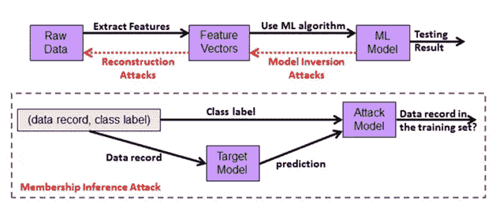
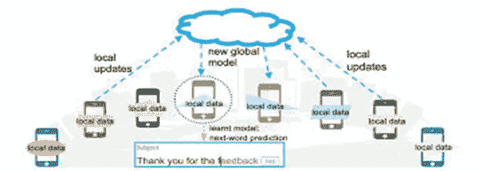
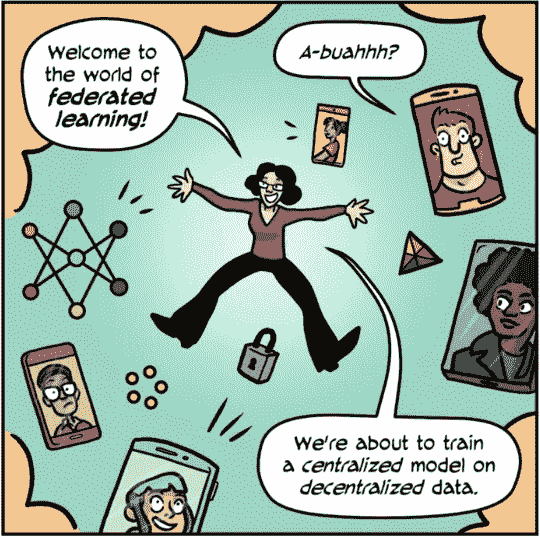
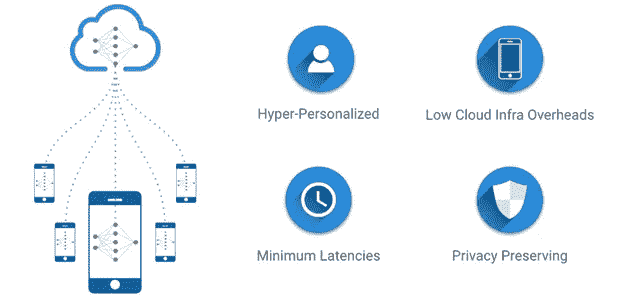
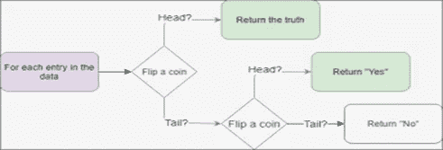
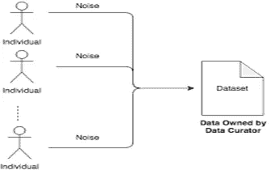
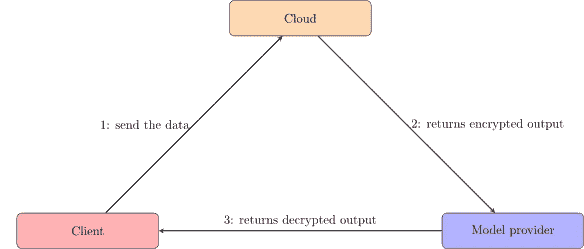
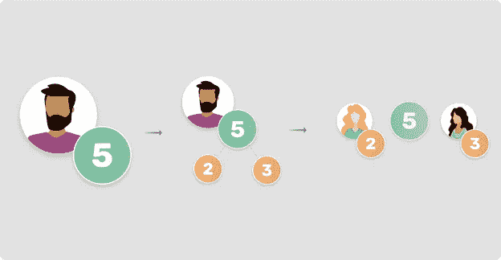

# 私有和加密数据科学简介

> 原文：<https://medium.com/analytics-vidhya/introduction-to-private-and-encrypted-data-science-327377f2d951?source=collection_archive---------11----------------------->

原故事:[https://www . technoskool . com/post/private-and-encrypted-data-science](https://www.technoskool.com/post/private-and-encrypted-data-science)

*我们能否在不泄露任何数据信息和相关用户身份的情况下，进行数据分析并建立机器学习模型？？*

世界每天都在产生大量的数据，并将它们分享给不同的社区，而没有考虑如何利用他们的隐私进行个人报复，大量的数据被各种公司用来制造机器，这些机器可以使用尖端技术大幅减少人类的工作。这些来自无数来源的数据被传输到中央服务器进行进一步分析，因此，保护隐私成为这些社区不可或缺的一部分，这是保障其主体的尊严和福利的基本原则。

随着新的 GDPR/隐私律师规则的出现，公司突然需要在现有的以及新的机器学习算法、数据存储中心和数据传输技术中引入隐私和安全组件，以及构建安全虚拟机。

现在非常强调在数据中保存个人的身份，从而提供针对各种数据盗窃的安全性。

公司正在投资大量的金钱和时间技术，向用户承诺他们的身份和私人信息将被高度保密，这使得用户可以毫不犹豫地共享数据。

这些技术主要保护我们的数据和模型免受各种攻击，以获取个人利益的机密数据。其中一些是:

**数据科学管道不同阶段的攻击**

一种中途更改数据的攻击，它可能会对双方用户造成很大伤害

**重建攻击:**

一旦在客户的位置准备好特征向量，并将其传送到将要建立模型的位置，攻击者就有可能利用他们对特征向量的了解来重建原始数据。

一些机器学习模型，如 KNN，SVM 在模型本身存储特征向量，从而使系统容易受到数据窃取。

**模型反转攻击:**

当攻击者无法访问存储在模型中的特征向量时，他们试图访问的是模型响应变量/值，这些变量/值是在客户发送新测试数据的情况下由模型生成的。这里，攻击者的目标是生成与训练特征向量相似的特征向量，从而使其容易受到进一步的数据/模型窃取。

**成员推理攻击:**

这种攻击会根据模型响应泄露有关训练集中样本/数据点的信息。它允许攻击者了解某些个人数据是否用于构建模型。

**重新识别**

匿名化通过在向公众发布数据之前删除个人标识符，看起来似乎是保护个人隐私的自然方法。事实上，一些公司试图通过只发布其数据集的匿名版本来保护用户的隐私，例如网飞发布的匿名电影评级，以帮助参赛者建立更好的推荐系统(电影)。尽管进行了匿名化，研究人员还是能够利用这个数据集以及 IMDB 背景知识来识别已知用户的网飞记录，并进一步能够推断出用户明显的政治偏好。这一事件表明，面对强大的对手，匿名化无法可靠地保护个人隐私。

现在，我们知道了这些攻击，让我们了解一些主要的技术，这些技术目前被许多大公司使用，如谷歌、苹果，以保护用户的数据。由于有关数据隐私的新规则以及公司突然需要保护个人的隐私权，这些技术目前发展非常迅速。

**隐私保护机器学习技术**

**联邦学习**

**设备发热问题！！**

**= = = = = = = = = = = = = = = = = = = = = = = = = = = = = = = = = = = = = = = = = = = = = = = = = = = = = = = = = = = = = = = = **

比方说，我们希望交叉检查我们每天收到的用户关于设备持续发热问题的投诉。我们做了一些研究，发现我们的设备有一个临界阈值，如果超过该阈值，我们就知道设备有问题。

在我们的第一阶段，我们只想知道有多少设备有问题。我们也不想捕捉关于设备和用户的每个细节，因为某些信息可能会导致用户的隐私被利用，因此，我们可能会失去我们有价值的客户。

因此，我们不是收集关于个人的冗余数据，而是只向我们所有的设备发送一条消息，以检查它们的温度是否高于比如说 50 度，并且它们所有的设备将返回简单的“是”或“否”。

通过这种方式，我们不会通过收集他们的个人和冗余数据(至少对于手头的任务而言)来侵犯他们的隐私，并且我们还能够实现我们的目标，即计算我们品牌的故障设备的数量。

**通过这种方式，我们可以将他们的数据保存在他们的本地设备上并进行分析，而无需将数据传输到中央服务器。**

**= = = = = = = = = = = = = = = = = = = = = = = = = = = = = = = = = = = = = = = = = = = = = = = = = = = = = = = = = = = = = = = = = = = = **

这是一种机器学习训练技术，它不是将数据从不同的客户端位置传输到中央服务器，而是将模型发送到这些客户端位置，然后并行训练，而不需要将数据从客户端安全服务器转移。

不是将数据移动到模型中，而是将全局模型的副本发送到数据所在的位置。本地数据样本保留在它们的源设备上，比如智能手机或医院服务器。模型被发送到设备，并在本地数据上进行训练，之后，新改进的模型及其更新被发送回主服务器，以与主模型聚合。

联合学习模型针对每个用户进行了调整，由于培训是高度分散的，它涉及最小的延迟并保护个人隐私。

**应用:**

1.谷歌的安卓关键词(Gboard)

2.苹果的 SIRI

**优势:**

1.可以在不涉及私有和敏感数据的情况下训练模型

2.遵守数据保护和其他合规性问题

3.联合学习允许更智能的模型、更低的延迟和更少的功耗，同时确保隐私

4.手机上的改进型号也可以立即使用

**局限性:**

1.与在中央服务器上构建模型相比，联合学习的成本会很高。

2.客户端需要在自己的终端进行计算，这导致设备类型和客户端基础架构成为瓶颈。

3.通常 FL 需要与其他技术相结合，这样人们就不能使用更新的权重来推断任何东西

**差分隐私**

**你有艾滋病毒吗？？**

**= = = = = = = = = = = = = = = = = = = = = = = = = = = = = = = = = = = = = = = = = = = = = = = = = = = = = = = = = = = = = = = = = = = **

假设我们正在进行一项实验，需要收集一些关于艾滋病毒携带者的机密数据，我们准备了一项调查来收集这些数据。

但我们发现，大多数人不愿意透露这些信息，因为他们担心这些敏感数据可能会被保险公司利用，从而增加他们的月保费。

为了克服这个问题，我们尝试使用一种简单的技术来确保人们的隐私，该技术如下:

我们给了每个人两枚不带偏见的硬币，并让他们抛硬币(但他们不必透露给我们)

a)如果第一次投掷的结果是**头朝上，**他们必须说真话。

b)如果第一次投掷的结果是**尾巴，**他们必须投掷第二枚硬币

a)如果第二枚硬币是**头**，他们必须返回“是”

b)如果第二枚硬币是**尾**，他们必须返回“否”

现在他们可以确定，即使我们有每个人的数据，我们也不能确定一个人是否说了真话。这为用户提供了某种隐私，从而允许他们毫无顾虑地共享数据。

我们还可以使用这些安全数据进行分析，而不是针对个体水平，而是针对总体水平，就像我们可以通过回溯轻松估计实际感染艾滋病毒的人口百分比，而没有任何合规性问题，因为*真实统计数据只是 50%概率(抛硬币概率)的平均值。因此，举例来说，如果我们得到 60%的人口感染了艾滋病毒，我们马上就会知道实际的百分比应该在 70%左右，因为在增加的数据中，平均 50%(抛硬币)会得到 60%。*

***这个实验告诉我们，我们如何通过在数据中引入一些随机性或噪声来保护个人的身份，这就是差分隐私的核心思想。***

***= = = = = = = = = = = = = = = = = = = = = = = = = = = = = = = = = = = = = = = = = = = = = = = = = = = = = = = = = = = = = = = = = = = = = = = ***

**

***在数据创建和输出生成时，噪声被添加到数据点的个体中，以使其更加安全。***

*被训练的模型可以学习关于数据的细节，否则这些数据应该是私有的。差分隐私可以帮助我们计算数据泄露的风险，并使用一些数学概念进行估计，这将允许我们找到可能的安全威胁和避免它们的方法。*

*差分隐私通过注入一定量的统计噪声来掩盖数据集中个人的数据贡献。在执行此操作的同时，确保模型仍能深入了解总体情况，从而提供足够准确的有用预测。*

**

*e 是对于其信息包含在输入中的每个个体 X，选择退出方案和真实世界计算之间应该同时保持的最大偏差。*

*1.当 X 是建模过程的一部分时的输出*

*2.X 不是建模过程的一部分时的输出*

*3.两种情况下结果的差异*

***优点:***

*1.比简单的数据匿名技术更可靠*

*2.公司可以在不侵犯隐私的情况下获取大量敏感数据*

*3.DP 提供了一种数学上可证明的隐私保护保证，可以抵御大范围的*隐私攻击(*包括*差异攻击*、*链接攻击、*和*重构攻击)**

***局限性:***

*1.DP 并不保证一个人认为是自己的秘密将保持秘密。重要的是要识别哪些是一般信息，哪些是私人信息，以便从 DP 保护伞中获益并减少伤害。DP 保证只保护私人信息(如上所述)。所以，如果一个人的秘密是一般信息，它将不受保护！*

*2.差分隐私是效用和信息泄露之间的权衡。*

***同态加密***

**

*加密的数据被发送到云，分析和模型开发在安全的云上执行，然后解密的输出被发送到客户端。*

***汤姆&杰瑞和装满钱的行李箱:***

***= = = = = = = = = = = = = = = = = = = = = = = = = = = = = = = = = = = = = = = = = = = = = = = = = = = = = = = = = = = = = = = = = = = ***

*假设有两个人汤姆和杰里，汤姆有一个装有很多钱的手提箱(但他不知道确切的数量)，并希望杰里(一个必要的邪恶)为他数钱。故事的转折是汤姆只信任杰里，因为他自己不擅长数学，他肯定需要杰里的帮助。*

*汤姆可以做两件事来保护这笔钱:*

*1.汤姆可以把手提箱交给杰里，这样他就可以数钱并把结果告诉他，但等待有第三个人，托普斯正在等待这一时刻冒充杰里，这样他就可以偷走所有的钱。*

*2.汤姆可以设计一种新的锁，这种锁甚至比手提箱锁本身更坚固，在这种锁中，拥有钥匙的人只能执行某些操作，在这种情况下，当给了杰里钥匙时，他只能数钱，他不能从手提箱中拿走任何东西，或者在这种情况下，除了汤姆，其他任何人都不能。*

*虽然前一个是一个坏主意，因为它使手提箱容易被抢劫，但后者是同态加密背后的核心思想。*

*它允许在不解密数据的情况下执行操作，如果攻击者试图窃取数据，他只会浪费时间解密数据*

***= = = = = = = = = = = = = = = = = = = = = = = = = = = = = = = = = = = = = = = = = = = = = = = = = = = = = = = = = = = = = = = = ***

**

*他让你对加密数据进行所有的操作。*

*同态加密(HE)与传统加密方法不同，它允许对加密数据执行有意义的计算。当使用同态加密时，数据可以由其所有者加密，并发送给模型所有者来运行计算。*

*例如，它会将经过训练的分类模型应用于加密的患者数据，并将加密的结果(例如，疾病的预测)发送回患者。值得注意的是，这里不需要加密模型权重，因为计算发生在模型所有者端。目前对使用同态加密可以执行的计算类型有限制，并且计算性能仍然与传统技术相差甚远。*

***优点:***

*1.这样做的好处是，A 公司可以对 B 公司的私有数据进行计算，而无需了解 B 公司的秘密。*

*2.另一个优势是数据可以不那么频繁地被解密，这有利于安全性。*

***限制:***

*1.非常慢，这使得它不太适合许多业务问题*

*2.最显著的缺点之一是，同态加密需要应用程序修改或专用和专门的客户端-服务器应用程序，以便使其在功能上工作。*

*3.同态加密对于大多数用途来说在功能上通常也太受限制。*

***安全多方计算***

***分而治之***

***= = = = = = = = = = = = = = = = = = = = = = = = = = = = = = = = = = = = = = = = = = = = = = = = = = = = = = = = = = = = = = = = ***

**

*两方或多方如何共享一个整数*

*假设我们想在给定的数据上计算一些东西，为了简单起见，假设数据是一个数字 **5。**我们会将这些数据分成我们想要的多个部分(这里是两个)。*

*在这里，德克斯特有一个数字 5，他想计算乘法运算，但他没有时间做这个，所以他任命了两个名叫金凤花和布鲁姆的人来完成这个任务，但他不想让他们中的任何人知道原始数字，因为这可能会泄露一些关于德克斯特的私人信息(*可能是他杀死的人的数量*)。*

*为了保护他的数据，他将数字分成 2 和 3，分别交给 Blossoms 和 Buttercup，并要求他们将各自的数字乘以 2，然后与 Dexter 分享。*

**

*在不知道原始数据的情况下如何进行计算*

*他们将各自的数据乘以 2，然后将值返回给 Dexter，这种方法使 Dexter 既能得到想要的结果，又能保护他的宝贵数据不被双方窃取。*

*这种技术被称为附加秘密共享，这是实现 SMPC 的一种非常简单和基本的方法。*

***= = = = = = = = = = = = = = = = = = = = = = = = = = = = = = = = = = = = = = = = = = = = = = = = = = = = = = = = = = = = = = = = = = = = = ***

*安全多方计算(SMC)允许两方或多方共同执行某些计算并接收结果输出，而不会暴露任何一方的敏感输入。*

*它允许模型被训练或应用于来自不同来源的数据，而不公开训练数据项或模型的权重。它依赖于构建某种价值的份额，当这些份额相加时，就重建了原始价值。*

***优点:***

*1.计算成本低于同态加密*

***2。***

*3.SMPC 的秘密共享可以保护模型的参数和训练/推理数据。*

***限制:***

*1.它需要各方之间的大量通信，因此带宽可能是一个瓶颈*

*2.在计算中需要对恶意协调方的**比例进行假设。***

***参考文献***

*   *[https://blog . openmined . org/private-machine-learning-explained/](https://blog.openmined.org/private-machine-learning-explained/)*
*   *[https://blog . open mined . org/what-is-secure-multi-party-computation/](https://blog.openmined.org/what-is-secure-multi-party-computation/)*
*   *[https://blog.openmined.org/what-is-federated-learning/](https://blog.openmined.org/what-is-federated-learning/)*
*   *[https://www . quora . com/What-the-is-the-limits-of-Apple % E2 % 80% 99s-% E2 % 80% 9c 差分隐私% E2 % 80% 9D-收集用户数据的方法](https://www.quora.com/What-are-the-limitations-of-Apple%E2%80%99s-%E2%80%9Cdifferential-privacy%E2%80%9D-approach-to-collecting-user-data)*
*   *[https://www . quora . com/What-is-the-pros-and-cons-of-poss-of-homology-encryption-implementation-in-a-cloud-database](https://www.quora.com/What-are-the-pros-and-cons-of-homomorphic-encryption-implementation-in-a-cloud-database)*
*   *[https://www.hindawi.com/journals/scn/2019/1368905/](https://www.hindawi.com/journals/scn/2019/1368905/)*
*   *[https://towards data science . com/understanding-differential-privacy-85ce 191 e 198 a](https://towardsdatascience.com/understanding-differential-privacy-85ce191e198a)*
*   *[https://arxiv.org/ftp/arxiv/papers/1804/1804.11238.pdf](https://arxiv.org/ftp/arxiv/papers/1804/1804.11238.pdf)*
*   *与安妮·莱斯纳和杰森·曼库索一起在 AMA 开矿*