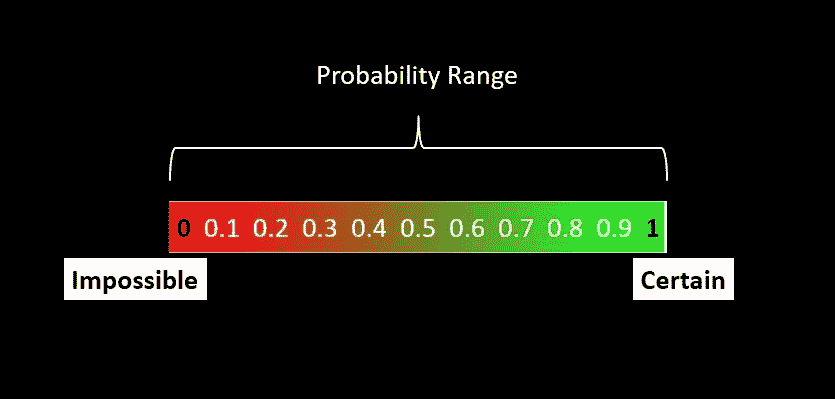
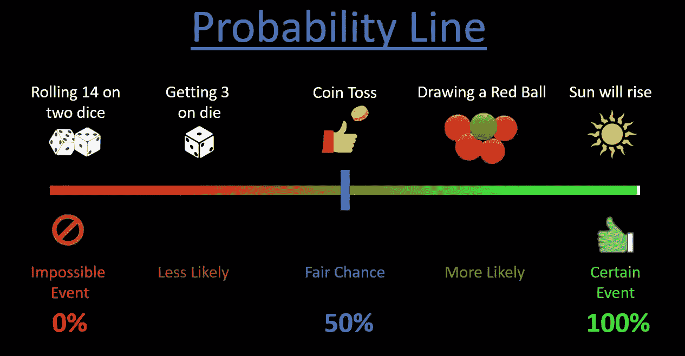

# 概率介绍:

> 原文：<https://medium.com/analytics-vidhya/introduction-to-probability-616a50776ff8?source=collection_archive---------18----------------------->

网上有很多教程和文章可以教你如何计算概率。因此，在这篇文章中，我将重点介绍-
1。什么是概率..
2。概率是如何使用的..
3。估计概率的方法..

每当我们对任何事件或事件的结果不确定时，我们就会有意或无意地谈论概率。
许多事件无法完全确定地预测。在这种情况下，我们试图用概率的概念来估计这些事件发生的可能性。概率告诉我们某事发生的可能性。
从技术上讲，同样的事情被说成是“概率决定事件的**可能性**”。

但是请记住，**概率只是一个指南，它不会告诉我们将会发生什么。**

所以当我们说要求概率的时候，我们做的是；我们只是用统计方法给一个事件发生的可能性分配一个数值。

某事发生的概率总是在 0 到 1 之间，因为一个事件发生的几率从 0%到 100%不等。

因此它的结果范围从**不可能到确定**其中，
**不可能= 0(某事没有发生的可能性)
确定= 1(那件事肯定会发生)**

现在，让我们考虑 5 种情况:
**a)掷骰子得到“14”:**这肯定不会发生。因为我们能得到的最大值是 12

在公平的骰子上得到 3 分:我们的机会微乎其微。因为骰子可以取从 1 到 6 的任何值

抛硬币，正面朝上:在这种情况下，我们的机会均等，因为抛硬币只有两种可能的结果，要么正面朝上，要么反面朝上

**d)从装有 5 个红色球和 1 个绿色球的袋子中抽取红色球:**我们更有可能在每捡起一个球时抽取一个红色球。因为我们有 5 个红球，只有一个绿球。

第二天太阳会升起，这是肯定会发生的。

那么让我们看看，它们是如何在**概率线**上表示的(它显示了概率以及这些概率是如何相互关联的):

既然我们已经理解了什么是概率，我们就来看看用来估计概率的不同方法。

不同的方法被用来寻找不同情况下的概率。

**1。传统方法:**

当我们意识到所有可能的结果并且所有这些结果都有同等的可能性时使用。同等可能性意味着所有可能的结果都有相同的发生几率。
这种概率方法的最好例子是掷骰子。
公平掷骰子的话，六种可能的结果都是我们事先知道的，我们得到一个 1 的可能性和得到一个 6 的可能性一样大。

**2。相对频率法:**

当事先不知道所有可能的结果，并且所有可能的结果的可能性不相等时使用。
使用相对频率法的一个例子是，店主根据前一年的销售额下订单。应用经典方法所需的信息不可用，但类似的可靠信息可用。

**3。主观方法:**

当事先不知道所有可能的结果时使用，所有可能的结果不是同样可能的，并且没有来自先前实验的类似统计数据可用。这种方法是基于观点、以前的经验或知识，这就是为什么它被称为主观方法。

这只是概率概念的介绍。在下一篇文章中，我们将研究细节，也将看到概率的数学含义。
如果你热衷于深入理解这个概念，我强烈推荐看看《看见理论》中这个令人惊叹的视觉介绍:
[https://seeing-theory.brown.edu/](https://seeing-theory.brown.edu/)