# SAS 中的 PROC SQL 介绍

> 原文：<https://medium.com/analytics-vidhya/introduction-to-proc-sql-in-sas-c470837fe28c?source=collection_archive---------25----------------------->

> PROC SQL 是一个 SAS 过程，用于在一个步骤中打印结果、创建新表、对数据进行排序等等。

制造者在 [Unsplash](https://unsplash.com?utm_source=medium&utm_medium=referral) 上 [NESA 的照片](https://unsplash.com/@nesabymakers?utm_source=medium&utm_medium=referral)

# SAS 术语

SAS 和 SQL 术语之间的区别如下:

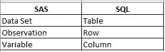

SAS 和 SQL 的不同术语

# 【PROC SQL 的语法:

> PROC SQL
> 
> 选择列
> 
> 来自表格
> 
> WHERE 表达式
> 
> 按列分组
> 
> 有表情
> 
> 按列排序；
> 
> 退出；

**解释**

***PROC SQL*** :需要在 SAS 中调用 SQL 过程

***选择*** :指定需要选择的列

***FROM*** :指定需要查询的表

***其中*** :用于根据条件对数据进行子集化

***分组依据*** :根据指定的列对数据进行分组

***ORDER BY*** :对数据进行排序

# **数据集**

我们将在 sashelp 库中使用 SAS 提供的标准数据集(cars)。特定库中的数据集可以通过键入 *libraryname.dataset_name 来访问。*所以我们的 cars 数据集可以通过键入 sashelp.cars 来访问

# **PROC SQL 语句为:**

1.  **显示数据集:**

要通过选择*汽车*数据集的所有列来显示数据集，我们需要在 *select* 语句后添加*。

> PROC SQL
> 
> select * from sashelp.cars
> 
> 退出；

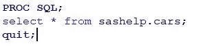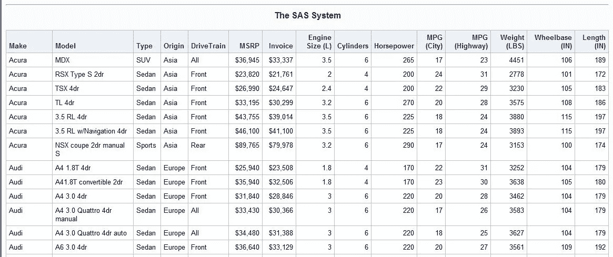

使用 select 语句后获得的部分输出

为了通过选择 *cars* 数据集的几列来显示数据集，我们需要在 *select* 语句之后提供列名。例如，我们希望仅在该数据集中看到 Model、MSRP 和马力列，那么我们需要在 SELECT 之后显示这些列的名称。

> PROC SQL
> 
> 从 sashelp.cars 选择型号、MSRP、马力；
> 
> 退出；

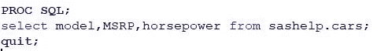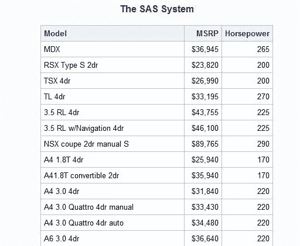

选择几列后获得的部分输出

**2。使用 WHERE 过滤数据集**

可以使用 WHERE 语句选择数据集的子集。例如，在我们的数据集中，我们希望看到所有原产于欧洲的汽车的详细信息。这可以通过使用 WHERE 语句来实现。

> PROC SQL
> 
> select * from sash elp . cars where origin = ' Europe '；
> 
> 退出；

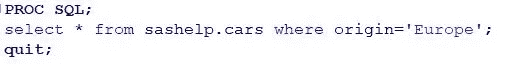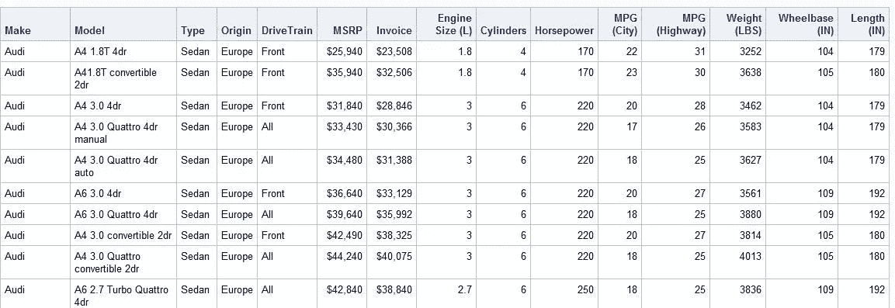

使用 WHERE 子句后生成的输出

**3。创建新数据集**

可以使用 PROC SQL 中的 *create table* 命令创建一个新的数据集。例如，我们想创建一个销售汽车数据集中提到的汽车的经销商数据集。该数据集将包含经销商的名称和经销商的原产国。名称长度为 20 个字符，国家/地区长度为 30 个字符。

> PROC SQL
> 
> 创建表经销商(名称字符 20，国家/地区字符 50)；
> 
> 退出；

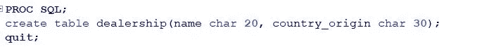

创建一个名为“经销商”的空白表，其中包含列“名称”和“国家/地区”。

要将数据插入该表，我们需要使用*插入到表名*值命令。

> PROC SQL
> 
> 插入经销商
> 
> 价值观(“ANC 汽车有限公司”、“德国”)
> 
> 价值观(“DGZ 高速公路有限公司”、“美国”)；
> 
> 从经销商处选择*；
> 
> 退出；

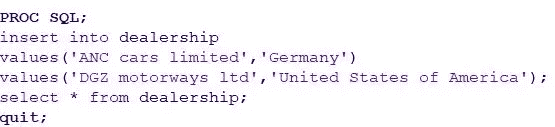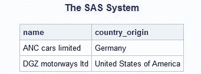

**4。使用现有数据集创建新数据集**

假设我们想要创建一个数据集，其中包含所有原产地为欧洲的汽车。我们可以通过在 *select* 语句之前使用 *create table table_name as* 从 cars 数据集创建 cars_eu 数据集。

> proc SQL
> 
> **创建表**cars _ eu**as**select * from sash elp . cars where origin = ' Europe '；
> 
> 退出；

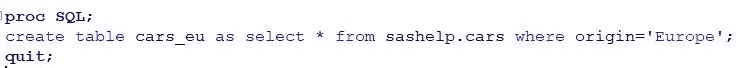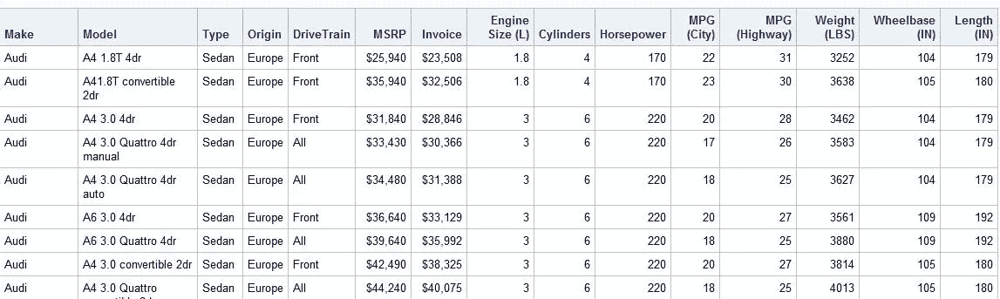

**5。过程 SQL 中的 Case 表达式**

如果满足某些条件，CASE 表达式将选择值。CASE 表达式返回单个值，对表中的每一行进行有条件的计算。例如，我们想根据重量将汽车分为“重型”、“中型”和“轻型”。

> PROC SQL
> 
> 选择型号、重量、箱子
> 
> 当重量> 4000 时，则为“重”
> 
> 当重量> 3000 时，则为“中等”
> 
> 其他'光'
> 
> 分类结束
> 
> 来自 cars _ eu
> 
> 退出；

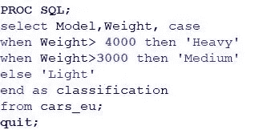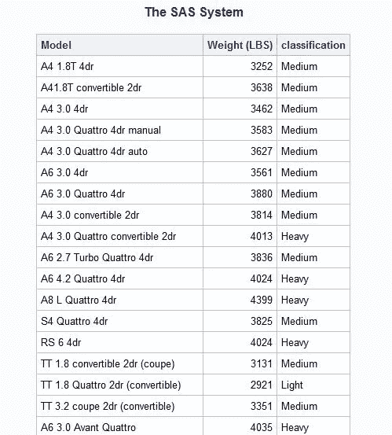

**6。限制在 PROC SQL** 中作为输出产生的行数

假设我们想要限制作为输出产生的行数。这可以通过使用 OUTOBS 语句来完成。在我们的示例中，我们希望将输出限制为 5，这可以通过在 PROC SQL 语句中使用 OUTOBS=5 来实现。

> PROC SQL OUTOBS = 5；
> 
> select * from cars _ eu
> 
> 退出；

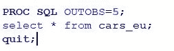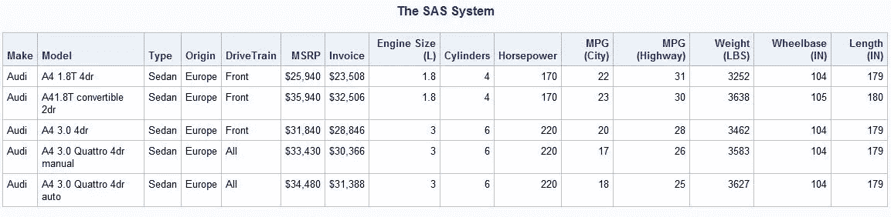

**7。对数据集中的数据进行排序**

可以在 ORDER BY 语句后使用“asc”或“desc”对数据集进行排序。

> PROC SQL
> 
> select * from cars _ eu order by weight desc；
> 
> 退出；

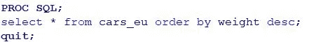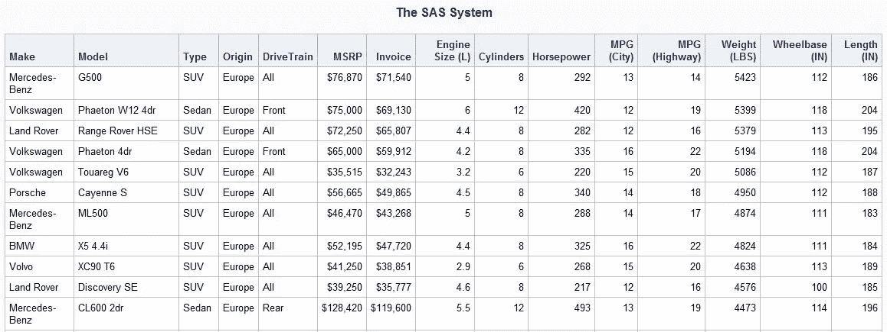

我希望你喜欢这个关于 PROC SQL 的教程。别忘了按“拍手”按钮。如果你有任何疑问或建议，你可以在评论区提供。