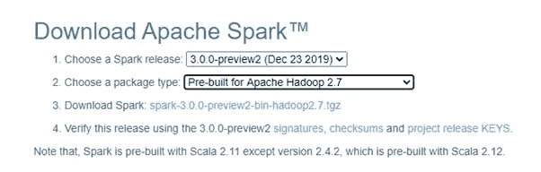
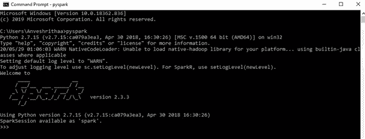

# PySpark 简介—第 2 部分

> 原文：<https://medium.com/analytics-vidhya/introduction-to-pyspark-part-2-6d6113e31592?source=collection_archive---------15----------------------->


在[之前的博客](/@anveshrithaas/getting-started-with-apache-spark-part-1-91b379204ae0)中，我们首先介绍了 Apache Spark，为什么它是首选，它的特性和优势，架构以及它的工业用例。在本文中，我们将开始使用 py Spark——使用 Python 的 Apache Spark！到本文结束时，您将会更好地理解什么是 PySpark，为什么我们选择 python 作为 Spark，它的特性和优点，然后是在您自己的计算机上设置 PySpark 的快速安装指南。最后，本文将阐明 Spark 中的一些重要概念，以便更进一步。

# PySpark 是什么？


资料来源:Databricks

正如我们已经讨论过的，Apache Spark 也支持 Python 和其他语言，这使得那些更习惯使用 Python for Apache Spark 的开发人员更加容易。与 Spark 的原生语言 Scala 相比，Python 是一种相对更容易学习和使用的编程语言，许多人更喜欢用它来开发 Spark 应用程序。众所周知，Python 是许多数据分析工作负载的事实语言。虽然 Apache Spark 是当今使用最广泛的大数据框架，但 Python 是使用最广泛的编程语言之一，尤其是在数据科学领域。那么为什么不整合它们呢？这就是 py Spark——python for Spark 的用武之地。为了用 Apache Spark 支持 Python，发布了 PySpark。由于许多数据科学家和分析师将 python 用于其丰富的库，将它与 Spark 集成是两全其美。在开源社区的大力支持下，PySpark 是使用 Py4j 库开发的，通过 Python 与 Apache Spark 中的 rdd 接口。高速数据处理、强大的缓存、实时和内存计算以及低延迟是 PySpark 优于其他数据处理框架的一些特性。

# 为什么选择 Python 做 Spark？


来源:becominghuman.ai

与其他编程语言相比，Python 更容易学习和使用，这要归功于它的语法和标准库。Python 是一种动态类型语言，这使得 Spark 的 rdd 能够保存多种类型的对象。此外，Python 有一套广泛而丰富的库，用于各种实用程序，如机器学习、自然语言处理、可视化、本地数据转换等等。

虽然 python 有许多用于数据分析和操作的库，如 Pandas、NumPy、SciPy，但是这些库是内存相关的，并且依赖于单节点系统。因此，对于处理万亿字节和千兆字节级的大型数据集来说，这并不理想。对于熊猫，可伸缩性是一个问题。在实时或接近实时的数据流的情况下，大量的数据需要被带到一个集成的空间进行转换、处理和分析，Pandas 不是一个最佳的选择。相反，我们需要一个框架，通过分布式和流水线处理的方式，更快、更有效地完成工作。这就是 PySpark 发挥作用的地方。

***注:****Spark 数据帧可以用 toPandas()函数转换成 Pandas 数据帧。但是当分布式 Spark 数据帧被转换时，所有数据都被带入单个节点驱动器存储器。因此，它对于大型数据集来说效率不高。*

# **PySpark 安装和设置**


以下是在 Windows 中安装和设置 Spark 的步骤。

## 安装先决条件

1.  **安装 Java**

*   确保您的计算机中已经安装了 Java(版本 7 或更高版本)
*   设置环境变量并将其添加到 PATH 变量中。

如果你还没有安装 Java，参考[本安装指南](https://www.guru99.com/install-java.html)来完成。

**2。安装 Python**

*   确保您已经安装了 Python(版本 2.7 或更高版本)

要安装 Python for Windows，请参考[本安装指南](https://www.howtogeek.com/197947/how-to-install-python-on-windows/)

**3。安装火花**

*   转到 [Apache Spark 主页](http://spark.apache.org/downloads.html)
*   选择最新的稳定 Spark 版本，对于包类型，选择预构建的 Apache Hadoop
*   并下载。tgz 文件，方法是单击步骤 3 中的链接(如下所示)



*   将下载的 zip 文件解压到所选目录下的一个文件夹中，并将其命名为“spark”(我的文件夹的路径是 C:\spark，因为我已将其存储在 c 盘中)
*   设置环境变量:

```
SPARK_HOME = C:\spark\spark-3.0.0-bin-hadoop2.7
```

*   将路径添加到 path 环境变量中:

```
C:\spark\spark-3.0.0-bin-hadoop2.7\bin
```

**4。安装 winutils.exe**

*   去[https://github.com/steveloughran/winutils](https://github.com/steveloughran/winutils)下载你的 Hadoop 版本的 winutils.exe(我的例子是 hadoop-2.7.1)
*   将 winutils.exe 文件移动到 SPARK_HOME 中的 bin 文件夹(在我的例子中是 C:\ SPARK \ SPARK-3 . 0 . 0-bin-Hadoop 2.7 \ bin)
*   设置环境变量(与 SPARK_HOME 相同):

```
HADOOP_HOME = C:\spark\spark-3.0.0-bin-hadoop2.7
```

**5。验证 PySpark 安装**

*   要验证 pyspark 是否安装成功，请打开命令提示符，键入 PySpark 并执行它以进入 PySpark shell。如果安装正确，您应该会看到类似下面的输出



***注意:*** *为了避免以后的错误和修复一些安装 Spark 后的 bug，按照* [*这篇文章*](/big-data-engineering/how-to-install-apache-spark-2-x-in-your-pc-e2047246ffc3) 中的可选步骤(步骤 4)进行操作

PySpark 安装成功，现在我们可以开始了！但是在我们深入探讨这个问题之前，Spark 中有几个重要的概念和术语，在进一步深入之前，您必须了解它们。

## SparkContext、SparkConf 和 SparkSession

SparkContext 是 Spark 功能的入口点。Spark 应用程序应该做的第一件事是创建一个定义如何访问集群的 SparkContext 对象。当执行 Spark 应用程序时，驱动程序启动，SparkContext 初始化。Spark 驱动程序应用程序生成的 SparkContext 允许 Spark 应用程序使用资源管理器访问 Spark 集群。

首先，为了创建 SparkContext，应该创建定义 Spark 应用程序配置的 SparkConf。SparkConf 用于配置 Spark，它包含由驱动程序传递给 SparkContext 的各种配置参数。一些常用的参数是 master 参数和 appName 参数，前者给出它所连接的集群的 URL，后者给出作业的名称。SparkConf 和 SparkContext 的创建过程如下。

```
#Creating SprarkConf object to configure Spark to run locally 
conf = SparkConf().setMaster("local").setAppName("SparkBlog")#Creating SparkContext
sc = SparkContext(conf)
```

从 Spark 2.0 开始，引入了 SparkSession 作为统一入口点，消除了显式创建 SparkConf 和 SparkContext 的需要，因为它们封装在 SparkSession 中。SparkContext 中可用的所有功能现在都可以在 SparkSession 中使用，从而取代了 SparkContext 和 SparkConf。SparkSession 创建如下。

```
spark = SparkSession.builder().master(“local”)\
.appName(“example of SparkSession”)\
.config(“spark.some.config.option”, “config-value”)\
.getOrCreate()
```

***注意:*** *如果使用 pyspark shell，SparkContext 变量****【sc】****和 SparkSession 变量****【spark】****会自动创建。您不需要显式创建它们。*

## 弹性分布式数据集

弹性分布式数据集(rdd)是 PySpark 的构建块。RDD 是 Apache Spark 的基本数据结构。它是一个不可变的对象集合，可以跨集群进行拆分，以促进内存中的数据存储，从而提高效率。RDD 是一种无模式的数据结构，可以处理结构化和非结构化数据。虽然 rdd 可以跨集群中的各种节点进行逻辑分区，但 rdd 上的操作也可以拆分并并行执行，从而实现更快、更可扩展的并行处理。RDD 是一个分布式内存抽象，它的一个显著特征是高度弹性。这是因为数据块是跨集群中的多个节点复制的，因此它们能够从任何问题中快速恢复，因为即使一个执行器节点出现故障，数据仍将由其他节点处理，这使得它具有高度的容错能力。此外，rdd 遵循延迟评估，也就是说，执行不会立即开始，而是仅在需要时才触发。可以在 rdd 上执行两个基本且重要的操作——转换和操作，我们将在下一篇博客中讨论。

总而言之，我们从 PySpark 的概述开始，为什么它被用于 Spark，它在哪些方面优于其他 python 库。我们看到了如何在您的计算机上安装它，然后以 SparkContext、SparkConf、SparkSession 的概述结束，最后是 Spark 的主干 RDDs！我希望现在你已经知道它到底是什么了。还有更多需要学习的内容，我们将在本系列的后续文章中介绍。查看下一篇关于 rdd 操作的文章,在那里你会得到一个更清晰的画面。快乐学习！

查看本系列中的其他博客

[***第一部分 Apache Spark 入门***](/@anveshrithaas/getting-started-with-apache-spark-part-1-91b379204ae0)

[***第三部分—了解 Spark RDDs***](/@anveshrithaas/understanding-spark-rdds-part-3-3b1b9331652a)

[***第四部分 PySpark 中的机器学习***](/@anveshrithaas/machine-learning-in-pyspark-part-4-5813e831922f)

[***第五部分——数据块上的端到端机器学习流水线***](/@anveshrithaas/end-to-end-machine-learning-pipeline-on-databricks-part-5-c10273e2cd88)