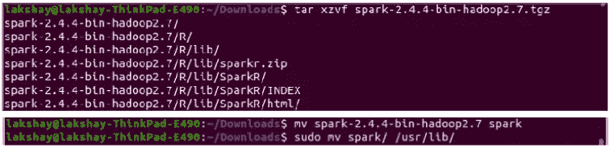
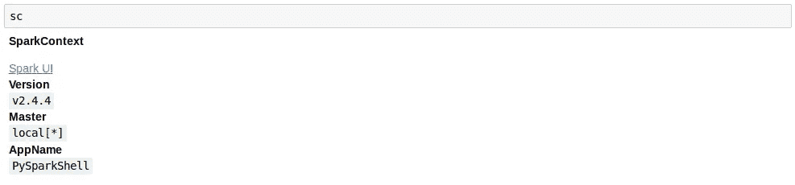
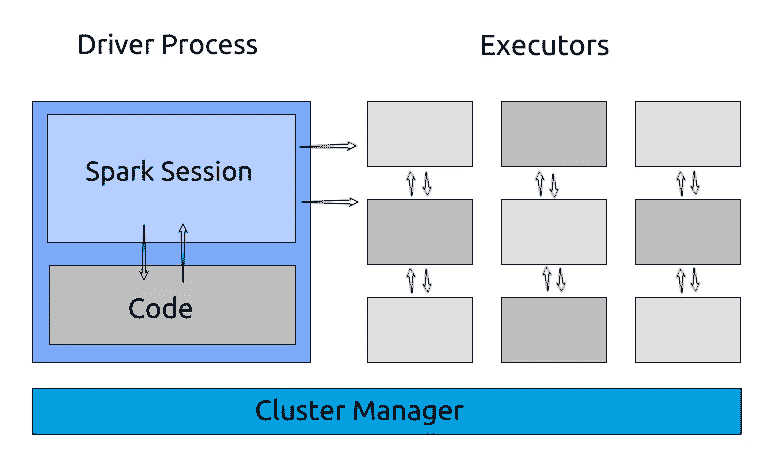
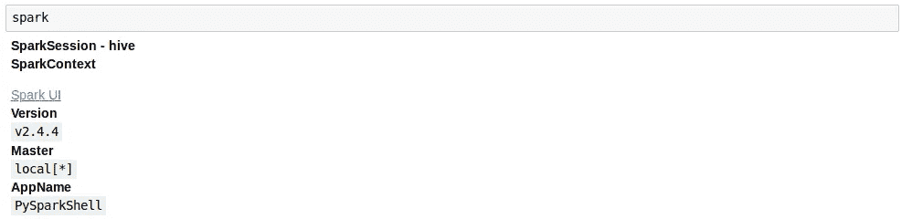
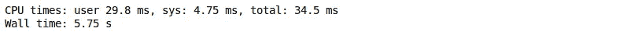
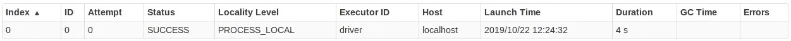
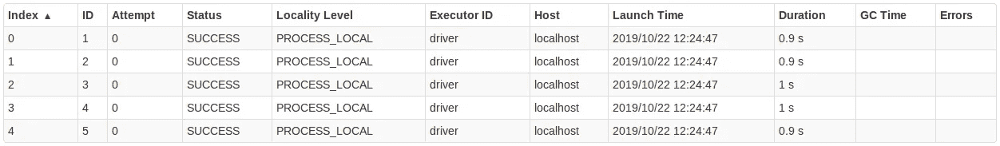
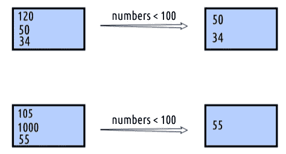
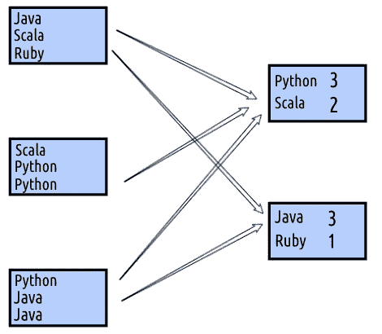

# PySpark 简介—迈出大数据分析的第一步

> 原文：<https://medium.com/analytics-vidhya/introduction-to-pyspark-take-your-first-steps-into-big-data-analytics-b98cf7dce8b3?source=collection_archive---------10----------------------->

我们正以前所未有的速度生成数据。老实说，我跟不上世界各地庞大的数据量！我敢肯定，您已经看到了对正在产生的数据量的估计——麦肯锡、Gartner、IBM 等。都提供了自己的数字。

这里有一些令人难以置信的数字供您参考——一天之内发送了超过 5 亿条推文、900 亿封电子邮件、6500 万条 WhatsApp 消息！仅脸书在 24 小时内就产生 4pb 的数据。太不可思议了！

当然，这本身也带来了挑战。数据科学团队如何获取如此大量的数据？你如何处理它并[从中建立机器学习模型](https://courses.analyticsvidhya.com/courses/applied-machine-learning-beginner-to-professional?utm_source=blog&utm_medium=pyspark-for-beginners-first-steps-big-data-analysis)？如果你是数据科学家或数据工程师，这些都是令人兴奋的问题。

> ***这就是火花出现的地方。Spark 是用 Scala 编写的，它提供了与 Scala、JAVA、Python 和 r 协同工作的 API。***


处理大数据的一种传统方式是使用 Hadoop 等分布式框架，但这些框架需要在硬盘上进行大量读写操作，这在时间和速度方面都非常昂贵。计算能力是一个重大障碍。

PySpark 以一种高效且易于理解的方式处理这个问题。所以在这篇文章中，我们将开始了解这一切。我们将了解什么是 Spark，如何在您的机器上安装它，然后我们将深入了解不同的 Spark 组件。这里也有一大堆代码，让我们开心一下吧！

*这里有一个* [*大数据世界的快速介绍*](https://www.analyticsvidhya.com/big-data/?utm_source=blog&utm_medium=pyspark-for-beginners-first-steps-big-data-analysis) *，以防你需要复习。请记住，这些数字已经远远超出了那里显示的数字——而且距离我们发表那篇文章只有 3 年时间！*

# 什么是火花？

> *Apache Spark 是一个开源的分布式集群计算框架，用于快速处理、查询和分析大数据。*

它是当今企业中最有效的数据处理框架。诚然，Spark 的成本很高，因为它需要大量 RAM 来进行内存计算，但它仍然是数据科学家和大数据工程师的最爱。您将在本文中看到为什么会这样。


通常依赖类似 Map Reduce 的框架的组织现在正在转向 Apache Spark 框架。Spark 不仅执行内存计算，而且比 Hadoop 等 Map Reduce 框架快 100 倍。Spark 在数据科学家中大受欢迎，因为它在内存中分发和缓存数据，并帮助他们在大数据上优化[机器学习算法](https://www.analyticsvidhya.com/blog/2017/09/common-machine-learning-algorithms/?utm_source=blog&utm_medium=pyspark-for-beginners-first-steps-big-data-analysis)。

我推荐查看 Spark 的官方页面[这里](https://spark.apache.org/)了解更多细节。它有大量的文档，是关于 Spark 的很好的参考指南。

# 在您的机器上安装 Apache Spark

## 1.下载 Apache Spark

安装 Spark 的一个简单方法是通过 pip。但是根据 Spark 的官方文档，这不是推荐的方法，因为 Spark 的 Python 包并不打算取代所有其他用例。

在实现基本功能时，您很可能会遇到许多错误。它仅适用于与现有集群交互(无论是独立的 Spark、YARN 还是 Mesos)。

所以，第一步是从[这里](http://spark.apache.org/downloads.html)下载最新版本的 Apache Spark。解压缩并移动压缩文件:

```
tar xzvf spark-2.4.4-bin-hadoop2.7.tgz mv spark-2.4.4-bin-hadoop2.7 spark sudo mv spark/ /usr/lib/
```



## 2.安装 JAVA

确保您的系统中安装了 JAVA。我强烈推荐 JAVA 8，因为众所周知，Spark 版本 2 在 JAVA 9 及更高版本中存在问题:

```
sudo apt install default-jre sudo apt install openjdk-8-jdk
```

## 3.安装 Scala 构建工具(SBT)

当您在处理一个包含很少源代码文件的小项目时，手动编译它们会更容易。但是如果您正在处理一个有数百个源代码文件的更大的项目呢？在这种情况下，您需要使用构建工具。

> SBT，Scala Build Tool 的缩写，管理你的 Spark 项目和你在代码中使用的库的依赖关系。

**请记住，如果您使用的是 PySpark，就不需要安装这个。但是如果你使用 JAVA 或者 Scala 来构建 Spark 应用，那么你需要在你的机器上安装 SBT。运行以下命令安装 SBT:**

```
echo "deb [https://dl.bintray.com/sbt/debian](https://dl.bintray.com/sbt/debian) /" | sudo tee -a /etc/apt/sources.list.d/sbt.list curl -sL "https://keyserver.ubuntu.com/pks/lookup?op=get&search=0x2EE0EA64E40A89B84B2DF73499E82A75642AC823" | sudo apt-key add sudo apt-get update sudo apt-get install sbt
```

## 4.配置火花

接下来，打开 Spark 的配置目录，并复制默认的 Spark 环境模板。这已经作为 **spark-env.sh.template 出现在那里。**使用编辑器打开它:

```
cd /usr/lib/spark/conf/ 
cp spark-env.sh.template spark-env.sh 
sudo gedit spark-env.sh
```

现在，在文件 **spark-env.sh** 中，添加 **JAVA_HOME** 路径，并将内存限制分配给 **SPARK_WORKER_MEMORY** 。在这里，我将其分配为 4GB:

```
## add variables 
JAVA_HOME=/usr/lib/jvm/java-8-openjdk-amd64 
SPARK_WORKER_MEMORY=4g
```

## 5.设置火花环境变量

使用下面的命令打开并编辑 **bashrc** 文件。这个 **bashrc** 文件是一个脚本，每当您启动一个新的终端会话时都会执行:

```
## open bashrc file 
sudo gedit ~/bashrc
```

在文件中添加以下环境变量:

```
## add following variables 
export JAVA_HOME=/usr/lib/jvm/java-8-openjdk-amd64 
export SBT_HOME=/usr/share/sbt/bin/sbt-launch.jar 
export SPARK_HOME=/usr/lib/spark 
export PATH=$PATH:$JAVA_HOME/bin 
export PATH=$PATH:$SBT_HOME/bin:$SPARK_HOME/bin:$SPARK_HOME/sbin export PYSPARK_DRIVER_PYTHON=jupyter 
export PYSPARK_DRIVER_PYTHON_OPTS='notebook' 
export PYSPARK_PYTHON=python3 
export PYTHONPATH=$SPARK_HOME/python:$PYTHONPATH
```

现在，找到 **bashrc** 文件。这将使用更新的脚本重新启动终端会话:

```
## source bashrc file 
source ~/.bashrc
```

现在，在终端中键入 **pyspark** ，它将在默认浏览器中打开 **Jupyter** ，并且 spark 上下文(它是 Spark 服务的入口点)将自动初始化为变量名 **sc** :



# 什么是 Spark 应用？

Spark 应用程序是 Spark 上下文的一个实例。它由一个驱动程序进程和一组执行程序进程组成。

**驱动进程负责维护关于 Spark 应用程序的信息，响应代码，跨执行器分配和调度工作。**驱动程序进程是绝对必要的——它是 Spark 应用程序的核心，在应用程序的生命周期中维护所有相关信息

**执行者负责实际执行司机分配给他们的工作。**所以，每个遗嘱执行人只负责两件事:

*   执行由驱动程序分配给它的代码，以及
*   将该执行器上的计算状态报告回驱动程序节点



# 那什么是火花会？

我们知道驱动程序进程控制 Spark 应用程序。**驱动程序进程将自身作为一个名为 Spark 会话的对象提供给用户。**

Spark 会话实例是 Spark 在集群中执行用户定义的操作的方式。在 Scala 和 Python 中，当您启动控制台时，Spark 会话变量可用作 **spark** :



# Spark 中的分区

> 分区意味着完整的数据不在一个地方。它被分成多个块，这些块被放置在不同的节点上。

如果你有一个分区，Spark 将只有一个并行度，即使你有成千上万个执行程序。此外，如果您有许多分区，但只有一个执行器，Spark 仍然只有一个并行度，因为只有一个计算资源。

在 Spark 中，底层 API 允许我们定义分区的数量。

让我们举一个简单的例子来理解分区如何帮助我们更快地得到结果。我们将创建一个 10 到 1000 之间的 2000 万个随机数的列表，并将计算大于 200 的数字。

让我们看看仅用一个分区我们能做到多快:

```
from random import randint# create a list of random numbers between 10 to 1000
my_large_list = [randint(10,1000) for x in range(0,20000000)]# create one partition of the list  
my_large_list_one_partition = sc.parallelize(my_large_list,numSlices=1)# check number of partitions
print(my_large_list_one_partition.getNumPartitions())
# >> 1# filter numbers greater than equal to 200
my_large_list_one_partition = my_large_list_one_partition.filter(lambda x : x >= 200)# code was run in a jupyter notebook 
# to calculate the time taken to execute the following command
%%time# count the number of elements in filtered list
print(my_large_list_one_partition.count())
# >> 16162207
```



用一个分区过滤结果需要 34.5 毫秒:



现在，让我们将分区的数量增加到 5，并检查我们是否在执行时间上有所改进:

```
# create five partitions of the list
my_large_list_with_five_partition = sc.parallelize(my_large_list, numSlices=5)# filter numbers greater than equal to 200
my_large_list_with_five_partition = my_large_list_with_five_partition.filter(lambda x : x >= 200)%%time# count the number of elements in the filtered list
print(my_large_list_with_five_partition.count())
# >> 16162207
```


使用五个分区过滤结果花费了 11.1 毫秒:



# 火花中的转变

数据结构在 Spark 中是不可变的。这意味着它们一旦创建就不能更改。但是如果我们不能改变它，我们应该如何使用它呢？

> 因此，为了做出任何改变，我们需要指示 Spark 我们希望如何修改我们的数据。这些指令被称为转换。

回想一下我们在上面看到的例子。我们要求 Spark 过滤大于 200 的数字——这基本上是一种转换。Spark 中有两种类型的转换:

*   **窄转换:**在窄转换中，计算单个分区的结果所需的所有元素都位于父 RDD 的单个分区中。例如，如果您想过滤小于 100 的数字，您可以分别在每个分区上执行此操作。转换后的新分区仅依赖于一个分区来计算结果



*   **宽转换:**在宽转换中，计算单个分区的结果所需的所有元素可能位于父 RDD 的多个分区中。例如，如果您想要计算字数，那么您的转换依赖于所有分区来计算最终结果。



*原载于 2019 年 10 月 28 日*[*https://www.analyticsvidhya.com*](https://www.analyticsvidhya.com/blog/2019/10/pyspark-for-beginners-first-steps-big-data-analysis/?utm_source=av&utm_medium=feed-articles&utm_campaign=feed)*。*