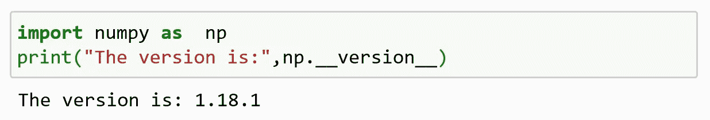
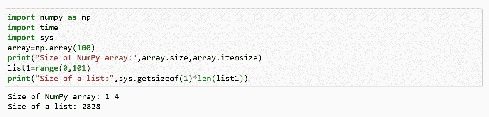
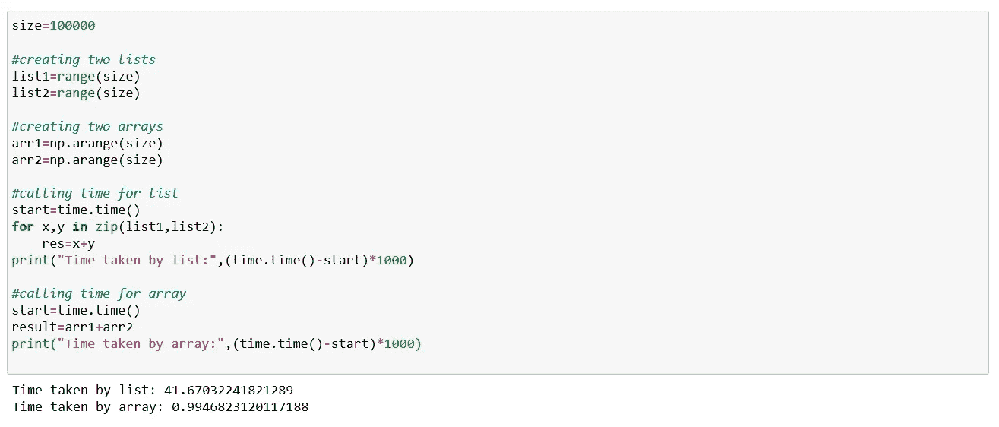
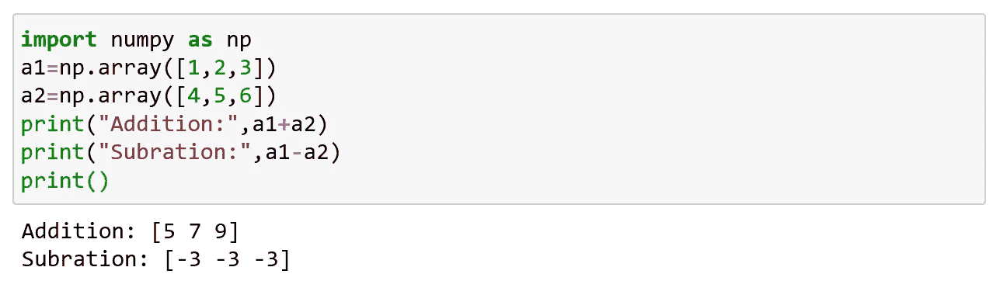

# Python Numpy 简介

> 原文：<https://medium.com/analytics-vidhya/introduction-to-python-numpy-8623f265933?source=collection_archive---------35----------------------->

## **NumPy:**

数字 Python (NumPy)是一个用于处理数组的 Python 库。

Numpy 是特拉维斯·奥列芬特在 2005 年创造的。它是开源的，可以免费使用。

## 【NumPy 是用哪种语言写的？

NumPy 是一个 python 库，它部分是用 python 编写的，大部分需要快速计算的部分是用 C 或 C++编写的。

## NumPy 的安装:

如果您的系统中安装了 python 和 pip，那么 NumPy 的安装会变得更容易。

使用以下命令安装它:

C:\\Users\Your-name>pip 安装号码

如果这个命令失败，那么使用已经安装了 numpy 的 python 发行版，如 Anaconda、Spyder 等。

## 导入数字:

一旦安装了 numpy 通过使用关键字“import ”,将它导入到您的应用程序变得更加容易。

现在 numpy 已经导入并可以使用了。

## 别名:

Numpy 通常在 np 别名下导入。

"别名:用来指代同一个 this 的别名"

在 python 中，别名是使用关键字“as”创建的。

现在 numpy 包可以被称为 np 而不是 numpy。

## 版本:

检查 numpy 的版本；

版本字符串存储在 __version__ 属性下。

## 为什么是 NumPy？

1.  **内存使用:**

2.**更快:**

3.**轻松简单(方便):**

就这样，我们来到了这篇文章的结尾。准备好弄脏你的手。

快乐编码…..😊😊😊