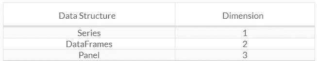

# PYTHON 熊猫数据结构简介

> 原文：<https://medium.com/analytics-vidhya/introduction-to-python-pandas-data-structures-d89c1e41605?source=collection_archive---------35----------------------->


要将熊猫添加到 Python 中，您需要将下面的代码写入终端并安装熊猫。

```
pip install pandas
```

Python 中的 Pandas 库处理 3 种数据类型:

*   系列
*   数据帧
*   面板

这些数据结构是建立在 numpy 之上的。这意味着它们很快。

# 尺寸和描述

让我们把这比作 matryoshkas。什么是套娃逻辑？尺寸递减的形状嵌套。这里的逻辑是一样的。它包括最大的，也就是其他尺寸最大的子维度。



创建和处理二维或更多维的数组是单调乏味的，用户在编写函数时需要考虑数据集的方向。然而，使用 pandas 数据结构，用户的脑力劳动减少了。例如，对于表格数据(DataFrame)，考虑索引(行)和列比考虑轴 0 和轴 1 在语义上更有用。

# 蟒蛇熊猫系列

series 是一个一维标记数组，可以保存任何类型的数据(整数、字符串、浮点、python 对象等)。).轴标签统称为目录。

可以使用以下生成器创建熊猫系列:

```
pandas.Series( data, index, dtype, copy)
```

创始人的参数如下:数据:数据采取 ndarray、list、constant 等多种形式

*   **Index** :索引值必须唯一且可散列，长度与数据相同。
*   **dtype** :为 dtype 数据类型。否则，该数据类型将被删除。
*   **复制**:复制数据。默认值为 false。

它可以使用几个输入来创建，例如一个系列:

*   排列
*   词典
*   标量值和常数

# 创建空系列

可以创建的基本数组是空系列。

```
Series([], dtype: float64)
```

# 使用 ndarray 创建系列图像

如果数据是 ndarray，则传递的目录必须具有相同的长度。默认情况下，索引采用其中 n 是数组长度的范围，而不是相同长度的索引。即:(n) [0，1，2，3 …Range (len (series)) — 1]。

**例 1:**

```
0  a
1  b
2  c
3  d
dtype: object
```

**例 2:**

```
10  a
20  b
30  c
40  d
dtype: object
```

我们在这里传递了索引值。现在您可以看到输出的定制索引值。

# 用字典创建系列

dict 可以作为输入传递，如果没有指定索引，字典键将按顺序导入以创建索引。如果索引通过，则取出与索引中的标签相对应的数据中的值。

**例 1:**

```
a  0.0
b  1.0
c  2.0
dtype: float64
```

**例 2:**

```
zero   0.0
one    1.0
two    NaN
three  3.0
dtype: float64
```

# 创建带标量的序列

如果数据是标量值，则必须提供目录。该值会重复以匹配索引长度。

```
0  5
1  5
2  5
3  5
dtype: int64
```

# 访问熊猫数据

## 访问与位置相关的数据

系列中的数据可以像数据阵列中的数据一样被访问。

**例 1:** 目的是获取第一个数据。我们已经知道，数组从零开始计数，这意味着第一个数据存储在零位置。

```
1
```

**例二:**当前目标是取前 3 的数据。为此，我们将使用一个特殊的符号':'。在此符号后输入的值表示从第一个值开始检查输入的值。

```
a   1
b   2
c   3
```

**例 3:** 加减取最后三个数据。

```
c   3
d   4
e   5
```

## 使用标签名称捕获数据

您需要有一个固定大小的字典来根据标签名获取值，并知道它调整了什么。

**例一:**

```
1
```

**例 2:** 利用数据作为列表，我们可以同时拉取更多的数据。

```
a   1
c   3
d   4
```