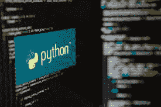

# Python 编程语言简介

> 原文：<https://medium.com/analytics-vidhya/introduction-to-python-programming-language-df9a9e416a11?source=collection_archive---------17----------------------->



你好。

如果你是编程新手或者想学习任何新的语言，那么我会建议你选择 Python。今天，Python 是最流行的编程语言之一。它被甲骨文、Quora 等几家公司使用。我想通过这个博客给大家一个 Python 编程语言的快速概述。希望你喜欢！

# **Python 简介**

## Python 是什么？

Python 是一种面向对象的高级编程语言，由吉多·范·罗苏姆在 1985-90 年间创建。Python 这个名字来自于英国流行的喜剧节目“巨蟒剧团”，而不是蛇蟒！！

这种语言有一个通用的公共许可证，并且比其他编程语言使用更少的语法结构。

如今，根据 [**TIOBE**](https://www.tiobe.com/tiobe-index/) 指数，Python 是全球最受欢迎的编程语言之一，使用它的程序员数量每天都在增长。这种语言在全世界有一个庞大的开发者社区。


Python 徽标

**Python 简史:**

Python 从诞生到现在已经经历了好几个版本。

Python 1.0:它发布于 1994 年，奠定了该语言的基本原则，强调简单性，基本上包括 lambda、map、filter 和 reduce 等特性。

Python 2.0:它发布于 2000 年，增加了新的特性，比如列表、理解和垃圾收集。不同的 2.x 子版本仍然在各种项目和库中使用。2.x 中的符号 x 表示对 Python 2 的任何颠覆。

2008 年 12 月 3 日，Python 3.0 发布。它旨在纠正这种语言的根本缺陷。


Python 版本的列表，以及它们开始运行的日期。

**Python 的特点:**

它支持函数式和结构化编程方法。

它可以用作脚本语言，也可以编译成字节码，用于构建大型应用程序

它提供了非常高水平的动态数据。

它支持自动垃圾收集

它可以很容易地与 C，C++，COM，CORBA 和 JAVA 集成。

**Python 的优势:**

很容易阅读和学习。

用 Python 写程序更容易

Python 有一些对程序员很有价值的独特特性，因为它们使代码变得简单。

没有一个 bug 会引发分段错误

它具有广泛的适用性，被科学家、工程师和数学家广泛使用

该语言包括一个带有内存管理的大型库，这是 Python 编程的另一个优势。

Python 更适合自动化构建系统、收集测试数据、服务器端应用程序。

**Python 的缺点:**

Python 作为一种解释型语言，执行速度很慢。

该语言不太适合移动开发和游戏开发。

它有很高的内存消耗，并且不在网络浏览器中使用，因为它不安全。

**安装 Python:**

如果您是 window 用户或 Linux 用户，安装 python 是一个非常小且容易的步骤。

**对于 windows:**

访问 Python 的官方网站，即 python.org

*   对于 32 位 Windows 操作系统，请下载 x86 文件。
*   对于 64 位 Windows 操作系统，请下载 x86–64 文件。


www.python.org/downloads/

这就对了。Python 将在几分钟内安装完毕**【或者根据您的互联网连接可能需要时间；)]**

您可以通过以下命令检查您的系统中是否安装了 Python:

# 如何在 Windows 中检查 Python 版本

大多数开箱即用的 Windows 安装都没有预装 Python。然而，检查总是一个好主意。

打开 Windows Powershell，并输入以下内容:

```
python ––version
```

如果你安装了 Python，它会报告版本号。


Windows 中的 Python 版本

或者，使用 Windows 搜索功能查看您拥有的 Python 版本:

按 Windows 键开始搜索，然后输入 Python。

**对于 Linux:**

在包管理器的帮助下，可以安装 python:

1.  如果您使用的是 Ubuntu，请在命令提示符下键入以下命令:

**$ sudo apt-get 安装 python3**

1.  如果您使用 Fedora，请在命令提示符下键入以下命令:

**$ sudo yum 安装 python3**

1.  将下载并安装 Python 3 的最新版本。要验证安装，请键入:

**$ Python**

**会出现 Python 提示(> > >)。**

通过下面的命令行检查 python 版本。

`**python ––version**`


Linux 中的 Python 版本

**空闲:**


IDLE-PYTHON

**IDLE 或 Integrated Development and Learning Environment**是一个用于 python 的集成开发工具或文本编辑器，它包含了一些默认的 python 包。

在上面的图片中你可以看到，

Idle 打开，从对话框窗口(左图)你可以打开一个无标题的文件(右图)在那里写你的程序。但是您甚至可以直接在空闲的 python 文本编辑器中编写程序。

**Python-text 编辑器的特性:**

用 100%纯 Python 编码，使用 tkinter GUI 工具包。

跨平台在 Windows、Unix 和 macOS 上的工作方式基本相同

在任何窗口中搜索，在编辑器窗口中替换，以及在多行中搜索。

具有持久断点、单步执行和查看全局和局部命名空间的调试器

**PYTHON 的显著特点:**

增强的可读性

动态打字

解释语言

可扩充语言

标准 DB2 API

GUI 编程

可嵌入

**什么是关键词？**

关键字是 Python 中的固定词，区分大小写，不能用作标识符或变量。

Python 3.7 中有 33 个关键字。下面是这些关键词的列表。


Python 中的关键字

**让我们用 Python 写第一个程序**！

如果你以前学过任何编程语言，比如 C 或 C++。你可能知道它教授的第一个程序。

“你好世界”节目。

如果我们用 C 或 C++编写这个程序，它将是一段 3-4 行的代码。

但是同样的事情在 python 中，将在一行中完成。

在下图中，你可以找到两种不同语言的相同程序。这就是 C、C++和 Python 的区别，也是 Python 被称为简单编程语言的原因。


程序打印 Hello World，左边是 Python 语言，右边是 C 语言。

现在，既然你已经编写了你的第一个 python 程序，让我们继续学习这门语言的另一个有趣而重要的概念。

**Python 数据类型:**

数据类型是数据项的分类。它们表示需要对其执行操作的数据类型。

**数字数据类型** —顾名思义，数字数据类型是用于数值或数字的表示。

它进一步分为 3 种数据类型:

**整数**:正整数或负整数。(例如:1234，-234 等。).

**Float** :具有浮点表示的实数，其中小数部分用十进制或任何科学记数法表示。(例如:55.55、0.005、1.32E10)

**复数**:由实部和虚部两部分组成的数。它们被表示为 x+yi，其中 x 是实部，y 是虚部。

**布尔数据类型**:任何有两个值 true 和 false 的数据表示(但 T 和 F 应该大写，True 或 False 无效，会抛出错误)。

**序列数据类型**:相似数据类型的有序集合。它们被分类为:

**>字符串**:是一个或多个字符的集合，放在单引号、双引号或三引号中。('你好'，'你好'，'''你好'')

**>列表**:一个或多个数据项(类型不一定相同)的有序集合。例子:[ 5，'拉维'，45.50，假]。

**>元组**:一个或多个数据项的有序集合，不一定是放在括号中的同一类型。元组的内容在创建后不能被修改——它是不可变的。举例:(1，“拉维”，75.50，真)

**Dictionary:** 它是数据类型的无序集合，以键的形式存在。这些集合用大括号{}括起来。

**举例:{1:《超人》，2:《神奇女侠》，3:《雷神》，4:《绿巨人》，5:《黑寡妇》}**

我谈到了 **Python 简介，它的历史，Python 版本，关键字和数据类型。**

在我的下一篇博客中，我将谈论 Python 语言编程的基础。我会写一些基本的程序。

希望你喜欢这个博客，并发现它有用❤❤

谢谢大家！