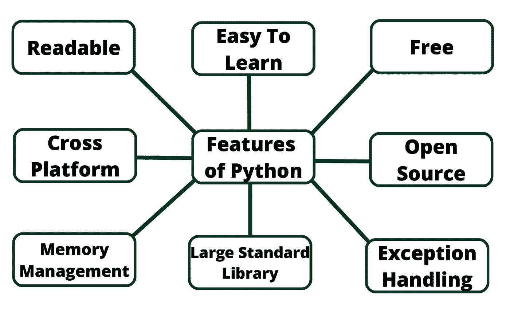

# Python 编程语言简介

> 原文：<https://medium.com/analytics-vidhya/introduction-to-python-programming-language-e6820b9e5e13?source=collection_archive---------15----------------------->

Python 是由吉多·范·罗苏姆开发的。吉多·范·罗苏姆在 1989 年开始实施 Python。Python 是一种非常简单的编程语言，所以即使你是编程新手，你也可以毫无困难地学习 python。

> *蟒蛇是以喜剧电视节目《巨蟒剧团的飞行马戏团》命名的。它不是以蟒蛇的名字命名的。*

# Python 编程语言的特点:

**可读性:** Python 是一种可读性很强的语言。

易学:学习 python 很容易，因为这是一种富有表现力的高级编程语言，这意味着它很容易理解这种语言，因此也很容易学习。

**跨平台:** Python 可用，可以在 Mac、Windows、Linux、Unix 等各种操作系统上运行。这使它成为一种跨平台和可移植的语言。

**开源:** Python 是一种开源编程语言。

**大型标准库:** Python 附带了一个大型标准库，其中有一些方便的代码和函数，我们可以在用 Python 编写代码时使用。

**免费:** Python 免费下载使用。这意味着您可以免费下载并在您的应用程序中使用它。见:[开源 Python 许可](https://docs.python.org/3/license.html)。Python 是自由开放源码软件(FOSS)的一个例子，这意味着你可以自由地分发该软件的副本，阅读其源代码并修改它。

**支持异常处理:**如果你是新手，可能会疑惑什么是异常？异常是在程序异常期间可能发生的事件，它会中断程序的正常流程。Python 支持异常处理，这意味着我们可以编写不太容易出错的代码，并且可以测试稍后可能导致异常的各种场景。

**高级特性:**支持生成器和列表理解。我们将在后面讨论这些特性。

**自动内存管理:** Python 支持自动内存管理，这意味着内存被自动清除和释放。你不必费心清除记忆。

# 你能用 Python 做什么？

你可能想知道 Python 的应用都有哪些。Python 有很多应用，下面是其中的一些。

**Web 开发:**像 Django、Flask 这样的 Web 框架都是基于 Python 的。他们帮助你编写服务器端代码，帮助你管理数据库，编写后端编程逻辑，映射 URL 等。

**机器学习:**用 Python 写的机器学习应用有很多。机器学习是一种编写逻辑的方法，以便机器可以自己学习和解决特定的问题。例如，亚马逊、Flipkart、易贝等网站的产品推荐。是一种识别用户兴趣的机器学习算法。手机中的人脸识别和语音识别是机器学习的另一个例子。

**数据分析:**也可以使用 Python 开发图表形式的数据分析和数据可视化。

**脚本:**脚本是编写小程序来自动完成简单的任务，如发送自动回复邮件等。这种类型的应用程序也可以用 Python 编程语言编写。

**游戏开发:**可以用 Python 开发游戏。

**嵌入式应用开发:**可以用 Python 开发嵌入式应用。

**桌面应用:**你可以使用 TKinter 或 QT 这样的库在 Python 中开发桌面应用。

# 为什么是 Python？

*   Python 可以在不同的平台上工作(Windows、Mac、Linux、Raspberry Pi 等)。
*   Python 有一个类似于英语的简单语法。
*   Python 的语法允许开发人员用比其他编程语言更少的代码编写程序。
*   Python 运行在解释器系统上，这意味着代码一写出来就可以执行。这意味着原型制作可以非常快。
*   Python 可以用过程化的方式、面向对象的方式或函数化的方式来对待。

# Python 语法与其他编程语言的比较

*   Python 是为可读性而设计的，与受数学影响的英语有一些相似之处。
*   Python 使用新行来完成命令，这与其他编程语言不同，后者通常使用分号或括号。
*   Python 依靠缩进，使用空白来定义范围；例如循环、函数和类的范围。其他编程语言经常为此使用花括号。

# 很高兴知道

*   Python 最近的主要版本是 Python 3，最好学 Python 3。
*   Python 社区已经冻结了 [Python 2。](https://pythonclock.org/)

# 谁使用 Python？

因为 Python 是一种广泛使用的编程语言。使用 Python 的一些地方有:

*   **谷歌** — Python 是谷歌使用的关键语言之一。
*   **飞利浦** —飞利浦使用 Python 作为排序语言(告诉每个机器人应该采取什么步骤的语言)。
*   Frequentis 是 TAPTools 的创始人，这是一种软件产品，用于许多机场的空中交通管制。这个特殊的工具向空中交通管制员提供最新的天气和跑道情况。所以，你飞的时候依赖 Python。
*   **Quora** — Quora 也选择 Python 进行开发。
*   **CodesDope** —是的，我们也用 Python。
*   《战地 2》—《战地 2》使用 Python 来实现游戏的核心元素，比如记分和团队平衡。
*   **Instagram** — Instagram 也使用 Python 作为后端。
*   **华特·迪士尼特色动画**——华特·迪士尼特色动画也在使用 Python 来提高他们动画制作系统的脚本效率。
*   **NASA** —约翰逊航天中心在其综合规划系统中使用 Python 作为标准脚本语言。
*   **文明 4**——传奇战略游戏系列的新成员，其所有的内在逻辑，包括 AI，都是用 Python 实现的。
*   **youtube**——我们都喜欢 YouTube，YouTube 也喜欢使用 Python
*   DropBox 允许我们使用 Python 的能力存储、同步和分享几乎任何东西。
*   Pinterest——Pinterest 是一个视觉发现工具，允许用户通过张贴图片来展示他们的兴趣。

这个列表是永无止境的，每天都有新的补充，但我希望它足以激励您学习 Python。

# 教程基础资源

[https://www.w3schools.com/python/](https://www.w3schools.com/python/)

[https://www.tutorialspoint.com/python/](https://www.tutorialspoint.com/python/)

[https://www.programiz.com/python-programming](https://www.programiz.com/python-programming)