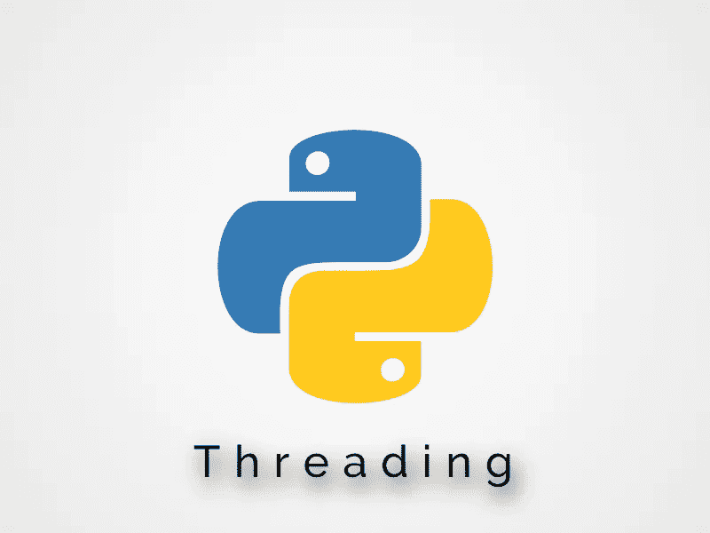

# Python 线程介绍

> 原文：<https://medium.com/analytics-vidhya/introduction-to-python-threading-749d8c2af79f?source=collection_archive---------25----------------------->



在本教程中，我们将学习如何使用 python 中的线程模块并发运行代码。

## 为什么我们要使用线程？

当我们想要加速程序时，我们使用线程，这种加速来自于同时运行不同的任务。

加速不一定是有保证的，它取决于你的程序在做什么。

在本文中，我们的简单任务是从网上下载图片。

首先，让我们定义一个函数，它将从一个 URL 下载一张图片并保存在我们当前的文件夹中。

创建一个名为 ***的新文件 lorempicsum.py :***

这个函数下载这个 URL 中包含的图片(每次刷新页面时图片都会改变),并接受一个参数，即保存图片的名称。

现在创建另一个名为 ***run.py*** 的文件，我们将在其中异步运行该函数 15 次:

```
image1.jpg was downloaded...image2.jpg was downloaded...image3.jpg was downloaded...image4.jpg was downloaded...image5.jpg was downloaded...image6.jpg was downloaded...image7.jpg was downloaded...image8.jpg was downloaded...image9.jpg was downloaded...image10.jpg was downloaded...image11.jpg was downloaded...image12.jpg was downloaded...image13.jpg was downloaded...image14.jpg was downloaded...image15.jpg was downloaded...Downloaded in 11.3468455 seconds
```

为了加快我们的程序，我们现在将使用线程。

创建一个新文件，命名为 ***runsync.py***

这里我们创建了一个空列表，其中包含了我们将要创建的所有线程。

在第 10 行，我们创建了一个线程`threading.Thread()`，在那里我们将调用我们的 lorem_picsum 函数`target=lorem_picsum`，由于我们的函数接受一个参数，我们指定了参数`args=[i]`的值。

在第 12 行，我们循环所有线程并执行`thread.join()`

这个方法阻塞调用线程，直到其`join()`方法被调用的线程终止。

```
8.jpg was downloaded...1.jpg was downloaded...12.jpg was downloaded...2.jpg was downloaded...10.jpg was downloaded...13.jpg was downloaded...9.jpg was downloaded...4.jpg was downloaded...6.jpg was downloaded...14.jpg was downloaded...7.jpg was downloaded...5.jpg was downloaded...0.jpg was downloaded...3.jpg was downloaded...11.jpg was downloaded...Downloaded in 0.9996082000000001 seconds
```

# 🏆奖励:更简单的方法

我本可以首先向您展示这种方法，因为它更简单，但是我认为在充分利用这种技术之前，理解如何手动实现线程是很重要的。

Python 的 ThreadPoolExecutor 最初是在 3.2 版中引入的，它为异步执行输入/输出任务提供了一个简单的高级接口。

创建一个名为**的新文件*runsyncpool . py:***

为了使用`ThreadPoolExecutor`我们`import concurrent.futures`

在第 7 行中，我们使用上下文管理器，它允许我们在需要的时候精确地分配和释放资源(这是实例化 ThreadPoolExecutor 的最流行的方法)。

最后，在第 8 行，我们使用`submit()`方法来执行我们的函数，并在逗号后传递我们的参数(我们的参数是来自 list comprehension for 循环的`i` )

```
12.jpg was downloaded...10.jpg was downloaded...7.jpg was downloaded...11.jpg was downloaded...2.jpg was downloaded...8.jpg was downloaded...9.jpg was downloaded...5.jpg was downloaded...1.jpg was downloaded...3.jpg was downloaded...6.jpg was downloaded...4.jpg was downloaded...13.jpg was downloaded...14.jpg was downloaded...15.jpg was downloaded...Downloaded in 2.2979992 seconds
```

**结论:**

我希望这篇教程能够揭开 Python 中使用线程和 ThreadPoolExecutor 的艺术。如果你想了解更多关于 Python 中线程的工作原理，那么我推荐你查阅 Python 的官方文档。

你可以在这里下载所有文件[。](https://github.com/samibenazzouz/mediumTutorial2)