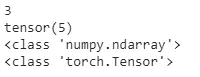
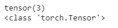
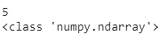
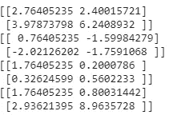
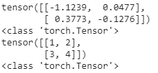
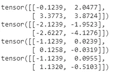

# PyTorch 简介

> 原文：<https://medium.com/analytics-vidhya/introduction-to-pytorch-e5df512b1079?source=collection_archive---------20----------------------->

PyTorch 是最受欢迎的深度学习项目库之一。我们将在系列文章中详细探讨 PyTorch。


首先，我们将了解 PyTorch 是什么以及它是如何工作的

**PyTorch 功能:**

1.  易于使用的 API
2.  易于与其他 python 库集成，因此在数据科学中非常有用
3.  动态计算图

**张量:PyTorch 中的主要抽象层**

标量的维数为零。这是一个单一的数字。向量是二维的。矩阵是二维或多维的。张量是除标量之外的一切。所以任何超过一维的东西都可以称为张量。

张量类似于 numpy 数组。但是 numpy 数组不能用于 GPU。这是使用张量优于 numpy 数组的主要优点。现在让我们看看 numpy 和 torch 张量之间的一些比较

```
import numpy as np
import torchnp_arr = np.array(3)
tensor = torch.tensor(5)
print(np_arr)
print(tensor)
print(type(np_arr))
print(type(tensor))
```



我们可以把 numpy 数组转换成张量，反之亦然。

```
tensor_from_np = torch.from_numpy(np_arr)
print(tensor_from_np)
print(type(tensor_from_np))np_arr_from_tensor = tensor.numpy()
print(np_arr_from_tensor)
print(type(np_arr_from_tensor))
```



**矩阵运算**

使用 Numpy:

```
np.random.seed(0)
mat1 = np.random.randn(2,2)
mat2 = np.array([[1,2],[3,4]])
print(mat1)
print(type(mat1))
print(mat2)
print(type(mat2))print(mat1+mat2)
print(mat1-mat2)
print(mat1/mat2)
print(mat1*mat2)
```



使用火炬张量:

```
torch.random.seed = 0
mat1 = torch.randn(2,2)
mat2 = torch.from_numpy(np.array([[1,2],[3,4]]))
print(mat1)
print(type(mat1))
print(mat2)
print(type(mat2))
print(mat2.shape)print(mat1+mat2)
print(mat1-mat2)
print(mat1/mat2)
print(mat1*mat2)
```



正如我们所看到的，numpy 数组和 torch 张量在用法上非常相似。笔记本电脑在 [git-repo](https://github.com/sarang0909/Explore-PyTorch/blob/master/intro_PyTorch.ipynb) 可用

在下一篇文章中，我们将使用 numpy 和 PyTorch 从头开始构建神经网络。

如果你喜欢这篇文章或有任何建议/意见，请在下面分享！

[领英](https://www.linkedin.com/in/sarang-mete-6797065a/)