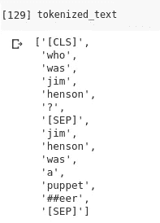

# PyTorch-Transformers:最先进的 NLP 的不可思议的图书馆

> 原文：<https://medium.com/analytics-vidhya/introduction-to-pytorch-transformers-an-incredible-library-for-state-of-the-art-nlp-ddecd75884ff?source=collection_archive---------1----------------------->

想象一下，有能力构建支持谷歌翻译的[自然语言处理(NLP)](https://courses.analyticsvidhya.com/courses/natural-language-processing-nlp?utm_source=blog&utm_medium=pytorch-transformers-nlp-python) 模型。嗯——我们现在可以坐在自己的机器前做这件事了！最新的 NLP 版本被 HuggingFace 的人称为 PyTorch-Transformers。


# PyTorch-Transformers 是什么？

> *PyTorch-Transformers 是一个用于自然语言处理(NLP)的最先进的预训练模型库。*

该库目前包含 PyTorch 实现、预训练的模型权重、使用脚本和以下模型的转换实用程序:

1.  **伯特(来自谷歌)**
2.  **GPT(来自 OpenAI)**
3.  **GPT-2(来自 OpenAI)**
4.  **Transformer-XL(来自谷歌/CMU)**
5.  **XLNet(来自谷歌/CMU)**
6.  **XLM(脸书)**

对于各种 NLP 任务，上述所有模型都是同类中最好的。其中一些型号还是上个月的产品！

大多数最先进的模型需要大量的训练数据和在昂贵的 GPU 硬件上进行数天的训练，这是只有大型技术公司和研究实验室才能负担得起的。但是随着 PyTorch 变形金刚的推出，现在任何人都可以利用最先进的模型的力量！

# 在机器上安装 PyTorch-Transformers

在 Python 中安装 Pytorch-Transformers 相当简单。您可以只使用 pip 安装:

```
pip install pytorch-transformers
```

或者，如果您正在使用 Colab:

```
!pip install pytorch-transformers
```

由于这些模型中的大多数都是 GPU 密集型的，我建议本文使用 [Google Colab](https://colab.research.google.com/notebooks/welcome.ipynb#recent=true) 。

***注:*** *本文中的代码是使用****py torch****框架编写的。*

# 使用 GPT-2 预测下一个单词

因为 PyTorch-Transformers 支持许多为语言建模而训练的 NLP 模型，所以它很容易允许像句子完成这样的自然语言生成任务。


2019 年 2 月，OpenAI 通过发布一个名为 **GPT-2 的新的基于变压器的语言模型，引起了轩然大波。** GPT-2 是一个基于转换器的生成语言模型，在来自互联网的 40GB 精选文本上进行训练。

让我们使用 GPT-2 建立我们自己的句子完成模型。我们将试着预测句子中的下一个单词:

```
what is the fastest car in the _________
```

我选择这个例子是因为这是 Google 的文本补全给出的第一个建议。下面是执行相同操作的代码:

代码很简单。我们将文本标记和索引为一个数字序列，并将其传递给 *GPT2LMHeadModel* 。这只不过是顶部带有语言建模头的 GPT2 模型转换器(线性层，权重与输入嵌入相关)。


厉害！该模型成功预测下一个单词为**【世界】**。这是相当惊人的，因为这是谷歌的建议。我建议您用不同的输入句子来尝试这个模型，看看它在预测句子中的下一个单词时表现如何。

# 使用 GPT-2、Transformer-XL 和 XLNet 的自然语言生成

现在让我们将文本生成提升到一个新的层次。**我们不是只预测下一个单词，而是根据给定的输入生成一段文本。**让我们看看我们的模型对以下输入文本给出了什么样的输出:

```
In a shocking finding, scientist discovered a herd of unicorns living in a remote, previously unexplored valley, in the Andes Mountains. Even more surprising to the researchers was the fact that the unicorns spoke perfect English.
```

我们将使用 PyTorch-Transformers 为此任务提供的现成脚本。让我们首先克隆他们的存储库:

```
!git clone [https://github.com/huggingface/pytorch-transformers.git](https://github.com/huggingface/pytorch-transformers.git)
```

# GPT-2

现在，您只需要一个命令来启动模型！

让我们看看我们的 GPT-2 模型对于输入文本给出了什么输出:

```
The unicorns had seemed to know each other almost as well as they did common humans. The study was published in Science Translational Medicine on May 6\. What's more, researchers found that five percent of the unicorns recognized each other well. The study team thinks this might translate into a future where humans would be able to communicate more clearly with those known as super Unicorns. And if we're going to move ahead with that future, we've got to do it at least a
```

这不是很疯狂吗？模型生成的文本非常有凝聚力，实际上可能会被误认为是一篇真实的新闻文章。

# XLNet

XLNet 将最先进的自动回归模型 Transformer-XL 的思想整合到预训练中。

您可以使用以下代码来实现相同的目的:

这是 XLNet 给出的输出:

```
St. Nicholas was located in the valley in Chile. And, they were familiar with the southern part of Spain. Since 1988, people had lived in the valley, for many years. Even without a natural shelter, people were getting a temporary shelter. Some of the unicorns were acquainted with the Spanish language, but the rest were completely unfamiliar with English. But, they were also finding relief in the valley.<eop> Bioinfo < The Bioinfo website has an open, live community about the
```

有意思。虽然 GPT-2 模型直接关注独角兽新闻的科学角度，但 XLNet 实际上很好地构建了上下文并巧妙地引入了独角兽的话题。看看 Transformer-XL 表现如何！

# 变压器-XL

Google 为语言建模提出了一种称为 Transformer-XL(意为超长)的新方法，这使得 Transformer 架构能够学习更长期的依赖性。

您可以使用下面的代码来运行 Transformer-XL:

下面是生成的文本:

```
both never spoke in their native language ( a natural language ). If they are speaking in their native language they will have no communication with the original speakers. The encounter with a dingo brought between two and four unicorns to a head at once, thus crossing the border into Peru to avoid internecine warfare, as they did with the Aztecs. On September 11, 1930, three armed robbers killed a donkey for helping their fellow soldiers fight alongside a group of Argentines. During the same year
```

这太棒了。有趣的是看到不同的模型如何关注输入文本的不同方面以进一步生成。这种差异是由许多因素造成的，但主要是由于不同的训练数据和模型架构。

# 为 BERT 训练一个屏蔽语言模型

谷歌人工智能的新语言表示模型 BERT framework 使用预训练和微调来创建最先进的 NLP 模型，用于广泛的任务。

使用以下两个无监督预测任务对 BERT 进行预训练:

1.  掩蔽语言建模(MLM)
2.  下一句预测

你可以用 PyTorch-Transformers 来实现这两个。那么，让我们看看如何为 BERT 实现屏蔽语言模型。

## 问题定义

让我们正式定义我们的问题陈述:

> 给定一个输入序列，我们将随机屏蔽一些单词。然后，该模型应该根据序列中其他非屏蔽单词提供的上下文，预测屏蔽单词的原始值。

那么我们为什么要这样做呢？模型在训练过程中学习语言的规则。我们很快就会看到这个过程有多有效。

首先，让我们使用`BertTokenizer` 从文本字符串准备一个标记化的输入:

这是我们的文本在标记化后的样子:



下一步是将它转换成一个整数序列，并创建它们的 PyTorch 张量，以便我们可以直接使用它们进行计算:

注意**我们在句子的第 8 个索引处设置了【掩码】，这个索引是单词‘Hensen’。**这就是我们的模型试图预测的。

现在我们的数据已经为 BERT 正确地进行了预处理，我们将创建一个屏蔽语言模型。现在让我们使用`BertForMaskedLM`来预测一个屏蔽令牌:

让我们看看模型的输出是什么:

```
Predicted token is: henson
```

真是令人印象深刻。

这是一个在单一输入序列上训练掩蔽语言模型的小演示。然而，对于许多基于变压器的架构来说，这是培训过程中非常重要的一部分。这是因为它允许模型中的双向训练——这在以前是不可能的。

# 维迪亚对 PyTorch 变形金刚的分析

在本文中，我们使用 PyTorch-Transformers 实现并探索了各种最新的 NLP 模型，如 BERT、GPT-2、Transformer-XL 和 XLNet。这更像是一个第一印象实验，我做这个实验是为了给你一个好的直觉，告诉你如何使用这个神奇的库。

以下是我认为你会喜欢这个图书馆的 6 个令人信服的理由:

1.  **预训练模型**:为 6 种最先进的 NLP 架构提供预训练模型，为这些模型的 27 种变体提供预训练权重
2.  **预处理和微调 API:** PyTorch-Transformers 不会在预先训练好的权重处停止。它还提供了一个简单的 API 来完成这些模型所需的所有预处理和微调步骤。
3.  **使用脚本:**它还附带了针对 SQUAD 2.0(斯坦福问答数据集)和 GLUE(通用语言理解评估)等基准 NLP 数据集运行这些模型的脚本。
4.  **多语言:** PyTorch-Transformers 支持多语言。
5.  **TensorFlow 兼容性:**您可以在 PyTorch 中将 TensorFlow 检查点作为模型导入
6.  **伯特学:**越来越多的研究领域涉及调查像伯特这样的大型变压器的内部工作原理(有人称之为“伯特学”)

你曾经实现过像伯特和 GPT-2 这样的最先进的模型吗？你对 PyTorch 变形金刚的第一印象是什么？下面在评论区讨论吧。

*原载于 2019 年 7 月 18 日*[*【https://www.analyticsvidhya.com】*](https://www.analyticsvidhya.com/blog/2019/07/pytorch-transformers-nlp-python/)*。*