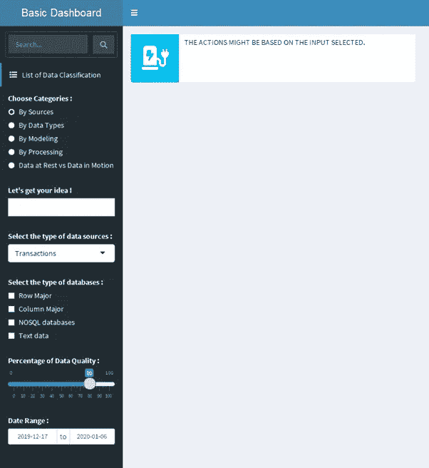
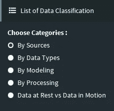
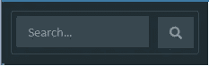
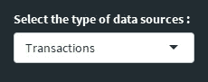
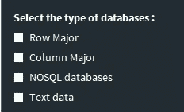
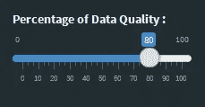
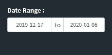
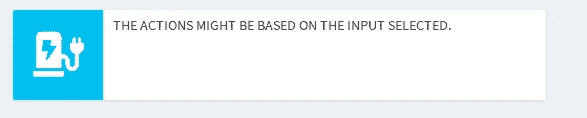

# R 闪亮仪表盘简介

> 原文：<https://medium.com/analytics-vidhya/introduction-to-r-shiny-dashboards-d2ce9451c2c3?source=collection_archive---------7----------------------->

随着在从个人规模到组织级别的每个级别上通过仪表板呈现分析的趋势不断增长，数据科学家在选择创建仪表板的平台时通常会面临问题，因为 Tableau 和 Power Bi 等最著名的平台会带来成本，并且要求数据采用特定的格式。

至此，创建仪表板的最简单和开源的方法，即 RShiny 仪表板，浮出了水面。

您可以使用通过 R 编程导入或创建的任何类型的数据来创建令人惊叹的交互式仪表板。闪亮仪表板最重要的一点是，通过重用模板和修改代码来塑造设计，它们很容易创建。

让我们从闪亮仪表板的基础知识和它的一些基本特性开始，这次讨论主要基于可以从侧边栏中创建的不同小部件样式中获取的输入类型。

## **基础知识**

`install.packages("shinydashboard")`

仪表板有三个部分:标题、侧栏和主体。

```
library(shiny)
  library(shinydashboard)
  ui <- dashboardPage(
    dashboardHeader(),
    dashboardSidebar(),
    dashboardBody()
  )
  server <- function(input, output) { }
  shinyApp(ui, server)
```

您还可以创建两个不同的文件，如 ui。r 和 app。R，然后使用 shinyApp()函数通过 R 控制台调用。

让我们考虑仪表板的主要元素，创建一个基本的仪表板。

# **组件**



## 页眉

```
header <- dashboardHeader(title = “Basic Dashboard”)
```

这条语句简单地创建了一个带有标题的仪表板标题，您还可以插入一些字体使事情变得更有趣。

## 补充报道

这是仪表板 UI 的一个非常有趣的部分，您可以创建不同风格的小部件来接收输入或过滤数据。

单选按钮输入部件—

这个小部件通过主体中的操作映射每个值，或者借助 server 应用程序中定义的函数过滤数据。

注意:dashboard 中基于这些输入而变化的交互部分将在后续文章中解释。

```
sidebar <- dashboardSidebar(
  sidebarMenu(
  sidebarSearchForm(textId = "searchText",buttonId = "searchButton",
                    label = "Search..."),
  menuItem("List of Data Classification", tabName = "list", icon =      icon("list")),
  radioButtons("rtype","Choose Categories :",
               choiceNames = c('By Sources', 'By Data Types','By Modeling', 'By Processing', 'Data at Rest vs Data in Motion'),
               choiceValues = c(1,2,3,4,5))
```



**搜索表单—**

这用于在仪表板中搜索关键字，通过搜索放大镜图标定位。

```
sidebarSearchForm(textId = "searchText", buttonId = "searchButton", label = "Search...")
```



**文本输入—**

这用于获取文本形式的输入，该文本形式的输入可用于其他功能，以操纵数据或创建专门的仪表板。

```
textInput("text", "Let's get your idea !")
```

**下拉菜单输入—**

下拉菜单用作小部件，其中有许多值可供选择，并且不能显示为单选按钮。

```
selectInput("dropdown","Select the type of data sources :",     c("Transactions" = 1,"Interactions" = 2,"Observations" = 3))
```



**复选框输入—**

当输入可以是多个值时，在这种情况下，我们肯定需要类似复选框的东西来输入多个值，这些值可以进一步用于分析。

```
checkboxGroupInput("check","Select the type of databases :",c("Row Major" = 1,"Column Major" = 2,"NOSQL databases" = 3, "Text data" = 4)) 
```



**滑块输入—**

当我们必须为连续变量(如百分比范围)提供输入范围时。

```
sliderInput("slide","Percentage of Data Quality :", min = 0, max = 100, value = 80)
```



**日期范围输入—**

要在特定的日期范围内过滤或分析数据，这个特定的过滤器可能非常有用。

```
dateRangeInput('date',"Date Range :", start = Sys.Date() - 10, end = Sys.Date() + 10)
```



## 身体

此部分包括数据显示或绘图创建，这些是仪表板中分析的主要部分。在这里，我刚刚包括了一个框架，我们将在后面的章节中讨论更多关于这个部分的内容。

```
body <- dashboardBody(
fluidRow(
infoBox("The actions might be based on the input selected.", icon = icon('charging-station')))
)
```



R shiny dashboards 在创建仪表板方面提供了很大的自由度，我们会一直想知道如何通过动态地改变其他基于 UI 的应用程序中的输入和功能来显示小信息或特定的图表或数据本身的图像，但是 R 直接处理代码库和原始数据可以非常有效和容易地创建这些小东西。

我个人是 R Shinydashboards 的超级粉丝，并广泛使用它来为我的客户量身定制仪表板，当我发现网上关于 Shiny dashboard 的资源很少时，我想到自己来做这件事。:)

下面是闪亮的包和功能的官方页面，这是一个很好的开始

[https://rstudio.github.io/shinydashboard/structure.html](https://rstudio.github.io/shinydashboard/structure.html)