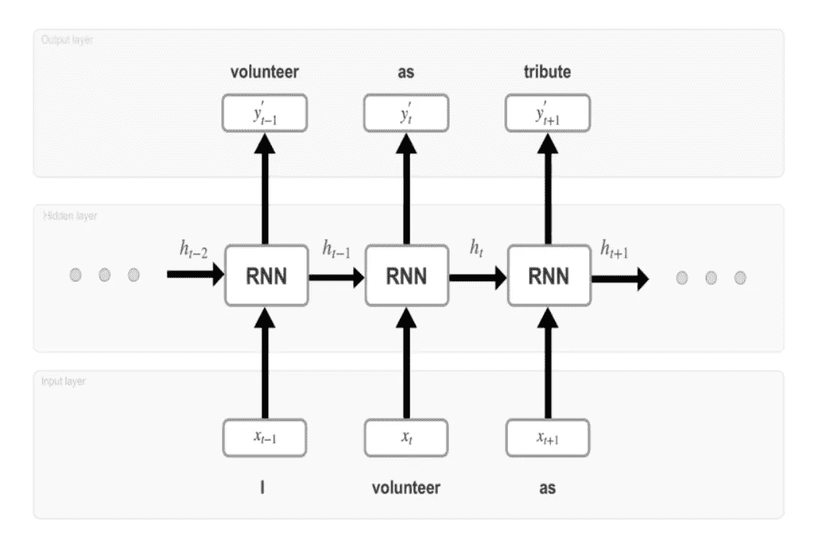

# 递归神经网络导论

> 原文：<https://medium.com/analytics-vidhya/introduction-to-recurrent-neural-networks-441d55321e2e?source=collection_archive---------21----------------------->

## 自然语言处理的核心

在人工神经网络介绍系列的这一章中，我们将讨论递归神经网络(RNNs ),它是自然语言处理(NLP)和机器翻译技术的构建模块。这是因为他们很容易理解像句子和语音片段这样的连续数据。

RNN 的目标是利用基于内存的架构对序列数据进行预测。与没有两个输入共享知识的前馈网络相反，RNNs 结合了额外的存储器状态。因此，预测不仅取决于当前状态，还取决于先前的信息。rnn 在各种任务中都有其用途，如将文本翻译为语音、预测句子中的新单词、将音频转换为文本、语言翻译和图像/视频字幕。

RNN 概述[1]

经典的 RNN 架构包含输入、隐藏和输出层，但与前馈网络不同，隐藏状态本质上是循环的，允许数据从一个时间步长传播到另一个时间步长。为了清楚地理解 RNN 架构的工作机制，对展开的具有一层的 RNN 的详细探索就足够了。上图所示的(输入-隐藏 RNN 单元-输出)集合代表每个时间步的网络[1]。以下是每个时间步发生的事件:

*   在时间步骤 *t-1* ，网络使用像一键编码、word2vec 或 GloVe 这样的单词嵌入技术对单词进行编码，以产生矢量 *xᵗ⁻*
*   编码的输入字 *xᵗ⁻* 被馈入 RNN 单元，该单元产生输出 *y'ᵗ⁻* 和存储器状态 *hᵗ⁻* 。应当注意，存储器状态是输入 *xᵗ⁻* 和存储器状态 *hᵗ⁻* 的先前值的结果。
*   通过将输出 *y'ᵗ⁻* 与训练开始时创建的文本语料库进行比较，对输出*进行解码，从而获得时间步长 *t-1* 处的实际单词预测。*

这就结束了我们对递归神经网络的介绍，在这里我们讨论了它们的基本结构和通过它的信息流。在本系列的下一章中，我们将深入探讨构成我们现代 RNN 的循环人工神经元是如何工作的。(这是一个相当高级的话题，如果你不熟悉矩阵和激活函数等数学概念，我建议你跳过它)。

[1] Kostadinov，S. & Safari，一家奥莱利传媒公司，2018 年。递归神经网络与 Python 快速入门指南第 1 版。，Packt 出版公司。

[2]朱利安博士，2018。用 Pytorch 进行深度学习快速入门指南:学习用 Python 训练和部署神经网络模型，伯明翰:Packt。