# 强化学习简介

> 原文：<https://medium.com/analytics-vidhya/introduction-to-reinforcement-learning-b2a74027ca9b?source=collection_archive---------26----------------------->

当我们出生时，我们做的第一件事就是与一个我们完全不了解的环境互动。我们的行为转化为我们以经验的形式吸收的结果。

这种学习过程是在一系列算法中衍生出来的，这些算法以强化学习的名义进行分组，目前在人工智能革命中处于领先地位，特别是在机器学习领域。

2010 年——谷歌以 4.5 亿美元收购 DeepMind。DeepMind 是人工智能领域致力于 R&D 的公司中的标杆。

2014 年——deep mind 开发了基于强化学习的软件，能够像人类一样学习玩视频游戏(Atari)。

DeepMind 的深度 Q 学习算法应用于雅达利游戏“砖块爆炸”的结果。2015 年——Deep mind 开发的 AlphaGo 软件击败了当前的策略游戏围棋世界冠军。

2015 年——由 DeepMind 开发的 AlphaGo 软件击败了当前的策略游戏围棋世界冠军。

2017 年——deep mind 的 AlphaZero 程序在 24 小时内实现了游戏中的超人水平:国际象棋及其亚洲等价物 shogi 和 go，击败了各自的世界冠军。

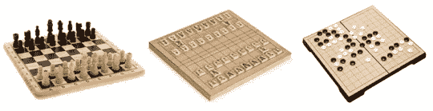

2019 年 DeepMind 开发的另一个程序 AlphaStar 成功赢得了最复杂的策略游戏之一《星际争霸 2》的职业玩家。

这种技术寻求通过试错来优化问题的结果。

每一个强化学习问题都是由一个主体和一个环境组成的。

*   代理可以被定义为具有记忆和推理能力的实体。它的任务是在环境中训练，直到达到最佳表现。从技术角度来看，它代表了算法。
*   另一方面，环境代表了要解决的问题；代理与之交互的上下文，即它的信息源。它总是由一系列的选择构成。

在每一个选择中，代理人执行一个动作，作为回报得到一个奖励。它对环境的了解随着它积累奖励而增长。一旦代理能够在所有可能的行动中找到一个给自己最高累积奖励的行动序列，学习就结束了

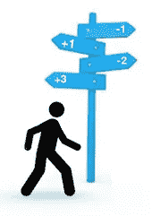

在下图中，环境被建模为由 9 个单元(备选方案)组成的建筑物内的燃烧植物。代理人由一个人代表，他的目标是在不烧伤自己的情况下穿过最少数量的单元到达门(绿色单元)。

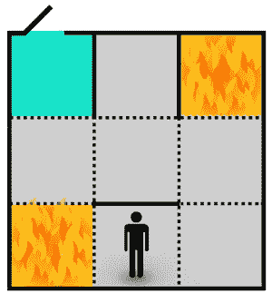

在每个单元中，代理可以向任何相邻的单元迈出一步(动作):左、右、前或后。

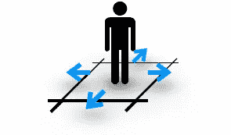

下图根据代理可以从每个单元中执行的可能操作来构建单元。毫不奇怪，墙壁覆盖了面向你方向的台阶。

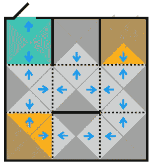

**与监督学习的异同**

*   强化学习还包括做出预测，然而其目的是在考虑当时环境状态的情况下，在所有可能的行动中，对最合适的行动进行分类。
*   强化学习是基于实验而不是模仿来实现这种预测的。因此，我们不需要标记所有的训练数据。取而代之的是，当主体以积极或消极体验的形式与环境互动时，我们用这个标签来代替我们所获得的结果。
*   强化学习从相反的角度处理问题，首先测试问题中可能找到的所有不同解决方案，然后将它们相互比较，以根据找到的最佳解决方案建立模型。从而避免了测试不同预测模型以查看哪一个最适合该问题的需要。

**马尔科夫的决策过程**

马尔可夫决策过程(MDP)提供了一个数学框架来模拟代理和环境之间的相互作用。

每个 MDP 由一组 S 个状态组成，相当于上面提到的环境替代物(细胞)。

每个状态都有一组有限的动作 A，每个动作都涉及两个状态之间的转换。

这种转变是随机的，即主体在一种状态下选择某个动作时的准则是不可预测的。虽然它可以根据归因于每个动作的发生概率来近似。

换句话说，在每个状态中，代理有 100%的概率执行任意分布在该状态的所有可能动作中的某个动作。

因此，如果我们以马尔可夫链的形式构造这个环境，并选择任何状态，例如“8”，则其转移概率之和将等于单元 P87 + P89 = 1。

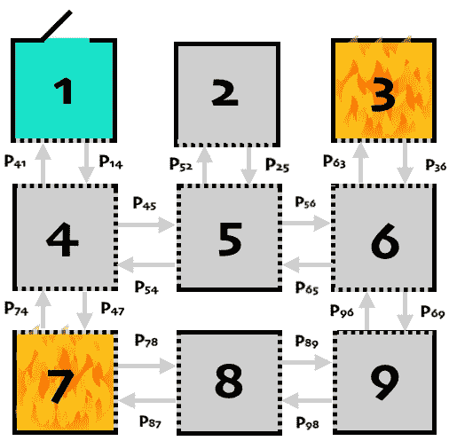

因此，代理遵循的策略𝝅将是一个函数，其输入变量是代理的当前状态，其输出是要采取的下一个动作。

换句话说，它是代理在每个状态中选择一个动作所应用的策略或标准。

在 MDP 中，状态之间的转换在离散时间 t = 0，1，2，⋯.中排序也就是说，在初始时刻 t，代理从环境的某个状态开始。在随后的时刻 t + 1，代理执行一个动作，移动到以下状态:

下图显示了上例中代理可以遵循的所有可能的状态序列，假设它从状态“8”开始，到状态“1”结束。星号象征着该状态之前的分支已经在图表中的其他点上被表示，因此两种表示的唯一不同之处是它们开始的瞬间。

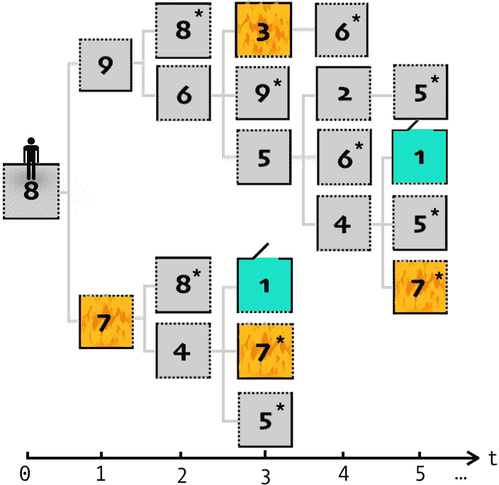

如上所述，代理的目标是识别他的所有未来线(状态序列)中哪一条是最合适的。为此，在每个新的状态中，代理都会收到一个奖励，他将使用该奖励来评估从前一个状态采取的行动:

我们可以把这个过程想象成一个任意的函数，它把状态-动作对映射到奖励上。

这种奖励表现为一个数字，其大小与代理接近(正数)或远离(负数)理想解的程度成正比。

以下列表确定了工程师为正确解决问题而必须考虑的所有可能事件的优先级顺序。每个事件可以在一个或多个状态(单元)中发生。每个州都分配有与其各自事件相关的奖励:

1.  到达出口(状态“1”)→+100 奖励。
2.  不要燃烧(状态“7”和“8”)→-10 奖励
3.  选择最短路径(其他状态)→ -每走一格奖励 1。如果单元之间的步长没有被惩罚，则代理将没有标准来识别它们的位移没有优化距离，从而导致过多的步长和/或取消所走的路径。

请注意，分配给奖励的值是主观的；重要的不是确切的值，而是它们彼此保持一致。下图总结了上一个列表中为每个环境状态设计的奖励分布。

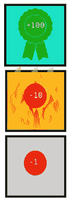

在完成 MDP 的建模之后，环境将为代理开始学习做好准备，也就是说，同化奖励的分配。

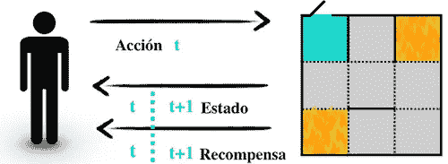

例如，假设一开始(状态“8”)，代理人决定向左移动一步。当到达状态“7”时，你会意识到这不是一个明智的决定(由于火的存在),你会继续转移到下一个状态。

这样，代理可以通过添加每个状态-动作对的即时奖励来计算所有可能路线的累积奖励。

例如，对于在时间 T 开始直到在时间 T 到达序列中的最后一个州的一般旅程，累积奖励将是其州中所有奖励的总和。

> 代理人的目标不是最大化(以下行为的)相邻报酬，而是每个可能的行为组合(Gt)的累积报酬。

在下图中，代理比较了两个明显最优的动作状态序列；虽然左边的路径更短，但火的存在大大减少了累积奖励，使路径成为问题的最优解。

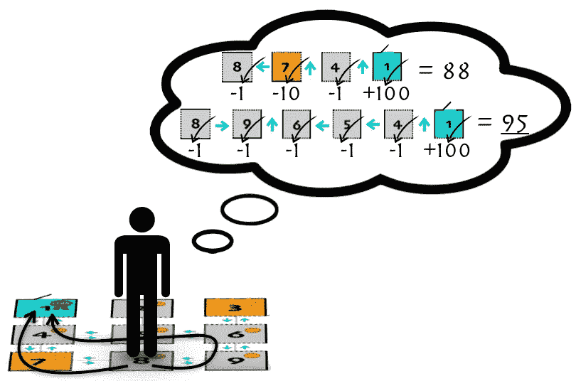

然而，如果我们停下来想一想，当环境是有限的时，代理很可能在他完成所有状态-动作对的知识之前就达到了最终状态。所以在你吸收整个奖励分配之前，你需要几个学习片段。这些类型的环境被称为情节任务。

强化学习问题往往有几百个，几千个，甚至无限个状态(连续任务)。在这种情况下，寻找最优解可能是一个过长的任务，如果不是无止境的话。

因此，为了加速算法的收敛，也就是说，为了便于代理找到使累积奖励最大化的路线，当代理离开初始状态时，减少奖励对代理的影响是一种好的做法。

从代理人的角度来看，它可以被解释为一种在执行动作时产生的疲劳。或者什么是相同的，一种尽快找到解决方案的动力。

从数学上讲，这个概念是通过乘以贴现率(贴现因子)γ0

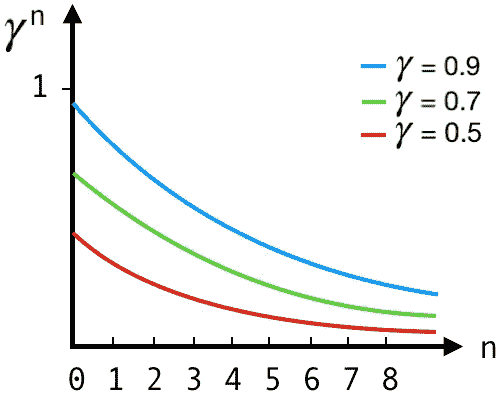

因此，累积奖励将是:

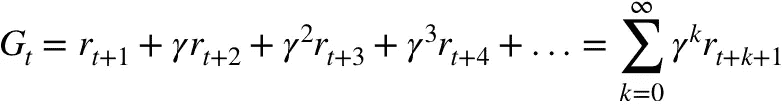

如果您觉得这篇文章有帮助，请单击👏你想要多少次都行。你也可以关注我的账户，以便及时了解未来的作品。