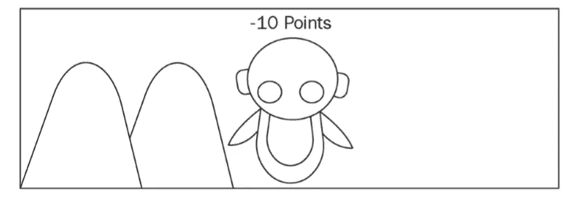
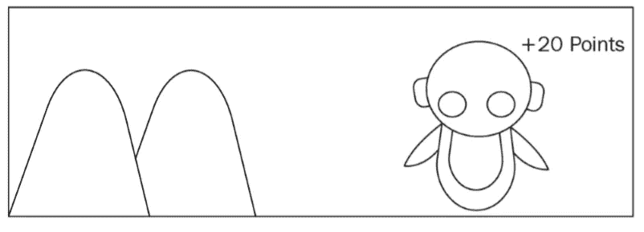
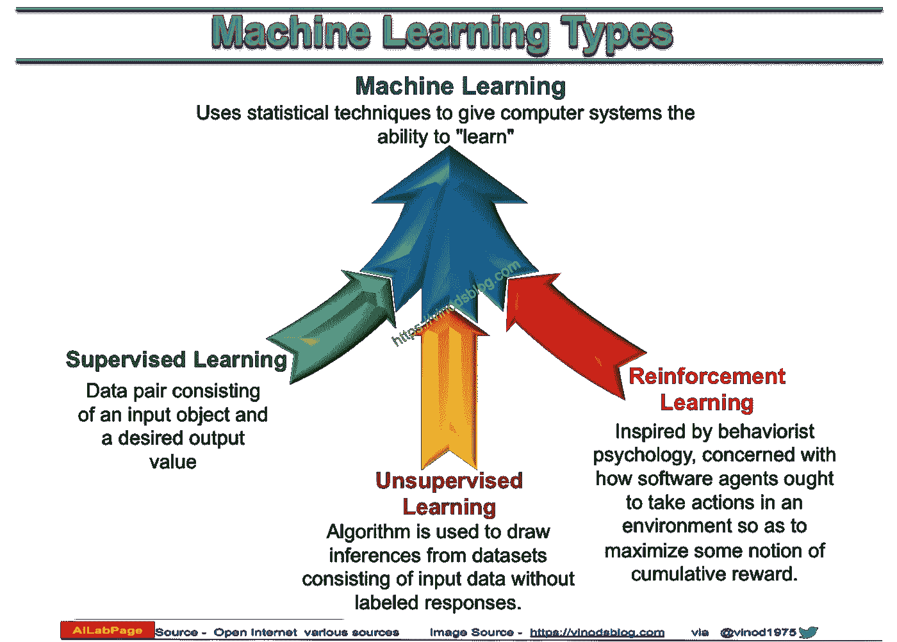
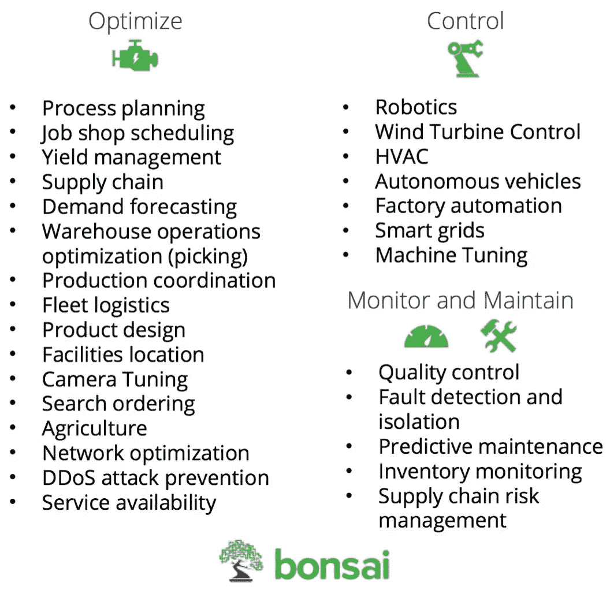

# 强化学习简介

> 原文：<https://medium.com/analytics-vidhya/introduction-to-reinforcement-learning-dc49e5c04310?source=collection_archive---------0----------------------->

这是强化学习教程系列的第一部分。我是一名学生，学习强化学习。如果从深度学习等其他人工智能范式来比较，学习强化学习并没有很大的来源。这将是一系列的教程，大部分是从其他地方复制的，如果你是初学者，这将是一个很好的来源。说得够多了，让我们进入正题吧。

# 什么是强化学习？

强化学习(RL)是机器学习的一个分支，通过与环境的交互来进行学习。它是以目标为导向的学习，不教学习者采取什么行动；相反，学习者从其行为的后果中学习。考虑一个机器人可以向左或向右两个方向移动的例子。它的左边有一个物体，而右边没有。在强化学习中，我们根据代理采取的行动给予奖励。在这种情况下，当机器人击中物体时，我们给它一个负奖励，如果它没有击中，我们给它一个正奖励。强化学习基本上是一个试错的学习过程。

# 强化学习与其他机器学习算法有何不同？

在监督学习中，机器(代理)从训练数据中学习，训练数据具有一组带标签的输入和输出。有一个外部主管，他对环境有完整的知识库，并监督代理完成一项任务。
在无监督学习中，我们为模型提供只有一组输入的训练数据；该模型学习确定输入中的隐藏模式。有一种常见的误解，认为 RL 是一种无监督学习，但它不是。在无监督学习中，模型学习隐藏结构，而在 RL 中，模型通过最大化回报来学习。假设我们想向用户推荐新电影。无监督学习分析这个人看过的类似电影并建议电影，而 RL 不断接收用户的反馈，了解他的电影偏好，并在此基础上建立知识库并建议新电影。

机器学习算法的类型

# 强化学习代理

强化学习代理是做出智能决策的软件程序，它们基本上是强化学习中的学习者。代理人通过与环境互动来采取行动，并根据他们的行动获得奖励，例如，超级马里奥在视频游戏中导航。

# **RL 的元素**

1.  **策略:-** 一个*策略*定义了学习代理在给定时间的行为方式。粗略地说，策略是从感知的环境状态到处于这些状态时要采取的行动的映射。策略是强化学习代理的核心，因为它本身就足以决定行为。策略通常用符号𝛑.来表示
2.  **奖励函数:-** 一个*奖励函数*定义了强化学习问题中的目标。粗略地说，它将环境的每个感知状态(或状态-行动对)映射到一个数字，一个*奖励*，表明该状态的内在可取性。强化学习代理的唯一目标是最大化它从长远来看得到的总回报。奖励函数定义了代理的好事件和坏事件。
3.  **价值函数:-** 一个状态的价值是从该状态开始，一个代理在未来可以期望积累的奖励总额。奖励决定了环境状态的直接的、内在的可取性，而价值在考虑了可能发生的状态以及这些状态中的奖励之后，表明了状态的长期可取性。打个人类的比方，奖励有点像快乐(如果高的话)和痛苦(如果低的话)，而价值则对应于一种更明确和更有远见的判断，即我们对环境处于特定状态有多高兴或不高兴。
4.  模型:- 模型是代理对环境的表示。学习可以有两种类型——基于模型的学习和无模型的学习。在基于模型的学习中，代理利用先前学习的信息来完成任务，而在无模型学习中，代理仅仅依靠试错经验来执行正确的动作。假设您想更快地从家里到达办公室。在基于模型的学习中，你简单地使用先前学习的经验(地图)来更快地到达办公室，而在无模型学习中，你不会使用先前的经验，而是尝试所有不同的路线并选择更快的路线。

# 强化学习环境

代理与之交互的一切都被称为环境。环境就是外界。它包括代理之外的一切。环境可以大致分为两类

1.  **确定性环境:-** 当我们知道基于当前状态的结果时，就说一个环境是确定性的。例如，在国际象棋比赛中，我们知道移动任何玩家的确切结果。
2.  **随机环境:-** 当我们不能基于当前状态确定结果时，环境被称为是随机的。会有更大程度的不确定性。例如，我们永远不知道掷骰子时会出现什么数字。

# 强化学习的应用

强化学习有大量的应用。我在这里提到了一些，如果你想了解更多，请看这个伟大的博客。

1.  机器人学
2.  交付管理
3.  玩游戏人工智能

强化学习在工业中的应用

# **强化学习系列**

1.  强化学习导论。→你在这里。
2.  [马尔可夫链和马尔可夫决策过程。](/@sanchittanwar75/markov-chains-and-markov-decision-process-e91cda7fa8f2)
3.  [贝尔曼方程和动态规划。](/@sanchittanwar75/bellman-equation-and-dynamic-programming-773ce67fc6a7)

# 参考

1.  Sudarshan Ravichandran 的 python 强化学习实践
2.  强化学习:介绍理查德·萨顿和安德鲁·g·巴尔托
3.  [https://towards data science . com/applications-of-enforcement-learning-in-real-world-1a 94955 BCD 12](https://towardsdatascience.com/applications-of-reinforcement-learning-in-real-world-1a94955bcd12)