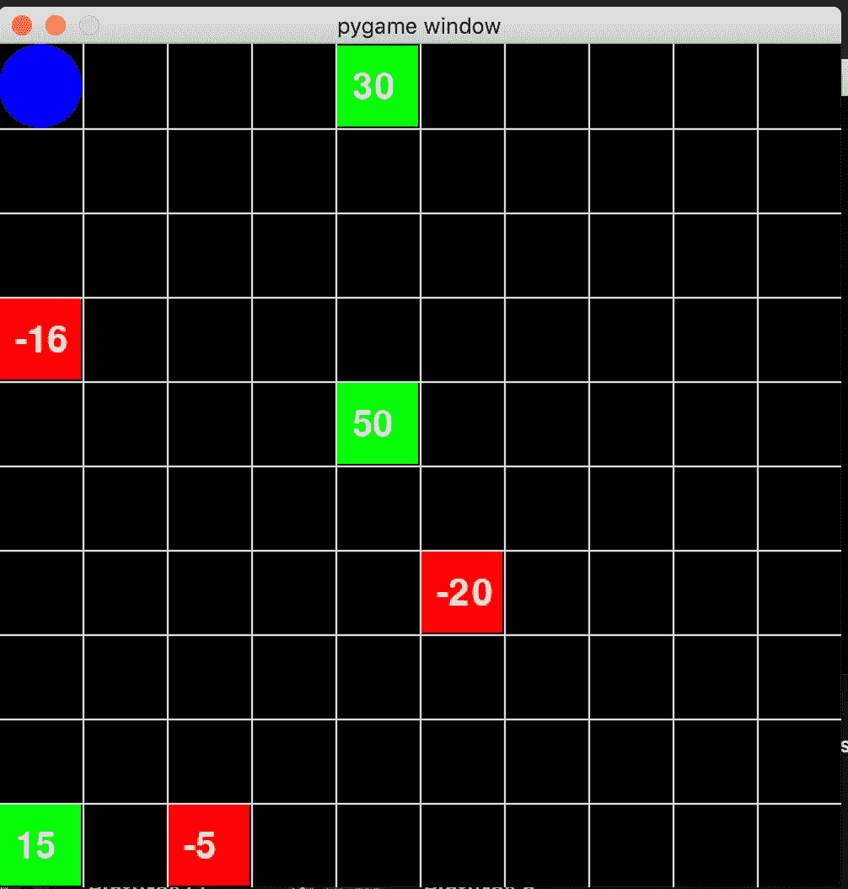
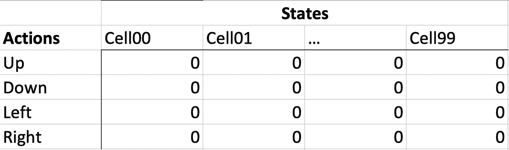
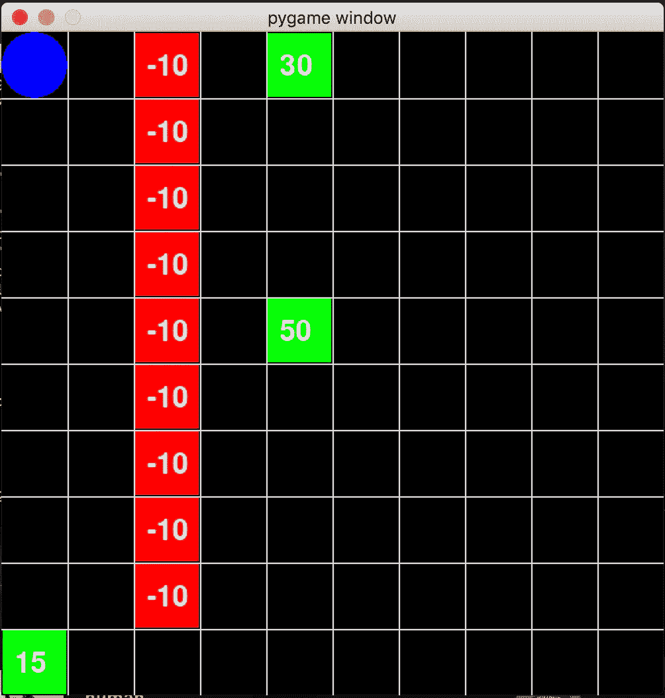
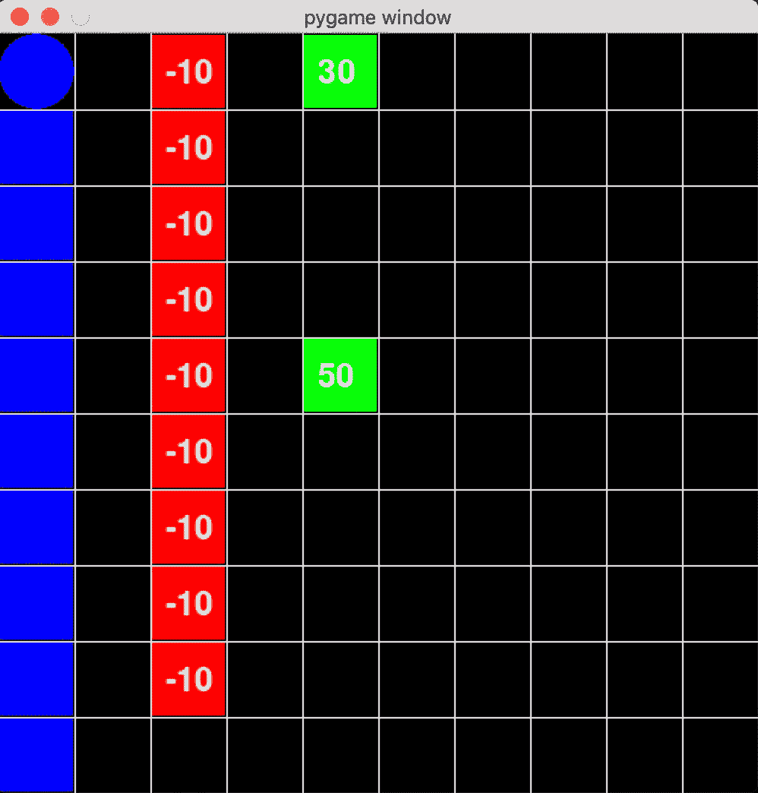
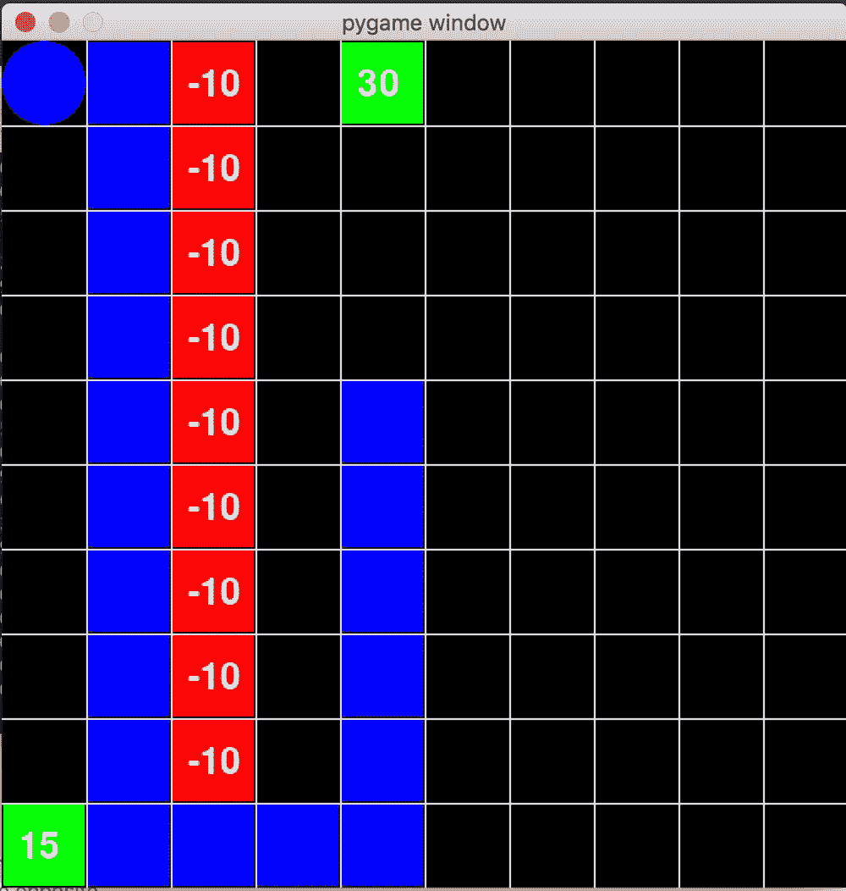
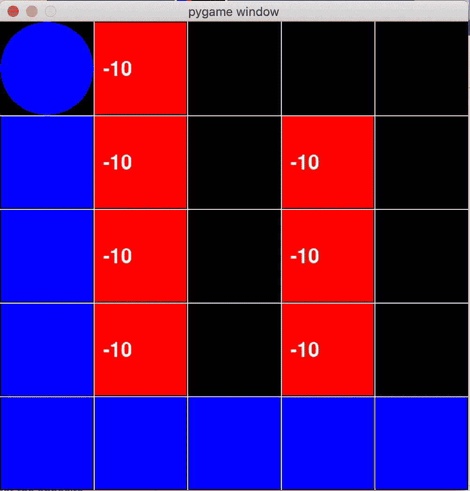
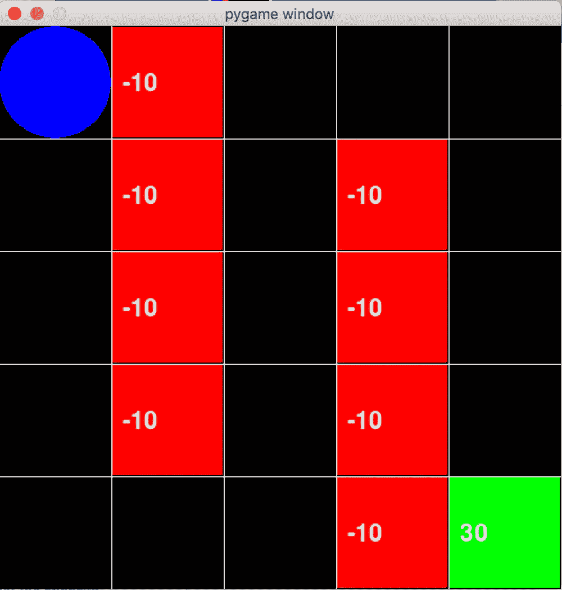

# 通过迷宫解决示例介绍强化学习(Q-Learning)

> 原文：<https://medium.com/analytics-vidhya/introduction-to-reinforcement-learning-q-learning-by-maze-solving-example-c34039019317?source=collection_archive---------1----------------------->

[](https://github.com/stschoberg/mazeGame) [## stschoberg/mazeGame

### 用强化学习(QLearning)玩迷宫游戏。你可以体验不同的电路板布局，终端…

github.com](https://github.com/stschoberg/mazeGame) 

# 介绍

强化学习(RL)算法是 ML 算法的子集，希望在未知环境中最大化软件代理的累积回报。

这个定义很拗口，如果没有对 RL 问题或算法的直觉，很难理解。然而，在看完下面的例子后，你会发现为了更好的理解，重温一下这个例子是很有用的。在此之前，我们将通过一个简单的迷宫解决 RL 示例来轻松了解该理论。我们将从 10，000 英尺的高空看到这些概念，将问题可视化，深入代码，用算法识别问题，然后更正式地重温 RL/QLearning。

# 问题概述

我认为在我们开始任何想法之前，先了解我们的问题是有用的。这样，您就能够将正式的定义和概念链接回一个文字示例。

你会在下面看到我们的游戏。我们有一个 10x10 的格子，一个蓝点代表我们的玩家，绿色的格子代表不同的奖励值，红色的方块代表不同的惩罚值。蓝点可以向四个方向移动:北、南、东、西。当蓝点到达奖励或惩罚方块时，游戏结束，方块的值为最终得分。这是一个非常简单的游戏，但是我们需要形式化它以便用 RL 来解决它。



# 定义:

回想一下 RL 的最初定义提到了软件代理和环境。这两件事是形式化 RL 问题的概念构建块。

**环境**:我们的环境就是整个游戏棋盘。游戏板是一组简单的单元。我们可以用一组或一列单元格来表示，这些单元格由它们在棋盘上的(x，y)位置来标识*。*

```
ENV = { cell00, cell01, … , cell99 }
```

**状态:**状态是环境中的单一元素。在我们的例子中，一个国家就是一个细胞。形式上，我们可以说环境是一组状态。

代理:代理是一个可以通过动作与环境交互的实体。代理以一种状态存在。我们的代理是蓝点。值得注意的是，我们只需要一个当前位置和我们的累积分数来定义我们的代理。

```
AGENT = { CurrPos: Cell, Score: 0 }
```

**动作**:动作是代理可以从一个给定状态调用到另一个状态的功能。我们的行动是北，南，东，西。

我们几乎可以形式化我们的整个 RL 问题了！首先，我们需要几个函数。

***Is terminal state(s):***Is terminal state 以状态 *s* 为输入，返回一个布尔值，表示 *s* 是否为结束状态。在我们的例子中，奖励和惩罚方块是最终状态。

***【Actions】:***返回一组代理可以从状态*采取的有效动作，例如 *Actions(cell00)* 将返回 *{ UP，RIGHT }* ，而 *Actions(cell55)* 将返回 *{UP，DOWN，LEFT，RIGHT}* 。这是因为棋盘的边界。*

**:返回一个状态的值。例如，*值(单元格 00)* 为 0，*值(单元格 09)* 为 15。**

**我们现在可以形式化整个 RL 问题了！**

## **强化学习问题:**

*   **一组状态(环境)**
*   **一系列动作**
*   **一个代理(具有开始状态 *S⁰***
*   **动作:来自状态 *s* 的可用动作**
*   **值:一个状态的值 *s***
*   **IsTerminalState:是否 *s* 是结束状态**

**就是这样。RL 定义的一般公式。我们可以用这 6 样东西代表任何 RL 问题。我们的最终目标是在到达终点状态之前通过访问各州来最大化累积分数(即在游戏结束之前获得尽可能多的分数)。**

**在我们着眼于最大化报酬之前，重要的是要注意到代理人所拥有的唯一知识是他自己的当前状态和分数。它不知道有多少个状态，奖励是什么，或者结束状态在哪里。代理可以学习的唯一方法是通过动作移动到不同的状态，调用*值*和*IsTerminalState*并记录结果。**

**凭直觉，你应该能够猜到寻找最优分数的算法必须探索状态空间，以找到产生最大回报的路径。**

# **学习**

**QLearning (QL)是一种在给定 RL 问题的情况下评估最优路径的技术。它包括一个记录由代理学习的数据的 q 表和一个确定给定状态的最佳回报的 q 函数。QLearning 是一个迭代的动态编程算法，只有几个参数，所以一开始看起来可能会令人困惑。我会尽力去划分，但是彻底的了解来自于曝光和时间。**

## **数量表**

**QTable 记录采取行动时状态的期望值(例如 *Q(Cell00，' UP')* )。它为所有状态和动作组合记录这一点。换句话说，一个量化表将一个奖励映射到每个状态、动作对。为了启动 QLearning 算法，我们将所有的 q 值都设置为 0。当算法运行并且代理探索状态时，我们更新 QTable。**

****

**在迷宫游戏的代码中，我们使用嵌套字典作为我们的 QTable。外部字典的关键字是一个状态名(例如 Cell00 ),它映射到一个有效的、可能的动作的字典。该字典的关键字是映射到 Q 值的动作(例如，右)。**

```
**qTable = {cell00 : {‘Right’: 0, ‘Up’: 0 }, cell01: {‘Right’: 0, ‘Left’: 0, ‘Up’: }, …}**
```

## **q 函数**

**QFunction 确定给定状态、动作对的 q 值。在看下面的等式之前，让我们考虑一下如何计算给定状态和动作的最佳值。给定状态 *s* 和导致新状态*s’*的动作 *a* ，最佳回报将是*值(s’)*加上从*s’*可用的所有动作中留下*s’*可获得的最大值(即*动作(s’)*)。最佳值取决于当前值、从*、*中获取 *a* 的奖励以及所有有效动作中下一状态的最佳值*s’*。我们用同样的方法计算*s’*的最优值。正如你所想象的，这会导致一些非常讨厌的递归。在实践中，我们用更新迭代计算 Q(s，a)。通过对上述直觉的一些代数操作，我们推导出以下等式:**

****Q(s，a)= Q(s，a)+α⋅[value(s')+γ⋅maxq(s′)−q(s,a)】****

**我不会去调整 **α** 和 **γ。这些被称为学习率和折现率。它们分别修改算法学习的速度和算法对未来行动的重视程度。****

## **该算法**

**理解 QLearning 算法的一个关键定义是插曲。一个情节就是一个代理从开始状态到结束状态的执行。我们想要运行大量的剧集来探索从开始状态到结束状态的大多数路径。我们的剧集越多，探索的路径越多，找到最佳路径的几率就越大。随着剧集数量的增加，QTable 的值会收敛到它们的真实值。**

```
**Init Q(s, a) to 0 for all (s, a) pairs
Repeat for episode = 1 ... numEpisodes
     Initialize s to startState
     While (s is not TerminalState)
           Choose an action a from Actions(s)
           s' = new state after action a from s
           Q(s,a)= Q(s, a) + α⋅[Value(s’)+γ⋅maxQ(s′)−Q(s,a)]
           s = s'**
```

**重要的是要意识到算法只是填充了 q 表。它不会输出最佳路径。但是，从 QTable 和 start 状态来看，找到最优路径是很容易的。**

## **行动选择**

**RL 中的一个基本问题和算法中的一个微妙选择，如何从*Actions*(即 while 循环中的第一行)*中选择一个 action *a* 。我们如何选择行动会影响代理如何探索环境。一种解决方案是从一组有效动作中选择具有最大奖励值或 Q(s，a)的动作。一开始，当所有的 q 值都是 0 时，这将是一个任意的选择。随着量化表的更新，代理将只探索它知道有回报的方向。似乎是个可行的选择，对吧？我们来模拟一下。考虑下面的环境。***

**

*我们假设我们总是从状态 *s* 中选择奖励值最大的行动。一开始，所有的值都是 0，所以代理会选择探索随机的方向。在许多随机决策之后，Q(第 1 列中的任何空格，右侧)将变为-10。由于我们总是选择最大动作进行探索，而 0 > -10，代理不会选择向右移动。因此，它最终会发现左下角的 15。*

*在发现 15 之后，选择产生最大价值的行动成为一个问题。代理人不会去探索棋盘右侧可以获得更高奖励的地方，而是总是会移动到 15。这是因为棋盘其余部分的 q 值仍然初始化为 0，而左下角的值现在为 15。代理将总是选择导致 15 的动作。具体看 QTable[(2，9)]看看为什么代理永远不会移动到棋盘的右边。*

**

```
*k: (0, 0), v: {'right': 5.230176601500001, 'up': 6.457008150000001}k: (0, 1), v: {'right': 5.811307335000001, 'up': 7.174453500000001, 'down': 5.811307335000001}k: (0, 2), v: {'right': 6.457008150000001, 'up': 7.971615000000001, 'down': 6.457008150000001}k: (0, 3), v: {'right': 7.174453500000001, 'up': 8.85735, 'down': 7.174453500000001}k: (0, 4), v: {'right': 7.971615000000001, 'up': 9.8415, 'down': 7.971615000000001}k: (0, 5), v: {'right': 8.85735, 'up': 10.935, 'down': 8.85735}k: (0, 6), v: {'right': 9.8415, 'up': 12.15, 'down': 9.8415}k: (0, 7), v: {'right': 10.935, 'up': 13.5, 'down': 10.935}k: (0, 8), v: {'right': 12.15, 'up': 15.0, 'down': 12.15}k: (0, 9), v: {'right': 0, 'down': 0}k: (1, 0), v: {'left': 5.811307335000001, 'right': -10.0, 'up': 5.811307335000001}k: (1, 1), v: {'left': 6.457008150000001, 'right': -10.0, 'up': 6.457008149999355, 'down': 5.230176601499478}k: (1, 2), v: {'left': 7.174453500000001, 'right': -10.0, 'up': 7.174453499999994, 'down': 5.811307334999995}k: (1, 3), v: {'left': 7.971615000000001, 'right': -10.0, 'up': 7.971615, 'down': 6.457008137731096}k: (1, 4), v: {'left': 8.85735, 'right': -10.0, 'up': 8.857349999114264, 'down': 7.174453500000001}k: (1, 5), v: {'left': 9.8415, 'right': -9.99999999999999, 'up': 9.841499999901576, 'down': 7.971614999999203}k: (1, 6), v: {'left': 10.935, 'right': -9.99999999999999, 'up': 10.93499999999989, 'down': 8.857349999999991}k: (1, 7), v: {'left': 12.15, 'right': -9.999999999999998, 'up': 12.149999878500001, 'down': 9.841499999998927}k: (1, 8), v: {'left': 13.5, 'right': -9.9999999999, 'up': 13.49999999999085, 'down': 10.934999988079628}k: (1, 9), v: {'left': 14.99999999999985, 'right': 10.628820000000001, 'down': 12.13784999999989}k: (2, 0), v: {'left': 0, 'right': 0, 'up': 0}

**... (a bunch of zeroes)**k: (2, 8), v: {'left': 0, 'right': 0, 'up': 0, 'down': 0}k: (2, 9), v: {'left': 13.3528499998785, 'right': 0.0, 'down': 0} **... (more zeroes)**k: (9, 8), v: {'left': 0, 'up': 0, 'down': 0}k: (9, 9), v: {'left': 0, 'down': 0}*
```

## *探索与开发*

*上述问题是勘探与开发问题的实质。代理可以利用已知的高回报状态，也可以探索更多的状态空间。重要的是在这两种策略之间取得平衡，以找到获得最佳价值的有效途径。*

*找到平衡的一种方法是使用**ε贪婪**函数。在一个ε贪婪函数中，你指定一个ε值， **ε** 。该值是一个百分比，表示您希望代理选择随机操作而不是具有最大结果的操作的频率。换句话说，这是你引入的混乱程度。代理人将在其决策的 **ε** % 中选择一个随机动作。ε值通常需要一些手动调整来找到最佳拟合。*

```
*EpsilonGreedy(state, ε):
       validActions = Actions(state)
       ε% of the time:
          choose from validActions randomly
       (1-ε)% of the time:
          chose action a from validActions with max(Q(state, a))*
```

*让我们考虑一下之前 epsilon 为 0.7 的游戏环境(是的，可能有些夸张)。虽然代理可能会首先发现 15，但它在 70%的情况下会采取随机行动，所以它不会总是移动到那个方块。超过 1000000 集(是的，也可能是多余的)代理商找到了 50 集！*

**

*探索与利用是代理避免陷入发现局部极大值的关键概念。还有其他方法可以平衡这两者。Epsilon greedy 只是其中之一。*

# *结论*

*在这个例子中，我们已经讨论了很多，但也触及了 RL 和 QLearning 中的很多主要主题。现在，您应该能够回到 RL 的原始定义，以便更完整地理解这个主题。*

*   *形式化 RL 问题*
*   *引入了探索环境寻找奖励的直觉*
*   *q learning:q 表和 q 函数*
*   *探索与开发*

*一些结束语:*

***为什么我们不能在这个例子中只使用搜索？***

*嗯……我们可以。这是一个相当小的例子，规则很简单。例如，我们可以添加更多带有奖励或惩罚的单元格。然后，我们可以说只有某些细胞是终态(这意味着在到达终态之前，你可以穿过多个奖励或惩罚细胞)。这将极大地增加可能的解集。随着事情变得越来越复杂，RL 被证明比搜索更有效。*

*我能得到密码吗？ [确定](https://github.com/stschoberg/mazeGame)。*

***你跳过的 QFunction 中的那些常数是什么？***

*[维基百科](https://en.wikipedia.org/wiki/Q-learning#Influence_of_variables)解释的比我好。还有一个有趣的部分是关于更改 QTable 初始化值如何影响探索。*

***您是否运行过更复杂、更有趣的例子？**是的。这很难。*

1.  *终端状态是绿色方块。ε= 0.2。NumEpisodes = 1M。最终得分= 40*

****

*更多考验即将到来…*