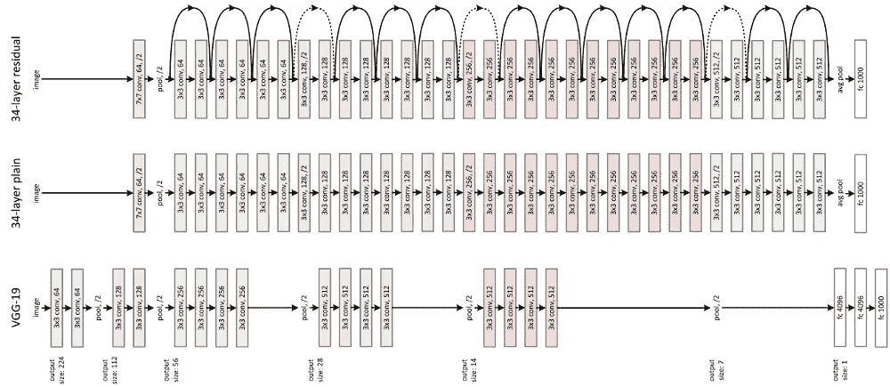
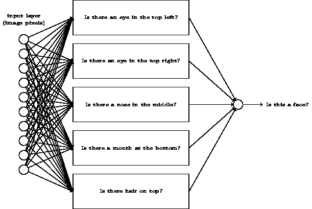
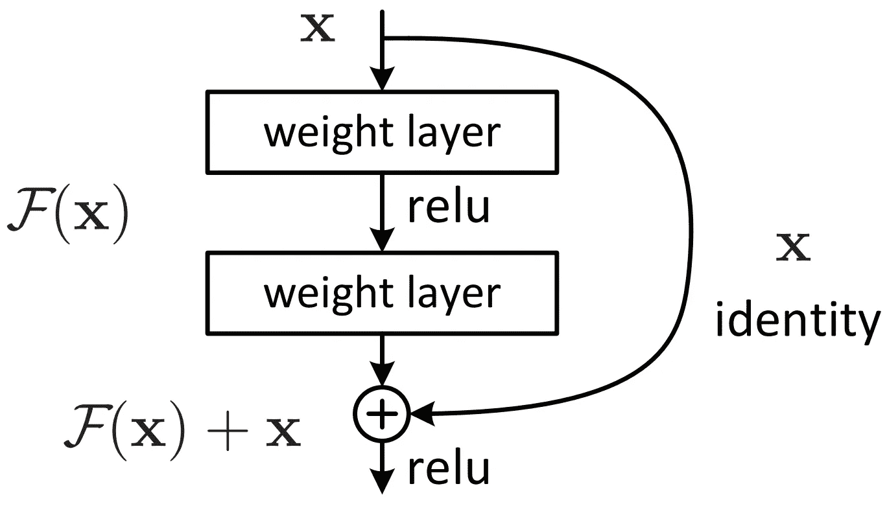
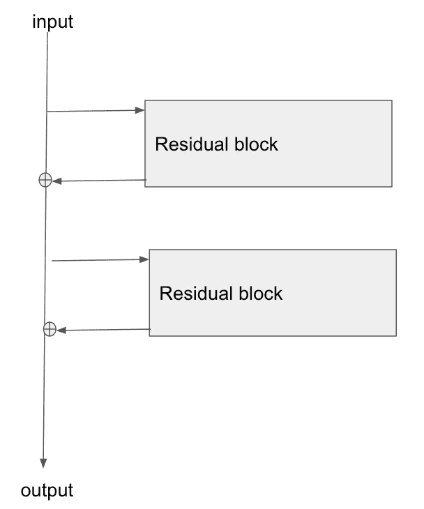

# 残差神经网络背后的动机

> 原文：<https://medium.com/analytics-vidhya/introduction-to-residual-neural-networks-8af5b7c4afd4?source=collection_archive---------4----------------------->

残差神经网络架构([来源](https://arxiv.org/abs/1512.03385)

这篇文章并不是对剩余神经网络的技术解释。我敢肯定，许多教程和书籍已经存在，并在这方面做得更好。这篇文章旨在介绍 ResNets 背后的动机，以及为什么它们工作得很好。

# 介绍

所有深度学习模型都由几个堆叠的层组成，这允许模型学习我们输入的特征，并对其性质做出决定。但是网络如何检测数据中的特征呢？

神经网络特征的例子([来源](http://neuralnetworksanddeeplearning.com/chap1.html)

神经网络是通用函数逼近器，这意味着给定训练数据，我们的模型会尝试学习正确的参数，这些参数密切代表给出正确输出的函数。添加层增加了参数，这允许复杂非线性函数的映射。但是，如果我们遵循这个规则，堆叠更多的层不就意味着更好的性能吗？嗯，有一个条件。在实践中，我们注意到向我们的模型添加更多的层会产生更好的性能，直到我们达到某个数字，我们注意到精度不仅停滞不前，而且实际上开始下降。

# **理解大量层次的问题**

首先，我们需要了解模型如何从训练数据中学习，这是通过将每个输入传递给模型(前馈)然后再传递回来(反向传播)来实现的。在反向传播过程中，我们根据模型对输入的分类程度来更新模型的权重，这由我们定义的损失函数来量化。更新包括从先前的权重值中减去损失函数相对于权重的梯度。

更新权重的公式。([来源](/analytics-vidhya/this-blog-post-aims-at-explaining-the-behavior-of-different-algorithms-for-optimizing-gradient-46159a97a8c1))

现在问题开始出现了。为了计算损失函数的梯度，我们必须使用[链式法则](https://en.wikipedia.org/wiki/Chain_rule)，这意味着为了计算每一层的梯度，我们要将之前各层计算的值相乘，因为每个值都已经很小了，所以将它们相乘会得到非常接近于零的值。许多层意味着网络起点的层不会发生任何变化，这被称为消失梯度问题。虽然消失梯度是最普遍的问题，但在实践中，我们也发现可能会出现相反的情况。如果梯度值真的很大，乘以多个大数量将导致爆炸梯度问题。

# **解决渐变消失问题**

一个残块([来源](https://arxiv.org/abs/1512.03385v1))

实际上，剩余网络是这个问题的解决方案。在残差网络中，我们添加跳过 2 或 3 层的快捷方式，该快捷方式将改变我们计算每层梯度的方式。简而言之，将输入传递到输出允许阻止一些层改变梯度的值，这意味着我们跳过对一些层的学习。这是解释梯度如何在网络中回流的最佳表示。

剩余块图。([来源](https://stats.stackexchange.com/questions/268820/gradient-backpropagation-through-resnet-skip-connections/268824#268824))

当我们训练时，模型学习哪些层是值得保留的，那些没有帮助的层将被转向身份映射。这是残差网络成功的另一个因素，使层映射到单位函数非常容易，就像使 F(x)=0 一样简单。

我们可以“隐藏”没有帮助的层，这一事实转化为动态的层数，我们从所有层开始，然后决定保留哪些层。

看看这些精彩的文章:

[剩余块 ResNet 的构建块](https://towardsdatascience.com/residual-blocks-building-blocks-of-resnet-fd90ca15d6ec)

[反向传播非常简单。谁让它变得复杂了？](/@14prakash/back-propagation-is-very-simple-who-made-it-complicated-97b794c97e5c)

[梯度如何流经残差网络？](https://stats.stackexchange.com/questions/268820/gradient-backpropagation-through-resnet-skip-connections)