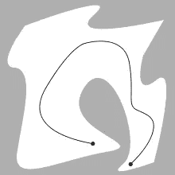
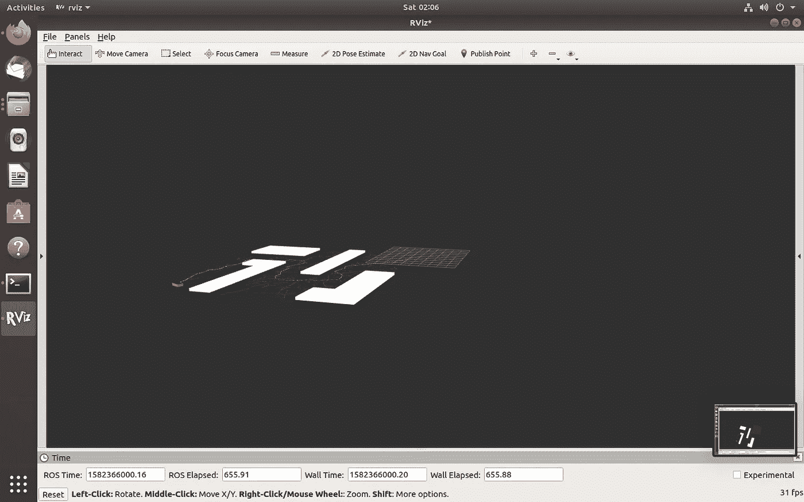
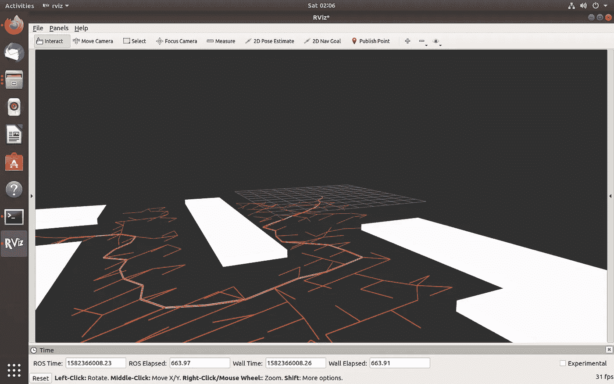
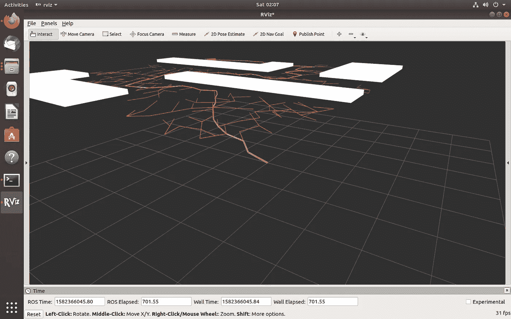
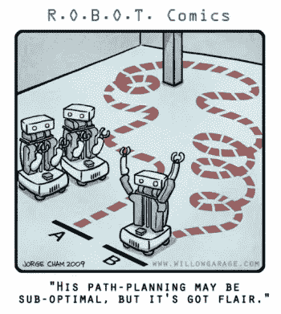

# RRT 介绍(快速探索随机树)

> 原文：<https://medium.com/analytics-vidhya/introduction-to-rrt-rapidly-exploring-random-tree-3c37cf57f02?source=collection_archive---------12----------------------->

在这篇文章中，我将简要解释运动规划领域中最常用的算法。在我们开始之前，我想请你(那些没有机器人或计算机科学背景的人)看一下这个维基百科页面，了解这个[算法](https://en.wikipedia.org/wiki/Rapidly-exploring_random_tree)背后的概念。这是

注意:很抱歉听起来太直截了当，但这篇文章是为那些在机器人领域有一些工作经验的人写的。

让我总结一下我将在这篇文章中涉及的内容:

1.  什么是**运动规划**及其背后的概念。
2.  为什么我们要求机器人的动作**完美规划**？
3.  RRT 及其背后的概念。

# 运动规划:通俗地说，运动规划就是为机器人(移动机器人)从起始位置行进到目标位置寻找一条有效的路径。它主要涉及找到一组有效的配置，以:

1.  避免碰撞(墙壁、边界)物体。
2.  用更少的时间从源头到达目的地。

在下图中，该算法能够成功找到两点之间的解决方案路径。

动作规划(承蒙:[https://en.wikipedia.org/wiki/Motion_planning](https://en.wikipedia.org/wiki/Motion_planning))

如果这个算法很容易实现，任何人都可以做到。我会有一个自己的创业公司，致力于解决运动规划的问题。开个玩笑！！！

这是实践的问题，没有别的。不管怎样，让我们直接进入下一部分。

# 为什么需要运动规划？

我在**IIT-马德拉斯**实习期间，在对 **UR5** 机械臂进行 TCP 校准和精度测试时，我们观察到机器人由于缺乏轨迹规划和运动规划，与保持在其附近的物体发生碰撞。轨迹分析没有正确完成，因此出现了以下问题:

1.  回差
2.  抓放操作过程中的振动。
3.  拾取和放置操作过程中的抖动和锯齿状路径。

现在我们知道了什么是运动规划，以及为什么它很重要，解释 RRT 是安全的。

**问题陈述:**假设障碍物是静态的，确定动态环境中的无碰撞路径。

**目标:**在精度测试& TCP 校准期间，我们观察到我们的 UR5 机器人在与工作台或底座碰撞后以反斜杠停止。轨迹一点也不平滑，这影响了精确度。所以我们测试了一些算法:

1.  轨迹平滑

2.精确避障和
3。内存效率高且计算成本低。

使用 python 中的 [Pygame](https://www.pygame.org/) 库实现了一个基本的 RRT 算法。

RRT 是一种渐近最优的算法。换句话说，当迭代次数趋于无穷大时，它获得一条解路径。它在概率上是完整的，这意味着如果路径存在，它将返回它。

3d 版 RRT

算法跟踪的曲折路径

黄色线是无冲突的解决方案路径

RRT 在行动

代码可以在我的 Github 资源库中找到:[源代码](https://github.com/addy1997/Kinodynamic-Fast_RRT-ROS)

为了更生动地理解它，请看下面的视频。在视频中，该算法在 3D 环境中实现，其中:

1.  **白色物体**是**碰撞物体**(墙壁或边界)。
2.  在每个方向上随机出现的**红色**线是作为用于对空间中的节点进行采样的**伪随机数发生器**的结果而形成的图的边。
3.  使用**橙色**突出显示**解决方案**路径。
4.  可以观察到一个**立方体**机器人从**起点**移动到**目标**节点。

这就把我们带到了这篇文章的结尾。我希望你觉得这很有趣，值得一读。继续修改代码，并亲自尝试。

谢谢！！！