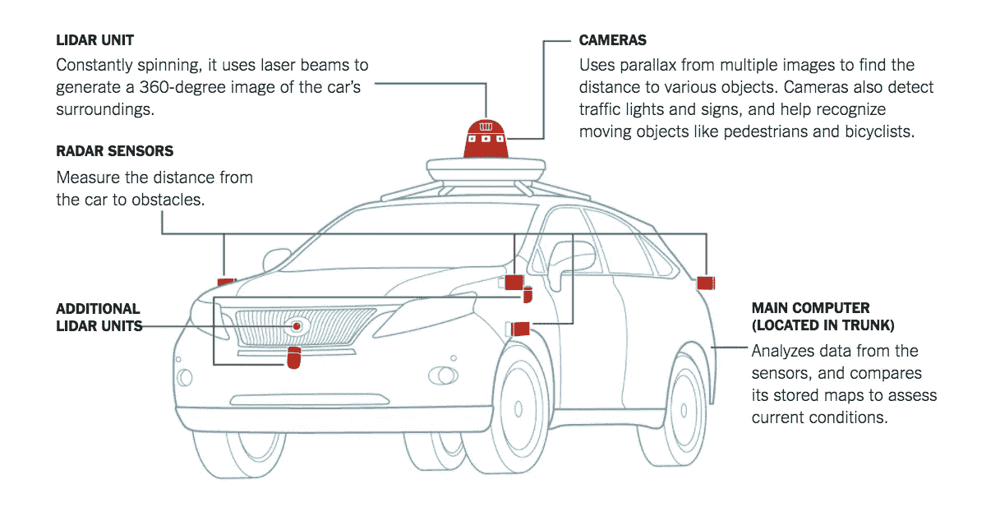

# 自动驾驶汽车简介

> 原文：<https://medium.com/analytics-vidhya/introduction-to-self-driving-cars-fef8730f145e?source=collection_archive---------11----------------------->

大家好，由于我有很多空闲时间，我决定拿起人工智能领域的一个技术术语，自动驾驶汽车。当我阅读和实验上述主题时，我打算研究和记录我的学习，同时加入我的感知。在这篇文章中，我将涉及**为什么无人驾驶汽车、****驾驶任务、自主程度、**和使用 [Carla](https://carla.org/) 的无人驾驶汽车的基本模拟。

*快乐阅读:)*


[特斯拉的自动驾驶汽车](http://forbes.com)

对于会开车的人来说，开车似乎不是一件困难的工作，我们有出租车、公共汽车和公共交通工具供不会或不想开车的人使用。对于一些乐观的人来说，完全自动驾驶的汽车似乎指日可待，但是我仍然想断言**为什么我们会首先拥有它们？**

人工智能的目标是制造智能机器，这些机器可以做我们认为人类才能做的事情，而自动驾驶汽车属于实现这一目标的大任务。简单来说，自动驾驶汽车可以实现:

1.  每个人的移动性
2.  避免由于系统性人为错误而发生的事故
3.  很多人学习驾驶，但他们都是从零开始，没有人天生就有特殊的能力知道如何驾驶。有了一个精心设计的自动驾驶汽车互联网络，每辆车都会比前一辆车更好，每辆车都会比昨天开起来更好。是的，我知道这听起来很天真，但是如果你想在这个领域取得进展，这是一个你不能忽视的好处。

现在让我们开始理解驾驶任务，看看我们人类在驾驶时处理的复杂性，并向计算机解释它。


自主车辆的过程建模

让我们稍微简化一下上面的图表。**驱动任务**由三个基本子任务组成:

1.  **感知**:感知我们的环境包括意识到我们周围的任何车辆、个人、建筑物，但不仅限于此，红绿灯、坑洼、建筑工地、任何可能影响我们驾驶任务的事物都需要被感知和理解。这是通过传感器完成的，它可以是照相机、激光雷达、雷达、声纳、GPS 或这些的组合。
2.  **规划**:我们感知到自己所处的环境后，需要做出驾驶决策。如果我必须从一个地方到另一个地方，我需要根据对周围环境的观察得到指示和决定。因此，对于规划任务，我们可以考虑所有的传感器和导航数据，但当我接近十字路口时，在同一车道上过马路的人怎么办？规划还需要根据传感器收集的数据进行预测，就像我们在驾驶时估计周围物体的运动和轨迹一样，计算机也需要这样做。
3.  **控制车辆**:基于感知、计划和预测，我们进行最终驾驶的行为。这包括理解汽车如何工作的机制，以及我们所做决定的实施过程中涉及的物理学，无论是加速、刹车还是提醒驾驶员。



[自动驾驶汽车中的传感器——纽约时报](https://www.google.com/url?sa=i&url=https%3A%2F%2Fwww.nytimes.com%2F2018%2F03%2F19%2Ftechnology%2Fhow-driverless-cars-work.html&psig=AOvVaw3UXtaMffgcHhuF2zIoX05Q&ust=1598090611076000&source=images&cd=vfe&ved=0CAIQjRxqFwoTCMDd1MyFrOsCFQAAAAAdAAAAABAS)

**自治级别**

根据汽车在没有人类干预的情况下可以处理的情况，我们将自主性分为不同的级别。作为参考，0 级被认为是手动驾驶的汽车，没有自动化，汽车做的一切都由司机控制。

为了推进自治级别，让我们快速浏览几个有助于我们使用自驱动分类法的术语:

1.  **侧向控制**:路面转向、左转、右转、直行。
2.  **纵向控制**:速度、加速或制动
3.  **OEDR** :物体/事件检测和响应，允许对事件做出响应，有物体碰撞的危险= >踩刹车
4.  **规划**:考虑过去的数据，预测物体未来的运动。
5.  **完全受限奇数**:操作设计域决定了汽车可以在什么条件下运行，比如已知的地形、城市、日光等。影响车辆在运行条件下是否限制了 ODD 或自由度。

现在让我们从自治级别开始:

1.  **级别 1-驾驶辅助**:汽车具有横向或纵向控制，即如果你注意转向，速度由汽车控制，反之亦然。这是今天许多车辆提供的。
2.  **级别 2-部分驾驶自动化**:车辆提供横向和纵向控制，但没有即时响应或任何其他功能。这个级别需要驾驶员的注意力。日产和特斯拉很少有 2 级自主的车型。
3.  **第三级——有条件的驾驶自动化**:车辆可以在受控的环境下，如慢速交通中，提供纵向和横向控制以及 OEDR。在任何紧急情况下，司机都必须控制局面。奥迪和特斯拉发布了提供 3 级自主的车型。
4.  **4 级-高驾驶自动化**:横向和纵向控制，OEDR，紧急情况下的回退。4 级及以上自主驾驶不需要驾驶员注意，但是，它在已知天气的限定地理区域内运行。
5.  级别 5-无限奇数:这是你能想象到的最高级别的自治，它处理横向、纵向、OEDR、回退，除此之外，对奇数没有任何限制。你可能已经猜到了，没有这种程度的自治的例子。

既然我们已经对自动驾驶汽车的基本概念有了很好的理解，我想把我们从单调的理论中拯救出来，为此我们可以对自动驾驶汽车进行一些很酷的模拟，我们可以看到自动驾驶汽车并对其进行编程。下一部分有某些[系统要求](https://carla.readthedocs.io/en/latest/build_faq/)，但是如果你不能继续下去，看看这个[很棒的教程。](https://pythonprogramming.net/introduction-self-driving-autonomous-cars-carla-python/)

**卡拉**

Carla 是一个开源的自动驾驶模拟器。它是从零开始构建的，作为一个模块化和灵活的 API，来解决自动驾驶问题中涉及的一系列任务。CARLA 基于虚幻引擎，通过 Python 和 C++处理的 API 来控制模拟，该 API 随着项目的进行而不断发展。

因此，首先要在你的电脑上安装 Python 3.7 或更高版本。

请不要使用旧版本。

[https://www.python.org/downloads/](https://www.python.org/downloads/)

其次，从 https://pip.pypa.io/en/stable/installing/[安装软件包安装程序 pip(最新稳定版本)](https://pip.pypa.io/en/stable/installing/)

您将需要两个 python 模块，NumPy 和 pygame 来使用 Carla 的所有特性。这些可以通过在命令提示符下使用以下命令来安装:


现在，作为最后一个安装步骤，请访问[https://github . com/carla-simulator/Carla/blob/master/Docs/download . MD](https://github.com/carla-simulator/carla/blob/master/Docs/download.md)并为您的系统下载最新的 Carla 版本。

将文件内容解压缩到一个方便的位置，并在该文件夹中打开一个命令提示符，然后随意浏览 PythonAPI 文件夹中的文件。主应用文件是启动基本地图的 CarlaUE4.exe 的**。**

对于一个基本的演示，转到*Carla>python API>examples*并运行以下文件

```
*>python spawn_npc.py -n 80*
```

对于用车辆填充地图:80 是作为命令行参数给出的数字。

```
*>python dynamic_weather.py*
```

通过改变决定地图中天气的变量来提供动态天气，允许传感器测试

```
*>python manual_control.py*
```

启动一个 pygame 窗口，允许用户浏览刚刚创建的地图，体验路径、碰撞、车道变换等。

**了解其工作原理**

CARLA 模拟器由一个可扩展的客户端-服务器架构组成。

服务器负责与模拟本身相关的一切:传感器渲染、物理计算、世界状态及其参与者的更新等等。因为它的目标是现实的结果，所以最适合的是使用专用 GPU 运行服务器，特别是在处理机器学习时。

客户端由一系列客户端模块组成，这些模块控制场景中演员的逻辑并设置世界条件。这是通过利用 CARLA API(Python 或 C++)实现的，CARLA API 是服务器和客户端之间的中介层，它不断发展以提供新的功能。

可以参考 Carla 官方文档中的[核心概念](https://carla.readthedocs.io/en/latest/core_concepts/) s 来了解 Carla 的主要特性和模块。

现在，让我们把手弄脏。为了探索特性和世界，让我们做一点实验。

```
*import glob
import os
import sys
try:
sys.path.append(glob.glob(‘../carla/dist/carla-*%d.%d-%s.egg’ % 
(
sys.version_info.major,sys.version_info.minor,‘win-amd64’ if os.name == ‘nt’ else ‘linux-x86_64’))[0])
except IndexError:
pass
import carla*
```

我们在 Carla 中有 3 个主要部分:世界、蓝图和演员。首先，我们将连接到我们的服务器，获得世界，然后访问蓝图。

```
*import random
import time
import numpy as np
import cv2
actor_list = []
try:
client = carla.Client(‘localhost’, 2000)
client.set_timeout(2.0)
world = client.get_world()
blueprint_library = world.get_blueprint_library()
bp = blueprint_library.filter(‘model3’)[0]*
```

这将为我们提供特斯拉 Model 3 的默认蓝图。

这就是我们如何访问某一辆车，你可以参考每辆车的准确细节的文件。

现在我们知道了如何访问一辆车，我们需要把它放到我们的世界中。

这被称为产卵，Carla 有几个为此初始化的起点，让我们随机选择一个点。

```
*spawn_point = random.choice(world.get_map().get_spawn_points())
vehicle = world.spawn_actor(bp, spawn_point)*
```

为了控制车辆，我们设置了油门和转向变量。

```
*vehicle.apply_control(carla.VehicleControl(throttle=1.0, steer=0.0))*
```

并将车辆添加到参与者列表中，以便在终止时得到处理

```
*actor_list.append(vehicle)
time.sleep(5)*
```


在生成一辆车之后，我们现在可以尝试使用 Carla 提供的传感器模拟器，让我们从一个简单的 RGB 摄像头开始，

```
*# get the blueprint for this sensor**blueprint = blueprint_library.find(‘sensor.camera.rgb’)
# change the dimensions of the image
blueprint.set_attribute(‘image_size_x’, f’{IM_WIDTH}’)
blueprint.set_attribute(‘image_size_y’, f’{IM_HEIGHT}’)
blueprint.set_attribute(‘fov’, ‘110’)
# Adjust sensor relative to vehicle
spawn_point = carla.Transform(carla.Location(x=2.5, z=0.7))
# spawn the sensor and attach to the vehicle.
sensor = world.spawn_actor(blueprint, spawn_point, attach_to=vehicle)
# add sensor to list of actors
actor_list.append(sensor)**# do something with this sensor
sensor.listen(lambda data: process_img(data))
time.sleep(5)
finally:
print(‘destroying actors’)
for actor in actor_list:
actor.destroy()**print(‘done.’)*
```


请随意探索和理解 Carla 的 PythonAPI 文件夹中的所有文件，并阅读更多关于自动驾驶汽车的信息，如果你对物理学方面感兴趣，我可能会为你提供一些额外的资源。

以一个有争议的话题结束，我意识到自动驾驶汽车概念的复杂性和致命缺陷。有人想投资 it，也有很多人想将资源转移到更紧迫的问题上，如不平等、贫困和世界卫生。我希望重申这样一个事实的重要性，即技术进步是一个持续的事情，只要人类活着，它就会持续下去。我们不必放弃一个问题来继续下一个问题，进展是一个缓慢的过程。

*参考文献:*

1.  [*多伦多大学*](https://www.coursera.org/learn/intro-self-driving-cars/) 自动驾驶汽车介绍
2.  [*卡拉文档*](https://carla.readthedocs.io/)
3.  [*卡拉教程*](https://pythonprogramming.net/introduction-self-driving-autonomous-cars-carla-python/)
4.  [*感知、信息处理和建模:自动驾驶应用的关键阶段*](https://www.sciencedirect.com/science/article/abs/pii/S136757881730113X)
5.  [*公路和农村环境下自动驾驶汽车的传感要求*](https://pdfs.semanticscholar.org/aa8c/c8a80fe591676b09ef50b9cc695c28460c73.pdf)