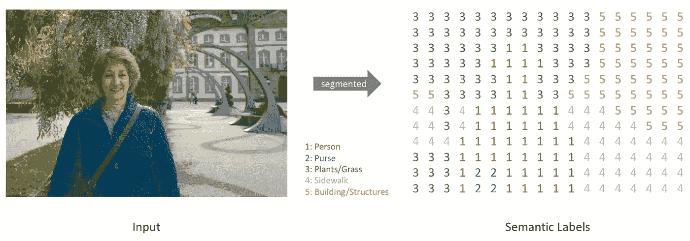

# 语义图像分割导论

> 原文：<https://medium.com/analytics-vidhya/introduction-to-semantic-image-segmentation-856cda5e5de8?source=collection_archive---------1----------------------->

语义图像分割的目的是对图像的每个像素进行分类。图像分割是一项计算机视觉任务，它包括将图像的各个区域标记为其中存在的对象。在这篇文章中，我们将讨论如何使用深度卷积神经网络(CNN)来完成语义图像分割的任务。

如今，卷积神经网络在深度学习领域已经非常普遍。细胞神经网络已被用于计算机视觉任务，如图像分类，物体检测，图像生成等。像所有其他计算机视觉任务一样，深度学习已经知道要优于以前存在的图像分割方法。

# 什么是语义图像分割？

更准确地说，语义图像分割是将图像的每个像素标记到一组预定义的类别中的任务。

图像分割([来源](https://vladlen.info/publications/feature-space-optimization-for-semantic-video-segmentation/)

例如，在上面的图像中，各种物体，如汽车、树、人、路标等。可以用作语义图像分割的类。所以任务就是取一个图像(RGB 或者灰度)输出一个 W x H x 1 的矩阵，其中 W 和 H 分别代表图像的宽度和高度。该矩阵中的每个单元将包含图像中每个像素的预测类别 id。

输入图像的分类标签([源](https://www.jeremyjordan.me/))

*注意:以上语义标签矩阵是输入的低分辨率表示。然而，实际上，输出语义标签矩阵将具有与输入图像相同的分辨率。*

在深度学习中，我们将分类类别标签表示为[一个热编码的](https://machinelearningmastery.com/why-one-hot-encode-data-in-machine-learning/)向量。类似地，在语义分割中，我们可以通过本质上为每个类标签创建一个通道，并用 1 标记包含相应类的像素的那些单元，并用 0 标记剩余的单元，来使用独热编码方案表达输出矩阵。

一键编码分割图([来源](https://www.jeremyjordan.me/))

上述表示中的每个通道被称为遮罩，因为它突出显示了图像中特定类别的像素出现在图像中的各个区域。

# 和物体检测有什么不同？

对于某些人来说，语义图像分割和对象检测可能看起来是相同的，因为两者都涉及在图像中找到对象，然后对它们进行分类。然而，这两种技术并不相同。

为了在不深入细节的情况下给出快速概述，对象检测包括定位图像中的所有对象，将所有检测到的对象包围在边界框中，并给它一个标签。下图是最先进的对象检测算法的输出样本。

物体检测([来源](https://pjreddie.com/darknet/yolo/))

另一方面，语义分割在像素级上工作，用类来标记每个像素。换句话说，语义分割将标记图像的每个区域。

对象检测与语义分割

阅读这篇博文，了解更多关于物体检测和分割的信息:[https://towardsdatascience . com/a-hitchyinglers-guide-to-object-detection-and-instance-segmentation-AC 0146 Fe 8 e 11](https://towardsdatascience.com/a-hitchhikers-guide-to-object-detection-and-instance-segmentation-ac0146fe8e11)

# 用于语义分割的 CNN

像其他计算机视觉任务一样，使用 CNN 进行语义分割将是显而易见的选择。当使用 CNN 进行语义分割时，输出将是与输入具有相同分辨率的图像，这与图像分类中的固定长度向量不同。

模型的一般架构包含一系列卷积层，以及用于下采样的池化或步长卷积层。为了改进模型，还使用了非线性激活和批量归一化层。

卷积神经网络的初始层学习低级特征，如线条、边缘、颜色等。而更深的层学习高级特征，如人脸或物体等。

从 CNN 的不同层面学习特征地图

较浅的卷积层包含关于图像较小区域的更多信息。这是因为当处理像图像这样的高维输入时，将每个神经元连接到先前体积中的所有神经元是不切实际的。相反，我们只将每个神经元连接到输入体积的局部区域。这种连接的空间范围被称为神经元的**感受野**。因此，当我们添加更多的层时，图像的尺寸不断减小，通道的数量不断增加。缩减像素采样由合并图层完成。

对于图像分类，我们使用一组循环的卷积层和池层来减小输入图像的大小，最后，当图像的大小足够小时，我们展平特征图，并将其馈入全连接层以用于分类目的。本质上，我们将输入图像映射到一个固定大小的向量。

CNN 进行图像分类([来源](https://www.learnopencv.com/image-classification-using-convolutional-neural-networks-in-keras/))

但是展平特征图会导致空间信息的丢失，而空间信息对于语义分割过程是至关重要的。为了保留空间信息，网络中不使用完全连接的图层。卷积层与下采样层耦合以产生低分辨率空间张量。这个张量包含关于包含在其各种通道中的输入的高级信息。在大多数实现中，该张量具有最低的分辨率和最大数量的通道。

现在我们已经获得了这个低分辨率张量，我们必须以某种方式将其分辨率提高到原始图像，以实现语义分割的任务。我们将这种低分辨率的特征图提供给上采样层，然后是更多的卷积层，以创建更高分辨率的特征图。随着分辨率的提高，我们同时减少了特征图中的通道数量。

这种架构被称为**编码器-解码器**架构。下采样阶段称为编码器，上采样阶段称为解码器。

编码器-解码器架构([来源](https://www.hackevolve.com/image-segmentation-using-deep-learning/)

下采样阶段称为编码器，因为它将输入图像转换为低分辨率空间张量，或者换句话说，它将输入图像编码为输入的低分辨率表示。上采样阶段采用低分辨率张量并解码其中编码的信息，以创建高分辨率分割图。

可以观察到，上述体系结构不使用任何全连接层来进行预测。因此，这种模型被称为**全卷积网络(FCNs)** 。

# 损失函数

解码器的最后一层对每个像素使用 softmax 函数来进行预测。因此在激活后获得的映射将仅具有范围从 0 到 1 的值。输出贴图具有与输入图像相同的维度，第三维度或通道数等于类别数。因此，我们可以将输出图与地面实况的一键编码版本进行比较，以计算损失。由于这个公式，可以使用标准的二元交叉熵损失。

# 改善培训的技巧

**批量规格化:**使用批量规格化可以加快训练速度，具有正则化效果，因为它会给网络增加一些噪声，允许更高的学习速率等。阅读[这篇](https://towardsdatascience.com/batch-normalization-8a2e585775c9)帖子，了解更多关于批量标准化的信息。

**使用跳过连接:**有时全卷积网络可能非常深，因此模型可能遭受 [**消失梯度问题**](/@anishsingh20/the-vanishing-gradient-problem-48ae7f501257) 。这个问题在网络的较深层更为普遍，并且可能导致训练质量下降，因为在这些层中学习变得非常慢。在连续应用链式法则之后，损失函数的梯度收缩到 0。因此，梯度下降更新值变为 0，因此没有学习发生。我们可以使用从前面的层到后面的层的跳跃连接。跳过连接为渐变从早期层流向后期层提供了一条替代路径，从而防止渐变收缩到 0。

**跳过编码器和解码器之间的连接:**可以在编码器和解码器之间的适当位置添加跳过连接，而不是在网络的层间添加跳过连接。如果我们简单地堆叠编码器和解码器，可能会丢失低级信息。因此由解码器产生的分割图中的边界可能不准确。为了弥补丢失的信息，我们可以让解码器访问编码器提取的低级特征。这些中间特征可以连接或添加到解码器层，以弥补损失，并增加解码器的感受域。

带跳跃连接的编码器-解码器([信号源](https://www.researchgate.net/figure/An-illustration-of-encoder-decoder-based-FCN-architecture-for-semantic-segmentation_fig1_333695010))

# 应用程序

**生物医学图像分析:**为了进行医学诊断，放射科医生需要解读各种图表和照片，但是医学照片的难度很大，有许多重叠的身体结构，即使是合格的专家也很难做出诊断。使用语义分割的系统可以帮助对图像的相关区域进行分类，使得诊断测试更加容易和简单。例如，模型可以用于分割 ct 扫描以检测肿瘤，或者最近用于帮助检测肺部 CT 扫描中的新冠肺炎病毒。

左图:大脑的 CT 扫描。中心:地面真实分割图像。右图:FCN 的分段图像。

**自动驾驶汽车:**自动驾驶是一项极其复杂的活动，涉及实时感知、解读和调整。语义分割用于对诸如其他车辆和路标的项目以及诸如道路车道和人行道的区域进行分类。实例的分割用于自动驾驶，因为跟踪单个车辆、行人、标志等很重要。

道路场景的分割

**卫星图像处理:**航空或卫星图像覆盖大面积的土地，并且包括许多人工制品。需要复杂的图像注释来对航空或卫星图像进行精确分析。语义分割在精确农业和地理传感中有应用。

卫星图像的分割

**面部分割:**执行语义分割可以帮助计算机视觉系统执行诸如识别手势、识别年龄和预测个人种族性别等任务。语义分割通过将面部区域划分为基本特征(如嘴、下巴、鼻子、眼睛和头发)来实现这些活动。有效的人脸分割意味着测试图像分辨率、光照条件、特征遮挡和方向等因素。

分割人脸([来源](https://www.researchgate.net/figure/Face-segmentation-as-produced-by-our-algorithm_fig1_276249168))

**语义分割的一些好读法**

*   [https://www.jeremyjordan.me/semantic-segmentation/](https://www.jeremyjordan.me/semantic-segmentation/)
*   [https://divamgupta . com/image-segmentation/2019/06/06/deep-learning-semantic-segmentation-keras . html](https://divamgupta.com/image-segmentation/2019/06/06/deep-learning-semantic-segmentation-keras.html)
*   [https://towards data science . com/a-bunch-of-tips-and-tricks-for-training-deep-neural-networks-3c a24c 31 DDC 8](https://towardsdatascience.com/a-bunch-of-tips-and-tricks-for-training-deep-neural-networks-3ca24c31ddc8)
*   [https://medium . com/@ anish sing 20/the-vanishing-gradient-problem-48ae 7 f 501257](/@anishsingh20/the-vanishing-gradient-problem-48ae7f501257)
*   [https://arxiv.org/pdf/1505.04597.pdf](https://arxiv.org/pdf/1505.04597.pdf)
*   [https://ieeexplore.ieee.org/abstract/document/8451295](https://ieeexplore.ieee.org/abstract/document/8451295)

这个帖子到此为止。如果你喜欢这篇文章，请鼓掌并与他人分享。你可以在 LinkedIn 上找到我，或者在 GitHub 上查看我的一些作品。如果您有任何问题或想法，请在下面留言。感谢你阅读这篇文章！！祝您有愉快的一天…🎉