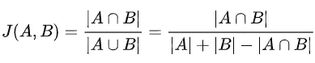
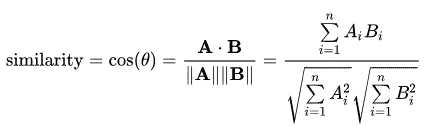

# 相似性度量简介

> 原文：<https://medium.com/analytics-vidhya/introduction-to-similarity-metrics-a882361c9be4?source=collection_archive---------5----------------------->

在这个博客中，我们正在讨论“两个句子是如何相似的”。在这种情况下，我们正在查看**雅克卡德** **相似度**以及**余弦** **相似度**。

Fig =书架( [find_here](https://www.google.co.in/url?sa=i&rct=j&q=&esrc=s&source=images&cd=&ved=2ahUKEwi63ObWp5TlAhW-ILcAHaIsBdIQjB16BAgBEAM&url=https%3A%2F%2Funsplash.com%2Fs%2Fphotos%2Fbooks-on-a-shelf&psig=AOvVaw2NaZ_b6KxOami5NNDa29ta&ust=1570886650159181) )

在看相似矩阵之前，你需要了解一些关于单词嵌入的知识。在这里，我解释了一点单词嵌入的总结

## 单词嵌入的类型:-

单词嵌入是将单词映射到实数向量的自然语言建模技术。以下是一些单词嵌入技术:-

1.  **反矢量器:-** 其思想是收集一组单词、句子、文档或段落，以统计每个单词在文档中的出现次数。它也被称为一键编码。这不是维护语义的意思
2.  **TF-IDF:-** TF-IDF 代表术语频率和逆文档频率。它常用于信息检索和文本挖掘。这不是维护语义的意思
3.  **Word2Vec:-** word2vec 是谷歌在 2013 年开发的最流行的技术。它维护文档的语义。

## **Jaccard 相似度:-**

Jaccard 相似指数也称为 jaccard 相似系数。它测量两个集合之间的相似性。范围是 0 到 100%。百分比越高，相似的两个词就越多。

图 jaccard 相似性公式

计算两个句子之间 jaccard 相似性的演示代码如下

两个句子之间的相似性代码

上面的例子是一个简单的代码示例，用于找出两个句子之间的相似性。如果你有大量的数据，那么最好使用上面讨论的单词嵌入技术。请注意，在将句子传递给 jaccard 相似性之前，您已经完成了词汇化。

如果文档的长度很长，甚至我们得到了一些相同的单词，那么 jaccard 距离做得不好。

## 余弦相似度:-

余弦相似性是衡量两个向量之间的余弦角度。对于 cosien，我们必须将所有的句子转换成向量。为了转换成矢量，我们可以使用 TF-IDF，Word2Vec。

余弦相似度的公式如下

图-余弦相似公式

代码示例如下:-

余弦相似性

为了获得更好的结果，你可以使用手套模型来创建一个向量，以保持语义。标准化向量也有助于改善结果。

## jaccard 和余弦相似度的主要区别:-

1.  Jaccard 相似度采用单词的唯一长度集合，而余弦相似度采用整个句子向量
2.  如果数据重复不重要，那么最好使用 jaccard 相似性，否则余弦相似性对于测量两个向量之间的相似性是很好的，即使存在数据重复。

也看我以前的博客

1.  [https://medium . com/analytics-vid hya/pdf-PMF-and-CDF-in-machine-learning-225 b 41242 Abe](/analytics-vidhya/pdf-pmf-and-cdf-in-machine-learning-225b41242abe)
2.  [https://medium . com/my take/gradient-descent-why-and-how-e 369950 ae7d 3](/mytake/gradient-descent-why-and-how-e369950ae7d3)

# 参考资料:-

 [## 应用课程

### 我们知道转行是多么具有挑战性。我们的应用人工智能/机器学习课程被设计为整体学习…

www.appliedaicourse.com](https://www.appliedaicourse.com)  [## Python 中文本相似性度量概述

### 在研究搜索引擎的自然语言模型时，我经常会问这样的问题:“这些模型有多相似……

towardsdatascience.com](https://towardsdatascience.com/overview-of-text-similarity-metrics-3397c4601f50)  [## 文本相似度:估计两个文本之间的相似程度

### 读者注意:Python 代码在最后是共享的

medium.com](/@adriensieg/text-similarities-da019229c894)