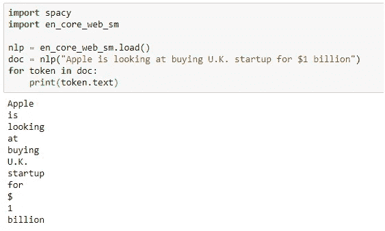
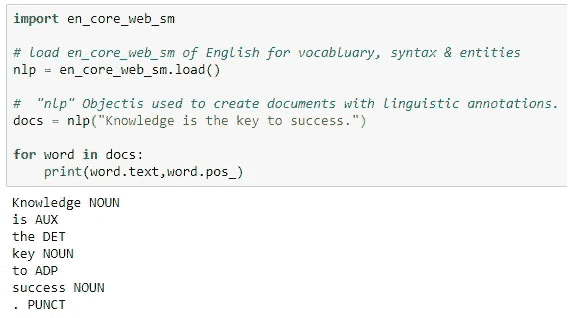
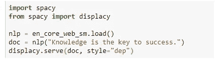
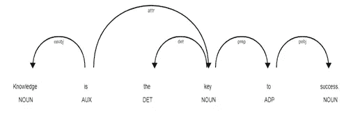
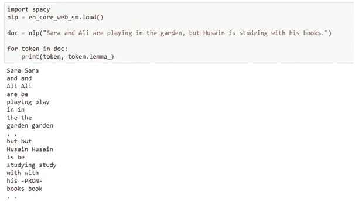
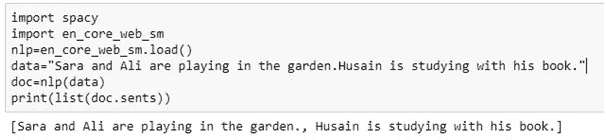
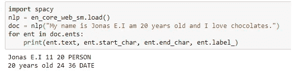
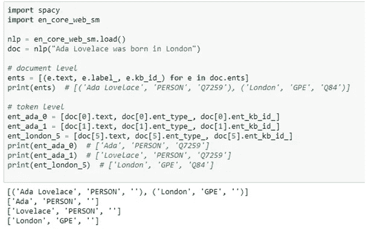
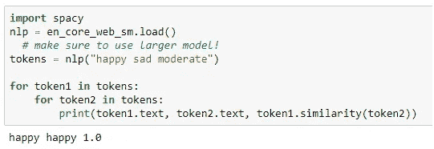

# 空间介绍

> 原文：<https://medium.com/analytics-vidhya/introduction-to-spacy-ed6f99b58b11?source=collection_archive---------13----------------------->

在当今世界，我们每秒钟都会生成数十亿封电子邮件和聊天记录，因此会产生难以想象的文本数据量，需要对其进行处理。处理这种文本背后的主要困难是这类数据的非结构化格式。

因此，要处理这种类型的非结构化文本，我们需要使用自然语言处理的概念。

***什么是自然语言处理？***

自然语言处理是 ***计算机科学、机器学习和人工智能*** 的分支，处理计算机和人类之间自然语言的分析和合成。而是文本如何被计算机处理，使其能够被人类容易地分析和理解。

自然语言处理在情感分析的几个不同领域中有大量的应用，用于从文本中识别情感、为特定文本修正正确的主题、自动分配相关的广告，并且还用作聊天机器人和语音助手机器来理解人类语音，并且一旦它们得到输入就做出响应。

***什么是 spaCy？***

Spacy 是一个非常流行的 Python，一个用于自然语言处理的开源库。它被广泛用于处理大量文本数据，以及开发能够有效处理大量文本数据的机器应用程序。

Spacy 具有许多与文本处理相关的特性和功能，如 ***标记化、词性标注、依存解析、词汇化、句子边界检测、命名实体识别、实体链接、相似性、文本分类、基于规则的匹配、训练和序列化。***

***标记化*** :就是把大段的句子转换成单词的过程。

***词性标注(POS):*** 它是找出句子中每个单词的功能，并用可以解释句子上下文的标签来标注那个特定单词的过程。

***依存解析:*** 它有助于分配句法依存标签，这些标签有助于定义每个标记的关系。

*:把一个词的不同屈折形式组合在一起，使它们可以作为一个单项进行分析的过程。比如 sleep 映射到 sleep，gone 映射到 go。*

**

****句子边界检测*** :有助于分割大段文本数据中的不同句子。*

**

****命名实体识别:*** 它有助于标注真实世界的物体，如人物、国家、地点等。*

**

****实体链接:*** 为了将命名实体融入“现实世界”，spaCy 提供了执行实体链接的功能，将文本实体解析为知识库(KB)中的唯一标识符。*

**

****相似度:*** 该参数通过比较单词和文本跨度来帮助检查两个文本文档之间的相似度。*

**

****文本分类:*** 帮助给整个文档或部分文档分配类别和标签。*

****基于规则的匹配:*** 使用基于规则的匹配，可以识别用于文本数据或用于基于特定文本规则提取文本的特定规则集。*

****空间中的主要特征****

*有些空间特征完全独立工作，但有些需要其他统计模型来预测语言注释。例如，如果想预测一个单词是名词还是动词。Spacy 有几个为大量语言构建的统计模型；这些统计模型具有不同的大小、速度、准确性和数据集。每个统计模型都有不同的功能，因此可以根据不同的用例进行相应的包含。用例功能的一般目的可以建立在小而简单的模型上。*

*这些统计模型 ***的主要组成部分是二进制权重、词汇条目、数据文件、词向量和配置。****