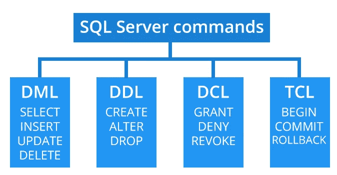
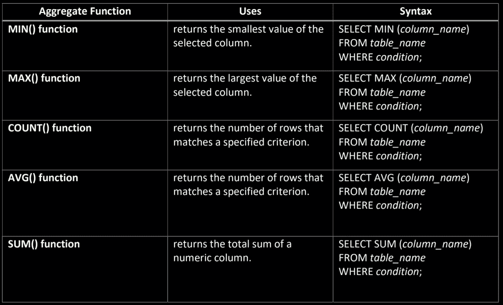
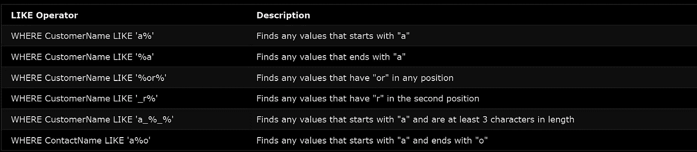

# SQL 简介

> 原文：<https://medium.com/analytics-vidhya/introduction-to-sql-2f0245c2ece?source=collection_archive---------19----------------------->

QL 代表结构化查询语言。SQL 允许你访问和操作数据库。SQL 在 1986 年成为美国国家标准协会(ANSI)的标准，在 1987 年成为国际标准化组织(ISO)的标准。

## ***SQL 能做什么？***

*   SQL 可以对数据库执行查询。它可以从数据库中检索数据
*   SQL 可以插入、更新、删除数据库中的记录。
*   SQL 可以在数据库中创建新表
*   SQL 可以在数据库中创建存储过程
*   SQL 可以在数据库中创建视图
*   SQL 可以设置表、过程和视图的权限
*   SQL 可以连接各种表。

## ***为什么我们使用 SQL 胜过 Excel？***

与 Excel 相比，SQL 有许多明显的优势:

*   Excel 发现很难处理大型数据集。
*   使用 Excel 对数据进行意外更改的可能性更高。另一方面，在 SQL 中，在对数据进行任何操作之前，需要进行编码和理解。
*   SQL 可以节省你的时间。这是省时的。
*   SQL 使编辑数据变得非常容易。

## ***SQL 命令***

与关系数据库交互的标准 SQL 命令是创建、选择、插入、更新、删除和删除。根据其性质，这些命令可分为以下几组

***DDL-数据定义语言***

1.  *创建-* 在数据库中创建一个新表、一个表的视图或其他对象。
2.  *ALTER-* 修改一个现有的数据库对象，比如一个表。
3.  *删除-* 删除整个表格、表格的视图或数据库中的其他对象。

***DML-数据操作语言***

1.  *插入-* 创建一条记录。
2.  *更新-* 修改记录。
3.  *删除-* 删除记录。

***DCL-数据控制语言***

1.  *授权-* 授予用户权限。
2.  *撤销-* 收回用户授予的权限

***TCL —交易控制语言***

1.  *提交:*保存对数据库所做的任何更改。
2.  *回滚:*撤销对数据库的任何更改。
3.  *保存点:*在事务中创建一个可以回滚到的点。

让我们开始学习一些基本但非常重要的语句。

## SQL SELECT 语句

SELECT 语句用于从数据库中选择数据。返回的数据存储在结果表中。

从 *table_name* 中选择 *column1* 、 *column2、…*
；

这将选择用户需要的特定列。要选择所有内容，请使用*

SELECT * FROM*table _ name*；

**SELECT DISTINCT** 语句用于仅返回不同的值。

在一个表中，一列通常包含许多重复的值，有时您只想列出不同的(不同的)值。

从 *table_name* 中选择不同的 *column1* 、 *column2、…*
；

## SQL WHERE 子句

WHERE 子句用于筛选记录。

从 *table_name*
中选择 *column1* 、 *column2、…*
其中*条件*；

***WHERE 子句可以与 AND、OR、and NOT 运算符结合使用。***

## SQL 插入语句

INSERT INTO 语句用于在表中插入新记录。

插入*table _ name*(*column 1*， *column2* ， *column3* ，…)
VALUES ( *value1* ， *value2* ， *value3* ，…)；

**或**

插入*表名*
值(*值 1* ，*值 2* ，*值 3* ，…)；

## SQL 更新语句

UPDATE 语句用于修改表中的现有记录。

更新*table _ name*
SET*column 1*=*value 1*，*column 2*=*value 2*，…
其中*条件*；

## SQL DELETE 语句

DELETE 语句用于删除表中的现有记录。

从*表名*中删除*条件*；

## SQL 聚合函数

## SQL LIKE 运算符

LIKE 运算符在 WHERE 子句中用于搜索列中的指定模式。

有两个通配符经常与 LIKE 运算符一起使用:

*   % —百分号代表零个、一个或多个字符
*   _ —下划线代表单个字符

## SQL GROUP BY 语句

GROUP BY 语句将具有相同值的行分组到汇总行中，如“查找每个国家的客户数量”。

GROUP BY 语句通常与聚合函数(COUNT、MAX、MIN、SUM、AVG)一起使用，按一列或多列对结果集进行分组。

从*表名*
中选择*列名*
其中*条件*
分组依据*列名* 排序依据*列名；*

这里我们完成了 SQL 的所有基本概念。

注意:还有各种高级 SQL 主题有待讨论。这只是给那些想了解 SQL 基础知识的人一个简单的概念。

参考资料:[https://www.w3schools.com](https://www.w3schools.com/)，[https://2.bp.blogspot.com](https://2.bp.blogspot.com/)，[https://www.cdn.geeksforgeeks.org](https://www.cdn.geeksforgeeks.org/)