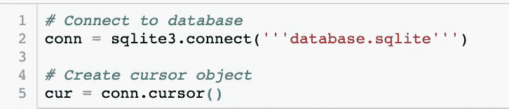

# 使用 Python 的 SQL 简介:计算统计数据和聚合数据

> 原文：<https://medium.com/analytics-vidhya/introduction-to-sql-using-python-computing-statistics-aggregating-data-c2861186b79f?source=collection_archive---------7----------------------->

在我的上一篇博客中，我讨论了如何使用 **WHERE** 语句在 SQL 中过滤数据。这个博客是一个关于如何用 SQL 计算统计数据和聚集数据的教程。我们将讨论以下内容:

*   计数功能
*   作为命令
*   选择不同
*   最大和最小函数
*   AVG 和求和函数
*   使用带有计算统计信息的 WHERE 语句
*   按语句排序
*   GROUP BY 语句
*   HAVING 语句

在本教程中，我们将继续使用我上一篇博客中的数据库，可以在这里下载。我们将使用这个数据库中的 Matches 表和 Teams 表。如果你没有看过我的[上一篇博客](/analytics-vidhya/introduction-to-sql-using-python-filtering-data-with-the-where-statement-80d89688f39e)的帖子，我推荐你在本教程之前阅读它。它涵盖了使用 **WHERE** 语句过滤 SQL 中的数据，还查看了 Matches 表中的各个列。来自[https://www.kaggle.com/laudanum/footballdelphi](https://www.kaggle.com/laudanum/footballdelphi)的团队表格中的列描述如下:

*   赛季(str):数据有效的足球赛季
*   TeamName (str):数据涉及的团队的名称
*   卡德尔霍姆(str):阵容中的球员数量
*   球员的平均年龄
*   外籍球员家庭(str):为球队效力的外籍球员的数量(分别为非德国人、非英国人)
*   OverallMarketValueHome (str):球队季前赛的整体市场价值，单位为欧元(基于 transfermarkt.de 的数据)
*   AvgMarketValueHome (str):球队季前赛的平均市值(每名球员),单位为欧元(基于 transfermarkt.de 的数据)
*   StadiumCapacity (str):球队主场的最大球场容量

首先，我们将下载必要的库， **sqlite3** 和 **pandas** 。

导入必要的库

接下来，您需要连接到数据库并创建一个游标对象。

连接到数据库并创建光标对象

以下是我们在 Python 中运行 SQL 查询时将使用的格式。

Python 中 SQL 查询的格式

# 计数功能

我们要看的第一个函数是**计数**函数。以前，我们要么在 **SELECT** 语句中添加一个星号，要么列出我们希望返回的列名。 **COUNT** 函数也可以在 **SELECT** 语句中列出，并将计算指定的行数。下面的查询使用了 **SELECT** 语句中的函数 **COUNT(*)** 。 **COUNT(*)** 将计算指定表格中的所有行。以下查询对**团队**数据集中的所有行进行计数。

SELECT COUNT(*)FROM Teams；

总共有 468 行包含在**团队**数据集中。我们还可以在 **COUNT** 函数的括号之间插入一个列名来代替星号，例如 **COUNT(Season)** 。然后，该函数将对 **Season** 列中有非空值的所有行进行计数。如果 **Season** 的值对于任何一行为空，那么该行将不被计数。如果 **Season** 列中没有空值，那么下面的函数将返回 468，与 **Teams** 数据集中的总行数相同。

从团队中选择计数(赛季)；

太好了，具有非空值的行数是 468，与包含在**团队**数据集中的总行数相同。这意味着没有空值。要练习使用 **COUNT** 函数，请计算**匹配**数据集中的行数，并将您的查询与下面的查询进行比较:

从匹配项中选择 COUNT(*)；

在**匹配**数据集中应该有 24，625 行。检查**匹配**数据集的**季节**列中是否有任何缺失值，并将您的查询与下面的查询进行比较:

从比赛中选择计数(赛季)；

在**匹配**数据集中的**季节**列中有 24625 行具有非空值。因为这与**匹配**数据集中的总行数相同，所以**季节**列中没有缺失/空值。

# 作为命令

当我们使用 **COUNT** 函数获得返回的结果时，我们返回的列的名称是 **COUNT(Season)** 。这个列名不太清楚。这是重命名该列的好时机。我们可以使用**作为**命令来重命名一个列。 **AS** 命令用于用别名重命名列甚至表。要查看如何使用 **AS** 命令，请查看以下查询:

SELECT COUNT(Season)作为 Num _ of _ NonNull _ Season _ Rows FROM Matches；

我们使用了您刚刚自己练习过的查询。不同之处在于，使用**作为**命令，将列 **COUNT(Season)** 重命名为别名**Num _ of _ NonNull _ Season _ Rows**。要练习使用**作为**命令，编写一个查询，计算**团队**数据集中**团队名称**不为空值的所有行，将列重命名为**Num of _ NonNull _ team name _ Rows**。将您的查询与下面的查询进行比较:

SELECT COUNT(team name)AS Num _ of _ NonNull _ team name _ Rows FROM Teams；

# 选择不同

使用 **COUNT** 函数，我们能够看到在**团队**和**匹配**数据集中列出了多少行。我们还看到了两个数据集的 **Seasons** 列中没有空值的行数。如果我们想知道**团队**数据集中**季节**列的独特值，该怎么办？我们不能使用 **COUNT(Season)** ，因为这只能给出在 **Season** 列中具有指定值的行数。相反，我们将在 **SELECT** 语句中使用 **DISTINCT** 子句。以下查询将向我们显示包含在**团队**数据集中的**赛季**列中的所有唯一值。

从团队中选择不同的季节；

练习选择**匹配**数据集中所有唯一的 **AwayTeams** ，并将您的查询与下面的查询进行比较:

从比赛中选择不同的客场球队；

# 一起使用计数和非重复

我们刚刚看到了如何从上面的匹配数据集中获取所有唯一的 **AwayTeam** 名称。当我们想知道**返回了多少个**唯一值时会发生什么？为了获得唯一的 **AwayTeam** 名称的计数，我们可以使用 **COUNT** 函数和 **DISTINCT** 子句。下面的查询将查找**数据集中所有与**匹配的 **AwayTeam** 名称，然后返回包含在 **AwayTeam** 名称中的行数。

从比赛中选择计数(不同于客场队)；

为了练习一起使用 **COUNT** 函数和 **DISTINCT** 子句，查询 **Teams** 数据集中包含的 distinct **Seasons** 的数量，并将该列重命名为 **Num_of_Seasons** 。将您的查询与下面的查询进行比较:

选择 COUNT(DISTINCT Seasons)作为团队的赛季数；

# 最大和最小函数

我们将继续研究如何在 **SELECT** 语句中计算数据。我们现在来看看如何使用**最大**功能和**最小**功能。 **MAX** 函数将返回指定列中的最大值，而 **MIN** 函数将返回指定列中的最小值。也许我们想知道**队**数据集中包含的最大体育场容量是多少。为此，我们可以使用下面的查询:

选择 MAX(StadiumCapacity)作为 maximum _ stadium capacity FROM Teams；

在上例中，81，359 是 **StadiumCapacity** 列中 **Teams** 数据集中的最大值。为了查看 **StadiumCapacity** 列中的最小值，我们将使用 **MIN** 函数。

选择 MIN(StadiumCapacity)作为 small _ stadium capacity FROM Teams；

我们可以看到**团队**数据集中包含的最小体育场容量是 15，000 人。为了练习使用 **MAX** 和 **MIN** 函数，查询一个小队中玩家的最大数量 **KaderHome** ，并将该列重命名为 **Max_Players** 。在同一个查询中，返回队伍中最小数量的球员，并将该列重命名为 **Min_Players** ，并将您的查询与下面的查询进行比较:

从团队中选择 MAX(KaderHome)作为 Max_Players，MIN(KaderHome)作为 Min _ Players

# AVG 函数和求和函数

现在我们来看看另外两个可以在 **SELECT** 语句中使用的函数。 **AVG** 函数将返回指定数值列的平均值。 **SUM** 函数将返回指定的数字列的总和。我们将继续查看**团队**数据集中的 **StadiumCapacity** 列。下面的查询显示了**队**数据集中的平均体育场容量。

选择 AVG(StadiumCapacity)作为球队的 Average _ StadiumCapacity

小数点后面有很多数字。如果我们想舍入到第 100 位，我们可以在我们的 **AVG** 函数周围添加一个 **ROUND** 子句，如下所示:

选择 ROUND(AVG(StadiumCapacity)，2)作为球队的 Average _ StadiumCapacity

关于**圆形**功能的快速注释。格式如下: **ROUND(要四舍五入的数字，小数位数要四舍五入到)**。我们想要舍入的数字是 **AVG(StadiumCapacity)** ，我们想要舍入到最接近的百分之一，或者小数后面的 **2__ 个数字，因此我们使用的格式是 __ROUND(AVG(StadiumCapacity)，2)** 。欲了解更多关于**轮**功能的信息，请访问[https://www.w3schools.com/sql/func_sqlserver_round.asp](https://www.w3schools.com/sql/func_sqlserver_round.asp)。

函数将返回指定列的总和。例如，如果我们想要查看在**匹配**数据集中的主场进球总数，我们可以使用以下查询:

从匹配项中选择 SUM(FTHG)作为 Total _ HomeGoals

要练习自己使用 **AVG** 和**总和**函数，请从**球队**数据集中查询以欧元为单位的球队季前赛的平均总市值，**总体市场价值主页**，并将该值四舍五入到最接近的百分之一，然后将该列标记为 **Avg_Market_Val** 。在同一个查询中，返回玩家平均年龄的总和， **AvgAgeHome** ，并将该列重命名为 **Avg_Age** 。将您的查询与下面的查询进行比较:

SELECT ROUND(AVG(OverallMarketValueHome)，2)作为 Avg_Market_Val，SUM(AvgAgeHome)作为 Avg _ Age FROM Teams

# 使用带有计算统计信息的 WHERE 语句

如果你没有读过我的上一篇关于在 **WHERE** 语句中过滤数据的博文，现在可能是一个看一看的好时机。我们现在开始计算过滤数据的统计数据。

如果你想知道曼联在主场比赛中平均进了多少球。为了得到这个答案，我们可以使用下面的查询:

选择 ROUND(AVG(FTHG)，2)作为 Avg_HomeGoals，来自 HomeTeam = '曼联'的比赛；

通过添加 **WHERE** 语句，我们告诉我们的查询，我们只想过滤拥有“曼联”主场团队的数据。为了更好地理解这一点，我们将简要讨论与该查询相关的 SQL 操作顺序。虽然 **SELECT** 语句是我们的 SQL 查询中的第一条语句，但是要执行的第一条语句是来自语句的**。上面的**语句中的**告诉 SQL 我们正在使用**匹配**数据集作为我们的表。执行的下一条语句是 **WHERE** 语句。 **WHERE** 语句过滤我们的数据集，使其只包含我们想要的信息，在本例中，我们只想要包含 **HomeTeam = 'Man United'** 所在的行。最后，执行 **SELECT** 语句，它以我们指定的形式返回数据。在这种情况下，我们希望返回在查询执行过程中 SQL 查询筛选出的数据中得分的四舍五入平均值。通过编写一个查询来练习聚合和使用 **WHERE** 语句，该查询显示了来自 **Teams** 数据集的所有球队在 2014 赛季的球员总数。将“球队球员总数”列重命名为 **Total_Soccer_Players** 。完成后，将您的查询与下面的查询进行比较:**

选择 SUM(KaderHome)作为 Season = 2014 的球队的 Total _ Soccer _ Players

# 按语句排序

**ORDER BY** 语句用于在给定指定列的情况下对返回的数据进行升序或降序排序。如果没有 **ORDER BY** 语句，数据将不会按任何特定顺序排序。如果您查看下面的查询，2015 赛季各队球员的独特平均年龄不会以任何特定的顺序返回:

从赛季= 2015 的球队中选择不同的 AvgAgeHome

我们现在将向同一个查询添加一个 **ORDER** 语句。现在，返回的结果将按升序排列，最低不同平均年龄的玩家位于返回结果的顶部，最高不同平均年龄的玩家位于返回结果的底部。

从 Season = 2015 ORDER BY AvgAgeHome 的球队中选择不同的 AvgAgeHome；

我们也可以通过 **AvgAgeHome** 以降序返回这个查询的结果。下面的查询与上面的查询相同，但是这个查询在 AvgAgeHome 语句的**ORDER 之后包括一个**desc**语句。这将按降序对返回的结果进行排序。团队中球员的最高不同平均年龄将在结果的顶部返回，而球员的最低不同平均年龄将在返回结果的底部返回。要查看运行中的 **DESC** 子句，请查看下面的查询:**

从 desc AvgAgeHome 订购的赛季= 2015 的球队中选择不同的 AvgAgeHome；

我们的结果现在按照 2015 赛季各队球员不同的平均年龄降序排列。如果我们没有将 **DESC** 子句放在一个 **ORDER BY** 语句的末尾，默认情况下，结果将按升序返回。您可以通过语句将 **ASC** 放在 **ORDER 的末尾，以升序返回结果，但这不是必需的。通过编写从 **Matches** 表中返回 **HomeTeam** 、 **FTHG** (一场比赛中主场进球数量)和 **FTAG** (一场比赛中客场进球数量)的查询，练习使用 **ORDER BY** 语句。仅包括 2010 年**赛季的数据，其中**亚琛**是主队的名称。按照比赛中主场进球的数量降序返回结果。对于主场进球数量相同的结果，按比赛中客场进球数量升序排列。将您的查询与下面的查询进行比较:

从由 FTAG 亚琛的 FTHG DESC 订购的 HomeTeam = '亚琛'和 Season = 2010 的比赛中选择 HomeTeam，FTHG，FTAG；

# GROUP BY 语句

最后我们通过函数到达了**组。 **GROUP BY** 函数将指定列中具有匹配值的行组合在一起。为了理解 **GROUP BY** 语句是如何工作的，我们将讨论下面的查询:**

选择 HomeTeam，COUNT(FTR)作为 Total_Home_Wins 来自 FTR = 'H '和 Season = '2016 '分组按 HomeTeam 排序按 COUNT(FTR)desc；

该查询返回 2016 赛季每支球队赢得的主场比赛总数，按赢得的主场比赛数降序排列。在我们的 **SELECT** 语句中有两个变量， **HomeTeam** 和 **COUNT(FTR)** 。第一个变量是来自**匹配**数据集的非聚合列，第二个变量是来自**匹配**数据集的聚合列。 **WHERE** 语句说只使用 **FTR = 'H'** (一场比赛的结果是主场获胜)和**赛季= 2016** 的数据。**分组依据**通过 **HomeTeam** 将行分组在一起。 **GROUP BY** 语句告诉查询将具有相同主队名称的所有行组合在一起。结果是每个主场球队被分组在一起，每次他们赢得一场主场比赛，它都被添加到最后结果的左边。

**GROUP BY** 语句通常与聚合函数一起使用，就像我们前面提到的那些函数一样， **COUNT** 、 **MAX** 、 **MIN** 、 **AVG** 和 **SUM_。尝试通过编写一个查询来练习使用 __GROUP BY** 语句，该查询显示来自 **Teams** 数据集的每支球队的外籍球员平均人数。将外国玩家平均人数列重命名为**Avg _ Num _ Foreign _ Players**，并将该列四舍五入到最接近的百分之一。按照外国玩家的平均数量以升序返回您的结果。将您的查询与下面的查询进行比较:

选举 TeamName，ROUND(AVG(ForeignPlayersHome)，2)为 Avg_Num_Foreign_Players 从 TeamName 分组的球队中按 ROUND 排序(AVG(ForeignPlayersHome)，2)ASC；

# HAVING 语句

具有语句的**过滤组。它总是紧接在 **GROUP BY** 语句之后使用。它类似于 **WHERE** 语句，但仅用于过滤聚合行。为了了解其工作原理，我们将运行与之前相同的查询，但这一次我们只想显示外籍球员平均人数大于或等于 15 人的球队。**

SELECT TeamName，ROUND(AVG(外国玩家家)，2)作为 Avg _ Num _ Foreign _ Players FROM team name GROUP HAVING ROUND(AVG(外国玩家家)，2) >= 15 ORDER BY ROUND(AVG(外国玩家家)，2)ASC；

尝试练习使用 **HAVING** 语句来查询每个赛季球队季前平均市值(每名球员)的欧元总和( **AvgMarketValueHome** )，其中球队季前平均市值(每名球员)的欧元总和等于或小于 65，000，000。将您的查询与下面的查询进行比较:

从具有 SUM(AvgMarketValueHome)< = 65000000 的按赛季分组的球队中选择 Season，SUM(AvgMarketValueHome)；

我们已经到了本教程的结尾。我们讨论了以下主题:

*   计数功能
*   作为命令
*   选择不同
*   最大和最小函数
*   AVG 和求和函数
*   使用带有计算统计信息的 WHERE 语句
*   按语句排序
*   GROUP BY 语句
*   HAVING 语句

我鼓励您继续尝试我们在本教程中介绍的函数和语句，以便更深入地理解它们是如何工作的。