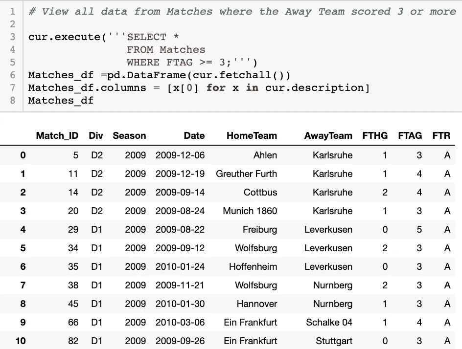
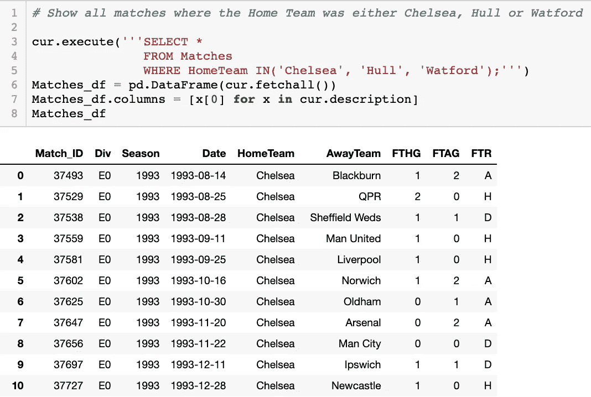

# 使用 Python 的 SQL 简介:使用 WHERE 语句过滤数据

> 原文：<https://medium.com/analytics-vidhya/introduction-to-sql-using-python-filtering-data-with-the-where-statement-80d89688f39e?source=collection_archive---------0----------------------->

结构化查询语言，通常称为 SQL，是一种功能强大的关系数据库语言。这种语言允许您访问和操作存储在 SQL 数据库中的数据。本教程将向您展示如何使用 Python 获得 SQL 的强大功能，以及如何使用 WHERE 语句过滤数据。

第一步是导入必要的库。您将需要导入 sqlite3，这将允许您连接到 SQL 数据库并运行 SQL 查询。你还需要进口熊猫。Pandas 将允许您以清晰易读的数据框格式查看查询结果。

导入必要的库

对于本教程，将使用足球德尔福数据库。你可以在这里下载数据库，[https://www.kaggle.com/laudanum/footballdelphi](https://www.kaggle.com/laudanum/footballdelphi)。花些时间阅读描述，以了解更多关于我们将使用的数据库和表的信息。

接下来，您需要连接到数据库并创建一个游标对象。稍后我们将调用 cursors execute 方法来运行 SQL 查询。

连接到数据库并创建光标对象

你现在应该连接到足球德尔福数据库。这是一个关系数据库。关系数据库包括表。每个表都是存储信息的唯一数据集。每个表格由列和行组成。该数据库包括四个表:

*   独特 _ 团队
*   比赛
*   组
*   比赛中的球队

要运行 SQL 查询并以易于查看的数据框格式进行查看，我们将使用以下代码:

Python 格式的 SQL 查询

对于第一个查询，我们将预览表 **Unique_Teams** 的内容。为此，我们可以运行以下查询:

唯一 _ 团队表

**SELECT** 语句告诉数据库我们试图从数据集中提取哪些列。星号(*)告诉数据库我们要选择表中所有可用的列。语句中的**告诉数据库我们想要从表 **Unique_Teams** 中选择数据。SQL 查询以分号(；).这告诉数据库您已经结束了查询，就像句号结束一个句子一样。**

您可以自己练习，尝试查询 **Matches** 表的所有内容，并将您的查询与下面的答案进行比较。

匹配表

这是我们将在本教程的剩余部分使用的表。**匹配**表中有 9 列。下载该数据库的 Kaggle 页面对每一列的描述如下:

*   **Match_ID** (int):每个匹配的唯一 ID
*   **Div** (str):标识比赛所在的级别(D1 =德甲，D2 =德甲 2，E0 =英超)
*   赛季:比赛发生的赛季(通常指八月到第二年五月)
*   **日期** (str):比赛日期
*   **主队** (str):主队名称
*   **客场队** (str):客场队的名称
*   **FTHG** (int)(全职主场进球):主队的进球数
*   **FTAG** (int)(全职客场进球):客场球队的进球数
*   **FTR** (str)(全职成绩):比赛三方结果(H =主场胜，D =平局，A =客场胜)

也许我们只想选择列 **Match_ID** 。为此，我们只需在 select 语句中写入 **Match_ID** ，而不是星号。下面的代码显示了这是如何实现的:

查看匹配标识

尝试从 **Matches** 表中只选择列 **HomeTeam** ，并将您的代码与下面的查询进行比较:

从比赛中选择主队；

通过在 select 语句中键入每一列的名称并用逗号(，)分隔每一列的名称，可以选择多个列。您可以在下面的每场比赛中看到主队和客场队的名称:

从比赛中选择主队、客场；

通过从 **Matches** 表中选择 **Match_ID** 和 **Date** 来练习选择多个列，并将您的查询与下面的代码进行比较:

SELECT Match_ID，Date FROM Matches。

# WHERE 语句

Matches 表中有 24，625 行。这使得很难找到具体的信息。也许我们只想要 2015 赛季的信息。为此，我们可以在 SQL 查询中添加一个 **WHERE** 语句。 **WHERE** 语句允许我们选择满足特定条件的信息。要从 **Matches** 表中查询仅与 2015 赛季相关的信息，我们可以使用以下查询:

SELECT * FROM Season = 2015 的比赛；

现在我们只有 992 行，每一行都来自 2015 赛季的比赛。这使我们能够查看 2015 赛季的数据，比以前滚动整个表格要容易得多。正如 **SELECT** 语句允许我们从数据表中返回指定的列一样， **WHERE** 语句允许我们从数据集中返回满足特定条件的特定行，比如 Season = 2015。要练习使用 **WHERE** 语句，请编写一个查询，从 **Matches** 表中选择全职家庭目标( **FTHG** )等于 5 的所有列，并将您的查询与下面的查询进行比较:

SELECT * FROM FTHG = 5 的匹配项；

到目前为止，我们只在 **WHERE** 语句中使用了数字数据。为了在 **WHERE** 语句中使用字符串数据，我们需要用引号将我们用作条件的数据括起来。要查询阿森纳是主队的所有数据，我们可以使用下面的查询:

SELECT * FROM home team = '阿森纳'的比赛；

要练习在 **WHERE** 语句中使用字符串数据作为条件，请选择 D2 分部中的所有列，并将您的查询与下面的查询进行比较:

SELECT * FROM Matches WHERE Div = ' D2 '；

# 比较运算符

到目前为止，我们只在 **WHERE** 语句中使用了等号(=)作为运算符。除等号外，您还可以使用其他运算符，包括:

*   **>** (大于)
*   **<** (小于)
*   **> =** (大于或等于)
*   **< =** (小于或等于)
*   **！=** (不等于)

要查看来自 **Matches** 表的所有数据，其中客队得分 3 次或更多，我们可以使用以下查询:

从 FTAG ≥ 3 的匹配项中选择*；

要练习在 **WHERE** 语句中使用条件运算符，请查询 **Matches** 表中的所有数据，其中主队没有获胜。

SELECT * FROM Matches WHERE FTR！= ' H

# AND & OR:在 WHERE 语句中使用多个条件

到目前为止，我们只在 **WHERE** 语句中放置了一个条件，但是也可以在 **WHERE** 语句中放置多个条件。为此，您可以在 SQL 查询中添加一个**和**或**或**子句来进一步过滤您的结果。在 **WHERE** 语句中使用**和**子句时，**和**子句两边的每个语句都必须为真，才能返回观察值。要了解这是如何工作的，下面的查询将显示来自 **Matches** 表的所有观察结果，其中曼联是主队，比赛的最终结果是平局。

SELECT *从主队= '曼联'和 FTR = 'D '的比赛中选择；

在 **WHERE** 语句中使用**或**子句时，只有当第一个条件为真或第二个条件为真时，才会在结果中包含行。如果一个观察的两个条件都为真，那么该观察也将被返回。要了解**或**子句的工作原理，请查看以下查询，该查询显示了来自 **Matches** 表中 2012 赛季或 2013 赛季的所有行:

SELECT * FROM Season = 2012 或 Season = 2013 的比赛；

要练习使用 **WHERE** 语句中的**和**子句，请从 **Matches** 表中选择主队得分超过 3 分且客队赢得比赛的所有行，并与下面的查询进行比较:

SELECT * FROM FTHG > 3 且 FTR = 'A '的匹配项；

为了练习在 **WHERE** 语句中使用**或**子句，从 **Matches** 表中选择主队、客场队、FTHG、FTAG、FTR，其中主队进球超过 7 个或客场队进球超过 7 个，并与下面的查询进行比较:

从 FTHG > 7 或 FTAG > 7 的比赛中选择主场队、客场队、FTHG、FTAG、FTR；

# BETWEEN & NOT BETWEEN:过滤落在某个范围内的行

现在，我们将介绍另外两个可以包含在 **WHERE** 语句中的子句，**BETWEEN**and**NOT BETWEEN**。使用一个 **BETWEEN** 子句，您可以根据被过滤的列中的值必须在两个值之间才能返回的条件来过滤结果。例如，如果我们想要选择 2012 赛季到 2015 赛季的所有比赛，我们将使用以下查询:

从 EN 2012 和 2015 赛季之间的比赛中选择*；

**NOT BETWEEN** 子句以相反的方式工作。如果我们在上面的查询中用**不在**之间代替**在**之间，它将只显示不包括在 2012-2015 赛季范围内的比赛。因此，2012 赛季之前的比赛将被包括在内，2015 赛季之后的比赛将被包括在返回的结果中，但 2012 赛季和 2015 赛季之间的比赛都不会被包括在内。要查询 Match_ID 不在 25 和 46，750 之间的匹配，我们可以使用以下查询:

SELECT * FROM Matches 不在 EN 25 和 46750 之间的匹配项；

自己练习的话，从所有主队进球数在 7 到 9 之间，客队进球数不在 0 到 3 之间的比赛中选择 FTHG，FTAG，FTR。完成后，将您的查询与下面的查询进行比较:

从匹配的 WHERE (FTHG 介于 EN 7 和 9 之间)和(FTAG 不介于 EN 0 和 3 之间)中选择 FTHG、FTAG 和 FTR；

# IN():从列表中选择值

有时您可能只想选择包含在某个列表中的数据。这就是操作符中的**开始使用的时候。如果只想在条件包含在列表中时返回行，可以在 **WHERE** 语句中使用**中的**运算符。例如，以下查询将返回切尔西、赫尔或沃特福德是主队的所有比赛:**

SELECT * FROM home team IN(' Chelsea '，' Hull '，' Watford ')；

当客场球队是利物浦、曼城或斯旺西时，练习使用运算符中的**从 **Matches** 表中选择客场球队，并将您的查询与下面的查询进行比较:**

从客场队所在的比赛中选择客场队('利物浦'，'曼城'，'斯旺西')；

# LIKE 运算符:过滤字符串数据

接下来，我们将介绍类似于运算符的**。当您想要过滤字符串数据时，此运算符非常有用。要了解它是如何工作的，请看下面的查询。该查询将返回主队名称以“A”开头的所有匹配项。**

从主队喜欢“A%”的比赛中选择*；

在**之后，像**一样的语句我们用引号括起来，A%。A 告诉我们，语句必须以 A 开头。百分号就像通配符一样使用。A 后面的任何内容都不必是任何特定的值。要了解其工作原理，请查看以下内容:

*   **WHERE**HomeTeam**LIKE**' Be % '(返回 home team 以“Be”开头的行)
*   **WHERE**HomeTeam**LIKE**' % ty '(返回 home team 以“ty”结尾的行)
*   **WHERE**HomeTeam**LIKE**' % a % '(返回 home team 包含“a”的行)

练习使用 **LIKE** 语句返回所有客场球队名称包含“City”的比赛，并与以下代码进行比较:

SELECT * FROM Matches WHERE away team LIKE“% City %”；

你也可以用不像的术语**。如果您想要返回日期不是以 2017 开始的所有匹配项，您可以使用以下查询:**

SELECT * FROM 日期不同于“2017%”的匹配项；

要自己练习，从 **Matches** 表中选择所有日期不以 2016 开始、HomeTeam 名称以“y”结尾且 AwayTeam 名称不包含“e”的列。将您的查询与下面的查询进行比较:

SELECT * FROM Matches WHERE(Date NOT LIKE ' 2016% ')AND(home team LIKE ' % y ')AND(away team NOT LIKE ' % e % ')；

# IS NULL & IS NOT NULL:处理缺失值

有时，某些行中可能会缺少数据。这些值被称为空数据。您可以在 **WHERE** 语句中使用子句 **IS NULL** 来检查特定列是否缺少任何数据。要查看 Matches 表中是否缺少任何匹配的结果，我们可以使用以下查询:

从 FTR 为空的匹配项中选择*；

我们收到一个长度不匹配错误。这是因为现在有观察结果表明一场比赛的结果是未知的。那很好。练习使用 **IS NULL** 子句检查 **Matches** 表中的任何观察值是否缺少任何主队进球计数，并将您的查询与下面的查询进行比较:

SELECT * FROM FTHG 为空的匹配项；

不应缺少任何值。语句**不为空**以相反的方式工作。这将返回某列没有空值**的所有值。以下查询显示了来自 **Matches** 表的所有观察结果，其中 HomeTeam 列中没有空值。**

SELECT * FROM home team 不为空的匹配项；

练习使用 **NOT NULL** 子句，方法是查询 Matches 表中日期不为空值的所有列，并与下面的查询进行比较:

SELECT * FROM Date 不为空的匹配项；

使用**时需要注意的一件重要事情是 NULL** 和**不是 NULL** ，零值不等同于 NULL 值。NULL 是缺失值，0 值不是缺失值。

本教程到此结束。我们已经介绍了如何使用 python 连接和查询 SQL 数据库。我们还讨论了什么是 **WHERE** 语句，以及以下可用于 **WHERE** 语句的过滤技术:

*   比较运算符
*   与或
*   介于两者之间&而非两者之间
*   在…里
*   喜欢&不喜欢
*   为空&不为空

我鼓励您继续练习使用这些技术，以便更深入地理解如何使用 **WHERE** 语句过滤 SQL 表。