# 使用 Python 的 SQL 简介:使用 JOIN 语句合并多个表

> 原文：<https://medium.com/analytics-vidhya/introduction-to-sql-using-python-using-join-statements-to-merge-multiple-tables-3b3513fe2c98?source=collection_archive---------2----------------------->

这篇博客是关于如何从 SQL 的多个表中提取数据的教程。在我以前的博客教程中，一次只能从一个表中查询数据。本教程将介绍 **JOIN** 语句。使用 **JOIN** 语句，可以在一个查询中返回多个表中的数据。

本博客将讨论以下内容:

*   **极限声明**
*   **返回多个没有连接语句的表**
*   **连接语句**
*   **使用连接语句返回特定的列**
*   **过滤&多表聚合**
*   **内部连接**
*   **左连接**
*   **右连接**
*   **全外连接**
*   工会声明

我们将使用我以前的教程中使用的数据库，可以在这里下载。如果你没有看过我以前的教程，现在是预览足球 Delphi 数据库中的数据表的好时机。你可以阅读我的前两篇 SQL 教程，链接如下:

*   [使用 Python 的 SQL 简介:使用 WHERE 语句过滤数据](/analytics-vidhya/introduction-to-sql-using-python-filtering-data-with-the-where-statement-80d89688f39e)
*   [使用 Python 的 SQL 简介:计算统计数据&聚合数据](/analytics-vidhya/introduction-to-sql-using-python-computing-statistics-aggregating-data-c2861186b79f)

首先，我们将下载必要的库， **sqlite3** 和 **pandas** 。

导入必要的库

接下来，您需要连接到数据库并创建一个游标对象。

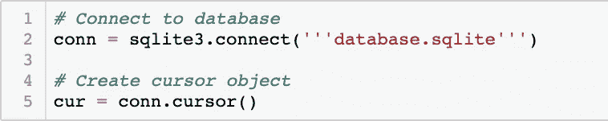

连接到数据库并创建光标对象

以下是我们在 Python 中运行 SQL 查询时将使用的格式。

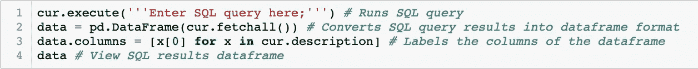

Python 中 SQL 查询的格式

# 极限语句

**LIMIT** 语句将限制 SQL 查询中返回的行数。它写在 SQL 查询的末尾，也是 SQL 操作顺序中要执行的最后一条语句。要查看如何使用**限制**语句，请预览以下查询:

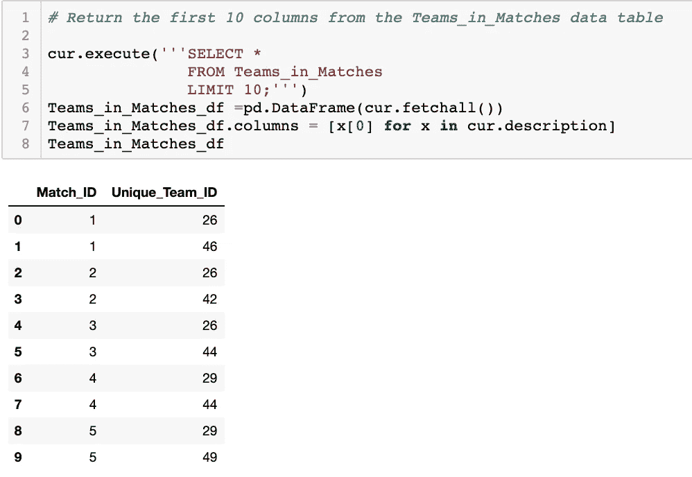

SELECT * FROM Teams_in_Matches 限制 10

上述查询从 **Teams_in_Matches** 表中返回前十行。为了练习使用 **LIMIT** 语句，编写一个从 **Unique_Teams** 数据集中返回前十行的查询，并将您的查询与下面的查询进行比较:

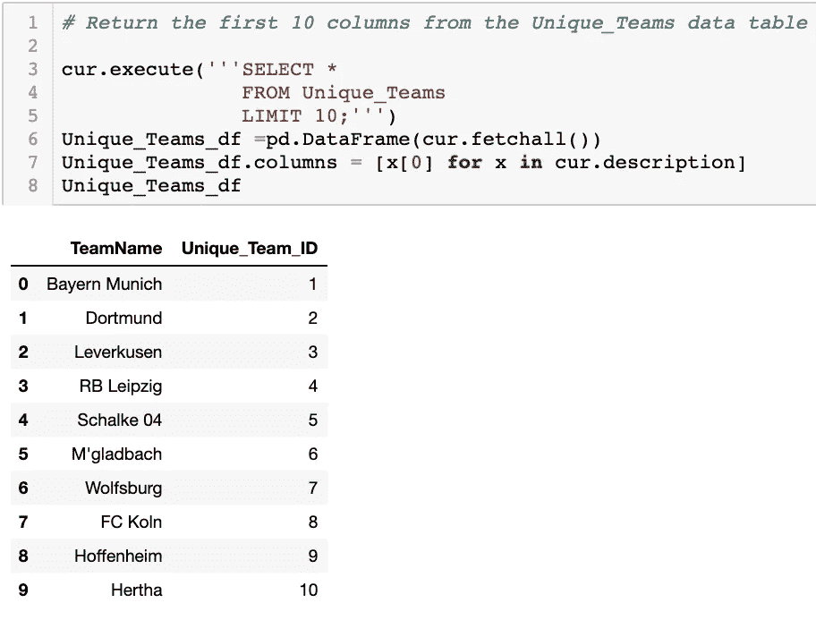

SELECT * FROM Unique_Teams 限制 10

# 不使用 JOIN 语句返回多个表

**Teams_in_Matches** 数据集有两列， **Match_ID** 和 **Unique_Team_ID** 。由于我们不熟悉每个团队的 **Unique_Team_ID** ，如果我们能在 **Team_in_Matches** 数据表中的列旁边看到团队的名称，将更容易识别每个团队。 **Unique_Teams** 数据表有两列， **Team_Name** 和 **Unique_Team_ID** 。如果我们一起返回这两个表，我们可以在来自 **Teams_in_Matches** 数据集的 **Match_ID** 和 **Unique_Team_ID** 列旁边看到每个球队的名称。以下查询返回两个表中的数据:

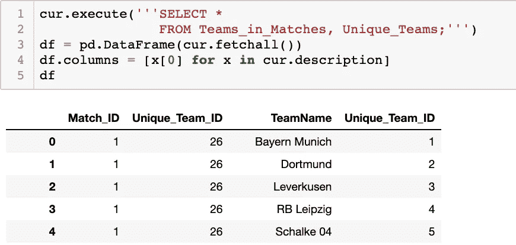

SELECT * FROM Teams_in_Matches，Unique_Teams

虽然 **Teams_in_Matches** 表只有 49，148 行，而 **Unique_Teams** 表只有 128 行，但该查询返回了 6，290，944 行。您可能认为查询最多会返回 49，148 行。实际情况是，SQL 从 **Teams_in_Matches** 表中取出每一行，并将其与 **Unique_Teams** 表中的每一行进行匹配，因此查询返回 49，148 * 128 = 6，290，944 行。我们现在返回的数据没有用，而且太大了。如果我们希望 SQL 返回 **Match_ID** 和 **Unique_Team_ID** 以及相应的 **Team_Name** ，我们必须告诉 SQL 如何返回结果。由于 **Unique_Team_ID** 是两个表中的列名，我们可以使用下面的查询来获得正确的结果:

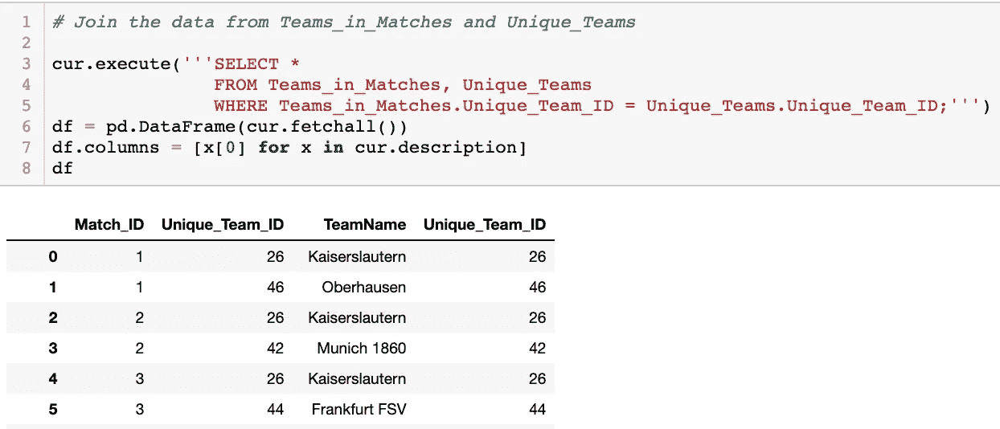

SELECT * FROM Teams_in_Matches，Unique _ Teams WHERE Teams _ in _ Matches。唯一团队 ID =唯一团队。唯一团队标识

我们添加了一个 **WHERE** 语句，并告诉 SQL **如何/什么列**将两个表 **WHERE Teams_in_Matches 连接在一起。唯一团队 ID =唯一团队。唯一团队 ID** 。返回的结果只显示来自 **Teams_in_Matches** 表的 **Unique_Team_ID** 与来自 **Unique_Teams** 数据表的 **Unique_Team_ID** 值相匹配的行。当处理多个表时，您必须弄清楚每个列来自哪个表，尤其是当列名同名时。在 **WHERE** 语句中，我们写下了表名，后跟一个句点，然后是列名，即 **Teams_in_Matches。唯一团队 ID** 。

# JOIN 语句

我们将运行刚才使用的相同查询，但是我们将使用一个**连接**语句，而不是使用一个 **WHERE** 语句。要了解这一点，请查看下面的查询:

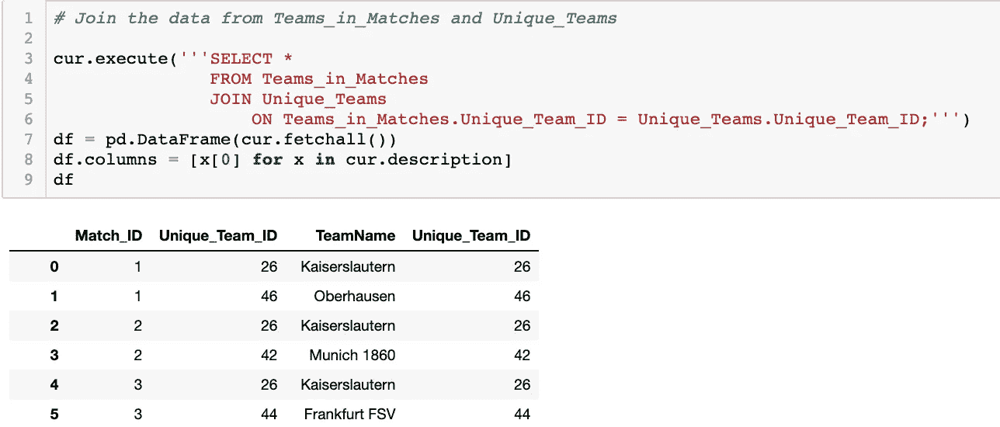

SELECT * FROM Teams _ in _ Matches JOIN Unique _ Teams ON Teams _ in _ Matches。唯一团队 ID =唯一团队。唯一团队标识

我们没有列出我们想在 **FROM** 语句中使用的表，而是首先列出表 **Teams_in_Matches** ，然后添加一个 **JOIN** 语句。我们告诉 SQL，我们希望将来自 **Teams_in_Matches** 表的数据与来自 **Unique_Teams** 表的数据连接在一起。我们还包含了一个 **ON** 语句，它告诉 SQL 如何将数据连接在一起。

**团队**表不包括每个团队的 **Unique_Team_ID** 。通过编写将 **Unique_Teams** 数据表和 **Teams** 表连接在一起的查询，练习使用 **JOIN** 语句，只返回前 10 行。将您的查询与下面的查询进行比较:

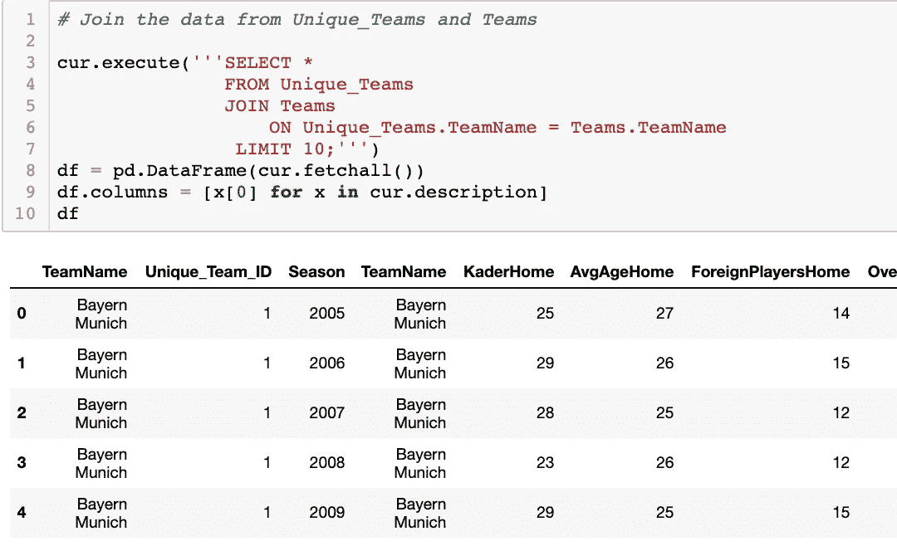

SELECT * FROM Unique_Teams 加入 Unique_Teams 上的团队。团队名称=团队。团队名称限制 10；

# 用 JOIN 语句返回特定的列

如果我们回过头来查看我们将 **Teams_in_Matches** 表和 **Unique_Teams** 表连接在一起的查询，您会看到 **Unique_Team_ID** 列被列出了两次。通过在 **SELECT** 语句中指定我们想要返回的列，我们可以消除这种冗余。

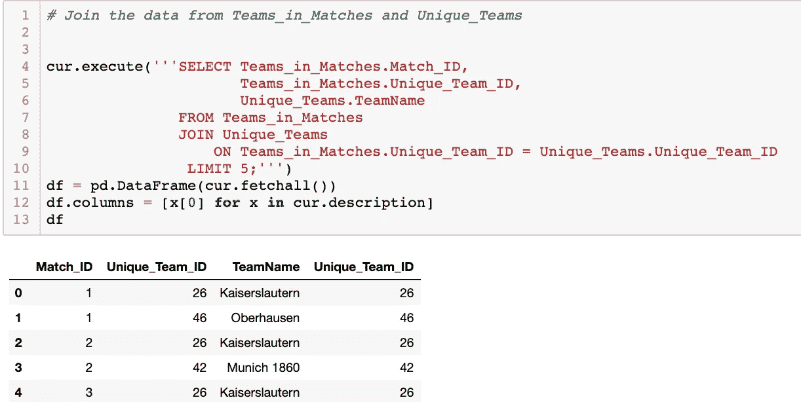

选择比赛中的球队。Match_ID，Teams_in_Matches。唯一团队标识，唯一团队。Teams_in_Matches 中的 TeamName 加入 Teams_in_Matches 中的 Unique_Teams。唯一团队 ID =唯一团队。Unique_Team_ID 限制 5

同样，因为我们是从多个表中查询数据，所以我们通过在表名后面加上一个句点，然后加上列名( **Unique_Teams)来指定每个列来自哪个表。团队名称**)。通过编写显示来自 **Unique_Teams** 表的 **Unique_Team_ID** 和 **TeamName** 以及来自 **Teams** 表的 **AvgAgeHome** 、 **Season** 和 **ForeignPlayersHome** 的查询，练习在处理多个表时选择特定的列。只返回前五行。将您的查询与下面的查询进行比较:

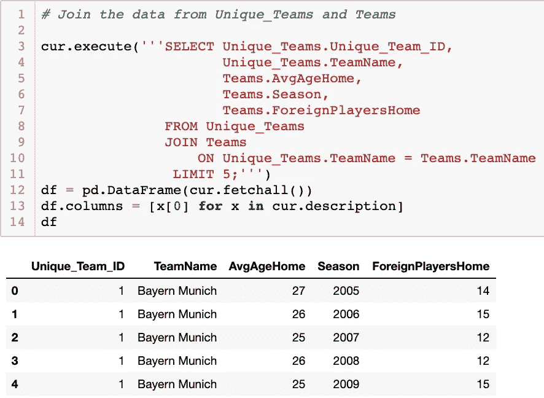

选择唯一团队。唯一团队标识，唯一团队。团队名称，团队。AvgAgeHome 各队。赛季，团队。来自 Unique_Teams 的外国玩家加入 Unique_Teams 的团队。团队名称=团队。团队名称限制 5

虽然在查询多个表时，将表名写在列名之前是一个好习惯，但是只有当存在重复的列名时才需要这样做。以下查询将产生与上述查询相同的结果:

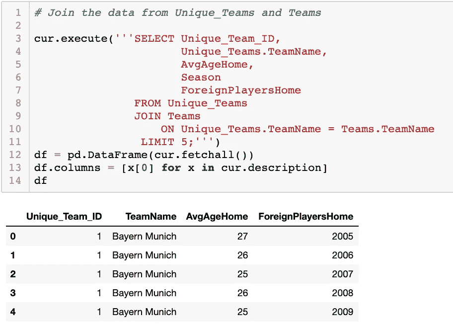

SELECT 唯一团队标识，唯一团队。TeamName，AvgAgeHome，Season，foreign players home FROM Unique_Teams 加入 Unique _ Teams 上的球队。团队名称=团队。团队名称限制 5；

# 用多个表过滤和聚集

在处理多个表时，我们仍然可以使用我以前的博客中讨论过的相同的过滤方法和聚合方法。在最后一个查询中，我们看到每个赛季都返回拜仁慕尼黑的数据。以下查询按每支球队对数据进行分组，并显示 2000 赛季后所有赛季中每支球队球员的平均年龄和外籍球员的最大数量。

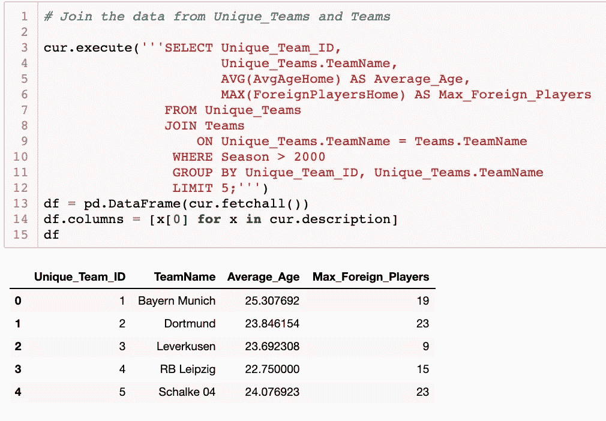

SELECT 唯一团队标识，唯一团队。TeamName，AVG(AvgAgeHome) AS Average_Age，MAX(Foreign Players home)AS MAX _ Foreign _ 来自 Unique_Teams 的玩家加入 Unique_Teams 的队伍。团队名称=团队。团队名称，其中赛季> 2000，分组依据 Unique_Team_ID，Unique_Teams。团队名称限制 5；

上面的查询有点复杂，但最好记住，我以前的博客和这篇博客中讨论的所有技术都可以一起用来创建查询。现在编写一个查询，显示以“y”或“r”结尾的每个团队的最高 **Match_ID** 。随着最大**匹配 ID** ，显示来自**团队匹配表**的**唯一团队 ID** 和来自**唯一团队表**的**团队名称**。将您的查询与下面的查询进行比较:

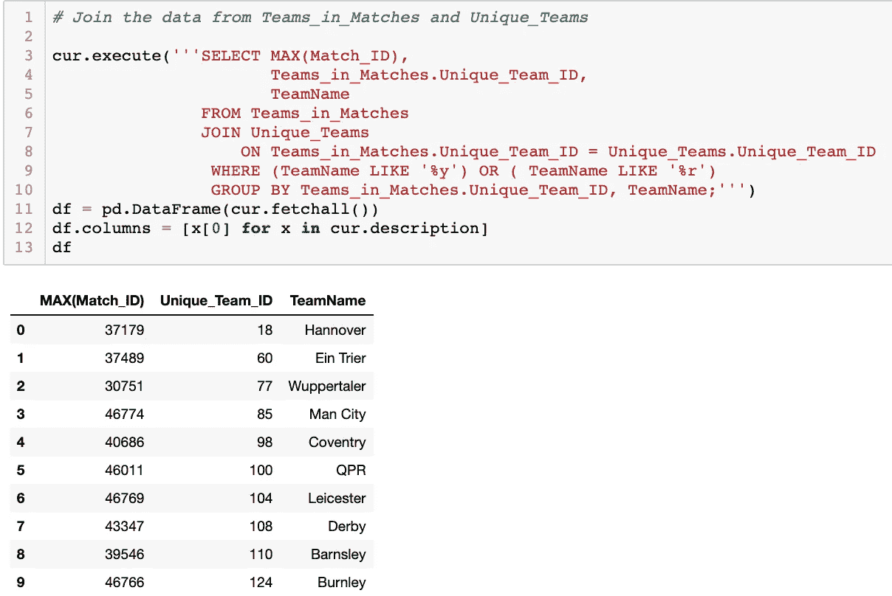

SELECT MAX(Match_ID)，Teams_in_Matches。来自 Teams_in_Matches 的 Unique_Team_ID，TeamName 加入 Teams_in_Matches 上的 Unique_Teams。唯一团队 ID =唯一团队。unique _ Team _ ID WHERE(Team name LIKE ' % y ')或(Team name LIKE ' % r ')GROUP BY Teams _ in _ Matches。Unique_Team_ID，团队名称；

# 内部连接

到目前为止，我们一直使用的**连接**语句也被称为**内部连接**。一个**内部连接**通常是**连接**语句的默认类型。我们之前已经看到了下面的查询，但是这一次，我们没有写**连接**，而是写**内部连接**。两个查询的结果是相同的。

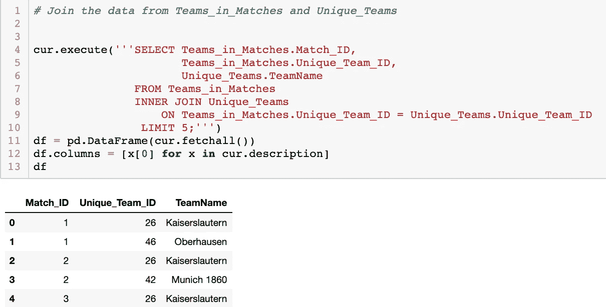

选择比赛中的球队。Match_ID，Teams_in_Matches。唯一团队标识，唯一团队。Teams_in_Matches 内部联接 Unique_Teams ON Teams_in_Matches 中的 TeamName。唯一团队 ID =唯一团队。Unique_Team_ID 限制 5

只要两个指定的列匹配，内部联接就从两个表中取出所有的行。如果一个 **Match_ID** 没有被分配一个 **Unique_Team_ID** ，那么 **Match_ID** 将不会出现在结果中，反之亦然，如果一个 **TeamName** 没有被分配一个 **Unique_Team_ID** ，那么那个 **TeamName** 将不会出现在结果中。

# 左连接

为了让下一个例子更容易理解，我们将修改 **Unique_Teams** 数据表。运行以下查询:

从 Unique_Teams 中删除，其中 TeamName 如“O%”或 TeamName 如“F%”

除了**内连接**之外，还有各种类型的**连接**。我们现在将讨论**左连接**。一个 **LEFT_JOIN** 将返回查询中列出的左表/第一个表中的所有行，以及查询中列出的右表/第二个表中的任何匹配行。如果不匹配，则仍将显示左侧表格中的数据，右侧表格中的数据将显示为 **NaN** 。要查看**左连接**是如何工作的，请查看下面的查询:

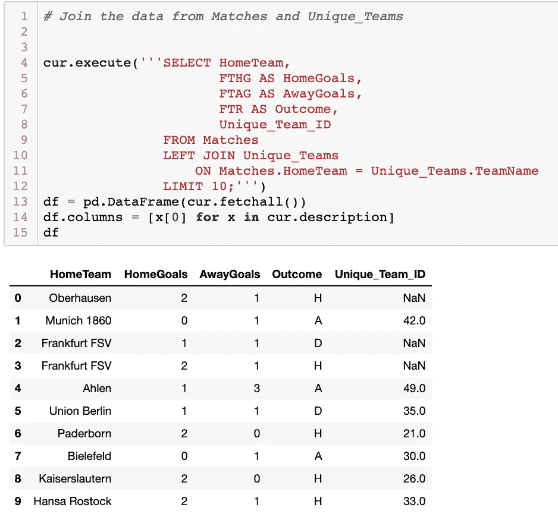

SELECT HomeTeam，FTHG 作为主场进球，FTAG 作为客场进球，FTR 作为结果，Unique _ Team _ ID FROM Matches LEFT JOIN Unique _ Teams ON Matches。HomeTeam = Unique_Teams。团队名称限制 10

第一个表**与**匹配，它是左侧的表，因此包含了该表中的所有行。第二个表 **Unique_Team** 是右边的表，只有当有匹配的行时，才会包含该表中的数据。例如，在 **Unique_Teams** 数据表中没有对应的行，其中 **TeamName** 为 **Oberhausen** 或**法兰克福 FSV** ，因此 **Unique_Team_ID** 在这些行中显示为 **NaN** 。在下一个例子之前运行下面的代码，帮助使**左连接**更容易理解。

从 Teams_in_Matches 中删除，其中 Unique_Team_ID 介于 EN 20 和 30 之间；

为了练习使用**左连接**，返回**匹配**表中的所有行，如果比赛中的主队有 **Unique_Team_ID** 显示 **Teams_in_Matches** 表中的数据。只返回前 10 行。将您的查询与下面的查询进行比较:

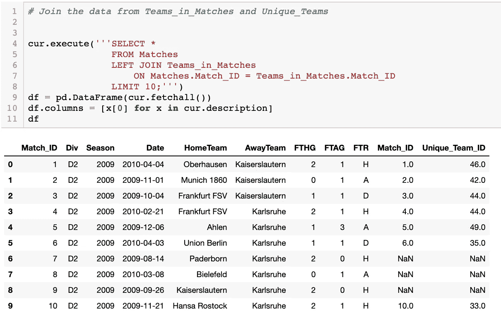

SELECT * FROM Matches LEFT JOIN Teams _ in _ Matches ON Matches。Match_ID = Teams_in_Matches。Match_ID 限制 10；

这次我们看到的是 **Match_ID** 为 7、8、9 的行，第二个 **Match_ID** 列和 **Unique_Team_ID** 列为 **NaN** 。这意味着 **Match_ID** 中没有来自 **Teams_in_Matches** 数据表的 7、8 或 9 行。

# 右连接

在继续之前，运行以下代码:

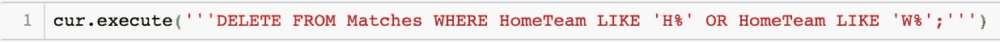

从主队为“H%”或“W%”的比赛中删除；

**右接头**与**左接头**相似。一个**右连接**返回右表/列出的第二个表中的所有行，以及左表/列出的第一个表中的所有匹配行。要了解其工作原理，请查看下面的查询:

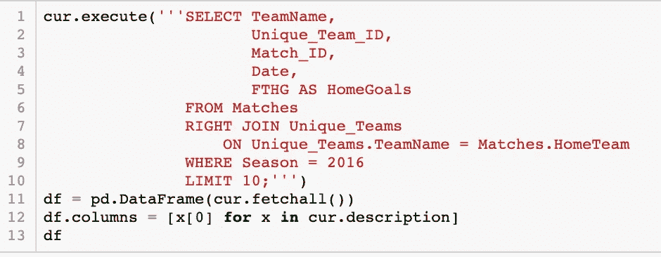

SELECT TeamName，Unique_Team_ID，Match_ID，Date，FTHG AS home goals FROM Matches RIGHT JOIN Unique _ Teams ON Unique _ Teams。团队名称=匹配。HomeTeam 其中赛季= 2016 限制 10；

如果您使用 Jupyter Notebook，上面的查询将不会运行，因为目前不支持**右连接**。你可以去[https://www.w3schools.com/sql/sql_join_right.asp](https://www.w3schools.com/sql/sql_join_right.asp)了解更多关于**右合**和练习。上面的查询应该返回来自 **Unique_Teams** 表的所有行，并且只返回来自 matches 表的匹配行。这基本上与**左连接**和**相反，左连接**比**右连接**更常用。

# 完全外部连接

**完全外部连接**返回左表和右表中的所有行，并在匹配时合并这些行。当没有匹配时，它也将返回行。有点像**左连接**和**右连接**的组合。下面的查询应该返回来自 **Matches** 表和 **Unique_Teams** 表的所有行。

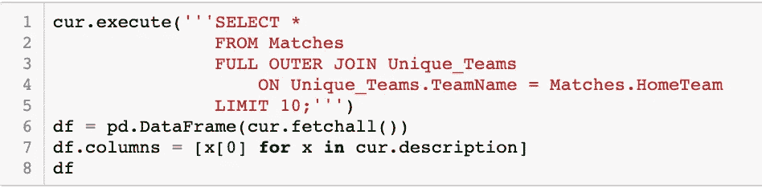

SELECT * FROM Matches 完全外部联接 Unique_Teams ON Unique_Teams。团队名称=匹配。HomeTeam 限制 10；

如果你使用 Jupyter Notebook，上面的查询将不会运行，但是你可以在这里阅读更多关于**全外连接**，[https://www.w3schools.com/sql/sql_join_full.asp](https://www.w3schools.com/sql/sql_join_full.asp)。

下图是**内接合**、**左接合**、**右接合**和**全外接合**的直观表示。

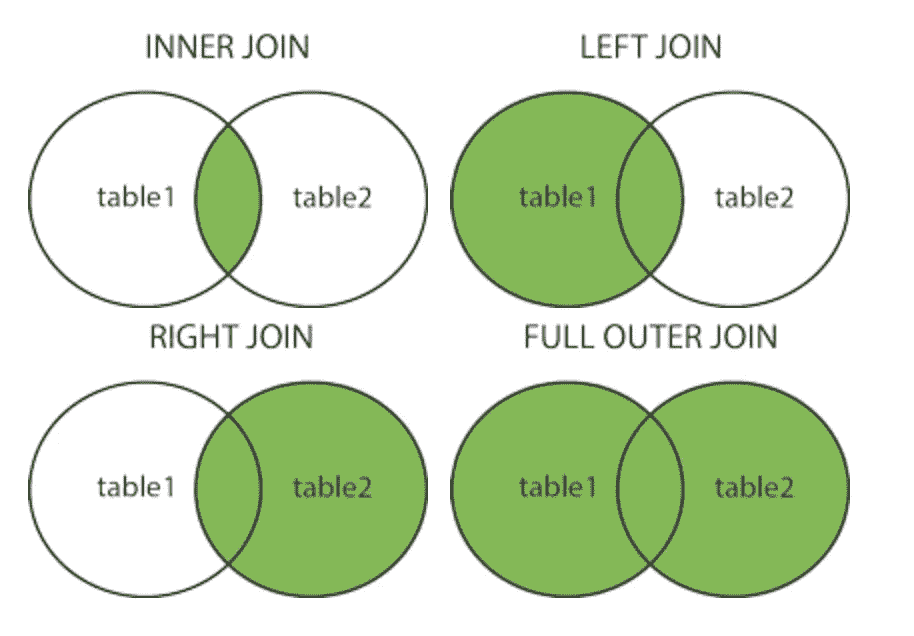

图片 via:[https://www.w3schools.com/sql/sql_join.asp](https://www.w3schools.com/sql/sql_join.asp)

# 工会声明

**UNION** 语句不是 **JOIN** 语句，但它是组合多个表的一种方式。 **UNION** 语句组合两个表的结果。这两个表必须具有相同的列数和相同的数据类型。此时，我们已经从 **Matches** 数据表中删除了一些团队，并从 **Unique_Teams** 表中删除了一些团队。我们可以使用一个 **UNION** 语句来获取所有团队的列表。

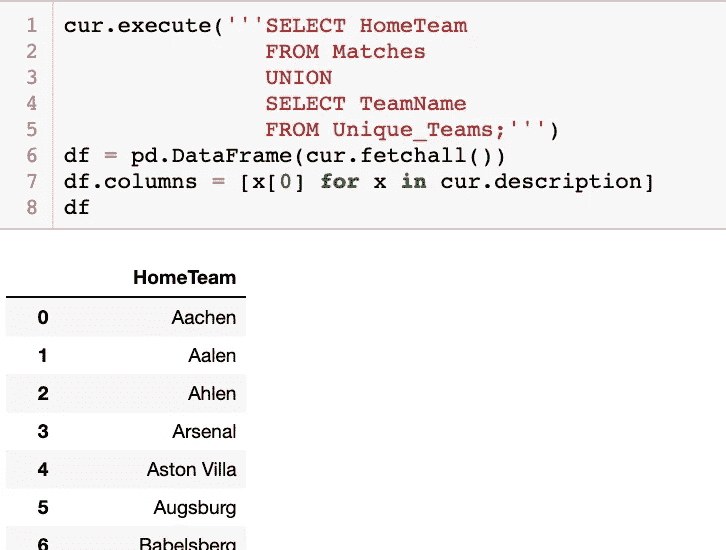

SELECT home team FROM Matches UNION SELECT team name FROM Unique _ Teams；

以上结果结合了来自**从匹配项中选择主团队**和**从唯一团队中选择团队名称**的两个结果。重复的不包括在内，但是如果你希望包括重复的，你可以写 **UNION ALL** 而不是 **UNION** 。

您已经到达本教程的结尾。讨论了以下项目:

*   极限语句
*   不使用 JOIN 语句返回多个表
*   JOIN 语句
*   用 JOIN 语句返回特定的列
*   用多个表过滤和聚集
*   内部连接
*   左连接
*   右连接
*   完全外部连接
*   工会声明

我鼓励你不断练习使用上述方法，以更深入地了解它们是如何工作的。