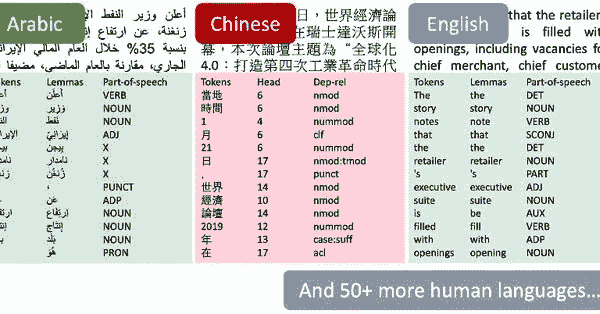
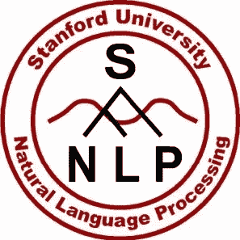
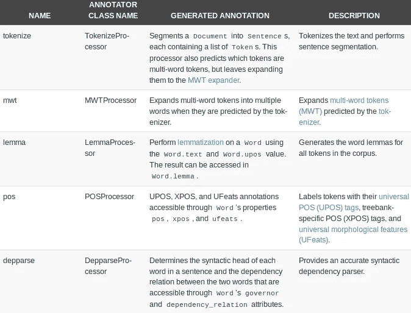
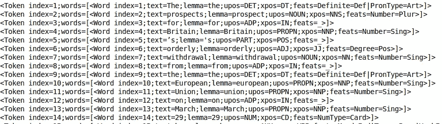
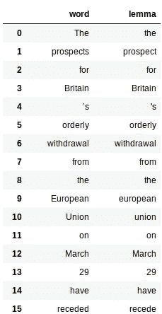
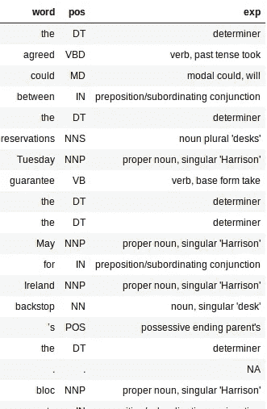
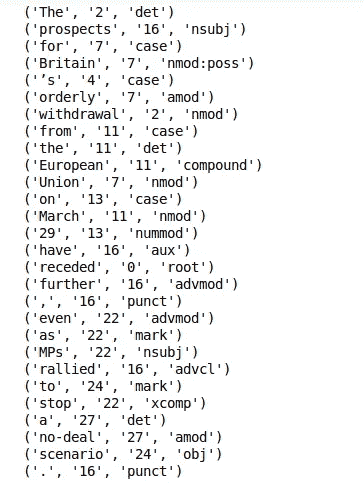
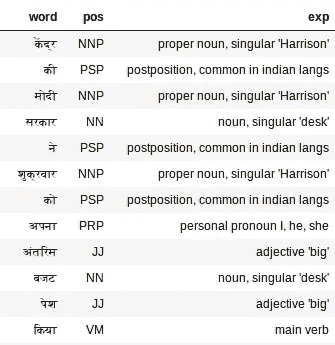

# StanfordNLP 简介:53 种语言的 NLP 库(带 Python 代码)

> 原文：<https://medium.com/analytics-vidhya/introduction-to-stanfordnlp-an-nlp-library-for-53-languages-with-python-code-d7c3efdca118?source=collection_archive---------0----------------------->

斯坦福大学最新图书馆指南——Stanford NLP。我展示了一个用 Python 实现的基本 NLP 任务+一个很棒的案例研究！

我在[学习自然语言处理(NLP)](https://trainings.analyticsvidhya.com/courses/course-v1:AnalyticsVidhya+NLP101+2018_T1/about?utm_source=blog&utm_medium=stanfordnlp-nlp-library-python) 时遇到的一个常见挑战——我们能为非英语语言建立模型吗？很长一段时间以来，答案都是否定的。每种语言都有自己的语法模式和语言上的细微差别。其他语言的数据集也不多。

这就是斯坦福大学最新的 NLP 图书馆介入的地方——Stanford NLP。

当我读到上周的新闻时，我几乎无法抑制我的激动。作者声称 StanfordNLP 可以支持超过 53 种人类语言！是的，我不得不再次检查那个号码。

我决定亲自去看看。这个库还没有正式的教程，所以我有机会尝试和使用它。我发现它打开了一个充满无限可能的世界。StanfordNLP 包含稀有亚洲语言(如印地语、中文和日语)的原始脚本的预训练模型。



# 什么是 StanfordNLP，为什么要使用它？

**StanfordNLP 是一组经过预先训练的最先进的模型。**这些模型被研究人员用于 CoNLL 2017 年和 2018 年的比赛。所有的模型都建立在 PyTorch 之上，可以根据你自己的注释数据进行训练和评估。厉害！



此外， **StanfordNLP 还包含一个流行的大型 NLP 库的官方包装器—** [**CoreNLP**](https://stanfordnlp.github.io/CoreNLP/) 。到目前为止，这在某种程度上仅限于 Java 生态系统。你应该看看这个教程来学习更多关于 CoreNLP 的知识以及它在 Python 中是如何工作的。

一个 NLP 爱好者还能要求什么呢？现在我们已经了解了这个库的功能，让我们用 Python 来体验一下吧！

# 在 Python 中设置 StanfordNLP

这个图书馆有一些奇特的东西最初让我迷惑不解。例如，你需要 **Python 3.6.8/3.7.2** 或更高版本来使用 StanfordNLP。为了安全起见，我在 Anaconda 中为 **Python 3.7.1** 设置了一个单独的环境。你可以这样做:

1.打开 conda 提示符并键入以下内容:

```
conda create -n stanfordnlp python=3.7.1
```

2.现在激活环境:

```
source activate stanfordnlp
```

3.安装 StanfordNLP 库:

```
pip install stanfordnlp
```

4.我们需要下载一种语言的特定模型来使用它。启动 python shell 并导入 StanfordNLP:

```
import stanfordnlp
```

然后下载英语语言模型(“en”):

```
stanfordnlp.download('en')
```

这可能需要一段时间，具体取决于您的互联网连接。这些语言模型非常庞大(英语模型是 1.96GB)。

# 一些重要的笔记

*   **StanfordNLP 建立在 PyTorch 1.0.0 之上。**如果你有一个旧版本，它可能会崩溃。以下是如何检查机器上安装的版本:

```
pip freeze | grep torch
```

其应该给出类似`torch==1.0.0`的输出

*   我尝试在我的联想 E470 Thinkpad(8GB 内存，英特尔显卡)上使用不带 GPU 的库。我很快在 Python 中得到一个内存错误。因此，我换成了一台支持 GPU 的机器，并建议你也这样做。你可以试试免费图形处理器支持的谷歌可乐(Google Colab)《T4》

就这样！让我们立即深入了解一些基本的 NLP 处理。

# 使用 StanfordNLP 执行基本 NLP 任务

让我们从创建文本管道开始:

```
nlp = stanfordnlp.Pipeline(processors = "tokenize,mwt,lemma,pos")doc = nlp("""The prospects for Britain’s orderly withdrawal from the European Union on March 29 have receded further, even as MPs rallied to stop a no-deal scenario. An amendment to the draft bill on the termination of London’s membership of the bloc obliges Prime Minister Theresa May to renegotiate her withdrawal agreement with Brussels. A Tory backbencher’s proposal calls on the government to come up with alternatives to the Irish backstop, a central tenet of the deal Britain agreed with the rest of the EU.""")
```

**processors = "**参数用于指定任务。如果不传递任何参数，默认情况下所有五个处理器都被占用。以下是处理器及其功能的简要概述:



让我们看看他们每个人的行动。

# 令牌化

一旦令牌处理器运行，这个过程就会隐式发生。实际上非常快。您可以使用**print _ token()**查看 token:

```
doc.sentences[0].print_tokens()
```



token 对象包含句子中标记的索引和单词对象列表(如果是多单词标记)。**每个词对象都包含有用的信息，如词的索引、文本的引理、词性标记和特征标记。**

# 引理化

这包括使用由引理处理器生成的单词的“引理”属性。下面是获取所有单词引理的代码:

这为每个单词及其相应的引理返回一个*熊猫*数据帧:



# 词性标注

PoS 标记器速度很快，在不同语言中都能很好地工作。与引理一样，PoS 标签也很容易提取:

注意到上面代码中的大字典了吗？它只是 PoS 标签和它们的含义之间的映射。这有助于更好地理解文档的句法结构。

输出将是一个包含三列的数据框——word、pos 和 exp(解释)。解释栏给了我们关于文本的大部分信息(因此非常有用)。



添加解释栏可以更容易地评估我们的处理器有多精确。我喜欢这样一个事实，大部分单词的标记都是正确的。它甚至可以识别一个词的时态，以及它是基础形式还是复数形式。

# 依赖项提取

依赖性提取是 StanfordNLP 的另一个现成特性。您可以简单地对一个句子调用 **print_dependencies()** 来获得它所有单词的依赖关系:

```
doc.sentences[0].print_dependencies()
```



该库在管道的单次运行期间计算上述所有内容。在支持 GPU 的机器上，这几乎不会花费你几分钟的时间。

我们现在已经找到了一种用 StanfordNLP 执行基本文本处理的方法。是时候利用我们可以为 51 种其他语言做同样的事情了！

# 在印地语上实现 StanfordNLP

**StanfordNLP 在性能和多语言文本解析支持方面非常突出。**让我们更深入地研究后一个方面。

# 处理印地语文本(梵文)

首先，我们必须下载印地语模型(相对较小！):

```
stanfordnlp.download('hi')
```

现在，将一段印地语文本作为我们的文本文档:

```
hindi_doc = nlp("""केंद्र की मोदी सरकार ने शुक्रवार को अपना अंतरिम बजट पेश किया. कार्यवाहक वित्त मंत्री पीयूष गोयल ने अपने बजट में किसान, मजदूर, करदाता, महिला वर्ग समेत हर किसी के लिए बंपर ऐलान किए. हालांकि, बजट के बाद भी टैक्स को लेकर काफी कन्फ्यूजन बना रहा. केंद्र सरकार के इस अंतरिम बजट क्या खास रहा और किसको क्या मिला, आसान भाषा में यहां समझें""")
```

这应该足以生成所有的标签。让我们检查印地语的标签:

```
extract_pos(hindi_doc)
```



PoS tagger 在印地语文本上工作得非常好。以“अपना”为例。词性标注者将其标注为代词——我、他、她——这是准确的。

# 使用 CoreNLP 的 API 进行文本分析

[CoreNLP](https://stanfordnlp.github.io/CoreNLP/) 是一款久经考验的工业级 NLP 工具包，以其性能和准确性而闻名。StanfordNLP 使用三行代码开始利用 CoreNLP 的复杂 API。实际上，只需要三行代码就可以设置好！

1.下载 CoreNLP 包。打开您的 Linux 终端并键入以下命令:

```
wget [http://nlp.stanford.edu/software/stanford-corenlp-full-2018-10-05.zip](http://nlp.stanford.edu/software/stanford-corenlp-full-2018-10-05.zip)
```

2.解压缩下载的包:

```
unzip stanford-corenlp-full-2018-10-05.zip
```

3.启动 CoreNLP 服务器:

```
java -mx4g -cp "*" edu.stanford.nlp.pipeline.StanfordCoreNLPServer -port 9000 -timeout 15000
```

***注意:*** *CoreNLP 需要 Java8 才能运行。请确保您安装了 JDK 和 JRE 1.8.x】*

现在，确保 StanfordNLP 知道 CoreNLP 在哪里。为此，您必须导出$CORENLP_HOME 作为您的文件夹的位置。在我的例子中，这个文件夹在**主目录**中，所以我的路径应该是这样的

```
export CORENLP_HOME=stanford-corenlp-full-2018-10-05/
```

完成上述步骤后，您可以启动服务器并使用 Python 代码发出请求。下面是一个启动服务器、发出请求以及从返回的对象中访问数据的综合示例。

# a.设置核心客户端

# b.依存关系解析和发布

# c.命名实体识别和共参照链

这里我最喜欢的是在 python 中使用 CoreNLP 时带来的易用性和增强的可访问性。

# 我对使用 StanfordNLP 的看法——利弊

关于 StanfordNLP 的未来，有几件事让我兴奋不已:

1.  它对多种语言的现成支持
2.  事实上，它将成为 CoreNLP 的官方 Python 接口。这意味着它只会在功能和易用性方面有所改进
3.  这是相当快的(除非有巨大的内存占用)
4.  Python 中的简单设置

然而，还有一些问题需要解决。以下是我对 StanfordNLP 可以改进的地方的看法:

1.  语言模型的大小太大(英语为 1.9 GB，中文为 1.8 GB)
2.  这个库需要大量的代码来生成特性。相比之下，NLTK 可以快速编写原型脚本——这对于 StanfordNLP 来说可能是不可能的
3.  当前缺少可视化功能。对于像依赖解析这样的功能来说，拥有是很有用的。与 SpaCy 等图书馆相比，StanfordNLP 在这方面做得不够

**务必查看** [**StanfordNLP 的官方文档**](https://stanfordnlp.github.io/stanfordnlp/) **。**

# 结束注释

显然，StanfordNLP 还处于测试阶段。从现在开始，它只会变得更好，所以现在是开始使用它的好时机——比其他人领先一步。

就目前而言，这种令人惊叹的工具包(CoreNLP)正在进入 Python 生态系统，像斯坦福这样的研究巨头正在努力开源他们的软件，我对未来持乐观态度。

*原载于 2019 年 2 月 3 日*[*www.analyticsvidhya.com*](https://www.analyticsvidhya.com/blog/2019/02/stanfordnlp-nlp-library-python/)*。*