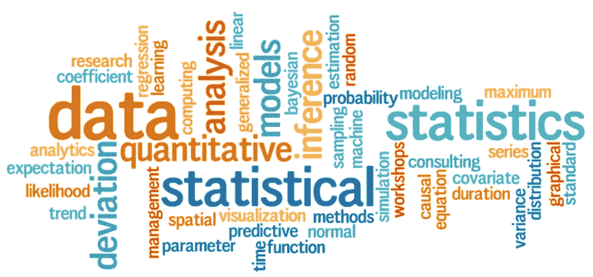
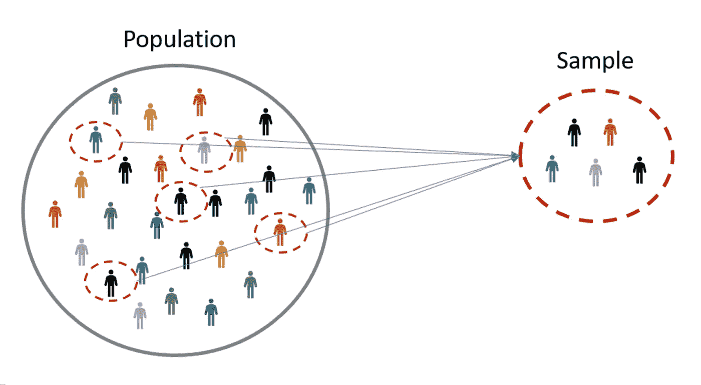
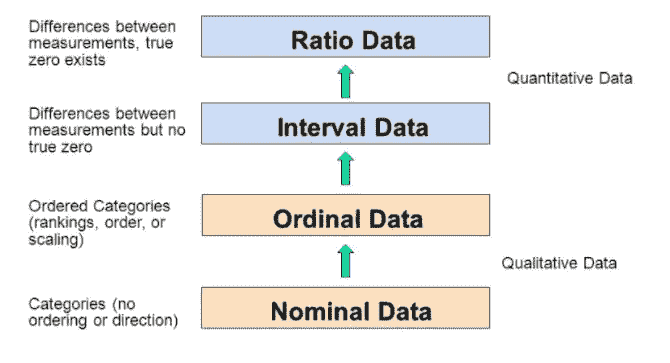
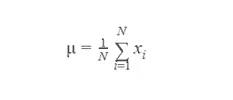
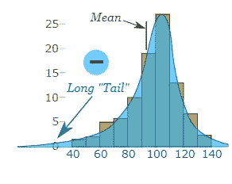
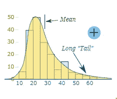
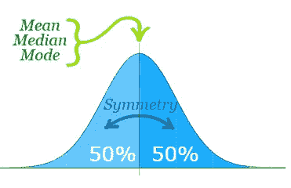
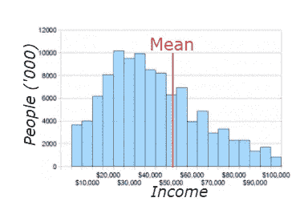
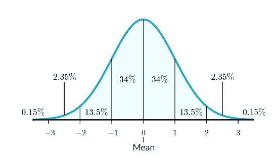
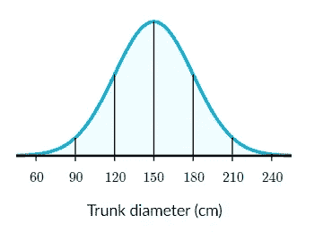

# 统计学导论(第一部分)

> 原文：<https://medium.com/analytics-vidhya/introduction-to-statistics-part-i-a63c9a19ac2e?source=collection_archive---------10----------------------->

**统计范围**

在现实世界中，数据在参与实时交易中发挥着巨大的作用。为了处理数据，我们需要知道数据是如何构成的？或者如何为下一阶段的研究解释数据？。用于组织、收集和分析数据的统计学。从最后能够学习数据结构。数据看起来怎么样？就是数据好到可以参与机器学习。

统计学分为两大类，即描述性和推断性。

**描述性统计**

它是一种以信息方式组织和总结数据的方法。比方说考虑零售公司评估

> 与去年相比，有多少产品增加了销售额？
> 
> 客户对哪种产品评价很高？
> 
> 新产品上市带来了多少收入？
> 
> 继续一年的大减价够好吗？

这些问题将从基于数据的描述性统计中得到回答。

**数据类型**

**分类** —数据可以以类别或组的形式表示。以该州的人口普查数据为例。将性别列为男性/女性。此外，每个人的就业类型可以是私人/公共/政府资助。所以，这些都被称为分类数据。

**数字—** 数据可以用数字表示。这可以分为两类，即

**离散型—** 数据可以表示为可数型。用简单的话来说，数据测量为有限的。说你有几个孩子？厨房架子上有多少瓶？

**连续** —数据不能表示为可数。用简单的话来说，数据测量是无限的。说天上有多少颗星星？高度/面积/距离/时间的测量

**推断统计**

用于根据数据进行预测。使用这些统计数据，您可以从样本中获取数据，并对总体进行概括。

考虑估计在加利福尼亚有多少人拥有蓝色/黄色/黑色/红色汽车的例子？。在这种情况下，我们不需要对单个家庭进行调查，而是采取 20%的百分比。加州只有 20%的家庭参与调查并提供结果。这个过程过去被称为取样。

总体与样本相反。基本上，它作为一个整体。考虑同样的例子，以美国的人口普查为例，政府官员登上每个州，在分配给他们的区域上标记人口普查。在这种情况下，每个家庭都将参加人口普查。

**测量等级**

**定性数据**

定性数据是对群体属性进行分类或描述的结果。定性数据一般用文字或字母来描述。

> 示例如下
> 
> 发色、血型、种族、一个人开的车、一个人住的街道

定性数据分为两种类型，即名义数据和序数数据。

**名义数据—** 数据可以用“标签”或“名称”来表示。

> 例如基因型、血型、邮政编码、性别、种族、眼睛颜色、政党。

**有序数据—** 顺序重要，但值之间的差异不重要。

> 例如经济状况(“低收入”、“中等收入”、“高收入”)、教育水平(“高中”、“学士”、“硕士”、“博士”)

**量化数据**

数量数据是对群体属性进行计数或测量的结果。

> 例如，你有多少钱，身高和体重，你所在城镇的人口数量，参加统计的学生数量

定量数据分为两种类型，即区间和比率。

**Interval —** 这可以用数字来表示，没有真正的零值。

> 例如温度(华氏)、温度(摄氏)

**Ratio —** 这可以用一个真零值来表示。

> 例如酶活性、剂量、反应速率、流速、浓度

**集中趋势的度量**

平均值、中值和众数是集中趋势的量度。让我们看看如何解决它。

**表示**

平均值等于数据集中所有值的总和除以数据集中值的数量。公式表示如下

让我们看一个数据集中的例子来确定平均值

{1,2,3,4,5,6,8,9,10} = (1+2+3+4+5+6+7+8+9+10)/10 = 55/10 = 5.5

**中位数**

数据集需要按升序排列。计算数据集中值的数量，

如果值是奇数，选择中间值作为中值

如果值是偶数，取两个中间值的中间值

从{1，2，3，4，5}数据集中，中间值将是 3

从{1，2，3，4，5，6}数据集，中间值将是(3+4)/2 = 7/2 = 3.5

**模式**

从数据集中挑选最频繁的数据。考虑示例{23，45，67，78，23，45，45，21}，数据集中出现次数最多的是“45”。出现了三次。因此“45”被认为是一个模式值。

**偏斜度**

偏斜倾向于在一边或另一边有一个长尾巴。测量数据集的对称性。完美的对称数据集被称为零偏斜。

**负偏斜**

平均值和中值在众数的左边。简而言之，我们可以说平均值和中值将小于众数。长“尾巴”在峰的负侧。人们有时会说它“向左倾斜”(长尾在左手边)。平均值也在峰值的左侧。

**正偏斜**

平均值和中值位于该模式的右侧。简单来说，均值和中值会大于众数。长尾在峰的正侧，有人说是“偏右”。平均值在峰值的右边。

**零偏度**

平均值、中值和众数的值是相同的。它完全对称。

收入分配的例子，这里的数据来自最近的人口普查。如你所见，数据是正偏的。

**正态分布**

正态分布在统计学中反复出现。正态分布有一些有趣的性质:它呈钟形，平均值和中值相等，68%的数据在 1 个标准差以内。

早期的统计学家注意到相同的形状在不同的分布中反复出现，所以他们将其命名为正态分布。

正态分布具有以下特征:

*   对称钟形
*   均值和中位数相等；两者都位于分布的中心
*   ≈68%的数据落在平均值的 1 个标准偏差内
*   ≈95%的数据落在平均值的 2 个标准偏差内
*   ≈99.7%的数据落在平均值的 3 个标准偏差内

# 绘制正态分布示例

某一松树品种的树干直径呈正态分布，平均值μ= 150 厘米，标准差σ= 30 厘米。画一条描述这种分布的正态曲线。

解决方案:

步骤 1:绘制一条法线曲线。

第二步:150 厘米文本的平均值放在中间。

第三步:每个标准差是 30cm 的距离。

希望本文给出统计学的基本介绍。让我们看看第二部分中的下一级统计概念。

快乐学习:)