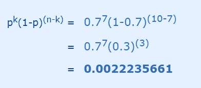
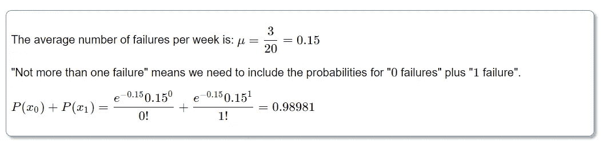

# 统计学导论(第二部分)

> 原文：<https://medium.com/analytics-vidhya/introduction-to-statistics-part-ii-ea64fe6171ab?source=collection_archive---------28----------------------->

**标准偏差**

标准差告诉我们数据集中在数据集的平均值附近。简单来说，我们可以说数据偏离均值多少。它的符号是 **σ** (希腊字母 sigma)。它是**方差的**平方根**。所以现在你会问，“方差是多少？”**

**差异**

与平均值之差的**平方**的平均值。

要计算方差，请执行以下步骤:

*   算出平均数(这些数字的简单平均数)
*   然后，对于每个数字:减去平均值并对结果求平方(*平方差*)。
*   然后算出这些平方差的平均值。

例子

你和你的朋友刚刚测量了你的狗的高度(毫米):

高度(肩部)为:600 毫米、470 毫米、170 毫米、430 毫米和 300 毫米。

找出平均值、方差和标准差。

你的第一步是找到平均值:

回答:

平均值=600 + 470 + 170 + 430 + 300=1970=394

所以平均身高是 394 毫米。让我们把它画在图表上:

现在我们计算每只狗与平均值的差异:

要计算方差，取每个差值，求平方，然后平均结果:

标准差的好处是它很有用。现在，我们可以显示哪些高度在平均值的一个标准偏差(147 毫米)内:

因此，使用标准差，我们就有了一个“标准”的方法来知道什么是正常的，什么是超大的或超大的。

罗威纳犬**是**高大的狗。还有腊肠狗**是不是**有点矮？

# 但是……样本数据有一点小小的变化

我们的例子是针对**种群**(这 5 只狗是我们唯一感兴趣的狗)。

但是如果数据是一个**样本**(从一个更大的群体中选取的)，那么计算就会改变！

> 当有“N”个数据值时，即: **总体:**计算方差时除以 N(就像我们做的那样) **样本:**计算方差时除以 N-1

例如:如果我们的 5 只狗只是一大群狗中的一个**样本**，我们用 **4 而不是 5** 来除，如下所示:

样本方差= 108520/**4**=**27130**

样本标准差=√27130 =**165**(精确到毫米)

**二项分布**

**“Bi”的意思是“两个”**(就像自行车有两个轮子)……所以这是关于与**两个结果**的事情。

当试验有一个以上的结果时，使用二项分布。这些结果被标记为“成功”和“失败”。

二项分布告诉我们“n”次独立实验成功的概率。这样的实验是是非问题。一个例子可能是扔硬币。

二项分布的参数是 p 和 n，其中 p 是单个试验成功的概率，n 是试验的总次数。

**抛硬币:**

*   我们有正面(H)还是
*   尾部(T)

我们说硬币落地的概率 **H** 是
，硬币落地的概率 **T** 是

# 让我们掷硬币吧！

抛一枚公平硬币**三次** …得到**两个头**的几率有多大？

投掷硬币三次( **H** 表示正面， **T** 表示反面)可以获得以下 8 种**结果中的任何一种**:

# 我们想要什么样的结果？

“两个头”可以是任何顺序:“HHT”、“THH”和“HTH”都有两个头(和一条尾巴)。

所以结果中的 **3 产生“两个头”。**

# 每种结局的概率是多少？

每种结果的可能性都是相等的，一共 8 种，所以每种结果都有 1/8 的概率

所以**事件**“两个头”的概率是:

所以得到两个头的几率是 3/8

> 在餐馆里，老板说“70%的人选择鸡肉，所以接下来的 10 个顾客中有 7 个应该选择鸡肉”…老板说对的可能性有多大？

所以我们有:

*   p = 0.7
*   n = 10
*   k = 7

我们得到了:

这是每种结果的概率。

这些结果的总数是:

我们得到了:

所以 10 人中有 7 人选择鸡肉的概率大概只有 **27%**

这个故事的寓意是:即使长期平均值是 70%，也不要指望接下来的 10 个中有 7 个。

**泊松分布**

用于计算特定时间段内几个事件发生的概率。泊松随机变量 X 的概率分布表示在给定的时间间隔或特定的空间区域中发生的成功次数，由以下公式给出:

> 如果电力故障按照泊松分布发生，平均每 20 周发生 3 次故障，计算在特定的一周内不会发生一次以上故障的概率。

**标准正态分布**

当正态分布被标准化后，称为标准正态分布。

我们一直使用的 **z 分数公式**是:

*   **z** 是“z 分数”(标准分数)
*   **x** 是要标准化的值
*   **μ**(‘mu’)是平均值
*   **σ**(“sigma”)是标准差

> 一项对日常出行时间的调查得出了以下结果(以分钟为单位):26、33、65、28、34、55、25、44、50、36、26、37、43、62、35、38、45、32、28、34

**均值为 38.8 分钟**，**标准差为 11.4 分钟**

将值转换为 z 分数(“标准分数”)。

> 莫莉在全国成绩测试中获得了 940 分。平均测试分数为 850，标准偏差为 100。比莫莉分数高的学生比例是多少？(假设考试成绩呈正态分布。)

首先，我们使用 z 分数转换公式将 Molly 的测试分数转换为 z 分数。

查看 Z 表以确定 0.90 的值。

因此，受测学生的 P(Z > 0.90) = 1 — P(Z < 0.90) = 1–0.8159 = 0.1841.

Thus, we estimate that **18.41 %** 比莫莉得分高。