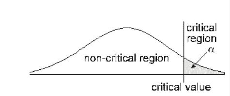

# 统计学导论(第三部分)

> 原文：<https://medium.com/analytics-vidhya/introduction-to-statistics-part-iii-84039fd43a1e?source=collection_archive---------16----------------------->

**为什么要进行统计假设检验？**

假设检验是一种推断统计的形式，它允许我们根据一个代表性的样本得出关于整个人口的结论。使用样本会给你带来巨大的好处。在大多数情况下，观察整个群体以了解其特性是根本不可能的。唯一的替代方法是收集一个随机样本，然后用统计学来分析它。

**什么是假设陈述？**

如果你要提出一个假设，习惯上要写一个陈述。你的语句会是这样的:
“如果我…(对一个自变量这样做)…。然后(因变量会发生这种情况)。”
例如:

*   如果我(减少给药草的水量)那么(药草会变大)。
*   如果我(除了药物治疗之外，给患者提供咨询)那么(他们的整体抑郁量表会降低)。
*   如果我(在中午而不是 7 点考试)那么(学生考试成绩会提高)。
*   如果我(在这个特定位置寻找)那么(我更有可能发现新物种)。

**假设检验**

统计学中的假设检验是一种对调查或实验的结果进行检验的方法，以确定是否有有意义的结果。你基本上是通过计算你的结果偶然发生的几率来测试你的结果是否有效。如果你的结果可能是偶然发生的，那么这个实验是不可重复的，因此用处不大。

**零假设**

用 Ho 表示的零假设假定两组值之间“没有”差异。零假设表明测量的现象(因变量)和自变量之间没有关系。

**替代假设**

*   零假设的反面。
*   说明两个变量之间有统计学意义
*   如果零假设被拒绝，则为真
*   通常研究者认为是真实的，并且正在测试
*   由 H1 或哈表示

**零假设:**

如果一株植物被喂了一个月的柠檬水，而另一株被喂了一个月的白开水，那么这两株植物的生长不会有什么不同

**替代假设:**

如果一株植物被喂了一个月的柠檬水，而另一株被喂了白开水，那么被喂了柠檬水的植物会比被喂了白开水的植物长得更多

**单尾检验的定义**

单尾检验是指显著性检验，其中拒绝区域出现在抽样分布的一端。它表示估计的测试参数大于或小于临界值。当测试样本落在拒绝区域，即左侧或右侧，视情况而定，它导致接受替代假设而不是零假设。它主要应用于卡方分布；这就确定了吻合度。

在这个统计假设检验中，与α相关的所有临界区都被置于两个尾部中的任何一个。单尾检验可以是:

*   左尾检验:当总体参数被认为低于假设参数时，进行的假设检验是左尾检验。

*   右尾检验:当假设总体参数大于假设参数时，进行的统计检验是右尾检验。

**双尾检验的定义**

双尾检验被称为假设检验，其中拒绝区域或临界区域位于正态分布的两端。它确定被测样品是在某个范围内还是范围外。因此，如果计算值落在概率分布的两个尾部中的任何一个，则接受替代假设来代替原假设。

在这个测试中，α被分成两个相等的部分，每一边放置一半，即它考虑了正面和负面影响的可能性。执行它是为了查看估计参数是高于还是低于假设参数，因此极值作为反对零假设的证据。

**混乱矩阵**

> 在预测分析中，混淆表(有时也称为混淆矩阵)是一个具有两行和两列的表格，报告了误报、漏报、真报和真漏报的数量。这允许比仅仅正确分类的比例(准确性)更详细的分析。如果数据集不平衡，准确性会产生误导性的结果；也就是不同类的观测数相差很大的时候。

给定 13 幅图片的样本，其中 8 幅是猫，5 幅是狗，其中猫属于类别 1，狗属于类别 0，

实际= [1，1，1，1，1，1，1，1，0，0，0，0]，

假设训练了一个区分猫和狗的分类器，我们拍摄了 13 张照片并通过分类器运行它们，分类器进行了 8 次准确的预测，并错过了 5 次:3 只猫被错误地预测为狗(前 3 次预测)和 2 只狗被错误地预测为猫(后 2 次预测)。

预测= [0，0，0，1，1，1，1，0，0，0，1，1]

有了这两个标记集(实际和预测)，我们可以创建一个混淆矩阵，它将总结测试分类器的结果:

在这个混淆矩阵中，8 张猫图片中，系统判断 3 张是狗，5 张狗图片中，预测 2 张是猫。所有正确的预测都位于表的对角线上(以粗体突出显示)，因此很容易直观地检查表中的预测错误，因为它们将由对角线外的值表示。

抽象地说，混淆矩阵如下:

P =正；N =负；TP =真阳性；FP =假阳性；TN =真阴性；FN =假阴性。

快乐学习:)