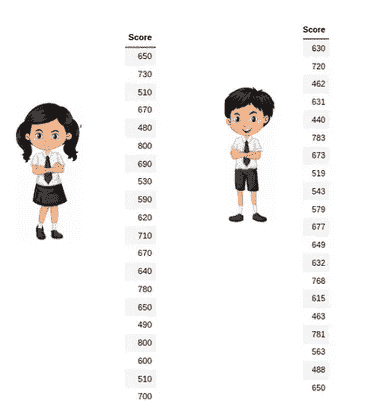
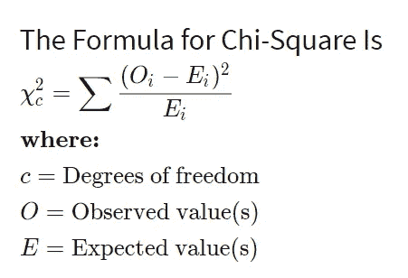

# 统计学导论(第四部分)

> 原文：<https://medium.com/analytics-vidhya/introduction-to-statistics-part-iv-da837396a83e?source=collection_archive---------10----------------------->

**Z 测试**

**Z 检验**是一种统计程序，用于针对无效假设检验替代假设。

z 检验是在方差已知且样本较大(n>=30)的情况下，用于确定两个样本均值是否不同的任何统计假设

计算 z 测试值的公式为

**单样本 Z 检验**

当我们想要比较样本平均值和总体平均值时，我们进行单样本 Z 检验。

> 假设我们想测试女生在 SAT 语言部分的平均分数是否高于 600 分。我们得到的信息是，女生分数的标准差是 100。因此，我们通过随机抽样收集了 20 名女生的数据，并记录了她们的分数。最后，我们还将⍺值(显著性水平)设置为 0.05。分数是[650，730，510，670，480，800，690，530，590，620，710，670，640，780，650，490，800，600，510，700]

假设我们想测试女生的平均分数是否高于 600 分

SAT 语言部分

*   女生的平均分是 641
*   样本的大小是 20
*   人口平均数是 600
*   总体的标准偏差是 100

临界值= 1.645

z 得分>临界值。

H0:μ <=600

H1:μ> 600

我们可以拒绝零假设，并根据我们的结果得出结论，男生的平均分数高于 600。

**两个样本的 Z 检验**

当我们想要比较两个样本的平均值时，我们执行双样本 Z 检验。

**这里有一个例子来理解双样本 Z 检验**

在这里，假设我们想知道女生的平均分数是否比男生高 10 分。我们得到的信息是，女生分数的标准差是 100，男生分数的标准差是 90。然后，我们通过随机抽样收集了 20 名女生和 20 名男生的数据，并记录了他们的分数。最后，我们还将⍺值(显著性水平)设置为 0.05。

在本例中:

*   女生的平均分数(样本平均值)是 641
*   男生的平均分数(样本平均值)是 613.3
*   女孩人口的标准偏差是 100
*   男孩人口的标准偏差是 90
*   女孩和男孩的样本量都是 20
*   总体平均值之间的差异为 10

因此，我们可以根据 P 值得出结论，我们无法拒绝零假设。

# 什么是 t 检验？

t 检验是一种检验假设的统计方法，适用于:

*   我们不知道人口方差
*   我们的样本量很小，n < 30

# 单样本 t 检验

当我们想比较样本平均值和总体平均值时，我们进行单样本 t 检验。与 Z 检验的不同之处在于，我们这里没有关于总体方差的信息。在这种情况下，我们使用样本标准差而不是总体标准差。

## 这里有一个理解单样本 t 检验的例子

假设我们想确定女生在考试中的平均分数是否超过 600 分。我们没有关于女生分数的方差(或标准差)的信息。为了进行 t 检验，我们随机收集了 10 名女生的数据及其分数，并选择我们的⍺值(显著性水平)为 0.05 进行假设检验。

在本例中:

*   女生的平均分是 606.8
*   样本的大小是 10
*   人口平均数是 600
*   样品的标准偏差为 13.14

我们的 P 值大于 0.05，因此我们无法拒绝零假设，也没有足够的证据来支持女生平均得分超过 600 分的假设。

**双样本 t 检验**

当我们想要比较两个样本的平均值时，我们执行双样本 t 检验。

## 这里有一个例子来理解双样本 t 检验

在这里，假设我们想确定在考试中男生的平均分数是否比女生高 15 分。我们没有关于女孩分数或男孩分数的方差(或标准差)的信息。进行 t 检验。我们随机收集了 10 个女生和男生的数据和他们的分数。我们选择⍺值(显著性水平)为 0.05 作为假设检验的标准。

在本例中:

*   男生的平均分是 630.1
*   女生的平均分是 606.8
*   人口平均数之间的差异 15
*   男生分数的标准差是 13.42
*   女生分数的标准差是 13.14

因此，P 值小于 0.05，所以我们可以拒绝零假设，并得出结论，在考试中，男孩平均比女孩多 15 分。

# 什么是卡方统计？

卡方(χ2)统计是一种测试，用于测量模型与实际观察数据的对比情况。卡方检验常用于假设检验。在给定样本大小和关系中变量数量的情况下，卡方统计比较预期结果和实际结果之间的差异大小。

参考

[统计学-分析学-假设检验-z 检验-t 检验](https://www.analyticsvidhya.com/blog/2020/06/statistics-analytics-hypothesis-testing-z-test-t-test/)

[假设检验使用 z 检验](https://www.fireblazeaischool.in/blogs/hypothesis-testing-using-z-test/)

[确定单尾和双尾测试的关键区域](https://www.youtube.com/watch?v=jUeQoL8M5eM)

[确定单尾测试和双尾测试](https://www.youtube.com/watch?v=94WmKn3zkck)