# 使用 R-5 的统计学导论

> 原文：<https://medium.com/analytics-vidhya/introduction-to-statistics-using-r-5-4c049ff7abf3?source=collection_archive---------6----------------------->

*如果您还没有阅读 R 数据分析系列的第 4 部分，请阅读下面的文章，其中我们讨论了 R — 4* *中的* [*高级数据争论。*](/analytics-vidhya/advanced-data-wrangling-in-r-4-f98693b92851)

*这篇文章的内容是我在 IIM-B 时代得到的几本书的要点。*

*人人有责——贾里德·p·兰德*

*实用数据科学与 R —妮娜·祖梅尔&约翰·芒特*

*文中讨论的所有代码块都以 R markdown 的形式出现在* [*Github 链接*](https://github.com/viveksrinivasanss/Data_Science_Using_R) *中。*

*要看我写的所有文章请使用链接，*[*Vivek Srinivasan*](/@viveksrinivasan)*。*

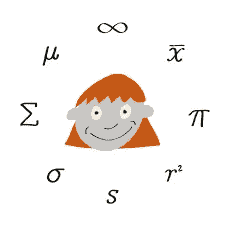

统计中最常用的一些工具是均值、方差、相关性、t 检验和方差分析。这些在 R 中得到了很好的体现，比如`mean`、`var`、`cor`、`t.test`和`anova`。在本文中，我们将只关注计算基本的汇总统计，以便在下一篇文章中详细讨论 t 检验和 ANOVA。

## 平均

许多人第一个想到的与统计相关的东西是`average`，或者恰当地称为`mean` 。我们先看一些简单的数字，然后在文章的后面处理更大的数据集。首先，我们从 1 到 100 之间随机抽取 100 个数字。

```
x <- sample(1:100, size = 100, replace = TRUE)
x
```

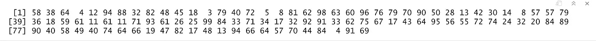

`sample` 从 x 处统一绘制`size` 条目，设置`replace=TRUE`表示同一条目可以多次绘制。现在我们有了`vector` 数据，我们可以计算平均值。这是最简单的算术平均数。平均值可能因您而异，因为我们是从 100 个`random` 数字的样本中计算平均值。

```
mean(x)
```

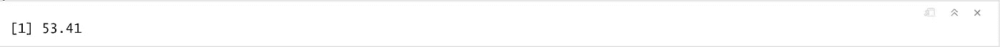

很简单。因为这是统计数据，我们需要考虑一些数据缺失的情况。为了创建它，我们取 x 并随机设置 20%的元素为`NAs`。

```
# copy x
y <- x# randomly setting 20 values to NA
y[sample(1:100, size=100, replace=TRUE)] <- NA
y
```

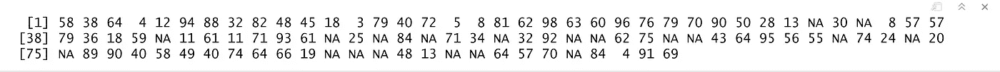

在 y 上使用`mean` 将返回`NA`。这是因为，默认情况下，如果 mean 遇到哪怕一个元素是`NA` ，它都会返回`NA`。这是为了避免误导信息。在计算`mean`、`set na.rm to TRUE`之前移除 NA。

```
mean(y, na.rm=TRUE)
```

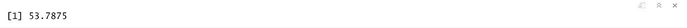

## 加权平均数

为了计算一组数字的加权平均值，函数`weighted.mean`采用一个`vector` 数字和一个`vector` 权重。它还有一个可选参数，`na.rm`在计算前去掉 NA；否则，带有`NA` 值的向量将返回`NA` ，如上例所述。

```
grades <-  c(95,72,87,66)
weights <- (1/2,1/4,1/8,1/8)
weighted.mean(x=grades, w=weights)
```

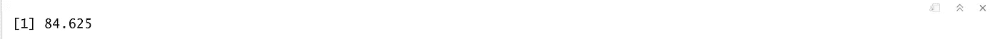

下面的等式给出了加权平均值的公式，它与随机变量的期望值相同。

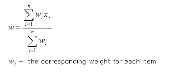

## 方差和标准差

方差和标准差是最常用的传播度量。我们知道方差是对数据集展开程度的一种度量。它被计算为每个数字与一个数据集的平均值的平均平方偏差。

```
var(x)
```

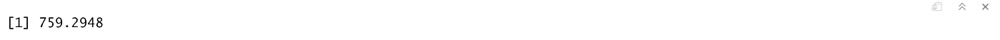

标准差是方差的平方根，用`sd`计算。与`mean`函数`sd` 和`var` 也类似，在计算前用`na.rm`参数移除`NAs`。

```
sd(y, na.rm=TRUE)
```

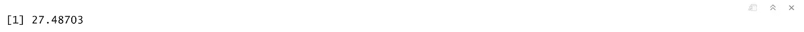

## 汇总统计数据

除了均值、标准差和 var，汇总统计的其他常用函数有最小值、最大值、中值和分位数。

```
min(x)
max(x)
median(x)
```


之前计算的`median` 是一组有序数字的中间值。比如 5，2，1，8，6 的`median` 是 5。在有`even` 个数字的情况下，`median` 是中间两个数字的平均值。对于 5、1、7、4、3、8、6 和 2，`median` 为 4.5。

一次性计算平均值、最小值、最大值和中值的有用函数是`summary`。不需要指定 na.rm，因为如果有 na，它们会被自动删除，并且它们的计数会包括在结果中。

```
summary(y)
```


摘要还显示了第一个和第三个分位数。要计算其他分位数值，我们可以使用`quantile` 函数。

```
quantile(x,probs= c(0.1, 0.25, 0.5, 0.75, 0.99))
```

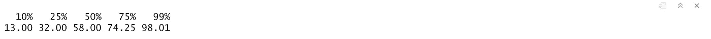

分位数是集合中某个百分比小于该分位数的数字。例如，在从 1 到 200 的数字中，第 75 个分位数-大于 75%的数字是 150.25。

## 相关性和协方差

当处理多个变量时，我们需要测试它们与其他变量的关系。两个简单直接的方法是`correlation` 和`covariance`。为了检验这些概念，我们来看看来自`ggplot2`的`economics` 数据。

```
require(ggplot2)
head(economics)
```

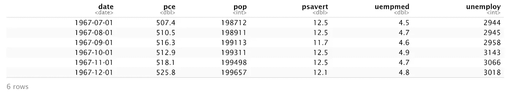

在`economics` 数据集中，`pce` 是个人消费支出，`psavert` 是个人储蓄率。我们使用`cor`计算它们的相关性。

```
cor(economics$pce, economics$psvert)
```


这种极低的相关性是有道理的，因为支出和储蓄是对立的。

要一次比较多个变量，在矩阵上使用`cor`(仅用于数字变量)。

```
cor(economics[,c(2,4:6)])
```

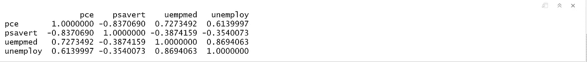

因为这只是一个数字表，所以使用图表来可视化信息会很有帮助。为此，我们使用`GGally`包中的`ggpairs`函数(在`ggplot2`上构建的有用图形的集合)。这显示了数据中每个变量相对于每个其他变量的`scatterplot` 。

```
GGally::ggpairs(economics[,c(2,4:6))
```

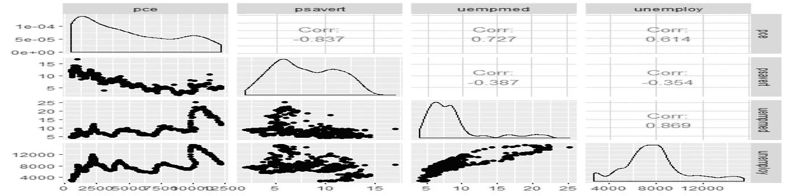

这类似于小倍数图，除了每个窗格有不同的`x` 和`y`轴。虽然这显示了原始数据，但实际上并没有直观地显示相关性。来展示我们构建了一个关联数的热图。高度正相关表示变量之间的正关系，高度负相关表示负关系，接近零表示没有强关系。

```
require(reshape2)
require(scales)
econCor <- cor(economics[,c(2,4:6)])## Converting to long format
econMelt <- melt(econCor,varnames=c("x","y"),value.names="Correlation")
econMelt
```

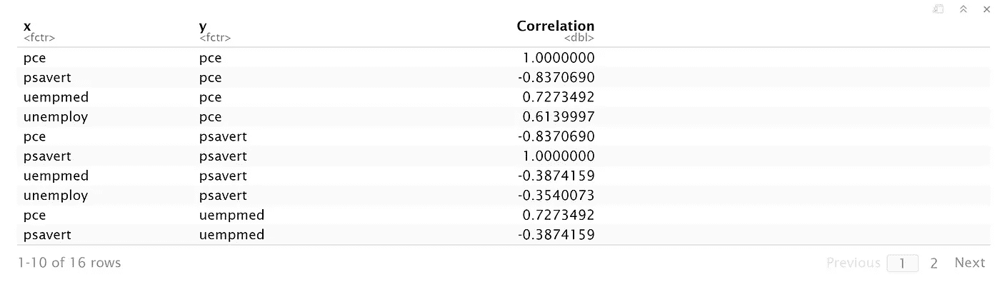

现在我们使用这些数据，并使用`ggplot2`为相关值创建热图。

```
ggplot(econMelt,aes(x=x,y=y)) + 
    geom_tile(aes(fill=correlation)) +
    scale.fill.gradient2(
        low=muted("red"),
        mid="white",                      
        high="steelblue"),
        guide=guide.colorbar(ticks=FALSE,barheight=10),
        limits=c(-1,1)) + 
    theme.minimal() + 
    labs(x=NULL,y=NULL)
```

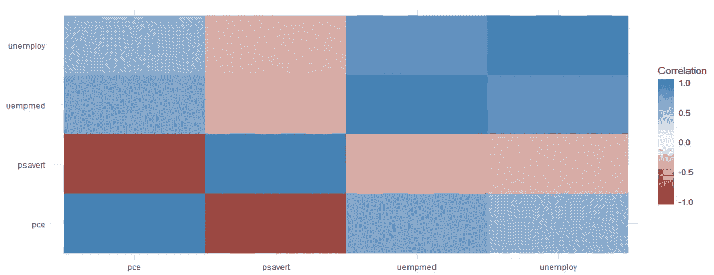

要了解`ggpairs` 的辉煌，请看`reshape2` 软件包中的提示数据。这显示了根据连续变量和离散变量的组合构建直方图、箱线图或散点图时，每对变量之间的相互关系。虽然像这样的数据转储看起来非常好，但它并不总是探索性数据分析的最有信息量的形式。

```
data(tips,package="reshape2")
head(tips)
```


```
GGally::ggpairs(tips)
```

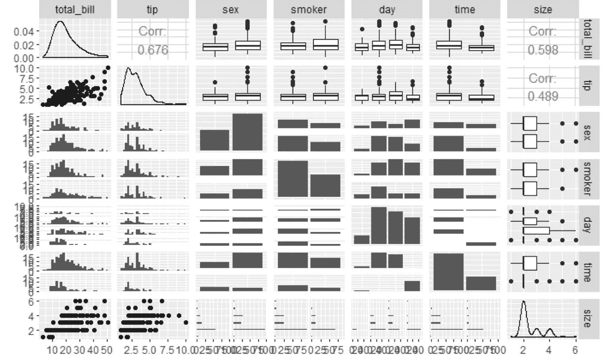

如果没有那句老话*“相关性并不意味着协方差”*，任何关于相关性的讨论都是不完整的。换句话说，仅仅因为两个变量相关并不意味着它们相互影响。运行下面的代码会产生一个惊喜。请运行代码并亲自查看，因为我不想打破这里的惊喜。

```
require(RXKCD)
getXKCD(which="552")
```

与相关性类似的是协方差，它就像变量之间的方差。`cov` 函数的工作方式类似于`cor` 函数，使用相同的参数来处理缺失数据。事实上，`?cov`和`?cor`会弹出相同的帮助菜单。

```
cov(economis$pce,economics$psavert)
```

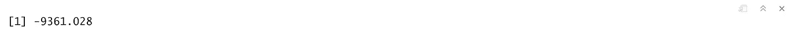

在下一篇文章中，我们将看到一些高级统计概念`t-tests`(单样本、双样本和配对 t 检验)和`ANOVA` ，它们构成了`regression`等高级统计方法的基础。

[*使用 R — 6*](/@viveksrinivasan/advanced-statistics-using-r-6-2789539a0167) 进行提前统计

> *一定要通过评论和分享文章来分享你的想法和支持。*