# 支持向量机第一部分

> 原文：<https://medium.com/analytics-vidhya/introduction-to-support-vector-machine-75dba4950e3?source=collection_archive---------16----------------------->

## 理解 SVM 背后的概念

Pic 信贷-https://www.knowledgehut.com/

# 介绍

感谢阅读这篇文章，在这篇文章中我们将经历一个非常强大和流行的机器学习算法**支持向量机**。在这里，我们将尝试理解 SVM 基于的基本概念，使用来自我们真实世界场景的非常简单的例子来更好地理解它。我们也将试图理解线性代数的一些基本概念，因为这将有助于理解 SVM 背后的数学，我们将在下一篇文章中解释。

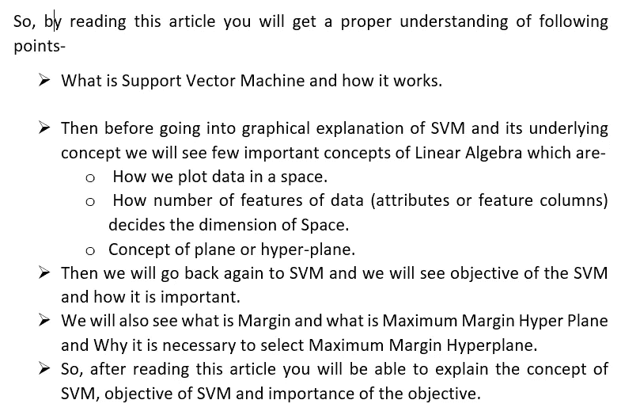

**支持向量机-**

支持向量机是由 Vladimir N Vapnik 和 Alexey Ya 开发的监督机器学习算法。Chervonenkis 于 1963 年提出，它是一种鉴别分类器，通过在 N 维空间中绘制数据，然后找到最合适的超平面，该超平面可以将数据清楚地分类到它们各自的类别中，并且为了找到超平面，它使用最大间隔超平面的概念。它可用于分类和回归，但主要用于分类问题。今天，它是机器学习中最常用的算法之一。正如我们所知，机器学习中最受信任和最受欢迎的算法是神经网络，但它的受欢迎程度有所下降，这是由于 SVM，因为通过使用比神经网络少得多的计算能力，它对线性和非线性数据都给出了非常可信的结果。

SVM 工作的主要思想或底线是，它试图找到分类器或决策边界，使得决策边界到每个类的最近数据点之间的距离最大(这种超平面也被称为**最大间隔超平面**)。这就是为什么它也被称为**最大间隔分类器。**

熟悉逻辑回归、神经网络等线性分类器的人很容易将决策边界的概念与每个类的最大距离形象化，但让我们从头开始讨论整个概念。

为了对任何数据进行分类，我们首先需要在某个空间中绘制数据，这是一个一般的想法，我们在日常生活中可以看到许多例子，假设给你一个任务，将两种水果分开，比如放在一个袋子里的橘子和芒果，在这种情况下，你将把这些水果放在一张桌子上，分成两组，每组之间有适当的距离，所以当我说我们在一个空间中绘制数据时，就把桌子当成一个空间，水果就是数据点。

以同样的方式，在支持向量机中，每个数据点被绘制在 N 维空间中，其中 N 仅仅是特征的数量。

**那么为什么我们把空间的维度和特征的数量一样呢？**

原因是在线性代数中，在线性代数中，如果我们想画一个点，其中 X1 = 2，X2 = 3，那么我们画一张图如下，并放置点，使其到 X1 的距离为 2，到 X2 的距离为 3

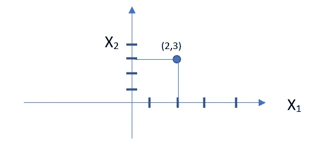

图一。说明空间尺寸与特征数量相同的原因

理想情况下，要找到位置来绘制一个点，我们需要距离每条线的距离，每条线是线性代数中的一个维度，整个图形可以看作空间，所以我们需要空间的维度等于坐标的数量，而坐标只是特征值。

**SVM 的主要目标及其重要性:-**

包括 SVM 在内的大多数线性分类器有一个共同点，即它们的目标是找到类别之间的最佳拟合决策边界，使得没有或很少有误分类点。

为了理解这个目的，让我们举一个我们在上面用过的分离水果的普通例子。

因为我们的任务是将放在一个袋子里的两种水果分开，所以要区分这两种水果，你通常需要看颜色、形状、大小等。所以形状、大小和颜色只不过是特征，根据这些特征你就能说出哪个水果是芒果还是橘子。让我们把这些特征放在下表中，假设橙色的颜色代码是 1，芒果的颜色代码是 2

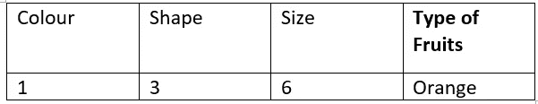

图二。显示数据集特征的表格。

所以这里的数字特征是 3，上面所有的点都将被绘制在三维空间中。

所绘制的点将具有坐标值，这些坐标值只是要素的值。因此，对于上面的行，坐标将是(1，3，6)。现在，考虑每个这样的行代表一个点(点也代表水果)，然后我们在 N(本例中为 3)维空间中绘制每个点，现在我们的目标是找到超平面，该超平面可以将这些点分成两类橙子或芒果，这样我们可以说平面一侧的数据属于橙子，另一侧的数据属于芒果。

**上面的例子有两个重要的概念，一个是如何用图形或线性代数的方式来表示一个普通的例子，另一个是我们实际上想要使用 SVM 或其他分类器找到的，这只不过是一个最佳决策边界。**

现在，让我们用另一个例子来理解我们线性代数的目标，我们也将试图找出为什么这个目标是重要的。这里我们将只考虑 2 个特性和 2 个类，因为很容易形象化-

假设我们有两个特征 X1 和 X2，我们有两个类 A 和 b。基于训练样本的数量(假设我们有 n 个训练样本)，我们将绘制我们的点，X1 和 X2 的值将是这些点的坐标-

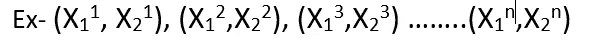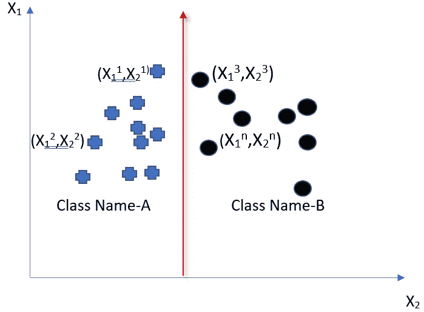

图三。该图显示了在二维空间中绘制的点的图形。

现在假设在 2 维空间中放置上述点后，我们得到了如上图。因为我们有两个特征列(X1，X2 ),并且我们知道空间的维度取决于特征的数量，所以我们选择了 2D 空间。

现在我们需要一个判定边界，在上面的例子中，判定边界是划分 A 类和 b 类的线，但是可以在任何方向和任何地方画一条线， 线的方向和位置由多种因素决定，但我们感兴趣的最主要和最重要的标准是，线的绘制方式应能够将整个数据集分为两部分(因为我们这里有两个类，对于多个类，部分的数量将是类的数量),划分方式应使得属于一个类的点应在一侧，属于另一个类的点应在另一侧。 所以，在上图中我们可以说画的线是有效的，可以作为我们的决策边界。

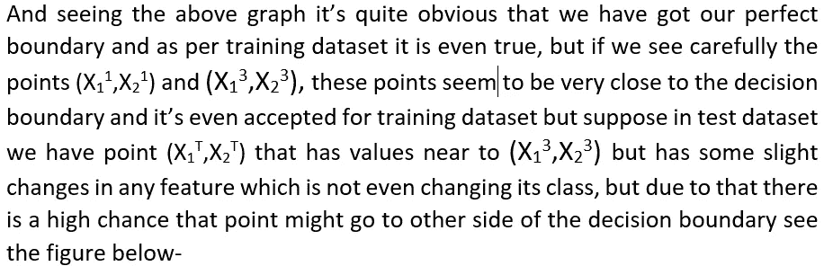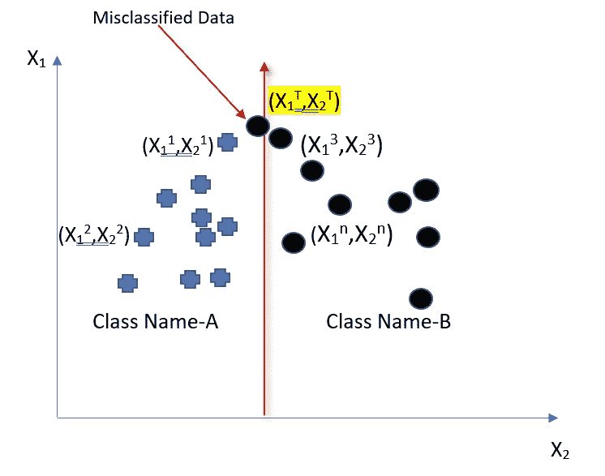

图 4 .显示缺失分类数据的图表。

因此，从上图中，我们可以说，虽然该点似乎更接近 B 类，但由于决策边界，现在它将被视为 A 类，因为它略微落在线的左侧，因此我们可以说，虽然该线最适合训练数据，但它在测试数据的情况下失败了，在机器学习术语中，我们称之为**过度拟合**。因此，为了避免过度拟合或减少分类失误的情况，我们不仅需要一个决策边界，而且还需要找到一个最佳边界。

因此，从上面的例子中，我们得到了我们的目标，画出一个最佳决策拟合边界，我们也看到了为什么它是重要的。

为了获得最佳决策边界，我们有许多选择，如应用神经网络，通过梯度下降，我们可以绘制任意形状，以实现最佳分类。

见下图-

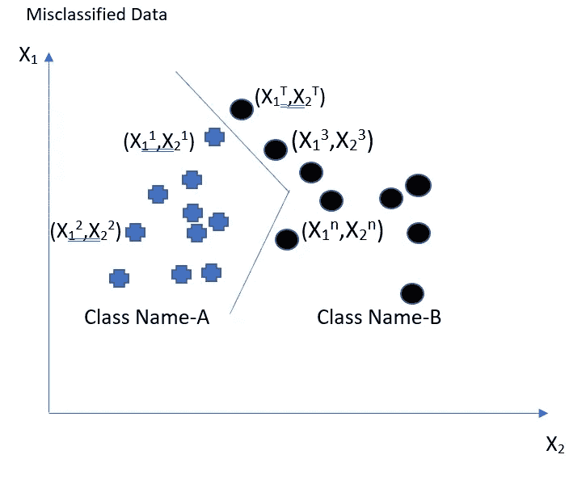

图 5。显示使用神经网络绘制的决策边界的图形。

但是这将需要巨大的计算资源，

**所以这里的问题是，我们有没有其他有效的机制来解决这个问题，而不用动用那么多资源？**

答案是肯定的，我们有**支持向量机**可以在这方面帮助我们。但是在我们开始 SVM 的细节之前，让我们先了解一下**超平面**的概念，我们将在解释中使用它。

**超平面** -正如我们在上面看到的，我们画了一个超平面来分隔这些点，但是到底什么是超平面。**超平面是一个几何实体，它的维数比它周围的维数小一。**如定义所述，超平面的维数比空间的维数小 1，所以如果空间的维数为 N，那么

超平面的维数= N-1

例如，在 3 维空间中，超平面将具有 2 维，并且我们知道 2 维实体被称为平面，因此 3 维空间中的超平面是平面。类似地，2D 空间中的超平面也是一维的，我们知道一维实体只是一条线。

例如，上面我们有 2D 维度，所以我们的决策边界的维度必须是 1D，这就是为什么我们画了一条线来分隔我们的数据集。所以，一个平面只不过是一条线在三维空间中的投影。

但在我们进一步前进之前，我们应该从机器学习的角度了解超平面的概念。**在机器学习中，超平面将数据集划分到各自的类别中，因此如果我们有两个类别，那么超平面应该将其分为两部分。**

**现在，我们已经了解了平面的概念，让我们来详细了解一下支持向量机-**

正如我们所知，支持向量机背后的思想是找到一个平面或决策边界，使得从每个类别的最近点到决策边界的距离最大。这里我们可以有两个问题，一个是为什么我们需要最大的距离，第二个是为什么我们需要每个职业的最大距离。为了理解这一点，让我们举一个同样的例子，将水果分成两部分或两类，即橘子或芒果。这一次我们不会画一个图表，而是采取一个非常简单的方法，见下图

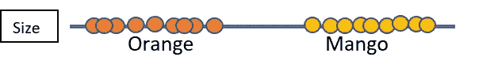

图 6。仅将大小和颜色作为特征的图形。

现在只考虑特征，即大小和颜色，我们可以说，如果大小较小，颜色为橙色，则该类为橙色，如果大小较大，颜色为黄色，则该类属于芒果。现在，我们的目标是找到一个决策边界，这样我们就可以说，决策边界左侧的数据属于橙色类，而决策边界右侧的数据属于芒果类，通过查看上面的图，我们可以说，我们可以将决策边界放在任何地方。因此，让我们采取 3 个案例，其中一个更接近橙色类，在下面的图 7 中表示为 D1， 在图中由 D2 表示的更接近芒果类的一个，并且对于与每个类具有最大距离的判定边界，让我们计算每个类的最近点之间的距离，即橙色类的 Po 和芒果类的 Pm，并且将我们的判定边界精确地放置在距离的中间，在下图中由 Dm 表示。

图 7。图表显示了 3 个决策边界。

让我们以决策边界 D1 为例，它似乎是可以的，因为它与至少一个类(即芒果)的最近点之间的距离是最大的，但是当我们得到一个橙子(Po)的数据，其大小比下图中的其他数据稍大一些时会发生什么

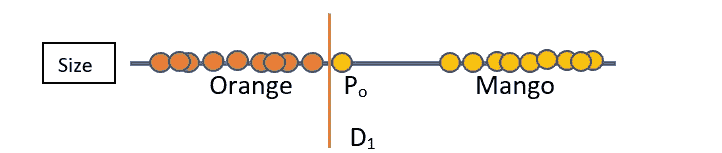

图 8。图表显示了当考虑 D1 时未命中分类情况。

根据我们的决策边界，它属于芒果类，因为它在决策边界的右侧，但实际上它似乎非常接近橙色类，所以这里我们可以说这是一个错误分类的情况，我们的决策边界不能处理规模稍高的情况。在机器学习的术语中，我们的决策边界不能被概括为处理这样的变化。

类似地，对于决策边界 D2 与橙色类的距离最大的情况，它可以是合适的决策边界，但是芒果的大小小于通常的情况，如下面的 Pm 所示，所以这里我们的决策边界将它放在橙色类中，但是实际上数据非常接近芒果类。因此，这个决策边界也不是最好的，因为它也不能处理数据中的微小变化。

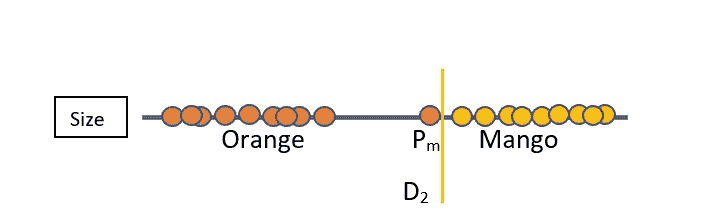

图 9。当考虑 D2 时，显示未命中分类的图形。

现在，让我们决定距离每个类最近点的距离相等的边界 Dm。

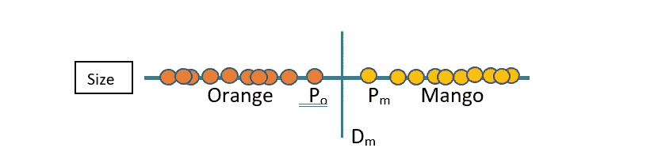

图 10。该图显示了决策边界与两个类的距离相同的情况。

在这里，我们可以说，这是我们可以拥有的最佳决策边界，因为它成功地处理了点 Po 和 Pm 中存在的变化，这些变化被其他两个决策边界错误分类。

**因此，从上面的例子中我们得到了两个问题的答案-**

**首先，为什么我们需要最大距离，因为如果我们采用最大距离，那么我们将能够避免由于数据中的一些变化而发生的错误分类。**

**其次，为什么我们需要与每个阶层保持最大距离，因为在这种情况下我们将有自由让每个阶层适当地调整数据的变化。**

所以，当我们谈论最近点的距离时，我们实际上在线性代数中有一个术语叫做**余量**。我们可以将保证金定义如下-

**余量-** 余量可以定义为最接近决策面的点的距离。我们也可以说，裕度是决策边界和每个类之间的距离。因此，在下图中，我们可以看到点(X11，X21)和(X12，X22)最接近决策面，因此这些点和决策面之间的距离就是余量。

让我们在下面的图表中标出以上各点，以更详细地形象化这个概念-

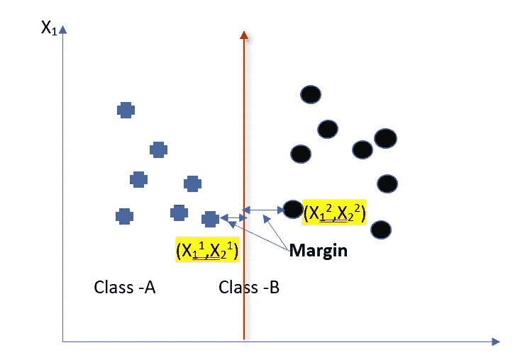

图 11。显示边距的图表

并且对于水果分类的例子，点 P0 和 Pm 是最近的点，因此这些点和决策表面 Dm 之间的距离是余量。

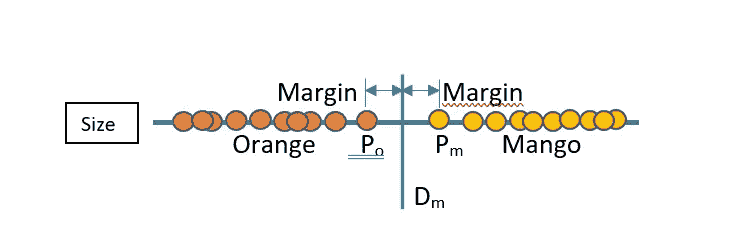

图 12。显示边距的图表。

# 结论

因此，在这篇文章中，我们试图理解潜在的概念

什么是支持向量机。

通过一个例子了解空间的概念。

空间的维度与特征的数量有关。

通过一个图表和一个例子，我们了解了数据点是如何在一个空间中绘制的，以及我们如何绘制一个平面来划分它。

解释了超平面的概念。

我们详细研究了 SVM，通过几个例子我们了解了利润的概念，以及为什么我们需要每个类都有最大的利润。

现在，在下一篇文章中，我们将看到 SVM 背后的数学概念，我们将尝试使用另一个分类算法逻辑回归的例子来获得它背后的直觉。