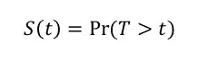
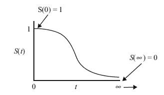
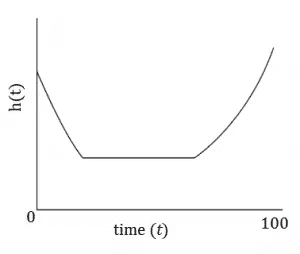
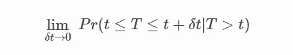
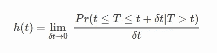
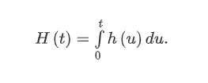
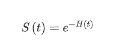

# 生存分析导论

> 原文：<https://medium.com/analytics-vidhya/introduction-to-survival-analysis-755fb1748bc?source=collection_archive---------28----------------------->

能活过一段时间的人口比例是多少？那些幸存下来的人，他们死亡或失败的比率是多少？特定的环境或特征如何增加或减少生存的可能性？各组之间的存活率有差异吗(例如，接受新疗法的组和接受旧疗法的组之间的差异)？这些问题经常浮现在我们脑海中，生存分析有了答案。

# **什么是生存分析？**

**生存分析**是统计学的一个分支，用于分析一个或多个事件发生前的预期持续时间，例如生物有机体的死亡和机械系统的故障。它是对事件时间变量的统计分析。事件时间变量反映了直到参与者发生感兴趣的事件(例如，死亡或失败)的时间。

## 少数术语

*   事件:死亡、疾病发生、疾病复发、康复或其他感兴趣的经历。
*   时间:时间可以指事件发生时个体的年龄。

# **审查**

当我们有一些关于个体存活时间的信息，但我们不知道确切的存活时间时，就会出现删失。存活时间未知，因为研究结束或参与者在经历该事件前退出研究。考虑一个人患癌症的例子。这里的事件是人的死亡。研究结束，但患者未出现事件，则患者的存活时间被视为已删截。

生存分析中的审查类型:

1.  **右删失:**存活时间大于等于观察存活时间。例如，如果受试者患有癌症，但他/她存活到研究结束而没有发病，因此存活时间在随访期的右侧变得不完整。
2.  **左删截:**存活时间小于等于观察存活时间。例如，病理报告显示患者患有癌症，但我们不知道患者何时被感染。
3.  **区间删截** **:** 真实存活时间在已知存活时间内。例如，在时间 t1，病理学报告揭示该人没有患癌症，但是在时间 t2，它揭示该人患有癌症。在这种情况下，受试者的真实存活时间发生在时间 t1 之后和时间 t2 之前，即，受试者在时间间隔(t1，t2)中被间隔删截。

# 生存函数

设 ***T*** ≥0 为代表生存(或事件)时间的随机变量。**生存函数**是个体生存**超过时间*t*的概率，**

生存函数

简单地说，生存函数定义了死亡事件在时间 tt 还没有发生的概率，或者等价地，生存过去时间 t 的概率。当 t 的范围从 0 到∞，生存函数具有以下性质:

*   它是非增长的。
*   在时间 t = 0 时，S(t) = 1。换句话说，熬过时间 0 的概率是 1。
*   在时间 t = ∞，S(t) = S(∞) = 0。随着时间趋近于无穷大，生存曲线趋近于 0。
*   理论上生存函数是光滑的。在实践中，我们在离散的时间尺度(几天、几周等)上观察事件。).

# 冒险函数

**危险函数**(也称为*死亡力*、*瞬时失败率*、*瞬时死亡率*或*年龄别失败率*)是一种在生存分析中对数据分布进行建模的方法。该函数最常见的用途是**将参与者的死亡几率建模为其年龄的函数**。

死亡事件在时间 t 发生的概率，假设死亡事件直到时间 t 才发生，则为:

随着 *δt* 收缩，这个量变为零，所以我们用这个量除以区间 *δt* (就像我们在微积分中可能做的那样)。这定义了时间 **t** 、 **h(t)** 的危险函数:

这个表达式的分子是事件在给定以前没有发生过的情况下，在区间[t，t+dt]内发生的条件概率，分母是区间的宽度。用一个除以另一个，我们得到单位时间内事件发生的速率。当区间宽度下降到零时，取极限值，我们得到一个瞬时发生率。

> 更具体地说，风险函数是在一个非常窄的时间范围内，感兴趣的事件发生的瞬时风险。

与非增函数的生存函数不同，风险函数可以是增函数、常数函数或减函数。

# 累积风险函数

**累积风险函数**测量到时间 **t** 为止已经累积的**风险总量**。它被定义为:

累积危害函数与生存函数的关系如下:*即危害越高，生存越低。*

在从风险函数计算生存函数时，累积风险函数不仅仅是一个中间函数。

现在让我们考虑在一个实验中，事件是一个机械系统的崩溃。危险率保持在每天 5 次故障。累积危险函数表明，如果故障继续以这种速度发生，那么一天内将总共有 5 次故障，或者两天内有 10 次故障。可以等效地说，机械系统单日经受住故障的概率为 exp(-5)。此外，如果第一天的危险率为每天 5 次故障，第二天为每天 3 次故障，这意味着在 2 天的时间内，累积危险为每 2 天 8 次故障，生存机会为 exp(-8)。此外，解释通过累积风险获得的信息的另一种方式是，如果故障事件是可重复的，它给出了在给定时期内我们预期(数学上)观察到故障(事件)的次数。这被称为计数数据解释。考虑我们的第一个案例，在 2 天的时间内累积危险为 10 次(*即*，每天 5 次故障)，这意味着我们可以预期我们的机械系统在此期间会有 10 次故障。

# **参考文献**

*   【https://books.google.de/books?id=xttbn0a-QR8C】&printsec = front cover&HL = de # v = one page&q&f = false
*   [https://life lines . readthedocs . io/en/latest/Survival % 20 analysis % 20 intro . html](https://lifelines.readthedocs.io/en/latest/Survival%20Analysis%20intro.html)