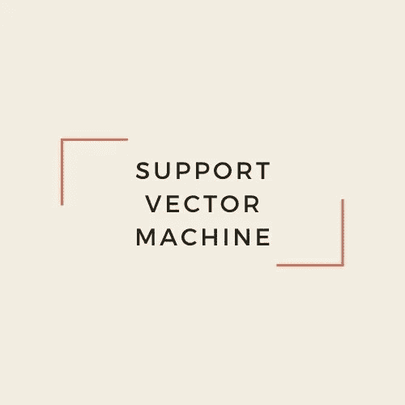
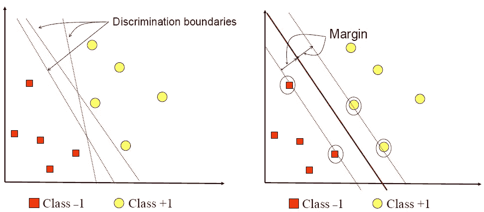
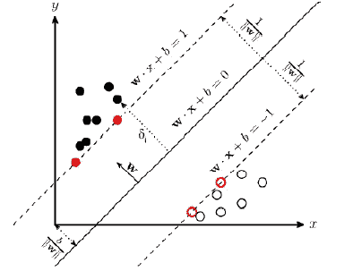
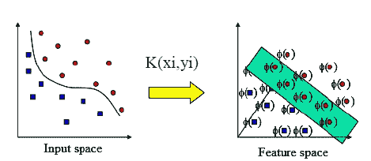

# 支持向量机(SVM)和核技巧

> 原文：<https://medium.com/analytics-vidhya/introduction-to-svm-and-kernel-trick-part-1-theory-d990e2872ace?source=collection_archive---------2----------------------->

我自己的 SVM 设计使用 [Canva](https://www.canva.com/)

# **什么是 SVM？**

支持向量机(SVM)是机器学习中包含的监督学习中的一种分类和回归算法，也称为支持向量网络。SVM 更常用于分类问题，而不是回归。

SVM 算法是由 Vapnik 和他的同事 Bernhard Bose 和 Isabelle Guyon 在 1992 年首先提出的，作为模式识别中的一系列高级概念。

SVM 通过使用结构风险最小化(SRM)原理来工作，该原理旨在获得在输入空间中将数据分成两类的最佳超平面线。

起初，SVM 线性工作，但后来 SVM 再次开发，以便它可以通过寻找用于计算数据类之间距离(边距)的超平面来非线性工作。在 SVM 应用可以应用于线性和非线性分类。

SVM 方法根据其特点分为两种，即线性 SVM 和非线性 SVM。线性 SVM 是使用软边界将可以线性分成两类的数据进行分类。线性分类通常适用于维数较低的数据集，也就是说，数据集只有很少的要素需要分类。同时，非线性 SVM 在高维工作空间中使用核概念。核概念是通过修改 SVM 算法来解决非线性问题所使用的函数。

SVM 概念被称为寻找最佳超平面的尝试，该超平面将在输入空间中将数据分成两类。关于 SVM 概念的训练过程的主要目标是找到超平面的位置。SVM 方法使用点积函数。超平面是用来分隔数据集的线。超平面可以是二维中的一条线，也可以是多个平面中的一个平面。SVM 算法中确定最佳超平面的例子。下面是 SVM 最佳超平面的插图。

SVM 上最佳超平面确定的图解

超平面可以通过测量超平面边缘来获得，超平面边缘是超平面与每个数据类的最近点之间的距离。分隔超平面的最近点称为支持向量。

在上图中，有一个黄色圆圈数据，它是+1 类中的数据，红色方框数据是-1 类中的数据。黄色圆圈数据是 class +1 的成员，而红色方框数据是 class -1 的成员。红线中可以看到的最佳超平面在正超平面和负超平面的中间。同时，支持向量是黄色圆圈和红色圆圈。现在我将描述 SVM 的一部分类型。看看吧！

## **林尼尔·SVM**

线性分类通常用于低维数据集。数据集的维度越低，意味着需要分类的要素就越少。两幅图像中的超平面可以通过测量超平面和每一类中最近点之间的距离(余量)来获得。

属于线性分类的例子是确定年龄和饮食因素是否影响人类健康。在这种情况下，只有两个特征是影响人类健康的因素，即年龄因素作为特征 x，食物因素作为特征 y。以下是线性 SVM 情况的可视化。

线性 SVM 是 SVM 的工作原理之一，用于可线性分离的数据，如下图所示。

林尼尔·SVM 的形象化

SVM 中可用的数据由符号(xi) ∈ R^d 和每个类的标签来符号化，即类+1 和类-1，它们被假设由 d 维超平面完美地分开，给定符号 yi ∈ {-1，+ 1} ，其中i = 1，2，…，*l*；其中 l 是大量数据。从而得到超平面方程的定义如下:
f (x) = w ^ T.x + b 或 w.x + b = 0

从而根据一个超平面方程得到线性 SVM 中的正类:
w. (xi) + b ≤ + 1

而对于线性 SVM 中的负类超平面方程是:
w. (xi) + b ≥ - 1

信息:
*w* =权重(权重向量)
*x* =矩阵输入值(特征)
*b* =偏差

为了计算最大的余量值，通过优化超平面和每个类中最近点之间的距离值来完成。用二次规划(QP)作为公式求带方程约束的方程的极小点:
τ (w) = 1/2 ‖w‖ ^ 2

易()。w + b)-1≥0

上述问题可以用各种计算技巧来解决，其中一种是使用 Langrange 乘子方程如下:
L (w，b，α)= 1/2‖w‖^ 2-∑_(I = 1)*l*αI(yi((Xi)。w + b) -1)

用，
i = 1，2，…， *l*

语言乘数= *αi* 其值为零或正值(αi≥0)，其中 i = 1，2，…， *l* 。从而将朗奇乘子方程修改为只包含αi 如下:
∑_(I = 1)^*l*αI-1/2∑_(I，j = 1) ^ *l* αi αj yi yj (xi)，xj

用，
αI≥0；(i = 1，2，…，*l*)；∑_ (i = 1) ^ *l* αi yi = 0

上面的大多数计算获得了正的αi，其中与正的αi 相关的数据被称为支持向量。以便使用下面的等式来确定新数据分类的结果:
*Class = sign f (x)*

## **非林尼尔·SVM**

非线性 SVM 是 SVM 的另一个工作原理，用于因其维数高而无法线性分离的数据。使用核概念进行非线性分类。非线性情况下的核心概念在确定用作模型的分类极限中起作用。

非线性 SVM 将核心概念的功能应用于具有高维度的空间。高维的含义是数据集有两个以上的特征需要分类。例如，非线性分类案例，即影响人类健康的因素，由年龄因素、饮食因素、运动因素、遗传、疾病史和压力水平组成。

在这个例子中，核心概念用于确定用作模型的分类边界。下图显示了非线性 SVM 的情况。

非线性 SVM 的可视化

由 SVM 算法中的过程生成的模型的准确性非常依赖于所使用的参数和核函数。在非线性 SVM 中使用核函数是需要考虑的事情，因为 SVM 的性能取决于核函数的选择。

非林尼尔 SVM 在实践中是用内核实现的，所以它可以用被称为内核技巧的内核函数来分离数据。

# **内核绝招**

使用内核技巧，SVM 可以在非线性数据情况下工作得很好。内核技巧的功能是将低维输入空间和变换映射到高维空间。

*   **径向基函数核(RBF)**

RBF 核是最广泛使用的核概念，用于解决无法线性分离的数据集的分类问题。已知该核在某些参数下具有良好的性能，并且与其他核相比，训练的结果具有较小的误差值。RBF 核函数的公式为:

`**K(x,xi) = exp(-gamma * sum((x – xi^2))**`

高斯核 RBF 有两个参数，即γ和σ。伽马参数有一个默认值，即γ = 1 / (2σ) ^ 2。当伽马值较高时，数据周围的点可能会在计算中被考虑。sigma 参数用于查找每个数据集的最佳值。

在 RBF 核函数方程中，xi-x 是两个不同特征空间中 x1 和 x2 之间的欧几里德距离，σ (sigma)是确定核权重的 RBF 核参数。在 SVM，西格玛参数需要调整，以提供准确的分类结果。σ参数的默认值为σ = 1。

*   **多项式内核**

多项式核是线性核的更一般化形式。在机器学习中，多项式核是适用于支持向量机(SVM)和其他核化的核函数，其中核表示特征空间中训练样本向量的相似性。多项式核也适用于解决标准化训练数据集的分类问题。多项式核函数的公式为:

`**K(x,xi) = 1 + sum(x * xi)^d**`

当数据不能线性分离时，使用这个内核。
多项式核有一个度参数(d ),用于在每个数据集中查找最优值。d 参数是多项式核函数的次数，默认值为 d = 2。d 值越大，产生的系统精度将会波动且不太稳定。这是因为 d 参数值越高，生成的超平面线越弯曲。

*   **s 形内核**

sigmoid 核的概念是人工神经网络(ANN)的发展，其核函数的方程为:

`**K(x,xi) = tanh**`***(α***`**xi.xj +**`**【β】**

Sigmoid 核已经在理论上被提出用于支持向量机(SVM ),因为它源于神经网络，但是直到现在它还没有在实践中被广泛使用。

sigmoid 核广泛应用于分类过程的神经网络中。具有 sigmoid 核的 SVM 分类具有复杂的结构，并且人类很难解释和理解 sigmoid 核如何做出分类决策。对这些核的兴趣源于它们在用神经网络和逻辑回归分类、特定性质、线性和累积分布方面的成功。

sigmoid 内核通常是有问题的或无效的，因为它很难有正参数。sigmoid 函数现在没有在研究中广泛使用，因为它有一个主要缺点，即 sigmoid 函数的输出值范围不是以零为中心。这导致反向传播过程的发生，这是不理想的，因此 ANN 的权重不是均匀地分布在正值和负值之间，而是趋向于接近极值 0 和 1。

*   **线性内核**

线性核可以用作任意两个给定观测值的正常点积。核函数的等式是:

`**K(x, xi) = sum(x * xi)**`

最后，就是这样。希望这一节有助于你们理解 SVM 和内核技巧的概念。您可以在下面给出一些评论、想法、反馈或建议。请继续学习，并关注更多内容！