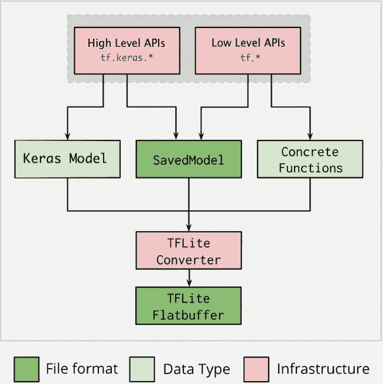

# TensorFlow Lite 简介

> 原文：<https://medium.com/analytics-vidhya/introduction-to-tensorflow-lite-66c19d757b8c?source=collection_archive---------11----------------------->

在本笔记本中，我们将回顾 TF Lite 的基础知识。这本笔记本的首要目标是描述两件事:
1。如何将 TensorFlow 模型转换成 TF Lite
2。如何从 TF Lite 模型中提取模型架构和权重

# 介绍

TensorFlow Lite 是一套帮助开发人员在移动、嵌入式和物联网设备上运行 TensorFlow 模型的工具。它支持设备上的机器学习推理，具有低延迟和小二进制大小。它由两个主要部分组成。

我们来看看使用 TensorFlow Lite 的整体工作流程。

# 开发工作流程

使用 TensorFlow Lite 的工作流程包括以下步骤:

1.  **挑模特**

带上你自己的 TensorFlow 模型，在网上找一个模型，或者用一个预先训练好的模型来加入或者重新训练。

2.**转换型号**

如果您正在使用自定义模型，请使用 TensorFlow Lite 转换器和几行 Python 将其转换为 TensorFlow Lite 格式。

3.**部署到您的设备上**

使用 TensorFlow Lite 解释器和多种语言的 API 在设备上运行您的模型。

4.**优化您的模型**

使用谷歌的[模型优化工具包](https://www.tensorflow.org/lite/performance/model_optimization)来减少你的模型的大小，提高它的效率，同时对准确性的影响最小。

# 张量流 Lite 转换器

让我们用第一个主要组件来回答第二个要点。为了将 TensorFlow 模型转换为 TFLITE，我们使用了 [TensorFlow Lite 转换器](https://www.tensorflow.org/lite/convert/index)。这将引入优化来提高二进制文件的大小和性能。TF Lite 转换器将创建 TensorFlow Lite 模型(由*标识的优化的 FlatBuffer 格式)。tflite* 文件扩展名)。



[TF Lite 转换过程](https://www.tensorflow.org/lite/images/convert/convert.png)

## 过程

推荐使用 Google 的 [Python API](https://www.tensorflow.org/lite/convert/index#python_api) 与转换器交互。假设你在 TensorFlow 中训练了一个模型。您可以通过将它保存为一个 *SavedModel* 或一个单独的 HDF5 文件

```
*#* You should save it as a SavedModel by specifying *save_format=‘tf’
tf.keras.Model.save(filepath, save_format=None)*
```

现在您已经有了一个 SavedModel，您可以如下转换它:

```
import tensorflow as tf
# Convert the model
converter = tf.lite.TFLiteConverter.from_saved_model(saved_model_dir) # path to the SavedModel directory
tflite_model = converter.convert()# Save the model.
with open(‘model.tflite’, ‘wb’) as f:
 f.write(tflite_model)
```

你可以从 _saved_model() [这里](https://www.tensorflow.org/api_docs/python/tf/compat/v1/lite/TFLiteConverter#from_saved_model)找到更多关于*的详情。*

# TensorFlow Lite 解释器

现在，让我们进入第二个主要组件。一旦我们有了*。tflite* 模型，我们需要用它对 edge 进行*推理。这意味着我们将在手机、嵌入式 Linux 设备或微控制器上执行它，以获得对输入数据的预测。为了进行推断，我们需要使用 [TensorFlow Lite 解释器](https://www.tensorflow.org/lite/guide/inference)。为了精简和快速，它使用了*静态图排序*。您可以在此找到有关支持设备[的详细信息。](https://www.tensorflow.org/lite/guide/inference#supported_platforms)*

## 推理过程

**1。加载模型**

您必须加载*。tflite* 模型放入内存，其中包含模型的执行图。

**2。转换数据**

模型的原始输入数据通常与模型预期的输入数据格式不匹配。例如，您可能需要调整图像大小或更改图像格式以与模型兼容。

**3。运行推理**

这一步包括使用 TensorFlow Lite API 来执行模型。它包括几个步骤，如构建解释器和分配张量，如下面几节所述。

**4。解释输出**

当您从模型推断中获得结果时，您必须以一种有意义的方式解释张量，这种方式在您的应用程序中是有用的。

例如，模型可能只返回概率列表。将概率映射到相关类别并呈现给最终用户取决于您。

下面是一些运行 TF Lite 模型进行推理的示例 Python 代码。

```
import numpy as np
import tensorflow as tf# Load the TFLite model and allocate tensors.
interpreter = tf.lite.Interpreter(model_path="converted_model.tflite")
interpreter.allocate_tensors()# Get input and output tensors.
input_details = interpreter.get_input_details()
output_details = interpreter.get_output_details()# Test the model on random input data.
input_shape = input_details[0]['shape']
input_data = np.array(np.random.random_sample(input_shape), dtype=np.float32)
interpreter.set_tensor(input_details[0]['index'], input_data)interpreter.invoke()# The function `get_tensor()` returns a copy of the tensor data.
# Use `tensor()` in order to get a pointer to the tensor.
output_data = interpreter.get_tensor(output_details[0]['index'])
print(output_data)
```

# 从 TF Lite 模型中提取模型架构和权重

有几种方法可以从*中提取信息。tflite* 文件。让我们检查他们。

## 形象化

[Netron](https://github.com/lutzroeder/netron) 是可视化 TensorFlow Lite 模型的最简单方法。

如果 Netron 无法打开您的 TensorFlow Lite 模型，您可以尝试 TensorFlow 资源库中的 [visualize.py](https://github.com/tensorflow/tensorflow/blob/master/tensorflow/lite/tools/visualize.py) 脚本
您可以按照以下步骤使用它:
1 .克隆 TensorFlow 存储库
2。安装[座](https://docs.bazel.build/versions/master/install.html)座
3。使用 bazel 运行 visualize.py 脚本:

```
bazel run //tensorflow/lite/tools:visualize model.tflite visualized_model.html
```

# 参考

*   [TensorFlow Lite 指南](https://www.tensorflow.org/lite/guide)