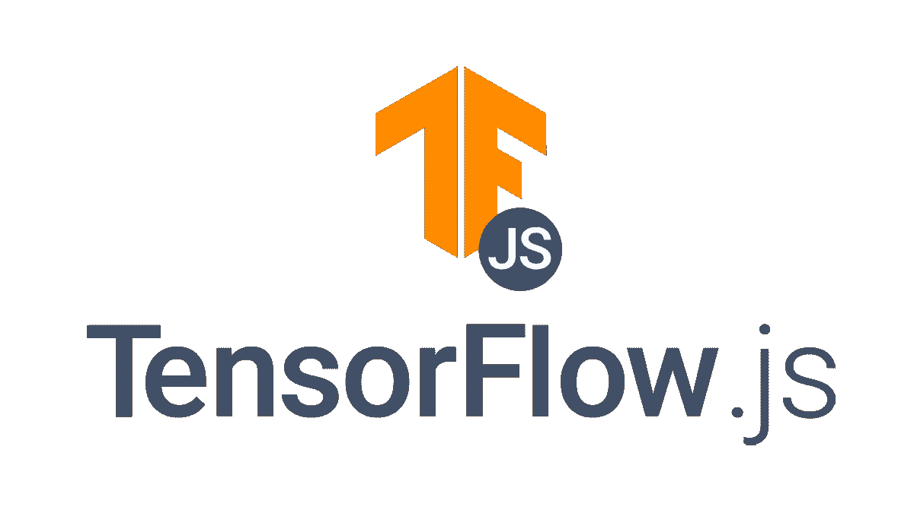
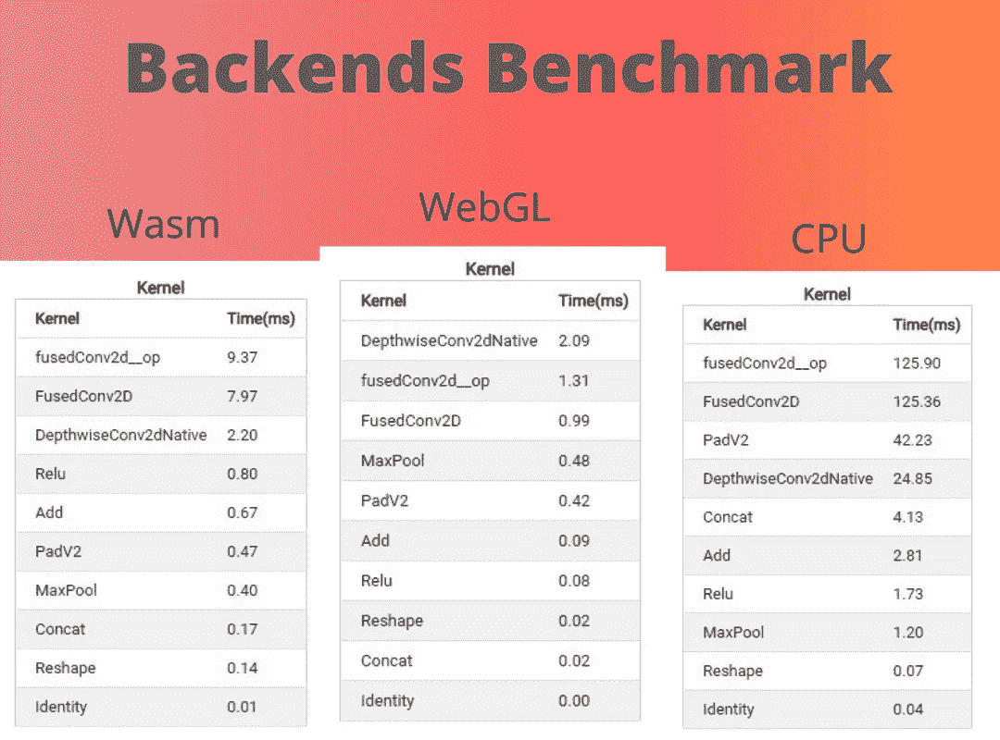

# TensorFlowJS 简介

> 原文：<https://medium.com/analytics-vidhya/introduction-to-tensorflowjs-8cdff6feec52?source=collection_archive---------24----------------------->

大家好，今天我要告诉你们一个几个月前推出的惊人的图书馆，TensorFlow JS 又名 **tfjs**

TensorFlowJS 是一个用 javaScript 进行机器学习开发的库，整个库是按照最常用和干净的方法构建的。开发一个完整的机器学习应用程序，可以处理数据、过程、学习、测试和生产。这意味着开发人员使用和应用机器学习和数据科学方法的过程将变得更加容易。

## ETL 过程

通过 TensorflowJS **数据**功能，我们可以轻松地从网络摄像头和麦克风加载、转换、创建和访问本地数据，这太棒了！我们不需要知道应用 ETL 过程的最佳方式，张量流 js 库为我们做了这些。此外，我们可以直接在 tfjs 中进行操作，这真的很好，因为我们只需要一个库来制作整个解决方案。

## 后端

或者在处理阶段，我们有许多后端可以与 TensorFlowJS 一起使用，两个更常用的后端是 WebGL 和 TensorFlow NodeJS，tfjs 将管理和选择最佳后端来使用。如果有两个后端可用，这意味着我们可以创建更高性能的应用程序。我们可以在下面看到，WebGL 比 wasm 和 CPU 后端更快，因此他们推荐并构建了 TensorFlowJS，以便在后端运行得更好。见下图三个后端之间的基准。

基准测试向我们展示了后端之间的巨大差异，这向我们展示了使用 WebGL 的 TensorFlowJS 的强大功能。

浏览器后端有一些限制，但没关系，tfjs 将为这项工作选择最好的后端。

另一方面，我们有 **NodeJS** 后端，这给我们带来了在后端不使用 python 的情况下做一个非常好的工作的可能性，性能非常好，因为 tjfs 在 NodeJS 中使用 C，这导致了很好的性能，否则，我们需要注意我们的线程，因为 tjfs 将承担处理器的主线程，这可能会导致操作系统的一些不稳定性。 但是要解决这个问题，我们可以使用 worker，tjfs 有很多例子来说明如何实现、执行、清理和预热后端，只要看一看[https://js.tensorflow.org/api/latest/#Backends](https://js.tensorflow.org/api/latest/#Backends)，你就会看到如何使用最佳实践来实现 tjfs worker。

## 生产

TensorFlow 是为生产而构建的，TensorFlowJS 也不例外，整个库的构建都在考虑如何使用机器学习来开发更好的解决方案和功能，因为他们构建了一个转换器，该系统将 Keras 和 TensorFlow 模型转换为 tjfs 模型。我们还可以使用容器来部署应用程序，并且可以使用 unikernerl 和 functions 方法来部署最少的功能。