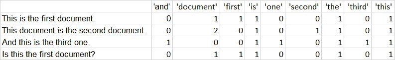
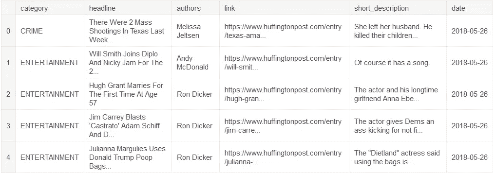
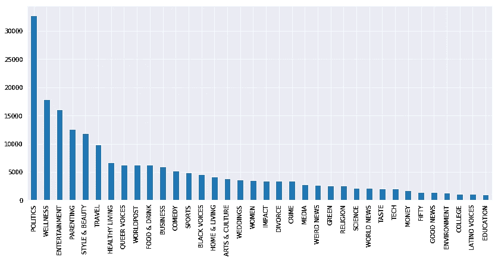
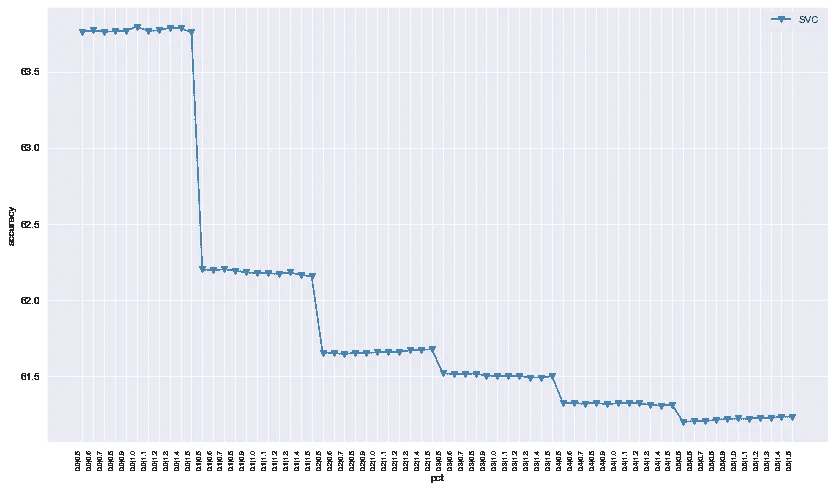
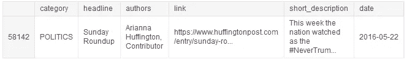
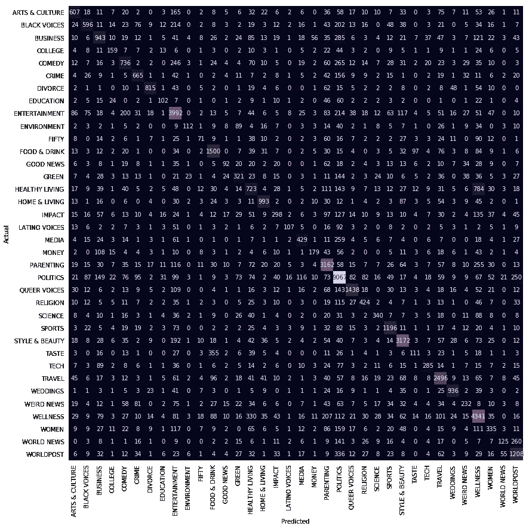

# Python 中的文本分类介绍

> 原文：<https://medium.com/analytics-vidhya/introduction-to-text-classification-in-python-659eccf6b2e?source=collection_archive---------3----------------------->


被困在付费墙后面？点击 [*这里*](/analytics-vidhya/introduction-to-text-classification-in-python-659eccf6b2e?source=friends_link&sk=53c909794e63b2799ebef9c556509b04) *阅读全文与我的朋友链接。*

**自然语言处理(NLP)** 是一个巨大且不断发展的领域，具有无数的应用，如情感分析、命名实体识别(NER)、文本分类等。

本文旨在成为使用 Python 进行基本文本分类的初学者指南。作为先决条件，Python 的基本机器学习经验更好，因为我们不会讨论常用的库、数据结构和其他 Python 功能。

我们将使用来自 Kaggle 的[新闻类别数据集](https://www.kaggle.com/rmisra/news-category-dataset)。使用的内核在这里可以得到[。](https://www.kaggle.com/siddhantsadangi/classification-using-linearsvc-val-acc-64)

让我们直接跳进来吧！

## 首先，导入库…

**自然语言工具包(NLTK)** 是 Python 中 NLP 的主干。它提供了各种文本处理功能和语料库，使任何数据科学家的工作变得容易得多！在这里找到官方文档。

**计数矢量器**将语料库转换成一种叫做**单词袋(BoW)** 的东西。对于机器学习算法来说，这是表示文本数据的最简单方法之一。它基本上将语料库中的所有单词放在一起，并创建一个矩阵，其中包含语料库的每个文档(或者在我们的例子中，每个新闻故事)中每个单词的计数。来自[官方文件](https://scikit-learn.org/stable/modules/generated/sklearn.feature_extraction.text.CountVectorizer.html)的一个例子:

在这里，vectorizer.get_feature_names()为我们提供了单词包，即语料库中所有不同的单词。该矩阵可以被形象化为:



计数矢量器

它被称为“单词包”，因为它将所有的单词放在一起，而不考虑它们在文档中的位置。在这个方法中，“这是第一个文档”和“第一个是这个文档”将具有相同的表示。有一些方法会考虑单词的位置，但我们不会在本文中讨论这些方法。

CountVectorizer()函数中的一个重要参数是“ngram_range”。“n 元语法”最简单的定义是“n”个单词的序列。例如，双字母组合意味着两个单词的序列。ngram_range 指定了将从语料库中提取的这个范围的边界。例如，对于(1，2)的 ngram_range，我们将提取所有的 uni 和 bi-gram。

如果我们使用(1，2):
'This '，' is '，' the '，' first '，' document '，' This is '，' is the '，' first '，' first document '，' This is '，' is the '，' first '，' first document '的 ngram 范围，这就是句子“这是第一个文档”的标记化方式。

使用较大范围的优势在于，它们有助于模型从文本序列中学习，从而提高模型的准确性。如果只使用单字，这些信息就会丢失。代价是增加了特征空间，从而增加了所需的时间和计算能力。请注意，句子“这是第一个文档”将减少到只有 5 个单字元，但 5+4=9 个双字元，5+4+3=12 个三字元。很少使用大于 3 的 ngram_range。

## 然后，我们将数据集加载到熊猫数据框架中:

**一些探索性的数据分析(EDA)对数据:**

```
df.head()
```



新闻类别数据集

“类别”列将是我们的目标列，从现在起，我们将只使用“标题”和“简短描述”列作为我们的功能

```
df.info()<class 'pandas.core.frame.DataFrame'>
RangeIndex: 200853 entries, 0 to 200852
Data columns (total 6 columns):
category             200853 non-null object
headline             200853 non-null object
authors              200853 non-null object
link                 200853 non-null object
short_description    200853 non-null object
date                 200853 non-null datetime64[ns]
dtypes: datetime64[ns](1), object(5)
memory usage: 9.2+ MB
```

这个数据集中没有空值，这很好。然而，对于真实世界的数据集来说，这种情况并不常见，空值需要作为预处理的一部分进行处理，要么删除空行，要么用空行(“”)替换它们。

现在让我们看看数据集中不同的类别…

```
labels = list(df.category.unique())
labels.sort()
print(labels)['ARTS', 'ARTS & CULTURE', 'BLACK VOICES', 'BUSINESS', 'COLLEGE', 'COMEDY', 'CRIME', 'CULTURE & ARTS', 'DIVORCE', 'EDUCATION', 'ENTERTAINMENT', 'ENVIRONMENT', 'FIFTY', 'FOOD & DRINK', 'GOOD NEWS', 'GREEN', 'HEALTHY LIVING', 'HOME & LIVING', 'IMPACT', 'LATINO VOICES', 'MEDIA', 'MONEY', 'PARENTING', 'PARENTS', 'POLITICS', 'QUEER VOICES', 'RELIGION', 'SCIENCE', 'SPORTS', 'STYLE', 'STYLE & BEAUTY', 'TASTE', 'TECH', 'THE WORLDPOST', 'TRAVEL', 'WEDDINGS', 'WEIRD NEWS', 'WELLNESS', 'WOMEN', 'WORLD NEWS', 'WORLDPOST']
```

我们看到有几个类别可以合并在一起，如“艺术”、“艺术与文化”和“文化与艺术”。让我们这样做:



这个看起来更好。我们已经将标签的数量从 41 个减少到 36 个。此外，我们看到数据集非常不平衡。我们有大约 35000 条政治新闻，但是不到 1000 条教育新闻(基本上也概括了当前的事态)。我们通常希望一个平衡的数据集来训练我们的模型，但是现实世界中的大多数数据集几乎永远不会平衡。有一些扩充和采样技术可以用来平衡数据集，但是这些不在本文的讨论范围之内。

**现在到了预处理，到目前为止最重要的一步！**

这是我使用的标准文本预处理用户定义函数(UDF)。让我们详细讨论一下。

```
lower = col.apply(str.lower)
```

这会将语料库转换为小写，因为否则 CountVectorizer 会将“hello”、“hElLo”和“HELLO”视为不同的单词，这不是一个好主意。

这将从语料库中删除 HTML 标签。如果语料库是从网页上搜集的，这是非常重要的。BeautifulSoup 库提供了一种更精确的方法。你可以点击查看[。](https://www.crummy.com/software/BeautifulSoup/bs4/doc/)

**词干化**‘是产生词根/基本词的形态变体的过程’。词干算法将单词“chocolate”、“chocolatey”、“choco”简化为词根，“chocolate”和“retrieve”，“retrieved”，“retrieved”简化为词干“retrieve”。词干法的工作原理是去掉一个单词的尾随字符，以“尝试”到达词根。因此，词根可能不是字典中的单词。词干提取的主要优点是减少了特征空间，即减少了语料库中用于训练模型的不同单词的数量。到达词根的另一种方法是**词汇化**。与词干化不同，词汇化遵循一种基于词典的方法，因此单词通常被简化为它们实际的词典词根。这样做的代价是处理速度。点击了解更多关于词干化和词汇化的信息[。](https://www.datacamp.com/community/tutorials/stemming-lemmatization-python)

**停用词**是常用词，通常不会给数据增加太多意义。从语料库中移除停用词，因为这将显著减小特征空间的大小。但是，停用词不能盲目使用。NLTK 停用词语料库中的一些词可能在数据集中有意义。例如，您不希望从正在进行情感分析的语料库中删除单词“not”(这是一个 NLTK 停用词)。这样做将导致类似“这是一部好电影”和“这不是一部好电影”的句子意思相同。

在我们的例子中，删除停用词提高了模型性能，所以我们将继续这样做。

```
rem_lngth1 = rem_num.apply(lambda x: re.sub(r'[^\w\s]',' ',x))
```

这里我们删除了所有长度为 1 的单词，因为它们通常不会给语料库增加意义。像“a”这样的词将被删除。你可能会问，还有哪些单词的长度是 1？还记得之前我们用空格代替标点符号吗？这将像“约翰·多伊的内核”一样转化为“约翰·多伊的内核”。这里的 s 没有增加任何意义。现在，在我们删除长度为 1 的单词后，我们将剩下“John Doe kernel”。所以除非所有权在你的内核中很重要，否则这是一件好事。

我们在 python re 模块中使用**正则表达式(regex)** 来实现这一点。正则表达式在 NLP 中广泛用于各种任务，如信息提取(电子邮件地址、电话号码、邮政编码等。)，数据清理等。关于正则表达式的官方 python 文档是让你熟悉正则表达式的好地方。

这可能有点难以理解。让我们更深入地了解一下这个问题。

h_pct 是我们想要移除的语料库中最频繁出现的单词的百分比。l_pct 是我们要删除的最不常用单词的百分比。

```
counts = pd.Series(''.join(df.short_description).split()).value_counts()
countsthe                166126
to                 111620
of                  95175
a                   94604
and                 89678
                    ...  
catch!"                 1
big-day                 1
incarcerates            1
323-square-foot         1
co-trustee,             1
Length: 208227, dtype: int64
```

这些是所有单词在我们的数据集中出现的次数。我们的数据集有 208227 个不同的单词，因此 h_pct 为 1.0 将删除语料库中最常用的前 1%的单词。

```
high_freq = counts[:int(pd.Series(''.join(df.short_description).split()).count()*1/100)]
high_freqthe            166126
to             111620
of              95175
a               94604
and             89678
                ...  
butternut           5
NGO                 5
Mary,               5
songwriter,         5
distracted,         5
Length: 39624, dtype: int64
```

这些是将从数据集中删除的最常见的单词。

这样做背后的直觉是，由于这些单词如此常见，我们希望它们分布在多个不相关的文档中(或者在我们的例子中是新闻)，因此，它们在对文本进行分类时没有多大用处。

```
low_freq = counts[:-int(pd.Series(''.join(df.short_description).split()).count()*1/100):-1]
low_freqco-trustee,        1
323-square-foot    1
incarcerates       1
big-day            1
catch!"            1
                  ..
Brie.              1
non-plant          1
fetus?             1
Techtopus”         1
Look).             1
Length: 39623, dtype: int64
```

这些是最不常用的前 1%的单词。所有这些单词在词汇表中只出现一次，因此没有多大意义，可以删除。

和停用词一样，没有固定数量的词可以被删除。这取决于你的语料库，你应该尝试最适合你的不同值。这正是我接下来要做的。

**检查最佳 h_pct 和 l_pct 组合**

这就找到了 h_pct 和 l_pct 的最佳值。我们从 0 到 10 的整数值开始，根据结果，可以将百分比进一步调整到 0.5%的步长。请记住，这是非常耗时的。该模型将被训练 i*j 次，其中 I 是 h_pct 值的数量，j 是 l_pct 值的数量。所以对于 0 到 10(包括 0 和 10)之间的 h_pct 和 l_pct 值，我的模型总共被训练了 121 次。

对我来说，第一次迭代分别为 h_pct 和 l_pct 返回 0.0 和 1.0 的值，下面是运行 h_pct 的 0.0 到 0.5%和 l_pct 的 0.5 到 1.5%之间的值时的结果:

```
SVC max: 63.79560061555173%, pct:0.0|1.0
```



我们看到 h_pct 和 l_pct 的最佳值仍然分别是 0.0 和 1.0。我们将继续使用这些值。

```
df.loc[df.short_description.str.len()==df.short_description.str.len().max()]
```



```
df.loc[58142]['short_description']'This week the nation watched as the #NeverTrump movement folded faster than one of the presumptive nominee\'s beachfront developments. As many tried to explain away Trump\'s reckless, racist extremism, a few put principle over party. The wife of former Republican Senator Bob Bennett, who died on May 4, revealed that her husband spent his dying hours reaching out to Muslims. "He would go to people with the hijab [on] and tell them he was glad they were in America," she told the Daily Beast. "He wanted to apologize on behalf of the Republican Party." In the U.K., Prime Minister David Cameron called Trump\'s proposal to ban Muslims from entering the U.S., "divisive, stupid and wrong." Trump\'s reply was that he didn\'t think he and Cameron would "have a very good relationship." The press is also doing its part to whitewash extremism. The New York Times called Trump\'s racism "a reductive approach to ethnicity," and said Trump\'s attitude toward women is "complex" and "defies simple categorization," as if sexism is suddenly as complicated as string theory. Not everybody\'s going along. Bob Garfield, co-host of "On the Media," warned the press of the danger of normalizing Trump. "Every interview with Donald Trump, every single one should hold him accountable for bigotry, incitement, juvenile conduct and blithe contempt for the Constitution," he said. "The voters will do what the voters will do, but it must not be, cannot be because the press did not do enough."'
```

这是我们数据集中最长的故事。我们将以此为参考，看看我们的预处理函数是如何工作的。

**模型构建**

这个函数将数据帧、h_pct 和 l_pct 的值、模型和详细度标志作为输入，并返回预测、模型精度和训练模型。

让我们分析一下组件:

```
df['short_description_processed'] = preprocessing(df['short_description'],h_pct,l_pct)
df['concatenated'] = df['headline'] + '\n' + df['short_description_processed']
df['concat_processed'] = preprocessing(df['concatenated'],0,0)
```

首先，我们使用 h_pct 和 l_pct 的 out 值对“short_description”列运行预处理函数，并将结果存储在“short_description_processed”中。然后，我们将“标题”添加到该列，并将结果存储在“连接”中。
最后，我们对“concatenated”再次运行预处理函数，但这次不删除任何频繁和不频繁的单词，并将结果存储在“concat_processed”中。不从这个集合中删除单词是一种增加出现在标题中的单词比出现在故事中的单词多的方法。

```
X = df['concat_processed']
y = df['category']
X_train, X_test, y_train, y_test = train_test_split(X, y, test_size=0.33, random_state=42, stratify=y) 

bow_xtrain = bow.fit_transform(X_train)
bow_xtest = bow.transform(X_test)
```

我们使用' concat_processed '作为我们的变量列，使用' category '作为我们的目标。

然后，我们使用 CountVectorizer 的 bow 对象分别为训练和测试语料生成词袋。根据经验，CountVectorizer 适用于训练集并在其上进行转换，但仅在测试集上进行转换。这样模型就不会从测试集中学到任何东西。

```
model.fit(bow_xtrain,y_train)
preds = model.predict(bow_xtest)
```

在训练弓上训练模型，并为测试弓生成预测。

**拼凑**

在数据帧上运行 prep_fit_pred 函数，将 0 和 1 作为 h_pct 和 l_pct(如前所述)，并使用 [LinearSVC()](https://scikit-learn.org/stable/modules/generated/sklearn.svm.LinearSVC.html) 模块，将 verbose 设为 True。

```
preds_abc, acc_abc, abc = prep_fit_pred(df, 0, 1, LinearSVC(), verbose=True)Number of words in corpus before processing: 3985816
Number of words in corpus after processing: 2192635 (55.0%)
Number of words in final corpus: 3498319 (88.0%)Raw story:
This week the nation watched as the #NeverTrump movement folded faster than one of the presumptive nominee's beachfront developments. As many tried to explain away Trump's reckless, racist extremism, a few put principle over party. The wife of former Republican Senator Bob Bennett, who died on May 4, revealed that her husband spent his dying hours reaching out to Muslims. "He would go to people with the hijab [on] and tell them he was glad they were in America," she told the Daily Beast. "He wanted to apologize on behalf of the Republican Party." In the U.K., Prime Minister David Cameron called Trump's proposal to ban Muslims from entering the U.S., "divisive, stupid and wrong." Trump's reply was that he didn't think he and Cameron would "have a very good relationship." The press is also doing its part to whitewash extremism. The New York Times called Trump's racism "a reductive approach to ethnicity," and said Trump's attitude toward women is "complex" and "defies simple categorization," as if sexism is suddenly as complicated as string theory. Not everybody's going along. Bob Garfield, co-host of "On the Media," warned the press of the danger of normalizing Trump. "Every interview with Donald Trump, every single one should hold him accountable for bigotry, incitement, juvenile conduct and blithe contempt for the Constitution," he said. "The voters will do what the voters will do, but it must not be, cannot be because the press did not do enough."Processed story:
week nation watch nevertrump movement fold faster one presumpt nomine beachfront developments mani tri explain away trump reckless racist extremism put principl party wife former republican senat bob bennett die may reveal husband spent die hour reach muslims would go peopl hijab tell glad america told daili beast want apolog behalf republican party u k prime minist david cameron call trump propos ban muslim enter u divisive stupid wrong trump repli think cameron would veri good relationship press also part whitewash extremism new york time call trump racism reduct approach ethnicity said trump attitud toward women complex defi simpl categorization sexism sudden complic string theory everybodi go along bob garfield co host media warn press danger normal trump everi interview donald trump everi singl one hold account bigotry incitement juvenil conduct blith contempt constitution said voter voter must cannot becaus press enoughAdding additional columns to story:
Sunday Roundup
week nation watch nevertrump movement fold faster one presumpt nomine beachfront developments mani tri explain away trump reckless racist extremism put principl party wife former republican senat bob bennett die may reveal husband spent die hour reach muslims would go peopl hijab tell glad america told daili beast want apolog behalf republican party u k prime minist david cameron call trump propos ban muslim enter u divisive stupid wrong trump repli think cameron would veri good relationship press also part whitewash extremism new york time call trump racism reduct approach ethnicity said trump attitud toward women complex defi simpl categorization sexism sudden complic string theory everybodi go along bob garfield co host media warn press danger normal trump everi interview donald trump everi singl one hold account bigotry incitement juvenil conduct blith contempt constitution said voter voter must cannot becaus press enoughFinal story:
sunday roundup week nation watch nevertrump movement fold faster one presumpt nomin beachfront develop mani tri explain away trump reckless racist extrem put principl parti wife former republican senat bob bennett die may reveal husband spent die hour reach muslim would go peopl hijab tell glad america told daili beast want apolog behalf republican parti u k prime minist david cameron call trump propo ban muslim enter u divis stupid wrong trump repli think cameron would veri good relationship press also part whitewash extrem new york time call trump racism reduct approach ethnic said trump attitud toward women complex defi simpl categor sexism sudden complic string theori everybodi go along bob garfield co host media warn press danger normal trump everi interview donald trump everi singl one hold account bigotri incit juvenil conduct blith contempt constitut said voter voter must cannot becaus press enoughPredicted class: POLITICS
Actual class: POLITICS
```



混淆矩阵

```
precision    recall  f1-score   support

ARTS & CULTURE       0.56      0.47      0.51      1280
  BLACK VOICES       0.59      0.40      0.48      1494
      BUSINESS       0.51      0.48      0.49      1959
       COLLEGE       0.48      0.42      0.45       377
        COMEDY       0.48      0.43      0.45      1708
         CRIME       0.57      0.59      0.58      1124
       DIVORCE       0.85      0.72      0.78      1131
     EDUCATION       0.43      0.31      0.36       331
 ENTERTAINMENT       0.64      0.75      0.69      5299
   ENVIRONMENT       0.67      0.26      0.37       437
         FIFTY       0.37      0.15      0.22       462
  FOOD & DRINK       0.64      0.73      0.68      2055
     GOOD NEWS       0.40      0.20      0.27       461
         GREEN       0.41      0.37      0.39       865
HEALTHY LIVING       0.35      0.33      0.34      2209
 HOME & LIVING       0.75      0.72      0.73      1384
        IMPACT       0.44      0.26      0.33      1141
 LATINO VOICES       0.66      0.29      0.40       373
         MEDIA       0.55      0.46      0.50       929
         MONEY       0.56      0.32      0.41       563
     PARENTING       0.66      0.76      0.71      4169
      POLITICS       0.71      0.84      0.77     10804
  QUEER VOICES       0.79      0.69      0.74      2084
      RELIGION       0.55      0.50      0.53       843
       SCIENCE       0.59      0.47      0.53       719
        SPORTS       0.68      0.74      0.71      1612
STYLE & BEAUTY       0.78      0.81      0.80      3928
         TASTE       0.37      0.16      0.22       692
          TECH       0.58      0.41      0.48       687
        TRAVEL       0.69      0.76      0.73      3263
      WEDDINGS       0.80      0.78      0.79      1205
    WEIRD NEWS       0.41      0.26      0.32       881
      WELLNESS       0.63      0.74      0.68      5883
         WOMEN       0.41      0.29      0.34      1152
    WORLD NEWS       0.51      0.17      0.26       718
     WORLDPOST       0.56      0.59      0.57      2060

      accuracy                           0.64     66282
     macro avg       0.57      0.49      0.52     66282
  weighted avg       0.63      0.64      0.62     66282

Accuracy: 63.83%
```

“short_description”列有 3985816 个单词。在应用预处理函数后，这个值减少到 2192635(减少了 45%)。添加标题并再次运行预处理后，最终的语料库有 3498319 个单词。

我们可以看到最长的故事的原始版本和最终版本。你可以看到最终的版本全部是小写的，没有标点符号，符号和数字，并且由于删除了单词而变得相当短。

分类报告显示，F1 得分最低的是“五十”和“品味”,这两个品牌的新闻故事数量都很少，而最高的是“风格和美感”,这两个品牌的新闻故事数量很多。

平均准确率为 63.83%。虽然这看起来并不吸引人，但对于 36 个标签来说，随机猜测的准确率只有 2.78%。所以我们的模型比随机猜测要好 23 倍。这样听起来好多了！😄

这就到此为止(短？)引言。希望你现在能够开始你自己的文本分类项目。

您的下一步应该是尝试不同的模型(只需将不同的模型传递给 prep_fit_pred 函数就可以轻松完成)，探索和试验预处理步骤，特征工程(故事的长度和它的标签之间有什么关系吗？)，并更详细地解释为什么大约 40%的故事被错误分类(提示:20%的教育故事被归类为政治)。

一旦你对基础知识有了信心，你可能会想要遵循一些顶级 Kagglers 在他们的 NLP 提交中使用的一些技术。Neptune . ai 的好朋友们已经帮你搞定了。

[](https://neptune.ai/blog/text-classification-tips-and-tricks-kaggle-competitions) [## 文本分类:来自 5 场 Kaggle 比赛的所有提示和技巧

### 在这篇文章中，我将讨论一些伟大的提示和技巧，以提高您的文本分类的性能…

海王星. ai](https://neptune.ai/blog/text-classification-tips-and-tricks-kaggle-competitions) 

*正如开头已经提到的，Kaggle 上既有* [*数据集*](https://www.kaggle.com/rmisra/news-category-dataset) *又有* [*代码*](https://www.kaggle.com/siddhantsadangi/classification-using-linearsvc-val-acc-64) *。如果你想在本地或 Google Colab 上尝试一下，也可以在 GitHub*[*上找到它们。*](https://github.com/SiddhantSadangi/TextClassification)

谢谢你坚持到现在。任何反馈都将非常受欢迎！

*你可以通过*[*siddhant.sadangi@gmail.com、*](mailto:siddhant.sadangi@gmail.com) *联系我和/或通过*[*LinkedIn*](https://www.linkedin.com/in/siddhantsadangi)*联系我。*

Medium 仍然不支持向印度以外的作者支付费用。如果你喜欢我的内容，你可以给我买杯咖啡:)

[](https://www.buymeacoffee.com/siddhantsadangi) [## Siddhant Sadangi 正在 Streamlit 上创建 python 网络应用程序

### 嘿👋我刚刚在这里创建了一个页面。你现在可以给我买杯咖啡了！

www.buymeacoffee.com](https://www.buymeacoffee.com/siddhantsadangi)