# 机器学习的基本概念介绍

> 原文：<https://medium.com/analytics-vidhya/introduction-to-the-basic-concepts-of-machine-learning-30c983523b5f?source=collection_archive---------18----------------------->

机器学习是一个研究领域，它赋予计算机在没有明确编程的情况下学习的能力。我们需要机器学习是因为:

1.  数据生成增加。
2.  从数据中发现趋势和数据。
3.  解决复杂问题。
4.  提高决策学习。

有几种不同类型的学习算法。

主要的两种类型是我们所说的监督学习和非监督学习。其他:强化学习，推荐系统。

**监督学习算法**

术语监督学习指的是这样一个事实，即我们给算法一个数据集，其中给出了所谓的“正确答案”。也就是说，我们给出过去的数据，让机器学习预测的模式。例如，我们希望基于同类房屋的过去房屋数据集来预测房屋的价格。这里价格是我们要预测的连续值。这叫回归问题。在监督学习中，我们得到一个数据集，并且已经知道我们的正确输出应该是什么样子，知道输入和输出之间有关系。

监督学习问题分为“回归”和“分类”问题。在回归问题中，我们试图预测连续输出中的结果，这意味着我们试图将输入变量映射到某个连续函数。在分类问题中，我们试图预测离散输出的结果。换句话说，我们试图将输入变量映射到离散的类别中。**举例:**

(a)回归——给定一个人的照片，我们必须根据给定的照片预测他们的年龄

(b)分类——对于患有肿瘤的患者，我们必须预测肿瘤是恶性的还是良性的。

**无监督学习**

无监督学习允许我们在很少或根本不知道我们的结果应该是什么样的情况下处理问题。我们可以从数据中推导出结构，而不一定知道变量的影响。我们可以通过基于数据中变量之间的关系对数据进行聚类来得到这种结构。

**强化学习**

强化学习是机器学习的一部分，其中一个代理被放置在环境中，他通过执行某些动作并观察从这些动作中获得的回报来学习在该环境中的行为。

监督学习是最成熟的，研究最多的，也是大多数机器学习算法使用的学习类型。有监督的学习比没有监督的学习容易得多。

# 模型表示

为了便于将来使用，我们将使用 x^{(i)} *x* ( *i* )来表示“输入”变量(在本例中为生活区)，也称为输入特征，使用 y^{(i)} *y* ( *i* )来表示我们试图预测的“输出”或目标变量(价格)。一对(x^{(i)}，y^{(i)} )( *x* ( *i* )， *y* ( *i* ))被称为训练样本，我们将用来学习的数据集——y^{(i)} {(x^{(i)}的 m 个训练样本列表)；i = 1，.。。，m}( *x* ( *i* )，*y*(*I*))； *i* =1，…， *m* —称为训练集。请注意，符号中的上标“(I)”只是训练集的一个索引，与取幂无关。我们还将使用 X 来表示输入值的空间，使用 Y 来表示输出值的空间。在这个例子中，X = Y = ℝ.

为了稍微更正式地描述监督学习问题，我们的目标是，给定一个训练集，学习一个函数 h : X → Y，使得 h(x)是 Y 的相应值的“良好”预测器。出于历史原因，这个函数 h 被称为假设。形象地看，这个过程是这样的:

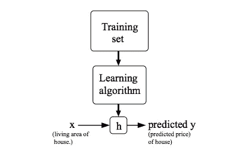

当我们试图预测的目标变量是连续的，比如在我们的住房例子中，我们称学习问题为回归问题。当 y 只能取少量的离散值时(例如，如果给定居住面积，我们想预测一个住所是房子还是公寓)，我们称之为分类问题。

# 价值函数

我们可以通过使用一个**成本函数**来衡量我们假设函数的准确性。这是假设的所有结果与 x 的输入和 y 的实际输出的平均差(实际上是一个更好的平均版本)。

我们使用称为梯度下降算法来最小化成本函数。事实证明，梯度下降是一种更通用的算法，不仅用于线性回归。它实际上在机器学习中被广泛使用。

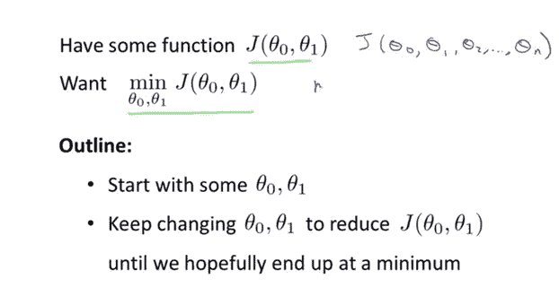

假设我们基于假设函数的域\theta_0 *θ* 0 和\theta_1 *θ* 1 来绘制假设函数的图形(实际上我们是将成本函数绘制成参数估计的函数)。我们并没有画出 x 和 y 本身，而是画出我们假设函数的参数范围，以及选择一组特定参数所产生的成本。

我们把\theta_0 *θ* 0 放在 x 轴上，把\theta_1 *θ* 1 放在 y 轴上，代价函数放在垂直的 z 轴上。我们图表上的点将是使用我们的假设和那些特定θ参数的成本函数的结果。下图描述了这样的设置。

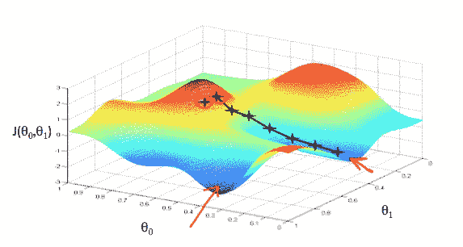

当我们的成本函数位于图表的最底部时，也就是当它的值最小时，我们就知道我们成功了。红色箭头显示图表中的最小点。

我们的方法是对成本函数求导(函数的切线)。切线的斜率是该点的导数，它会给我们一个前进的方向。我们沿着下降速度最快的方向逐步降低成本函数。每一步的大小由参数α决定，该参数称为学习速率。

例如，上图中每个“星”之间的距离代表一个由我们的参数α决定的步长。较小的α会导致较小的步长，而较大的α会导致较大的步长。迈步的方向由 J(\theta_0，\theta_1) *J* ( *θ* 0， *θ* 1)的偏导数决定。根据一个人在图上的起点，他可能会在不同的点结束。上图向我们展示了两个不同的起点，最终到达两个不同的地方。

梯度下降算法是:

重复直到收敛:

\ theta _ j:= \ theta _ j—\ alpha \ frac { \ partial } { \ partial \ theta _ j } j(\ theta _ 0，\ theta _ 1)*θj*:=*θj*—*α*∂*θj*∂*j*(*θ*0， *θ* 1)

在哪里

j=0，1 表示特征索引号。

在每次迭代 j 时，应该同时更新参数\theta_1、\theta_2、…、\theta_n *θ* 1、 *θ* 2、…、 *θn* 。在计算 j^{(th)}*j*(*th*)迭代中的另一个参数之前更新一个特定参数会导致错误的实现。

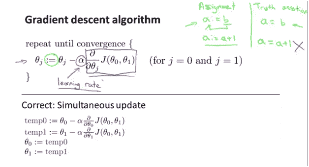

# 学习率

达到最小值或底部的步长称为**学习速率**。我们可以用更大的步长/更高的学习率覆盖更多的区域，但是有超过最小值的风险。另一方面，小步/更小的学习率会消耗大量时间到达最低点。另外，我们应该调整我们的参数\alpha *α* 以确保梯度下降算法在合理的时间内收敛。未能收敛或获得最小值的时间太长意味着我们的步长是错误的。

**将梯度下降算法应用于线性回归模型(只有一个目标变量)**

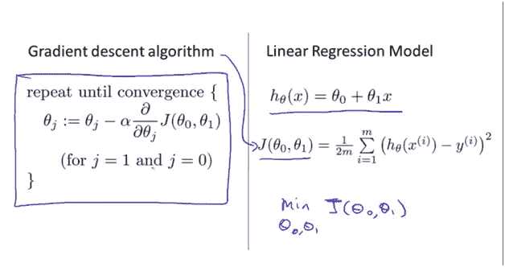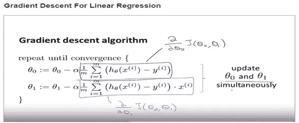

让我们看看梯度下降是如何工作的。的成本函数

线性回归总是像这样的弓形函数。用专业术语来说，这叫做凸函数。

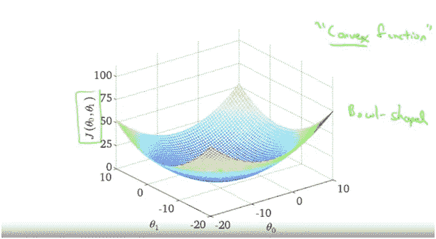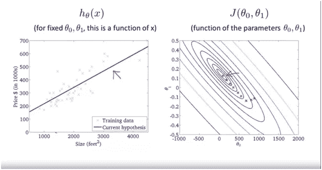

在θ0 和θ1 的不同值下，我们得到 h(x)函数图中的直线。这条线代表最小误差线。

**机器学习—多元线性回归**

多变量梯度下降

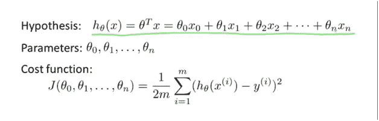

这是梯度下降的样子。我们要重复更新每个参数θj，根据θj 减去α乘以这个导数项。我们再一次把它写成θ的 J，所以θJ 更新为θJ 减去学习率α乘以导数，一个偏导数

成本函数关于参数θj 的导数

## 实践中的梯度下降 I —特征缩放

如果将梯度下降应用于未缩放的要素，梯度可能会花费很长时间，并且可能会来回振荡，并需要很长时间才能最终找到全局最小值，如下所示。

更一般地说，当我们执行特征缩放时，我们通常想要做的是将每个特征放入大约-1 到+1 的范围内，具体地说，你的特征 x0 总是等于 1。所以，这已经在这个范围内了，但是你可能会用不同的数字来划分其他的特性，从而得到这个范围。数字-1 和+1 并不太重要。所以，如果你有一个特征，x1，在 0 和 3 之间，这不是问题。如果你最终有一个不同的特征，风在-2 和+ 0.5 之间，这足够接近-1 和+1，你知道，这很好，这很好。

只有当你有一个不同的特征，比如介于-100 tp +100 之间的 X 3，那么，这是一个非常不同于-1 和+1 的值。因此，这可能是一个不太熟练的特征，同样，如果您的特征取值范围非常非常小，那么如果 X 4 取值范围在-0.0001 和正 0.0001 之间，那么它取值范围也比-1 到+1 的范围小得多。同样，我认为这个特性的扩展性很差。

上面解释的东西显示在下面的幻灯片中

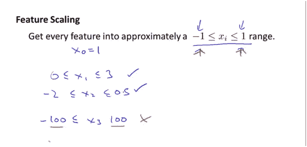

有两种技术可以帮助做到这一点，即**特征缩放**和**均值归一化**。特征缩放包括将输入值除以输入变量的范围(即最大值减去最小值)，从而得到一个仅为 1 的新范围。均值归一化包括从某个输入变量的值中减去该输入变量的平均值，从而得出该输入变量的新平均值正好为零。要实施这两种技术，请按以下公式所示调整输入值:

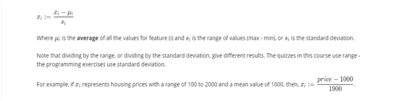

# 正态方程

梯度下降给出了最小化 j 的一种方法，让我们讨论第二种方法，这一次明确地执行最小化，而不求助于迭代算法。在“正规方程”方法中，我们将通过显式计算 J 相对于θj 的导数，并将它们设置为零，从而使 J 最小。这使得我们无需迭代就能找到最佳θ。法线方程公式如下所示:

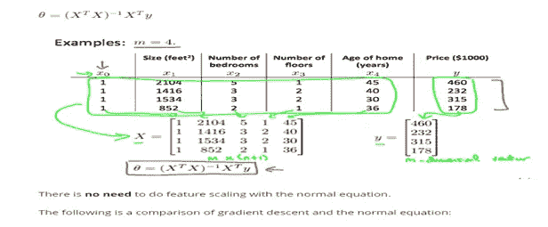

下面是梯度下降和正常方程的比较:

**梯度下降:**

需要选择α

需要多次迭代

当 n 较大时工作良好

**正规方程**

没必要选α

不需要迭代

如果 n 很大，速度很慢

# 欠装配:

当模型具有较少的特征，因此不能很好地从数据中学习时。这个模型有很高的偏差。

# 过度装配:

当模型具有复杂的函数，因此能够很好地拟合数据，但不能进行归纳以预测新数据时。这个模型有很高的方差。

有三个主要选项来解决过度拟合问题:

1.  **减少特征数量:**手动选择保留哪些特征。这样做，我们可能会错过一些重要的信息，如果我们扔掉一些功能。
2.  **正则化:**保留所有的特征，但减少权重 w 的大小。当我们有许多稍微有用的特征时，正则化工作得很好。
3.  **提前停止:**当我们迭代地训练一个学习算法时，比如使用梯度下降，我们可以衡量模型的每次迭代执行得有多好。达到一定的迭代次数后，每次迭代都会改进模型。然而，在这一点之后，模型的概括能力会减弱，因为它开始过度拟合训练数据。

仅此而已。

感谢阅读:)