# 梯度推进算法简介

> 原文：<https://medium.com/analytics-vidhya/introduction-to-the-gradient-boosting-algorithm-c25c653f826b?source=collection_archive---------0----------------------->

图片:Edusky

Boosting 算法是过去二十年中引入的最强大的学习思想之一。梯度推进是一种用于分类和回归问题的监督机器学习算法。它是一种集成技术，使用多个弱学习器来产生用于回归和分类的强模型。

# **直觉**

梯度推进依赖于直觉，即最佳可能的下一个模型，当与先前的模型结合时，最小化整体预测误差。关键的想法是从先前的模型到下一个模型设定目标结果，以最小化误差。这是另一个 boosting 算法(其他几个是 Adaboost，XGBoost 等。).

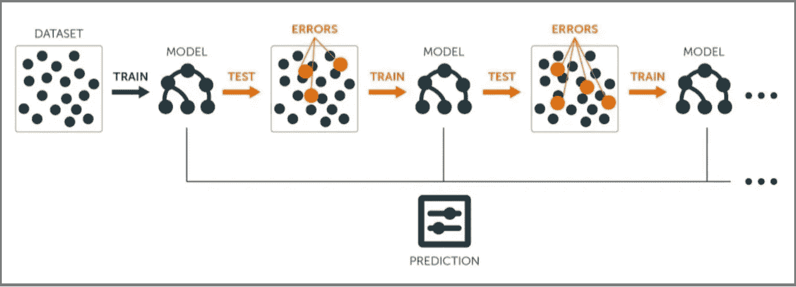

**梯度推进的输入要求:**

1.  要优化的损失函数。
2.  弱学习者做预测(一般是决策树)。
3.  添加弱学习者以最小化损失函数的加法模型。

## 1.损失函数

损失函数基本上说明了我的算法是如何模拟数据集的。简单来说，就是实际值和预测值之间的差异。

**回归损失函数:**

1.  L1 损失或平均绝对误差(MAE)
2.  L2 损耗或均方误差(MSE)
3.  二次损失

**二元分类损失函数:**

1.  二元交叉熵损失
2.  铰链损耗

添加树时，使用梯度下降过程来最小化损失。

## 2.弱学习者

弱学习器是顺序使用的模型，以减少从先前模型产生的误差，并最终返回强模型。

决策树在梯度提升算法中被用作弱学习器。

## 3.加性模型

在梯度推进中，一次添加一个决策树(按顺序)，模型中现有的树不变。

# 逐步了解梯度增强:

这是我们的数据集。这里年龄，Sft。，地点是自变量，价格是因变量或目标变量。

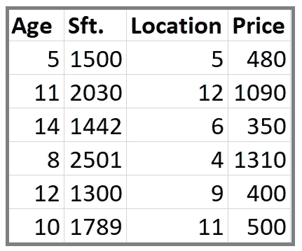

**步骤 1** :计算目标变量的平均值/均值。

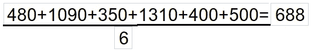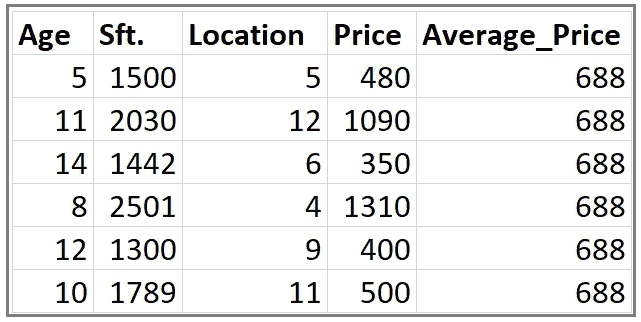

**步骤 2** :计算每个样本的残差。

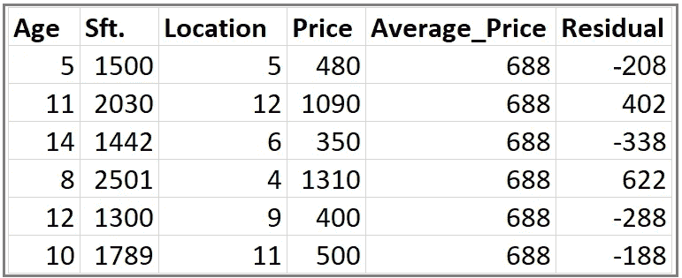

**第三步:**构建决策树。我们构建一个树，目标是预测残差。

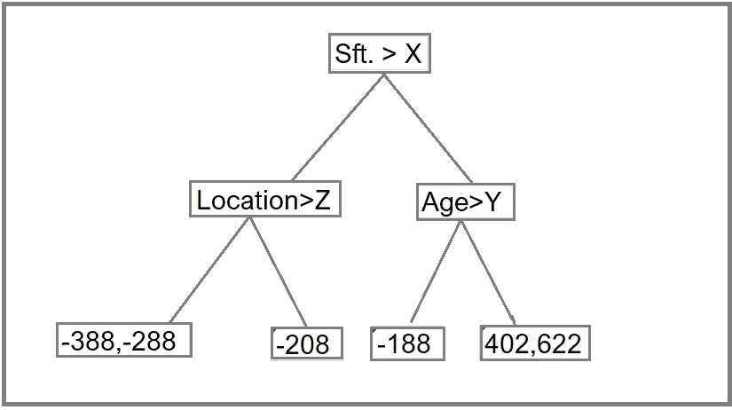

如果有比叶节点更多的残差(这里是 6 个残差)，一些残差将在同一个叶内结束。当这种情况发生时，我们计算它们的平均值，并将其放入叶子中。

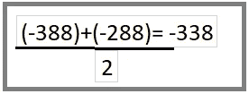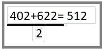

在这棵树变成这样之后。

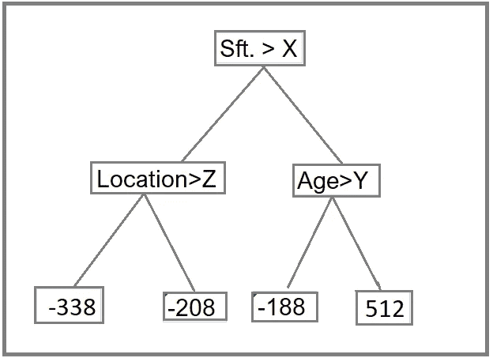

**步骤 4** :使用集合中的所有树预测目标标签。

每个样本通过新形成的树的决策节点，直到它到达给定的线索。所述叶子中的残差用于预测房价。

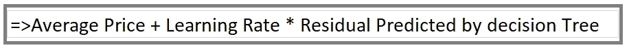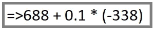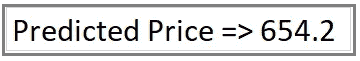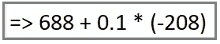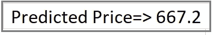

**上面对第 2 步**中的残值(-338)和(-208)的计算

同样，我们将计算其他值的**预测价格**

**注意:**我们最初将 0.1 作为学习率。

**第五步**:计算新的残差

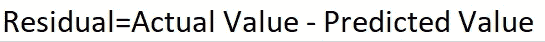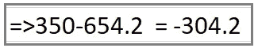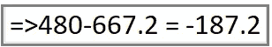

**价格分别为 350 和 480 时。**

对于我们的单叶平均值 **(688)** ，我们得到下面的残差列。

通过我们的决策树，我们得到了下面的新残差。

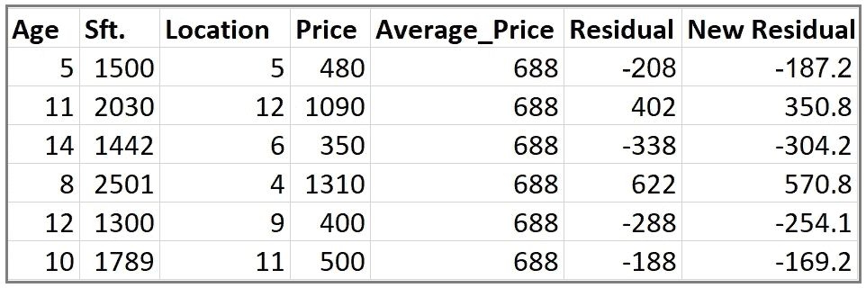

**第 6 步**:重复第 3 步到第 5 步，直到迭代次数与超参数指定的次数(估计数)相匹配

**步骤 7** :一旦训练完毕，使用集合中的所有树对目标变量的值进行最终预测。最终预测将等于我们在步骤 1 中计算的平均值加上组成森林的树木预测的所有残差乘以学习率。

这里，

**LR** :学习率

**DT** :决策树

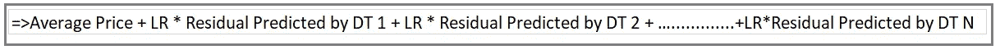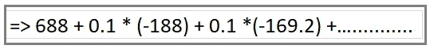

# **Python 中的梯度推进代码实现**

# 梯度增强的优势

1.  梯度推进算法的大部分时间预测精度偏高。
2.  它提供了很大的灵活性，可以优化不同的损失函数，并提供了几个超级参数调整选项，使函数拟合非常灵活。
3.  大多数时候不需要数据预处理。
4.  梯度推进算法适用于分类数据和数值数据。
5.  处理缺失数据-不需要缺失值插补。

# **梯度增强的缺点**

1.  梯度推进模型将继续改进，以尽量减少所有误差。这可能会过分强调异常值并导致过度拟合。必须用交叉验证来中和。
2.  它在计算上非常昂贵——GBM 通常需要许多树(> 1000)，这可能会耗尽时间和内存。
3.  高灵活性导致许多参数相互作用并严重影响该方法的行为(迭代次数、树深度、正则化参数等)。).这需要在调优期间进行大范围的网格搜索。

# **结论**

梯度推进算法是非常广泛使用的机器学习和预测建模技术(在 Kaggle 和其他代码竞赛中首选)。

希望你喜欢我的文章！

想要连接:

联系方式:[https://www.linkedin.com/in/anjani-kumar-9b969a39/](https://www.linkedin.com/in/anjani-kumar-9b969a39/)

如果你喜欢我在 Medium 上的帖子，并希望我继续做这项工作，请考虑在 [**patreon**](https://www.patreon.com/anjanikumar) 上支持我