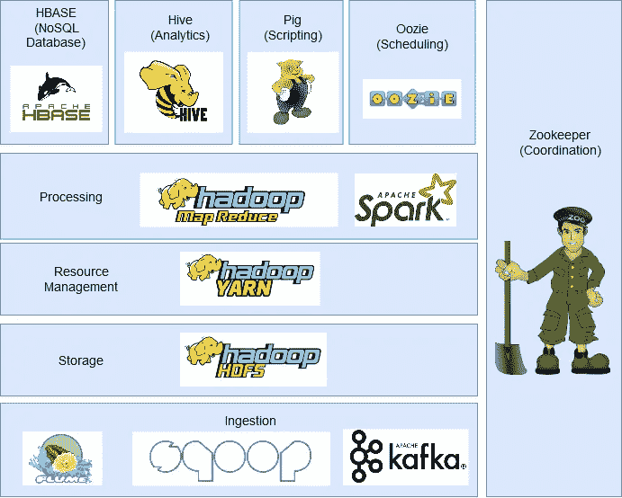
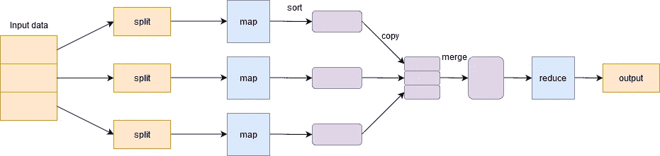
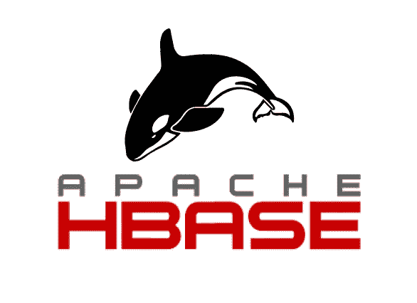
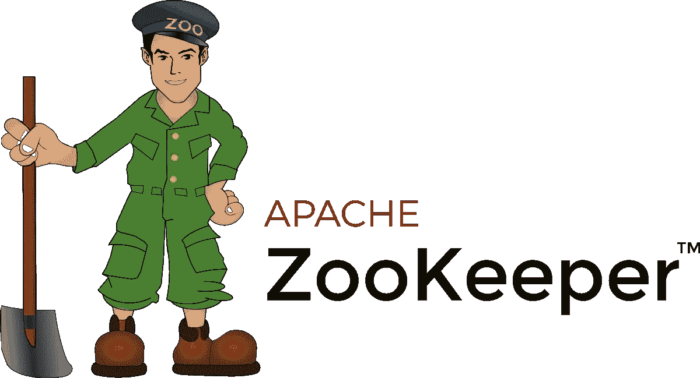
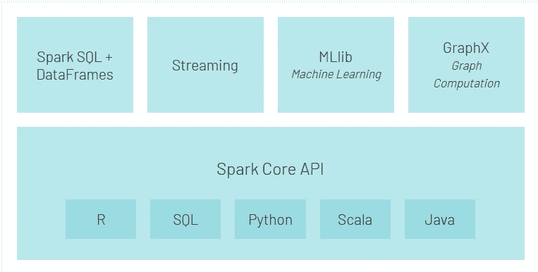
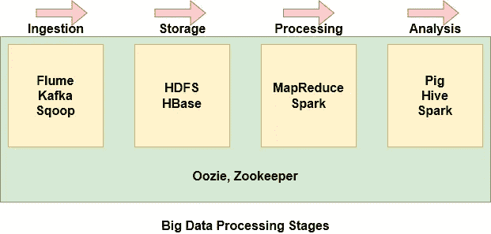

# 面向大数据和数据工程的 Hadoop 生态系统简介

> 原文：<https://medium.com/analytics-vidhya/introduction-to-the-hadoop-ecosystem-for-big-data-and-data-engineering-66045f7cb722?source=collection_archive---------10----------------------->

今天，我们有超过 40 亿的互联网用户。从纯数据的角度来看，这幅图是这样的:

> *每秒 9176 条推文*
> 
> *每秒上传 1023 张 Instagram 图片*
> 
> *每秒 5036 次 Skype 通话*
> 
> *每秒 86497 次谷歌搜索*
> 
> *每秒观看 86302 个 YouTube 视频*
> 
> *每秒发送 2，957，983 封电子邮件*
> 
> *还有更多…*

这就是我们现在正在处理的数据量——难以置信！据估计，到 2020 年底，我们将产生 44 zeta 字节的数据。那就是 44*10！

这种以惊人的速度和各种格式生成的海量数据就是我们今天所说的大数据。但是将这些数据存储在我们已经使用了 40 多年的传统系统上是不可行的。为了处理这些大量的数据，我们需要一个更加复杂的框架，它不仅仅由一个组件组成，而是由处理不同操作的多个组件组成。

我们将此框架称为 Hadoop，连同其所有组件，我们称之为 Hadoop 生态系统。但是，由于这个 Hadoop 生态系统中有如此多的组件，要真正理解和记住每个组件的作用以及它们在这个大世界中的位置有时会变得非常具有挑战性。

因此，在本文中，我们将尝试了解这个生态系统，并分解其组成部分。

# 目录

1.  传统系统的问题
2.  Hadoop 是什么？
3.  Hadoop 生态系统的组件

*   HDFS (Hadoop 分布式文件系统)
*   MapReduce
*   故事
*   HBase
*   猪
*   储备
*   Sqoop
*   水道
*   卡夫卡
*   动物园管理员
*   火花

4.大数据处理的阶段

# 传统系统的问题

我所说的传统系统是指像关系数据库和数据仓库这样的系统。在过去的 40 年里，组织一直使用它们来存储和分析数据。但是这些数据库无法处理今天生成的数据，原因如下:

*   今天生成的大多数数据都是半结构化或非结构化的。但是传统的系统被设计成只处理具有良好设计的行和列的结构化数据
*   关系数据库是纵向可扩展的，这意味着您需要向同一个系统添加更多的处理、内存和存储。这可能会非常昂贵
*   如今存储的数据位于不同的孤岛中。将它们放在一起并分析它们的模式可能是一项非常困难的任务。

那么，我们如何处理大数据呢？这就是 Hadoop 的用武之地！

# Hadoop 是什么？

当谷歌的人想要在互联网上对网页进行排名时，他们也面临着上述挑战。他们发现关系数据库非常昂贵且不灵活。所以，他们想出了自己新颖的解决方案。他们创造了[谷歌文件系统【GFS】](https://static.googleusercontent.com/media/research.google.com/en//archive/gfs-sosp2003.pdf)T2。

GFS 是一个分布式文件系统，它克服了传统系统的缺点。它运行在廉价的硬件上，并提供并行性、可伸缩性和可靠性。这为 [Apache Hadoop](https://hadoop.apache.org/) 的进化奠定了基石。

Apache Hadoop 是基于 Google 文件系统的开源框架，可以在分布式环境下处理大数据。这种分布式环境是由一群紧密协作的机器组成的，给人一种单台机器工作的印象。

以下是您应该知道的 Hadoop 的一些重要属性:

*   Hadoop 是高度可扩展的，因为它以分布式方式处理数据
*   与 RDBMS 中的垂直扩展相比，Hadoop 提供了**水平扩展**
*   它创建并保存数据的副本，使其具有容错能力
*   **这是经济的，因为集群中的所有节点都是商用硬件，只不过是廉价的机器**
*   **Hadoop 利用**数据局部性概念**在存储数据的节点上处理数据，而不是通过网络移动数据，从而减少流量**
*   **它可以处理任何类型的数据:结构化的、半结构化的和非结构化的。这在当今时代极其重要，因为我们的大部分数据(电子邮件、Instagram、Twitter、物联网设备等。)没有定义的格式**

**现在，让我们看看 Hadoop 生态系统的组件。**

# **Hadoop 生态系统的组件**

****

**在本节中，我们将讨论 Hadoop 生态系统的不同组件。**

# **HDFS (Hadoop 分布式文件系统)**

****

**它是 Hadoop 的存储组件，以文件的形式存储数据。**

**每个文件被分成 128MB(可配置)的块，并存储在集群中的不同机器上。**

**它采用主从式架构，由两个主要组件组成:名称节点和数据节点。**

*   ****名称节点**为主节点，每个集群只有一个。它的任务是知道属于一个文件的每个块在簇中的位置**
*   ****数据节点**是存储数据块的从节点，每个集群有多个数据块。它的任务是在需要时检索数据。它通过心跳与名称节点保持持续联系**

# **MapReduce**

****

**为了处理大数据，Hadoop 依赖于谷歌推出的 [MapReduce 算法](https://research.google/pubs/pub62/),可以轻松地在集群中分发和并行运行作业。它本质上是把一个任务分成多个任务，在不同的机器上处理。**

**通俗地说，它以分而治之的方式工作，在机器上运行进程以减少网络流量。**

**它有两个重要的阶段:映射和减少。**

****

****映射阶段**对数据进行过滤、分组和排序。输入数据被分成多个**分割**。每个 map 任务在不同的机器上并行处理数据分割，并输出一个键值对。该阶段的输出由**缩减任务**执行，被称为**缩减阶段**。它汇总数据，总结结果，并将其存储在 HDFS 上。**

# **故事**

****

**YARN 或其他资源协商器管理集群中的资源，并通过 Hadoop 管理应用程序。它允许存储在 HDFS 的数据被各种数据处理引擎处理和运行，例如批处理、流处理、交互式处理、图形处理等等。这增加了使用纱线的效率。**

# **HBase**

****

**HBase 是一个基于列的 NoSQL 数据库。它运行在 HDFS 之上，可以处理任何类型的数据。它允许对数据进行实时处理和随机读/写操作。**

# **猪**

****

**Pig 是为分析大数据集而开发的，克服了写图和归约函数的困难。它由两部分组成:猪拉丁和猪引擎。**

**Pig Latin 是一种类似于 SQL 的脚本语言。猪引擎是猪拉丁运行的执行引擎。在内部，用 Pig 编写的代码被转换成 MapReduce 函数，这对不精通 Java 的程序员来说非常容易。**

# **储备**

****

**Hive 是由脸书开发的分布式数据仓库系统。它允许在 HDFS 上轻松地读取、写入和管理文件。它有自己的查询语言，称为 Hive 查询语言(HQL ),与 SQL 非常相似。这使得程序员使用简单的 HQL 查询编写 MapReduce 函数变得非常容易。**

# **Sqoop**

****

**许多应用程序仍然将数据存储在关系数据库中，从而使它们成为非常重要的数据源。因此，在将数据从关系数据库引入 HDFS 的过程中，Sqoop 发挥了重要作用。**

**用 Sqoop 编写的命令在内部转换成在 HDFS 上执行的 MapReduce 任务。它可以与几乎所有的关系数据库一起工作，如 MySQL、Postgres、SQLite 等。它还可以用于将数据从 HDFS 导出到 RDBMS。**

# **水道**

****

**Flume 是一个开源的、可靠的、可用的服务，用于有效地从多个数据源收集、聚合和移动大量数据到 HDFS。它可以实时收集数据，也可以批处理方式收集数据。它具有灵活的体系结构，并具有多种恢复机制的容错能力。**

# **卡夫卡**

****

**有许多应用程序生成数据，也有相应数量的应用程序消费这些数据。但是将它们单独连接起来是一项艰巨的任务。这就是卡夫卡出现的地方。它位于生成数据的应用程序(生产者)和消费数据的应用程序(消费者)之间。**

**Kafka 是分布式的，具有内置的分区、复制和容错功能。它可以处理流数据，还允许企业实时分析数据。**

# **驭象者**

****

**Oozie 是一个工作流调度系统，允许用户链接在 MapReduce、Hive、Pig 等各种平台上编写的作业。使用 Oozie，您可以预先安排一个作业，并可以创建一个单独作业的管道，依次或并行执行，以完成一个更大的任务。例如，您可以使用 Oozie 对数据执行 ETL 操作，然后将输出保存在 HDFS 中。**

# **动物园管理员**

****

**在 Hadoop 集群中，协调和同步节点可能是一项具有挑战性的任务。因此，Zookeeper 是解决该问题的完美工具。**

**它是一个开源、分布式和集中式的服务，用于维护配置信息、命名、提供分布式同步，以及提供跨集群的组服务。**

# **火花**

****

**Spark 是 Hadoop 的替代框架，构建在 Scala 之上，但支持用 Java、Python 等编写的各种应用。与 MapReduce 相比，它提供了内存处理，因此处理速度更快。除了 Hadoop 提供的批处理之外，它还可以处理实时处理。**

**此外，Spark 有自己的生态系统:**

****

*   ****Spark Core** 是 Spark 和其他构建在它之上的 API 的主要执行引擎**
*   ****Spark SQL API** 允许查询存储在数据帧或配置单元表中的结构化数据**
*   ****流式 API** 使 Spark 能够处理实时数据。它可以很容易地与各种数据源集成，如 Flume、Kafka 和 Twitter**
*   **MLlib 是一个可扩展的机器学习库，它将使您能够执行数据科学任务，同时利用 Spark 的属性**
*   ****GraphX** 是一个图形计算引擎，它使用户能够交互式地构建、转换和推理大规模的图形结构数据，并附带一个通用算法库**

# **大数据处理的阶段**

**Hadoop 生态系统中有如此多的组件，理解每个组件在做什么可能会变得相当困难。因此，根据一些组件在大数据处理阶段的位置，将它们组合在一起会更容易。**

****

*   **Flume、Kafka 和 Sqoop 用于将外部数据源的数据导入 HDFS**
*   **HDFS 是 Hadoop 的存储单元。甚至从 Hbase 导入的数据也存储在 HDFS 上**
*   **MapReduce 和 Spark 用于处理 HDFS 的数据并执行各种任务**
*   **Pig、Hive 和 Spark 用于分析数据**
*   **Oozie 帮助安排任务。因为它适用于各种平台，所以在各个阶段都会用到它**
*   **Zookeeper 同步集群节点，并且在整个阶段中使用**

# **结束注释**

**我希望这篇文章有助于理解大数据，为什么传统系统无法处理它，以及 Hadoop 生态系统的重要组成部分是什么。**

**我鼓励您查看更多关于大数据的文章，这些文章可能对您有用:**

*   **[大数据](https://www.analyticsvidhya.com/big-data/)**
*   **[初学 py spark](https://www.analyticsvidhya.com/blog/2019/10/pyspark-for-beginners-first-steps-big-data-analysis/)**

**您也可以在我们的移动应用程序上阅读这篇文章**

********

**相关文章**

***原载于 2020 年 10 月 23 日 https://www.analyticsvidhya.com***。****