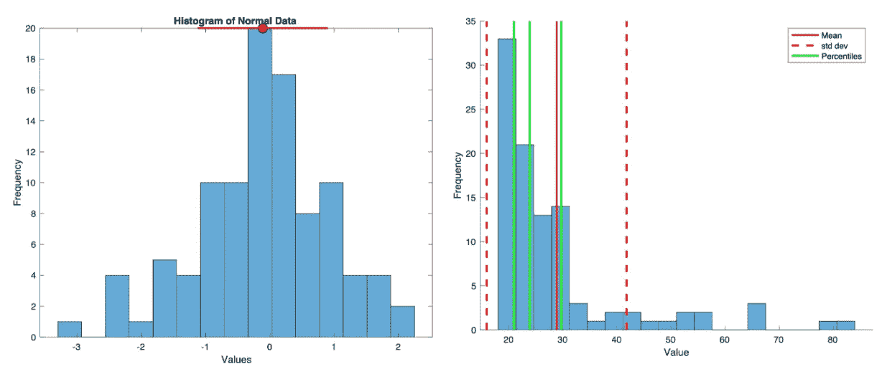
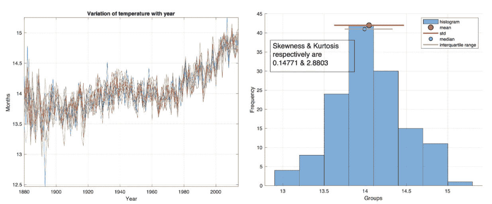
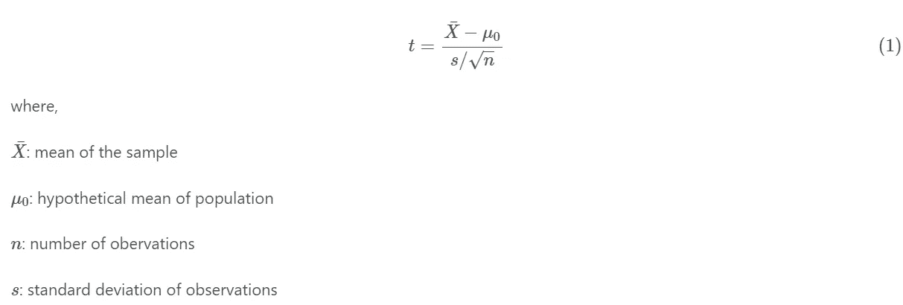
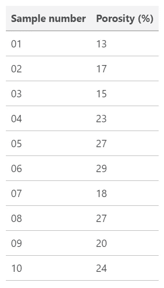

# MATLAB 中实现统计目标的三个有益步骤

> 原文：<https://medium.com/analytics-vidhya/introduction-to-the-statistical-analysis-in-matlab-96afeaa4648d?source=collection_archive---------19----------------------->


[杰森·布里斯科](https://unsplash.com/@jsnbrsc?utm_source=medium&utm_medium=referral)在 [Unsplash](https://unsplash.com?utm_source=medium&utm_medium=referral) 上的照片

数据科学仍然炙手可热，需求量巨大。各行各业的人都在转向数据科学。他们尝试新事物，并想出惊人的解决方案来解决长期存在的问题。但是从数据中推断是没有意义的，除非我们用一些统计工具来验证它。

MATLAB 附带了许多函数，对于初学者来说非常有帮助，即使对于那些数学知识很少的人来说也是如此。在这篇文章中，我将展示一些统计分析的基本工具。请注意，统计分析本身是一个巨大的主题，即使一本 500 页的书也只是触及了主题的表面。

在这里，我将介绍一些用于计算和可视化正常和非正常数据的基本统计数据的代码。对于第一个示例，我将从随机生成的数据开始，但是代码对于真实的数据同样有效。我们假设数据以离散值的形式表示平稳随机过程的样本记录。

# 基本统计分析

## 正常和非正常数据

第一个任务是使用`randn`生成正常数据。然后我们计算平均值、标准差、百分位数和直方图。接下来，我们将这些值绘制在图上。



正常[左]和非正常[右]数据的统计分析

```
%% Analysing random data to learn statistical skills
clear; close all; clc;

%% Normal Data
figure(1)
dataNormal=randn(100,1);
h1=histogram(dataNormal,15);
xlabel('Values'), ylabel('Frequency')
title('Histogram of Normal Data')
hold on
mu=mean(dataNormal);
sd=std(dataNormal);
binmax = max(h1.Values); %finding the maximum bin height
plot(mu,binmax,'ko','markerfacecolor','r', 'markersize',10); %plotting the location of mean
plot([mu-sd, mu+sd],[binmax, binmax], '-r', 'linewidth', 2); %plotting the 1 std
saveas(gcf,"normal_data_stats",'pdf')

%% Non-Normal Data
% generate some fake data
x = (randn(1,100).^2)*10 + 20;

% compute some simple data summary metrics
mn = mean(x);  % compute mean
sd = std(x);   % compute standard deviation
ptiles = prctile(x,[25 50 75]);  % compute percentiles (median and central 68%)

% make a figure
figure;
hold on;
histogram(x,20);  % plot a histogram using twenty bins
ax = axis;   % get the current axis bounds
  % plot lines showing mean and +/- 1 std dev
h1 = plot([mn mn],      ax(3:4),'r-','LineWidth',2);
h2 = plot([mn-sd mn-sd],ax(3:4),'r--','LineWidth',2);
h3 = plot([mn+sd mn+sd],ax(3:4),'r--','LineWidth',2);
  % plot lines showing percentiles
h4 = [];
for p=1:length(ptiles)
  h4(p) = plot(repmat(ptiles(p),[1 2]),ax(3:4),'g-','LineWidth',2);
end
legend([h1 h2 h4(1)],{'Mean' 'std dev' 'Percentiles'});
xlabel('Value');
ylabel('Frequency');
saveas(gcf,"non_normal_data_stats",'pdf')
```

## 全球月温度数据

在本例中，我们绘制了几年的月度时间序列数据。然后，我们再次计算统计数据，并将它们绘制在直方图上。



地图上的[左]温度与年份的关系图[右]基本统计数据

```
clear; close all; clc;
load temp_month

%% Making a matrix of data
p=[Jan,Feb,Mar,Apr,May,Jun,Jul,Aug,Sep,Oct,Nov,Dec];
pstring={'Jan','Feb','Mar','Apr','May','Jun','Jul','Aug','Sep','Oct','Nov','Dec'};

[row, col]=size(p);
%% Plotting the data vs year
figure
for i=1:col
  plot(Year,p(:,i))
  grid on
  hold on
end
title('Variation of Months with Year')
xlabel('Year'), ylabel('Months')
axis tight
saveas(gcf,"dataYear",'pdf')

%% Statistical Analysis
for i=1:col
    dd=p(:,i);
    mu(i)=mean(dd); %mean
    sd(i)=std(dd); %standard deviation
    med(i)=median(dd); %median
    x = min(dd):0.01:max(dd);
    ddsorted = sort(dd,'ascend'); %interquartile range
    e25=ceil(25/100*length(dd)); e75=ceil(75/100*length(dd));
    iqr_dd = ddsorted([e25, e75]);
    skew_dd=skewness(dd);
    kurt_dd = kurtosis(dd);

    %Plotting Figure
    figure
  %  subplot(2,2,[1 2])
     xlabel('Groups'), ylabel('Frequency'),grid on
    annotation('textbox',...
    [0.15 0.65 0.3 0.15],...
    'String',{'Skewness & Kurtosis respectively are ',[num2str(skew_dd),' & ', num2str(kurt_dd)]},...
    'FontSize',14,...
    'FontName','Arial')
    hold on
    h1=histogram(dd,'BinMethod','auto');
    binmax1(i) = max(h1.Values); %finding the maximum bin height
    plot(mu(i),binmax1(i),'ko','markerfacecolor','r', 'markersize',10); %plotting the location of mean
    plot([mu(i)-sd(i), mu(i)+sd(i)],[binmax1(i), binmax1(i)], '-r', 'linewidth', 2); %plotting the 1 std
    plot(med(i),binmax1(i)-1,'ko','markerfacecolor','c', 'markersize',7)
    plot(iqr_dd,[binmax1(i)-1, binmax1(i)-1], '-m', 'linewidth',2);
    legend('histogram','mean','std','median','interquartile range')
    saveas(gcf,sprintf("hist_Month%s",pstring{i}),'pdf')
end
```

> 侦察卫星等技术创新能够喷涌出大量数据，挑战传统的解释方法。用约翰·格里菲斯的话来说，“我们必须能够在它变得一团糟之前消化它。"只有计算机实现的数学和统计技术才具有足够的能力和速度来完成这项任务."— J.C .戴维斯

# t 统计量

总体统计估计中的不确定性可以通过使用比正态分布具有更宽“分布”的概率分布来解释。一种这样的概率分布被称为`t`分布(类似于正态分布)。这取决于所取样本的大小。当样本中的观测值数目为无穷大时，`t`分布和正态分布是相同的。

t 统计量是参数的估计值与其假设值的偏差与其标准误差的比率。`t`-测试可用于确定给定样本成为具有特定特征的总体成员的可能性，或用于测试两个样本等效性的假设。

对于包含从正态总体中随机采集的样本的数据集，t 统计量可通过以下方式计算



## 例子

让我们以 1986 年 Davis 和 Simpson 的孔隙度测量为例。



我们希望检验大约 10 个样本来自孔隙度大于 18%的总体.

# 假设检验

这里，我们的零假设是:


替代假设:


在这个测试中，我们假设平均值和标准差是估计的。对于上述 10 个样本的数据集，自由度是 9。

只有当平均孔隙度大大超过 18%时，我们才拒绝零假设。如果我们希望测试这个假设，当它为真时，拒绝它的概率只有一个是二十次(α= 0.05)，对于单尾测试，`t`的计算值必须超过 1.833。[参见此处](https://www.itl.nist.gov/div898/handbook/eda/section3/eda3672.htm)了解学生自由度的 t 分布表。


对于 9 个自由度和 5%的显著性水平，获得的值 1.89 超过了`t`的临界值，因此位于临界区域或拒绝区域。因此，我们可以拒绝零假设，给我们留下另一个假设，即数据集样本的总体孔隙度大于 18%。注意，如果零假设被接受，我们只能说样本中没有任何东西表明总体均值大于 18%。

## 用 MATLAB 计算 t 统计量

```
clear; close all; clc;
% generate some fake data
data1=randn(100,1);
data2=(randn(150,1).^2)*10 + 20;
mu_x=mean(data1)
mu_y=mean(data2)
%t-statistic
[h,p,ci,stats] = ttest2(data1,data2,0.05,'both','unequal')
```

```
mu_x = -0.0727

mu_y = 29.8633

h = 1

p = 7.6969e-54

ci =
  -32.3794
  -27.4925

stats =
  struct with fields:
    tstat: -24.2062
       df: 150.9778
       sd: [2×1 double]
```

# 参考资料:

1.  [MATLAB 统计与数据分析讲座](https://www.cmrr.umn.edu/~kendrick/statsmatlab/)
2.  戴维斯和桑普森(1986)。地质学中的统计和数据分析(第 646 卷)。威利纽约。
3.  [维基百科:t 统计](https://en.wikipedia.org/wiki/T-statistic)
4.  戴维斯和桑普森(1986 年)。地质学中的统计学和数据分析。从 https://www.academia.edu/download/6413890/clarifyeq4-81.pdf[检索](https://www.academia.edu/download/6413890/clarifyeq4-81.pdf)

*原载于 2020 年 5 月 22 日 https://www.earthinversion.com*[](https://www.earthinversion.com/statistics/statistical-analysis-in-matlab/)**。**