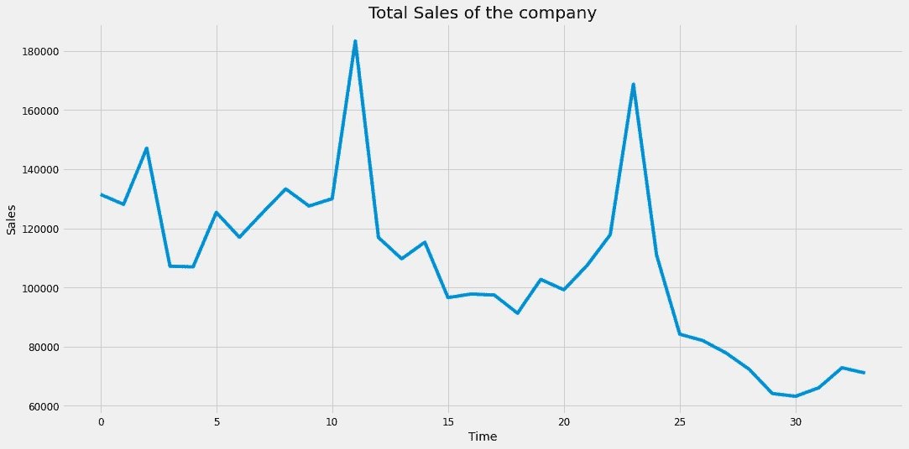
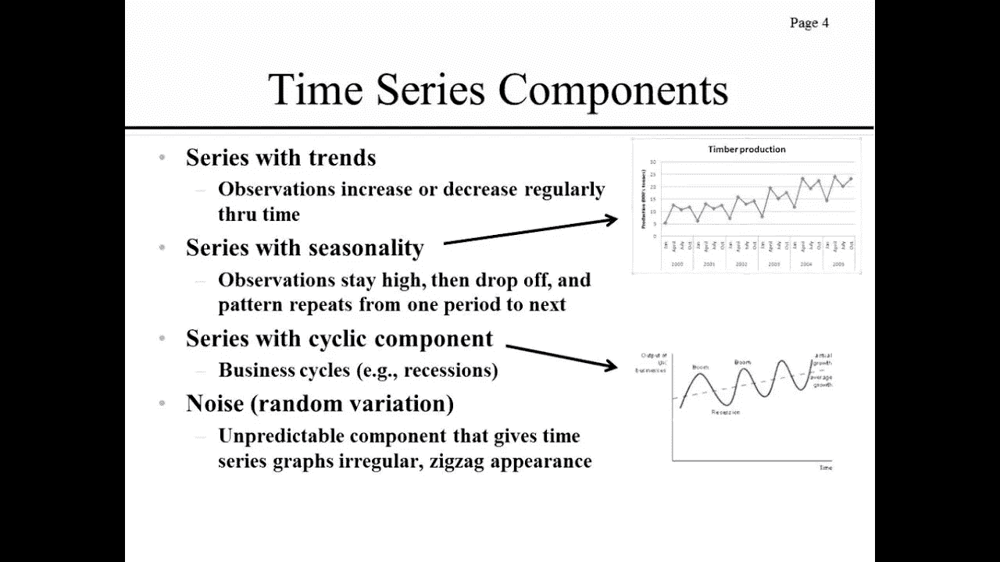
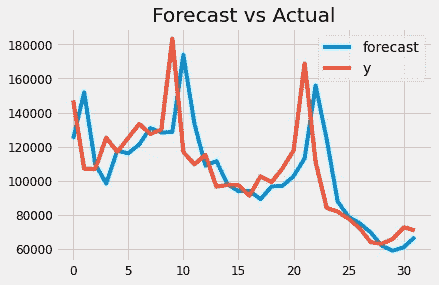
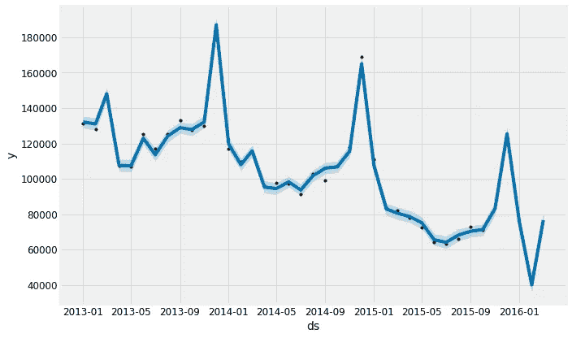

# 时间序列分析和预测导论

> 原文：<https://medium.com/analytics-vidhya/introduction-to-time-series-analysis-and-forecasting-f68f61235c9c?source=collection_archive---------17----------------------->


**时间序列分析**包括分析**时间序列**数据的方法，以提取有意义的统计数据和数据的其他特征。**时间序列**预测是利用模型来预测未来值。

## 在本文中，我们将基于“预测未来销售”数据集讨论这些结果及其背后的理论。

注意:要了解每一个细节和背后的详细理论，请查看本教程。

[](http://mathematicacity.co.in/2020/07/introduction-to-time-series-analysis-and-forecasting%e2%80%8a-%e2%80%8ai/) [## 时间序列分析和预测导论(一)

### 时间序列分析包括分析时间序列数据的方法，以提取有意义的统计和…

mathematicacity.co.in](http://mathematicacity.co.in/2020/07/introduction-to-time-series-analysis-and-forecasting%e2%80%8a-%e2%80%8ai/) 

## 数据集描述:

我们有:

1.  日期——售出商品的每个日期
2.  date_block_num —每月指定的数字
3.  shop_id —每个商店的唯一编号
4.  item_id —每个项目的唯一编号
5.  item_price —每个项目的价格
6.  item_cnt_day —某一天售出的商品数量

## 我们需要的包装:

```
import warnings
import itertools
import numpy as np
import matplotlib.pyplot as plt
warnings.filterwarnings("ignore")
plt.style.use('fivethirtyeight')
import pandas as pd
import statsmodels.api as sm
from statsmodels.tsa.arima_model import ARIMA
from pandas.plotting import autocorrelation_plot
from statsmodels.tsa.stattools import adfuller, acf, pacf,arma_order_select_icimport matplotlibmatplotlib.rcParams['axes.labelsize'] = 14
matplotlib.rcParams['xtick.labelsize'] = 12
matplotlib.rcParams['ytick.labelsize'] = 12
matplotlib.rcParams['text.color'] = 'k'
```

读取数据:

```
df=pd.read_csv('sales_train.csv')df.head()
```

数据类型:

```
date               object
date_block_num      int64
shop_id             int64
item_id             int64
item_price        float64
item_cnt_day      float64
dtype: object
```

现在我们必须将“日期”对象转换为字符串(YYYY-MM-DD)

```
import datetimedf['date']=pd.to_datetime(df.date)
```

## 可视化时间序列数据:

```
ts=df.groupby(["date_block_num"])["item_cnt_day"].sum()ts.astype('float')plt.figure(figsize=(16,8))plt.title('Total Sales of the company')plt.xlabel('Time')plt.ylabel('Sales')plt.plot(ts)
```



我们取某一特定月份售出的商品总数(我们可以取平均值而不是总和。我尝试了这两种方法，但平均无法给出一个好结果)。

注意:当我们绘制数据时，会出现一些不同的模式。该时间序列具有季节性。似乎也有一个趋势:似乎先略有上升，然后下降。换句话说，时间序列中有趋势和季节成分。



## 移除趋势:

考虑数据时间序列的季节性成分的一种方法是从时间序列中移除趋势。这样你就可以很容易地调查季节性。

去除趋势的方法:

1.  要消除趋势，可以从原始信号中减去滚动平均值。然而，这将取决于你平均了多少个数据点。
2.  另一种去除趋势的方法是差分法，即查看连续数据点之间的差异。

# 用 ARIMA 进行时间序列预测

我们将应用一种最常用的时间序列预测方法，称为 ARIMA，它代表自回归综合移动平均。

ARIMA 模型用符号`ARIMA(p, d, q)`表示。这三个参数说明了数据中的季节性、趋势和噪声。

```
model = ARIMA(ts['count'].values, order=(1, 1, 1))fit_model = model.fit(trend='c', full_output=True, disp=True)fit_model.summary()
```

AIC : 743.512

让我们画出这个:



我对结果很满意。

# 用 PROPHET 进行时间序列预测

预测工具 [Prophet](https://research.fb.com/prophet-forecasting-at-scale/) 由脸书于 2017 年发布，旨在分析时间序列，这些时间序列在不同的时间尺度上显示模式，如每年、每周和每天。它还具有高级功能，可以对节假日对时间序列的影响进行建模，并实现自定义的变点。因此，我们使用 Prophet 来启动并运行一个模型。

使用 prophet 的结果:



这里我们可以看到销售额在波动。

# LSTM 的结果:

LSTM 建筑

1.  忘记大门
2.  输入门
3.  输出门

## 我们的方法:

我们的特征将是商店每月售出的商品数量，不包括上个月的数据，因为这将是我们的标签，我们帮助我们的模型学习预测下一个序列。对于测试，将使用商店每月售出的商品数量，不包括第一个月，这样我们的数据维度保持不变。我们的模型将预测下一个序列，我们将是我们的结果。

数据集的准备:

```
X_train = np.expand_dims(dataset.values[:,:-1],axis = 2)
# the last column is our label
y_train = dataset.values[:,-1:]# for test we keep all the columns execpt the first one
X_test = np.expand_dims(dataset.values[:,1:],axis = 2)# lets have a look on the shape 
print(X_train.shape,y_train.shape,X_test.shape)>(424124, 33, 1) (424124, 1) (424124, 33, 1)
y_test=dataset.values[:,:1]
print(y_test.shape)
```

然后让我们跳到模型构建部分:

```
from keras.models import Sequential
from keras.layers import LSTM,Dense,Dropoutmy_model = Sequential()
my_model.add(LSTM(units = 64,input_shape = (33,1)))
my_model.add(Dropout(0.4))
my_model.add(Dense(1))my_model.compile(loss = 'mse',optimizer = 'adam', metrics = ['mean_squared_error'])
my_model.summary()
```

然后拟合模型:

```
history=my_model.fit(X_train,y_train,batch_size = 4096,epochs = 10)
```

现在让我们来计算 RMSE 值:

```
from sklearn.metrics import mean_squared_error
from numpy import sqrt
rmse = sqrt(mean_squared_error(y_test,y_pred))
print('Val RMSE: %.3f' % rmse)
```

瓦尔·RMSE:1.595

注:RMSE 是残差方差的平方根。它表示模型与数据的绝对拟合度，即观察到的数据点与模型预测值的接近程度。

即较低的 RMSE 值表示更好的拟合。

这个分数不错。对！！！！！

请在评论区给我们你的想法和结果。

如果你想了解先知，LSTM 和数据准备及其背后的所有理论，请通过以下链接。

[](http://mathematicacity.co.in/2020/07/introduction-to-time-series-analysis-and-forecasting-ii/) [## 时间序列分析和预测导论 2

### 在这一部分，我们将讨论与我们的销售广泛相关的预言家和 LSTM 的预测结果…

mathematicacity.co.in](http://mathematicacity.co.in/2020/07/introduction-to-time-series-analysis-and-forecasting-ii/) 

谢谢大家！！！