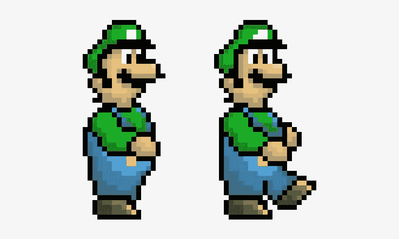
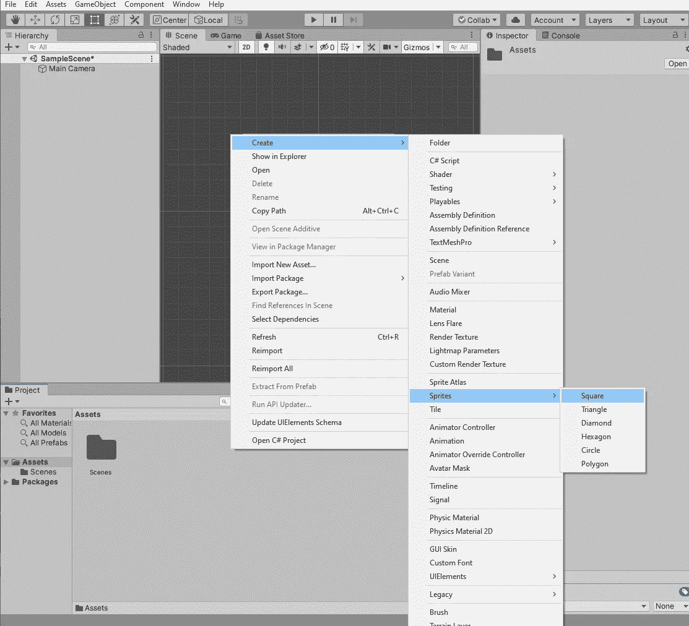
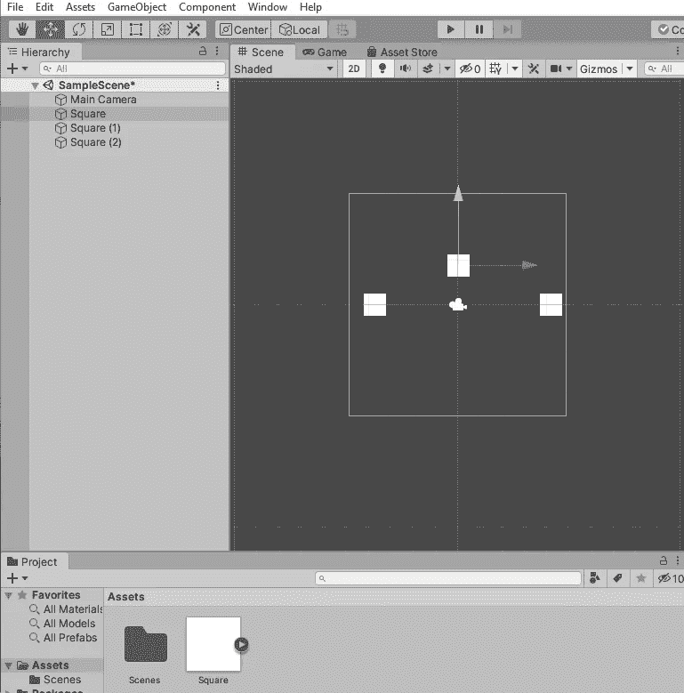
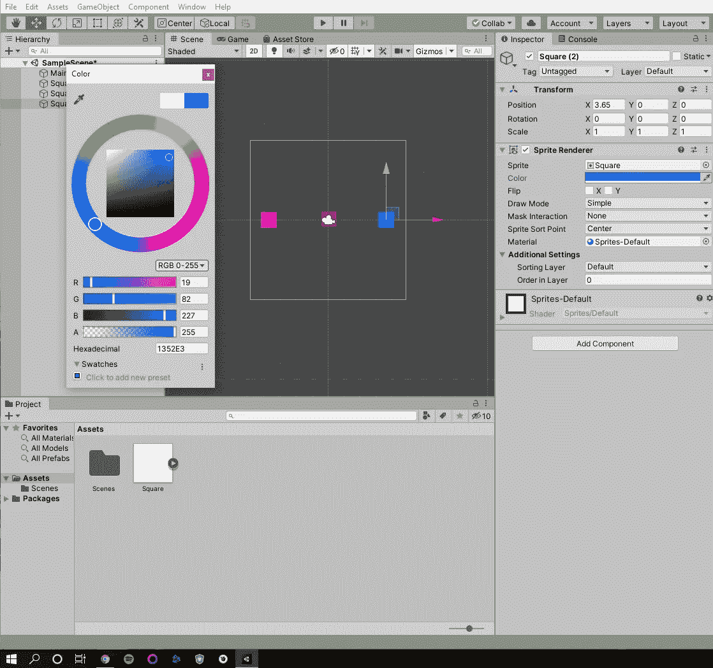
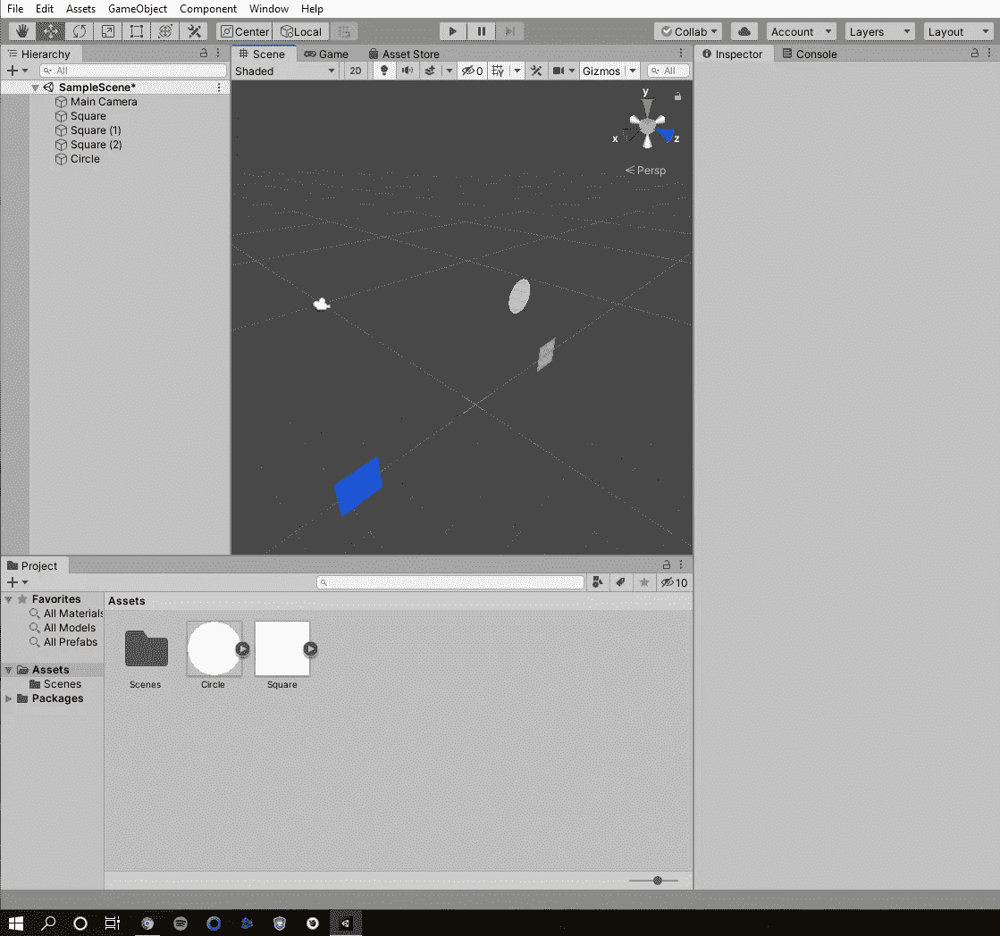
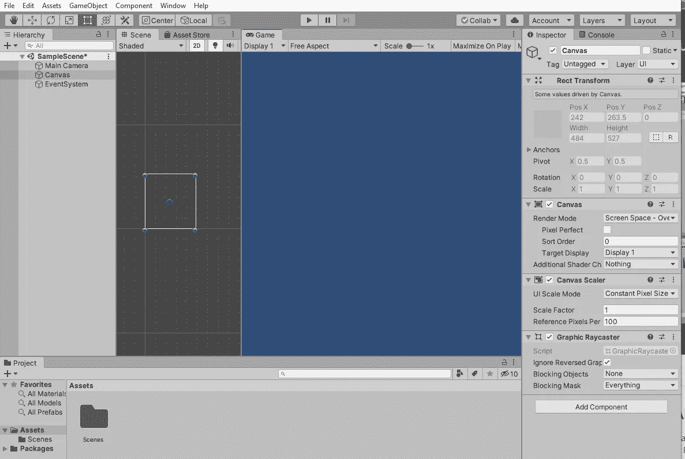
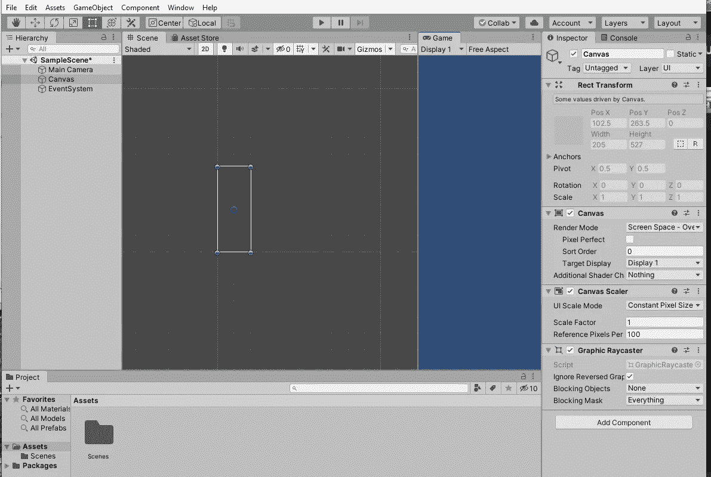
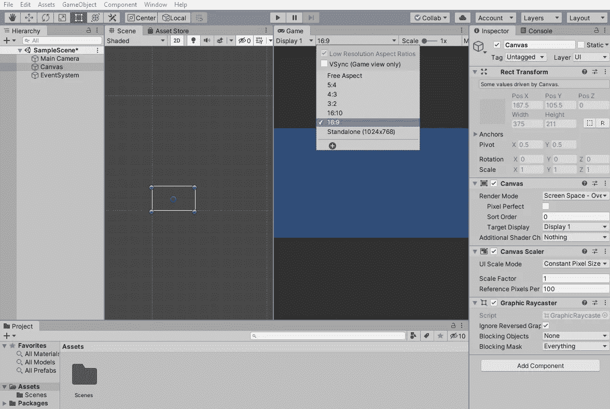
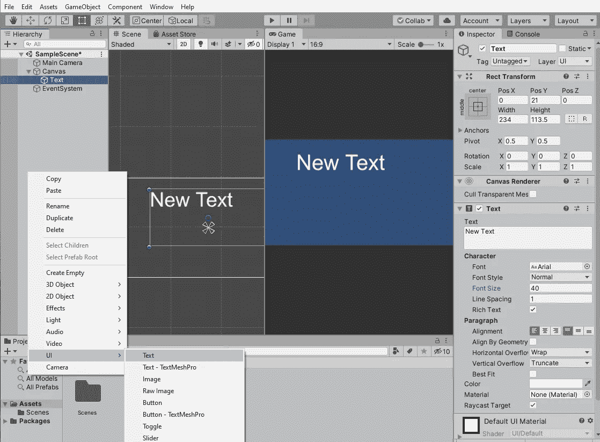
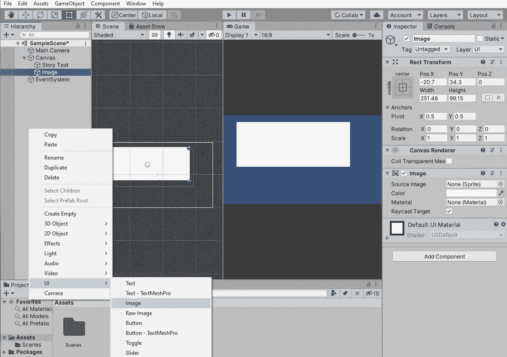

# Unity UI 简介——制作精灵和文本

> 原文：<https://medium.com/analytics-vidhya/introduction-to-unity-ui-making-sprites-and-text-53a5b8be9939?source=collection_archive---------9----------------------->

与 Unity 一起工作是令人兴奋的，充满了可能性，但是在我们开始学习游戏设计和 C#语言之前，重要的是对您所使用的工具有一个基本的了解。团结可能会显得有点势不可挡；该程序非常像 Photoshop 或 Final Cut Pro，非常强大。当第一次打开时，有许多不同的选项可用于您的项目，因此学习一些基础知识并能够进行 bop 是很重要的！

在接下来的几篇博客中，我们将深入探讨如何制作一个游戏，以及它如何与 C#一起工作，但这只是让你开始理解 Unity 的基础。今天我们将回顾精灵和文字创作；不涉及 C#！这是一个面向 Unity 新手的免费教程，所以一旦我们加入一些代码，我们就不会不知所措。先说精灵吧！

# 精灵是什么？

我们现在知道的许多游戏都是用 3D 技术制作的，整个团队的艺术家们花了数年时间才制作完成。我们将在后面的教程中一起用 Unity 制作 3D 游戏(也许你在加载程序时已经看到了 3D 项目的选项！)，我们将从一个更简单的 2D 方法开始。因此，在 2D 工作是使用精灵的最佳时机！

如果你对什么是雪碧感到困惑，我敢肯定现在有了这个路易奇的雪碧就很明显了！通常用像素化的艺术作品来完成，精灵是游戏世界中的 2D 物体，可以与玩家互动或被玩家看到。简单明了。虽然 pixel artwork 很棒，是一种很好的动画制作方式，但我们将通过使用 Unity 内置的 sprite 工具开始甚至更简单的，这样我们就可以学习如何与界面交互(你猜对了，我们将在另一篇博客中讨论 pixel work！).

请看下面的一系列截图，我解释了如何简单地制作一些精灵，并在程序空间中移动它们:

在这里，我们已经打开了一个新的统一 2D 项目。要开始，我们所要做的就是右键单击我们的资产窗口(你可以在程序的底部看到它，里面有场景文件夹)，然后转到创建>>精灵>>正方形(你可以制作任何形状，但我在我的例子中使用正方形)。这将为我们的游戏创建一个正方形的实例对象！你在创造，哇哦！

一旦添加了正方形，要么把它放到主摄像机下面的层次中，要么简单地把它拖到工作摄像机空间(场景窗口)。做完这个，再做两个！所以我们总共有三个方块。

现在你可以看到我们在场景窗口中有三个方块！在我们的层次结构中，我们也列出了所有三个方块。沿着程序的左上方，在文件//编辑//资产等下。，我们可以连续看到手工具和其他工具。点击移动工具，或者这一行中的第二个工具(你也可以按下 W 键作为热键)，你现在可以在你的空间中移动你的对象了！这允许你垂直和水平地移动东西，而不是简单地拖动它。

在右边，在我们的检查器中，你可以看到我们为精灵提供的所有工具！举个简单的例子，我选择编辑每个方块的颜色选项。一旦您使用移动工具或通过在层次中单击选择了正方形，您就可以根据需要编辑它们。我用颜色工具给我的三个正方形添加了不同的阴影，你可以在右边看到。尝试一下，看看你能做什么(改变大小，翻转物体，看看当你移动一个物体时位置数字是如何变化的，等等。)!

现在，你准备好来点让你大吃一惊的酷东西了吗..？

哇哦！这是怎么回事？？Unity 是一个强大的引擎，可以让我们在 3D 空间中移动和模拟我们的 2D 游戏和精灵！正如你所看到的，我在场景窗口中添加了一个圆形，然后将视图改为 3D。在场景窗口的顶部有许多选项，但只需点击灯泡旁边的 2D 按钮。现在，我们可以在 3D 中四处查看，并沿着 Z 轴移动对象！虽然 Z 轴不会改变我们在游戏窗口中的视图，因为我们在 2D 工作，但当我们制作复杂的游戏时，知道这个工具在未来会多么强大真是太好了！

上面我提到了游戏窗口；一定要好好看看这个。它是场景窗口旁边的另一个选项卡；点击一下。如果我们是一个玩游戏的用户，这就是我们从主摄像头看到的。这让我们可以预览我们正在做什么！可以把场景窗口想象成电影布景中的幕后场景，把游戏窗口想象成影院中的最终产品。你也可以拖拽并点击场景窗口旁边的游戏窗口来同时观看它们。

# 添加文本

向 Unity 添加文本很简单！让我们快速浏览一下。

这里你可以看到我做了上一段提到的事情；我把游戏窗口放在我的场景窗口旁边。我这样做是为了向你展示基于我如何滑动窗口的大小，你的画布(你可以看到我已经在我的层次中突出显示了)上的纵横比将如何变化。看看当我改变游戏窗口的大小时，我左边的画布是如何改变大小的:

如你所见，它是动态变化的。这可能很好，但现在让我们使它不随我们拖动窗口的方式而缩放。这将使我们更容易处理文本。为此，我们将改变自由方面。

在游戏窗口中，单击自由方面下拉菜单，然后单击 16:9。这将为我们的画布提供 1080 的比例，并保持静态！这个例子更容易处理。现在让我们快速添加一些文本到我们正在制作的内容中。

要添加文本，请右键单击层次结构空间，然后转到 UI > >文本。这将在我们的程序中创建一个新的文本实例！你可以在右边的检查窗口中看到，我们有很多文本选项，就像我们对精灵所做的一样！在这里，您可以命名文本对象以便以后更容易识别它，更改文本框中文本的内容，更改对齐方式、文本大小(我将我的设为 40)等等。尝试一下，看看如何让文本出现在你的游戏窗口中！

最后，向您的项目添加一个图像。正如我们添加文本一样，我们将进入层次结构窗口并右键单击，然后转到 UI > >图像。这将创建一个图像实例。我们有不同的选项在检查窗口现在为我们的形象！

但是啊哦！图像覆盖了我们的文本，这样不好！幸运的是，有一个简单的解决办法。在层次窗口中，选择图像实例并将其拖到文本实例的上方。这将改变我们游戏中图层的顺序，因此现在给我们的文本一个背景！万岁！玩玩这个，做个游戏菜单更舒服。

正如你所看到的，这篇文章非常基础，但是我们都刚刚开始，简单的东西就可以了！我们会慢慢适应，每个项目和检查点都会变得越来越复杂。敬请期待！现在我们知道了 Unity 的一些基本功能，我们现在更有能力将它与 C#结合起来，创建真正的互动游戏。让我们实现它吧！