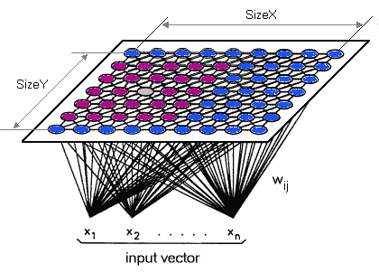
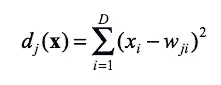
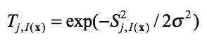
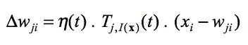
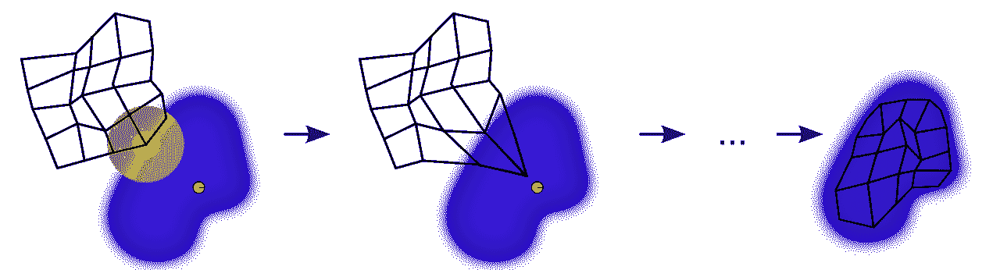
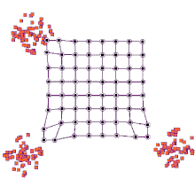
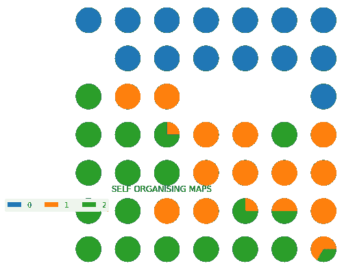
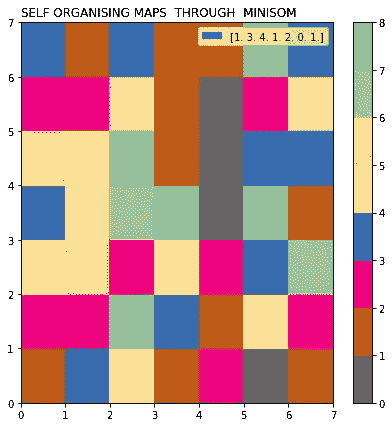
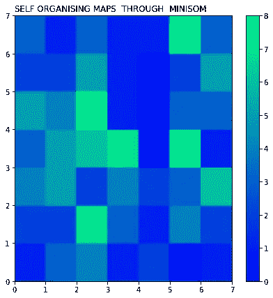

# 介绍无监督深度学习与自组织地图及其架构和可视化。

> 原文：<https://medium.com/analytics-vidhya/introduction-to-unsupervised-deep-learning-with-self-organizing-map-with-its-architecture-and-7ac67b0c5977?source=collection_archive---------5----------------------->

自组织映射(SOM)是一种无监督的神经网络机器学习技术。当数据集有很多属性时，使用 SOM，因为它产生低维的、大多数情况下是二维的输出。输出是输入空间的离散化表示，称为地图。

# SOM 是如何工作的？

输入空间中的点在输出空间中有对应的点。在 Kohonen 网络(一种 SOM)中，有一个二维单层，输入点与该层上的神经元完全连接。

在自组织过程开始时，用随机值初始化权重。之后，为了竞争，所有的神经元将计算下面输入特征的辨别函数。具有最小值的神经元将是获胜者。

D =输入的尺寸；x =输入；w =重量

这个函数将显示哪个神经元与输入向量最相似。

当一个神经元被激发时，它的邻居会比远处的神经元更兴奋。这个过程称为拓扑邻域，计算如下:

其中 *S* 是神经元之间的横向距离， *I(x)* 是获胜神经元的指数， *σ* 是邻居的数量，并且该数量随着时间而减少。拓扑邻域数将减少，随着到获胜者的距离增加而趋于零。

由于 *t* 是时期的数量，并且 *η(t)* 是当时的学习率，因此权重用以下公式更新:

正如我们所见，权重根据拓扑邻域移动，导致远处的神经元有微小的更新。这将产生一种类似赢家神经元拉动其他神经元的效果。

当特征图停止变化时，SOM 算法停止。

在本文中，我们将编写一个学习颜色的 SOM。这里我们使用 MiniSom 库和一个自组织地图的简单实现。

用这个库训练一个 SOM 网络非常简单，只有 4 行代码就可以训练我们的模型并产生下面的输出，显示网络学习到的颜色。

自组织地图如何学习？

现在是我们学习 SOMs 如何学习的时候了。你准备好了吗？我们开始吧。就在这里，我们有一个非常基本的自组织地图。

我们的输入向量有三个特征，我们有九个输出节点。

如果您还记得本节前面的教程，我们说过 som 旨在减少数据集的维数。

也就是说，看到这个例子如何显示三个输入节点产生九个输出节点，您可能会感到困惑。不要对此感到困惑。三个输入节点表示数据集中的三列(维度)，但是这些列中的每一列都可以包含 n 行。SOM 中的输出节点总是二维的。

现在，我们要做的是将这个 SOM 转换成一个输入集，这是我们在前面讨论监督机器学习方法(人工、卷积和递归神经网络)时更熟悉的。

这是它看起来的样子。

它仍然是完全相同的网络，只是节点的位置不同。它包含输入和输出节点之间的相同连接。

然而，som 与我们所了解的受监督类型的神经网络有所不同:

*   SOMs 简单多了。
*   由于它们是不同的，一些术语和概念(例如，权重、突触等。)在 SOMs 的上下文中会有不同的含义。尽量不要被这些术语弄糊涂。

现在，让我们把注意力放在最顶层的输出节点和输入节点的连接上。如您所见，每个连接都有一个权重。

同样，这里的“权重”一词有着与人工神经网络完全不同的含义。

例如，对于人工神经网络，我们将输入节点的值乘以权重，最后应用一个激活函数。另一方面，对于 SOMs，没有激活功能。

在这里，权重并不与节点分开。在 SOM 中，权重属于输出节点本身。SOM 中的输出节点包含权重作为其坐标，而不是权重相加的结果。带着这些重量，它悄悄地试图找到进入输入空间的路。

当我们开始了解和探索它们时，进一步的步骤会更有趣。

让我们转到教程的第二部分，关于 SOMs 如何学习。就像我们在上一节课结束时所说的，这次我们将在一个更复杂的层次上研究 SOM 学习过程。

这次我们的地图将包含多个最佳匹配单位(bmu ),而不是只有两个。

我们在上一个教程中提到了 bmu 如何更新它们的权重，以便更接近数据点。

然后这些 bmu 中的每一个都将被分配一个半径，如下图所示。

让我们逐一检查这些 bmu。以左上角的紫色节点为例。它已被更新，以便更接近与之匹配的行。落入其半径范围内的其他节点会经历相同的更新，因此它们会被一起拖动。

其他每个 bmu 及其外围节点也是如此。

当然，在这个过程中，外围节点会经历一些推和拉，因为它们中的许多都位于不止一个 BMU 的半径内。它们被这些 BMU 的联合力量更新，最近的 BMU 是最有影响力的。

随着我们不断重复这个过程，每个 BMU 的半径都会缩小。这是 Kohonen 算法的独特之处。

这将以 SOM 实现的理论部分结束，现在我们将进一步讨论数据集可视化代码的实现，然后从这些代码中得出关于 SOM 的结论。

在开始实际实施该准则之前。我们应该熟悉我们正在使用的数据集虹膜数据集。

1.  萼片长度以厘米为单位。
2.  萼片宽度以厘米计。
3.  花瓣长度，单位为厘米。
4.  花瓣宽度，单位为厘米。
5.  类别:—刚毛鸢尾—杂色鸢尾—海滨鸢尾。

前 4 个是自变量，最后一个是因变量，您可以从 **UCI** 资源库下载数据集。

步骤 1 数据集的导入和安装。

> 将 numpy 作为 np 导入
> 
> 将 matplotlib.pyplot 作为 plt 导入
> 
> 进口熊猫作为 pd

步骤 2 加载数据集

> data=pd.read_csv("Iris.csv ")

步骤 3 数据集框架

> data.head()

步骤 4 删除数据集的最后一列，因为我们将预测该类。

> dataset=data.drop(['Species '，" Id"]，axis=1)
> 
> dataset.head()

步骤 5 数据集的标准化，使数据集更加精确和简单。

> #numpy bases SOM 实现附件
> 
> 来自 sklearn .预处理导入标准缩放器
> 
> standard =标准缩放器()
> 
> cleandataset=pd。data frame(standard . fit _ transform(dataset))
> 
> cleandataset.head()
> 
> cleandataset.tail()

Step 6 MINISOM 由开发人员在 year 开发，用于更好地可视化数据集和正确实现预测端的类，并为我们提供数据集的正确标准可视化。

> ！pip 安装 minisom

minisom 中的步骤 7(7，7)是指对数据集中的 150 行进行聚类的网格中的行和列。适马指的是圆的大小默认为 0.5 我们可以用 0 比 1

> 从微型计算机导入微型计算机
> 
> 从 matplotlib.gridspec 导入 gridspec
> 
> som=MiniSom(7，7，4，sigma=0.5，neighborhood _ function = " Gaussian ")# 4 用于独立变量数据
> 
> som . train _ random(clean dataset . to _ numpy()，300000) #30000 表示模型的迭代次数。

第 8 步现在轮到因变量 Y，它有 3 个值，所以我们把分类而不是二进制。

> 目标=数据。species . as type(' category '). cat . codes
> 
> label _ map = som . labels _ map(clean dataset . to _ numpy()，target)
> 
> label_names=np.unique(目标)

第九步你可以看到在 0，1，2 中的代码类和在矩阵中相关的 labels_map。

> 目标*
> 
> 标签 _ 地图

#输出

> {(0，0):计数器({2: 1})、(0，1):计数器({2: 3})、(0，2):计数器({2: 4})、(0，3):计数器({2: 1})、(0，4):计数器({2: 2})、(0，6):计数器({0: 1})、(1，0):计数器({2: 2})、(1，1):计数器({2: 2})、(1，2):计数器({2: 7})。 6):计数器({0: 6})、(3，0):计数器({2: 3})、(3，1):计数器({1: 5})、(3，2):计数器({1: 6})、(3，3):计数器({1: 7})、(3，5):计数器({0: 8})、(3，6):计数器({0: 1})、(4，0):计数器({2: 5})、(4，1):计数器({1: 1，2: 3})。 0):计数器({1: 2，2: 1})、(6，1):计数器({1: 1})、(6，2):计数器({1: 3})、(6，3):计数器({1: 1})、(6，4):计数器({0: 1})、(6，5):计数器({0: 8})、(6，6):计数器({0: 3})})

第 10 步现在是可视化部分，我们根据数据集进行比较并显示类，以及它们如何分类。

> plt.figure(figsize=(7，7))
> 
> _grid=GridSpec(7，7)
> 
> 对于 label_map.keys()中的位置:
> 
> label _ fracs =[label _ names 中 l 的 label_map[position][l]
> 
> PLT . subplot(_ grid[6-position[1]，position[0]]，aspect=1)
> 
> patches，texts=plt.pie( label_fracs)
> 
> plt.legend(label_names，bbox_to_anchor=(0，1)，ncol=5)
> 
> plt.title("自组织地图"，loc ="left ")
> 
> plt.show()

第 11 步现在是从正方形的一面看的部分，我们可以看到这个多颜色的可视化。

> plt.figure(figsize=(7，7))
> 
> 频率=np.zeros((7，7))
> 
> 对于 position，为 som . win _ map(clean dataset . to _ numpy())中的值。项目():
> 
> 频率[位置[0]，位置[1]]=len(值)
> 
> plt.pcolor(频率，cmap="Accent_r ")
> 
> plt.title("通过 MINISOM 自组织地图"，loc ="left ")
> 
> plt.legend(频率，ncol=15)
> 
> plt.colorbar()
> 
> plt.show()

> plt.figure(figsize=(7，7))
> 
> 频率=np.zeros((7，7))
> 
> 对于 position，为 som . win _ map(clean dataset . to _ numpy())中的值。项目():
> 
> 频率[位置[0]，位置[1]]=len(值)
> 
> plt.pcolor(频率，cmap= "冬季")
> 
> plt.title("通过 MINISOM 自组织地图"，loc ="left ")
> 
> plt.colorbar()
> 
> plt.show()

如果你想手工实现代码，点击 [**按钮**](https://colab.research.google.com/drive/11SiBmYXxBCtVY_t4050DjR13ZemqGHYv#scrollTo=mmS8P0LAQFfC) ，在 google colab 中实现代码。

如果你喜欢读这篇文章，并对类似的项目有共同的兴趣，那么我们可以扩大我们的网络，可以为更多的实时项目工作。

更多详情请联系我的 [**Linkedin 账户**](https://www.linkedin.com/in/karan-choudhary-9102b81a0/) ***！***

**谢谢！！！！**