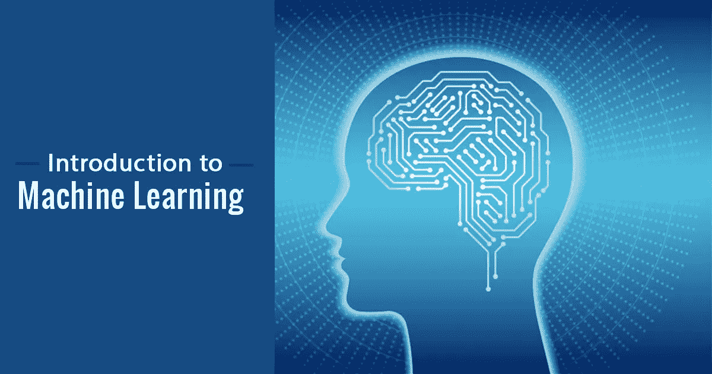

# 无监督学习算法简介

> 原文：<https://medium.com/analytics-vidhya/introduction-to-unsupervised-learning-algorithms-305b52e70634?source=collection_archive---------22----------------------->

机器学习的基础介绍，在这篇文章中你将能够学习机器学习中不同的无监督学习算法以及它们是如何工作的…

[这里](https://www.digitalvidya.com/wp-content/uploads/2018/04/Introduction-to-Machine-Learning.jpg)

# 无监督学习算法

**无监督学习**算法应用以下技术来描述数据:

*   **聚类:**它是…