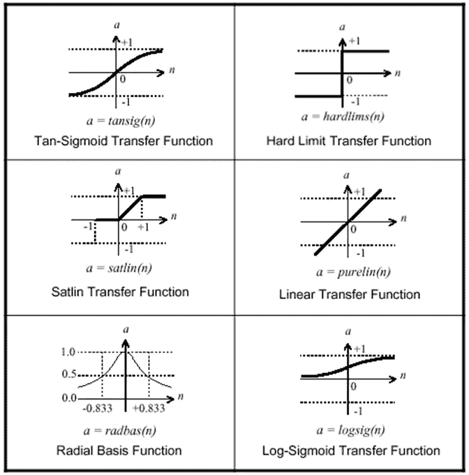
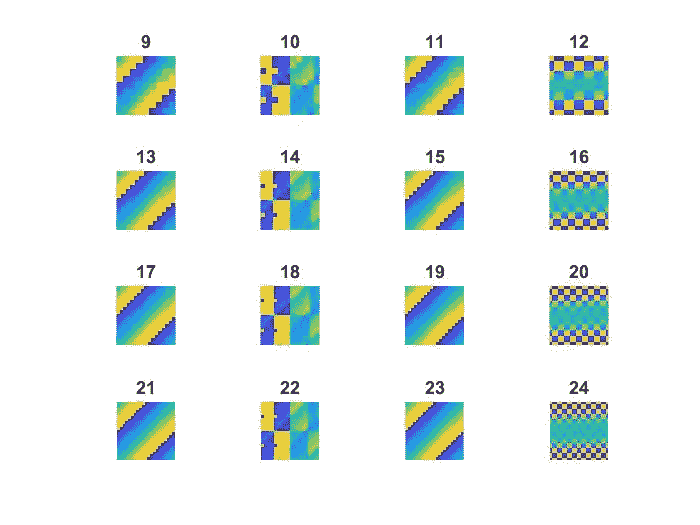
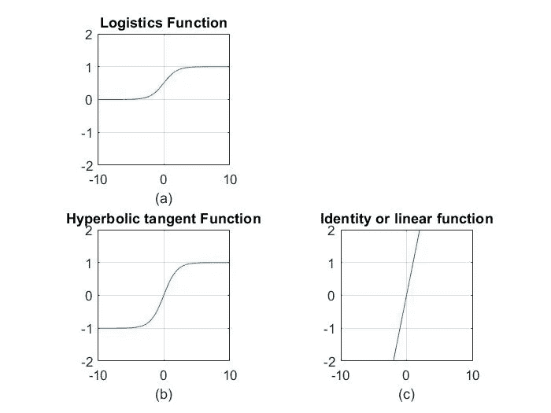

# 使用 MATLAB R2017b 介绍各种激活函数(第一部分)

> 原文：<https://medium.com/analytics-vidhya/introduction-to-various-activation-functions-using-matlab-r2017b-part-1-6ccb4228cb5?source=collection_archive---------12----------------------->



# **让我们先玩同样酷的功能-**

M = magic(n)返回一个 n 乘 n 矩阵，该矩阵由行和列和相等的整数 1 到 n 构成。阶 n 必须是大于或等于 3 的标量。

sum(A，1):-对的列中的连续元素进行操作，并返回每列总和的行向量。

sum(A，2):-对 A 的行中的连续元素进行操作，并返回每行总和的列向量。

axis([xmin xmax ymin ymax zmin zmax]):-设置当前轴的 x 轴、y 轴和 z 轴的限制。v = axis 返回包含 x 轴、y 轴和 z 轴缩放因子的行向量。v 有四个或六个分量，分别取决于当前轴是二维的还是三维的。

**imagesc(C) :-将 C 显示为图像。C 的每个元素对应于图像中的一个矩形区域。C 的元素的值是当前色图中的索引，其确定每个色块的颜色。imagesc(x，y，C)将 C 显示为图像，并用向量 x 和 y 指定 x 轴和 y 轴的边界**

> 使用<imagesc>进行绘图的程序，使用:-</imagesc>

```
for n = 1:16
 subplot(4,4,n)
 ord = n+8;
 m = magic(ord);
 imagesc(m)
 title(num2str(ord))
 axis equal
 axis off
end
```

## 输出



图:使用 imagesc(C)类型

# 物流函数、双曲正切函数、恒等函数的绘制

```
%Plotting of activation function
x= -10:0.1:10
temp = exp(-x);
y1 = 1./(1+temp);%Here <./ >stands for the right division in matlab (otherwise stated as rdivide(A,B))y2 = (1-temp)./(1+temp);
y3 = x;
subplot(221);
plot(x,y1);
grid on;
axis ([min(x) max(x) -2 2]);
title(‘Logistics Function’);
xlabel(‘(a)’);
axis(‘square’);
subplot(223);
plot(x,y2);
grid on;
axis ([min(x) max(x) -2 2]);
title(‘Hyperbolic tangent Function’);
xlabel(‘(b)’);
axis(‘square’);
subplot(224);
plot(x,y3);
grid on;
axis ([min(x) max(x) -2 2]);
title(‘Identity or linear function’);
xlabel(‘©’);
axis(‘square’);
```

# 输出



> **命令行值-**

**x =**

第 1 栏至第 13 栏

-10.0000 -9.9000 -9.8000 -9.7000 -9.6000 -9.5000 -9.4000 -9.3000 -9.2000 -9.1000 -9.0000 -8.9000 -8.8000

第 14 至 26 列

-8.7000 -8.6000 -8.5000 -8.4000 -8.3000 -8.2000 -8.1000 -8.0000 -7.9000 -7.8000 -7.7000 -7.6000 -7.5000

第 27 至 39 列

-7.4000 -7.3000 -7.2000 -7.1000 -7.0000 -6.9000 -6.8000 -6.7000 -6.6000 -6.5000 -6.4000 -6.3000 -6.2000

第 40 至 52 列

-6.1000 -6.0000 -5.9000 -5.8000 -5.7000 -5.6000 -5.5000 -5.4000 -5.3000 -5.2000 -5.1000 -5.0000 -4.9000

第 53 至 65 列

-4.8000 -4.7000 -4.6000 -4.5000 -4.4000 -4.3000 -4.2000 -4.1000 -4.0000 -3.9000 -3.8000 -3.7000 -3.6000

第 66 至 78 栏

-3.5000 -3.4000 -3.3000 -3.2000 -3.1000 -3.0000 -2.9000 -2.8000 -2.7000 -2.6000 -2.5000 -2.4000 -2.3000

第 79 至 91 列

-2.2000 -2.1000 -2.0000 -1.9000 -1.8000 -1.7000 -1.6000 -1.5000 -1.4000 -1.3000 -1.2000 -1.1000 -1.0000

第 92 栏到第 104 栏

-0.9000 -0.8000 -0.7000 -0.6000 -0.5000 -0.4000 -0.3000 -0.2000 -0.1000 0 0.1000 0.2000 0.3000

第 105 至 117 列

0.4000 0.5000 0.6000 0.7000 0.8000 0.9000 1.0000 1.1000 1.2000 1.3000 1.4000 1.5000 1.6000

第 118 至 130 列

1.7000 1.8000 1.9000 2.0000 2.1000 2.2000 2.3000 2.4000 2.5000 2.6000 2.7000 2.8000 2.9000

第 131 至 143 列

3.0000 3.1000 3.2000 3.3000 3.4000 3.5000 3.6000 3.7000 3.8000 3.9000 4.0000 4.1000 4.2000

第 144 至 156 列

4.3000 4.4000 4.5000 4.6000 4.7000 4.8000 4.9000 5.0000 5.1000 5.2000 5.3000 5.4000 5.5000

第 157 至 169 列

5.6000 5.7000 5.8000 5.9000 6.0000 6.1000 6.2000 6.3000 6.4000 6.5000 6.6000 6.7000 6.8000

第 170 至 182 列

6.9000 7.0000 7.1000 7.2000 7.3000 7.4000 7.5000 7.6000 7.7000 7.8000 7.9000 8.0000 8.1000

第 183 至 195 列

8.2000 8.3000 8.4000 8.5000 8.6000 8.7000 8.8000 8.9000 9.0000 9.1000 9.2000 9.3000 9.4000

第 196 栏到第 201 栏

9.5000 9.6000 9.7000 9.8000 9.9000 10.0000