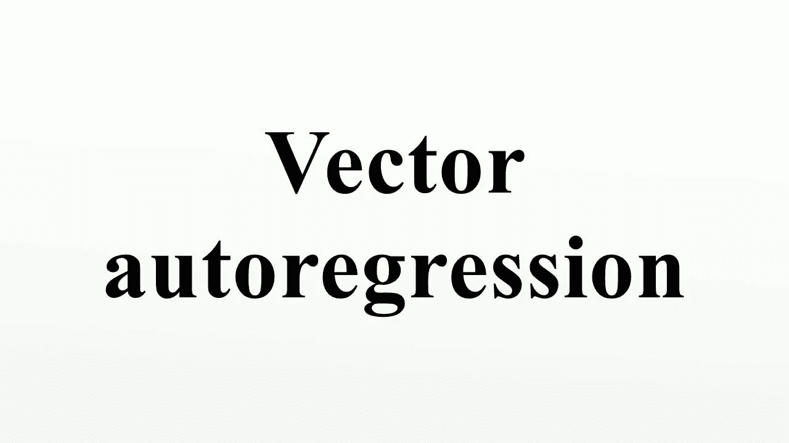
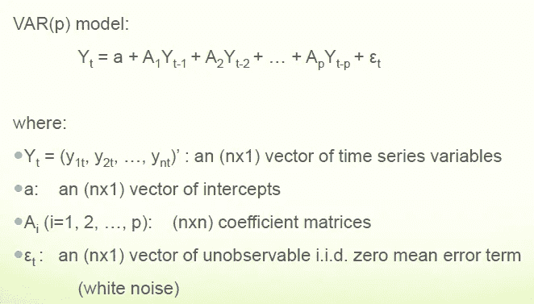
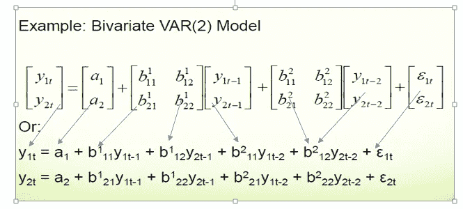
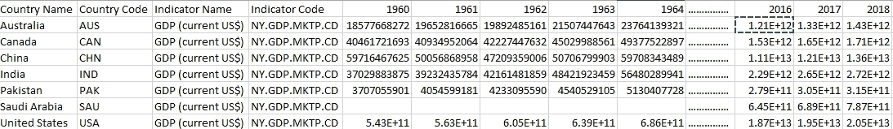
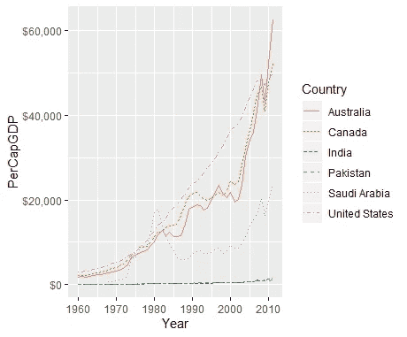
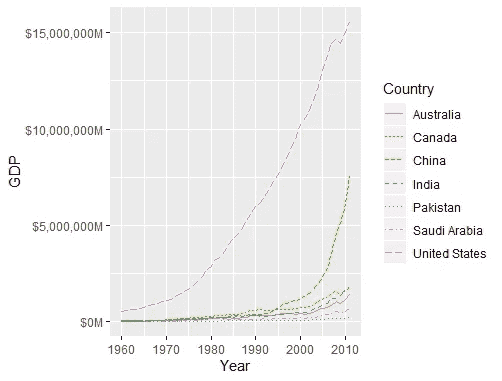
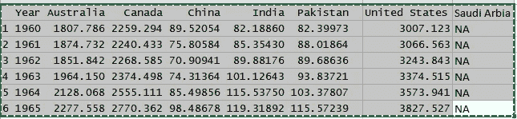
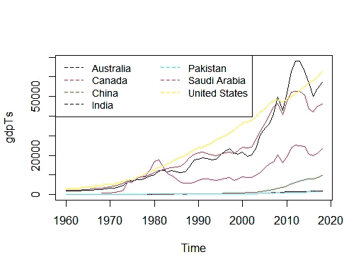

# 向量自回归简介

> 原文：<https://medium.com/analytics-vidhya/introduction-to-vector-autoregression-6ec386db387e?source=collection_archive---------13----------------------->



介绍

git hub-https://github . com/vats manish/Time-series-vector-auto regression-model

**你从这篇文章中学到了什么:-**

为什么向量自回归很重要

你将学习向量自回归如何工作？

向量自回归的实际例子

您将看到使用世界银行数据集和预测各国 GDP 的向量自回归的实际实现。

一、什么是向量自回归(VAR)，什么时候用？

向量自回归(VAR)是一种多变量预测算法，在两个或多个时间序列相互影响时使用。

也就是说，使用 VAR 的基本要求是:

1.  您至少需要两个时间序列(变量)
2.  时间序列应该相互影响。

好吧。那么为什么称之为‘自回归’呢？

它被认为是一个自回归模型，因为每个变量(时间序列)都被建模为过去值的函数，也就是说，预测值只不过是序列的滞后(时间延迟值)。

好的，那么 VAR 与 AR、ARMA 或 ARIMA 等其他自回归模型有什么不同呢？

主要区别是这些模型是单向的，其中，预测因子影响 Y，而不是相反。然而，向量自回归(VAR)是双向的。也就是变量相互影响。

“当人们有兴趣使用单一模型预测多个时间序列变量时，向量自回归(VAR)模型非常有用。其核心是，VAR 模型是单变量自回归模型的扩展。

你将学习向量自回归如何工作？

让我们看看这个算法背后的数学直觉

这是针对单变量数据的



如上所述，在单变量数据中，Ai=1 意味着我们只有一列，假设我想添加更多列。

为此，我们将使用更多数量的多元数据，即:-我们在数据集中添加更多数量的变量。

在这里，我有两行数据相乘，就像自回归一样，例如:leg=1(previous 1)这里 t=我们想要的术语数。每一行的乘法运算都与上面显示的它们的乘积相同。



其中α是截距，常数，β1，β2 到βp 是 Y 到阶 p 的滞后系数

随着变量数量的增加，常数系数项也在增加。

**现实生活中向量自回归的实际例子**

让我们进入下一步

统计学的很大一部分，尤其是金融和计量经济学数据，是分析时间序列，即随时间自相关的数据。也就是说，一个观察依赖于先前的观察，并且顺序很重要。需要特别注意考虑这种依赖性。r 有许多内置的函数和包，使得处理时间序列更加容易

在这里，我使用了世界银行的数据集，我通过 R 统计工具从世界银行的 API 中提取数据，该工具使用了包“WDI”来提取数据。

数据集描述:-该数据集包含 GDP、人均增长率、年份、国家名称、国家代码。

年份- 1960 年至 2018 年

国家——我考虑过国家——美国、加拿大、澳大利亚、中国、印度、巴基斯坦、沙特阿拉伯，

国家代码=美国、加拿大、澳大利亚、中国、印度、巴基斯坦、沙特

人均增长-每个国家的人均增长

每个国家的国内生产总值

当处理多个时间序列时，每个时间序列都依赖于自己的过去、他人的过去和他人的现在，事情变得更加复杂。我们要做的第一件事是将所有的 GDP 数据转换成多元时间序列。为此，我们首先将`data.frame`转换为宽格式，然后调用`ts`进行转换。

#有关指标和更多详细信息-"？WDI

> GDP
> 
> indicator = c(“NY.GDP.PCAP.CD”,”NY.GDP.MKTP.CD”),
> 
> start = 1960, end = 2018)
> 
> Headings the of dataset



country’s with their dataset

Now plot these data and see their inflation in years of PerCapitalGrowth

> # plot them with lables and multiple format percapital growth
> 
> ggplot(gdp,aes(Year,PerCapGDP,color=Country,linetype=Country))+
> 
> geom_line()+scale_y_continuous(label=multiple_format(extra=dollar,multiple=”M”))



As you know percapital growth is depend on population of country . this plot shows that data’s are following a specific trend so, now I will put Here VAR model

Now let’s see GDP growth of these country

> # plot the year wise gdp of bove mentioned country
> 
> ggplot(gdp,aes(Year,PerCapGDP,color=country,linetype=Country)+
> 
> geom_line()+scale_y_continuous(label=dollar))
> 
> As plot show us has best GDP and PerCapitalGRowth so plot it incividually.



build a model to forcast the gdp of every country that mentioned above.



Now as you can see Saudi Arbia has not GDP so now here i drop saudi arbia and make the data time series. for this write the code below

> #convert first 10 rows since saudi arbia has not gdp on that time
> gdpTs<-ts(data = gdpcast[，-1)，start = min(gdpcast$Year)，
> end = max(gdpcast$Year))

这将移除 suadi arbia，现在绘制它们



转换为时间序列后的国内生产总值增长

所有国家的名称

```
[1] "Australia"     "Canada"        "China"        
[4] "India"         "Pakistan"      "United.States"
```

正如我们上面讨论的，我们得到了每个国家的系数

```
Each model has it's own coefficient i plot them separately(Australia)
    Australia.l1        Canada.l1         China.l1 
       -1.697297         1.537982        10.509208 
        India.l1      Pakistan.l1 United.States.l1 
       27.605359       -30.358330        -1.469154model for CanadaAustralia.l1        Canada.l1         China.l1 
      -1.7700709        0.8624928        7.3055663 
        India.l1      Pakistan.l1 United.States.l1 
       9.0913249      -19.1109224       -0.9543049
model for IndiaAustralia.l1        Canada.l1         China.l1 
     -0.01773529       0.02896139       0.41307104 
        India.l1      Pakistan.l1 United.States.l1 
     -0.67389952       0.08271539       0.09754610...…..[https://github.com/vatsmanish/Time-series-vector-autoregression-model](https://github.com/vatsmanish/Time-series-vector-autoregression-model)now you have coefficient so u can forecast the GDP of future.
Stay tuned for update!
Thank you
```