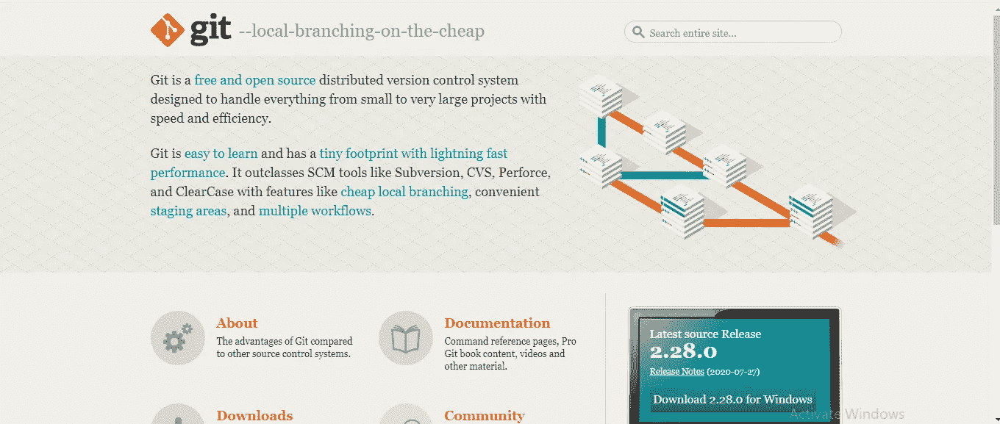
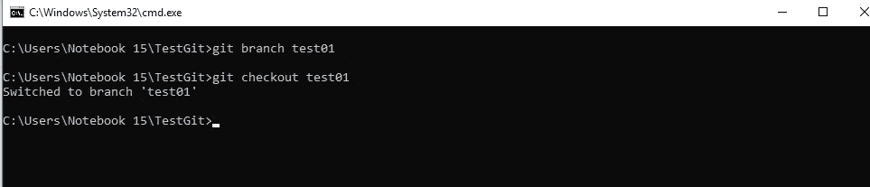

# 使用 Git 的版本控制简介

> 原文：<https://medium.com/analytics-vidhya/introduction-to-version-control-using-git-bf0dd0e4ae47?source=collection_archive---------15----------------------->

当我们作为团队工作时，版本控制是编程的重要部分。版本控制用于跟踪对文档、文件、程序和其他信息集合所做的更改，以确保团队的所有成员都使用最新版本。它也被称为源代码控制或版本控制。

用于版本控制的最流行的工具是 Git、CVS、SVN、Mercurial 和 Monotone。在本文中，我们将讨论 Git，它是市场上最好的版本控制系统之一。

Git vs GitHub

大多数人混淆了 Git 和 GitHub 是一样的。但它们根本不是一回事。Git 是安装在本地机器上管理源代码历史的版本控制系统。Git hub 是使用 Git 的项目的托管服务。

在这篇博客中，我们将逐步了解如何使用 Git 和 GitHub 进行版本控制。

让我们从基础开始…

首先，在开始学习使用 git 进行版本控制之前，在 GitHub 中创建一个帐号来存储 git repository。然后从[官方 git 网站](https://git-scm.com/)安装 git。

Git 官方网站

接下来在本地机器上安装 git，打开命令提示符并检查安装的 Git 的版本。

检查版本的命令

通过使用下面提到的两个命令，您可以在手册页中看到命令的配置、语法及其用法。

重定向到手动页面的命令

出于演示目的，创建目录 TestGit，它在文件系统中创建一个空文件夹，移动到该目录并使用以下命令初始化该空目录。

创建并定向到目录

初始化空文件夹

使用虚拟信息创建文本文件，并在 TestGit 存储库中将其保存为 Demo.text 文件。

在 TestGit 目录中创建演示文件

使用电子邮件地址和用户名创建到 git hub 帐户的连接。

链接了 GitHub 账户

然后使用 *git add Demo.txt* 命令将文本文件添加到 staging 中。使用以下命令通过提交消息提交更改。

用于添加和提交的命令

在连接的 GitHub 帐户中创建一个新的存储库(origin ),并使用 GitHub 帐户中提供的地址将 Origin 与本地存储库连接起来。

创建新的存储库测试-演示

将原点添加到本地机器

最后，将所有的更改从本地推送到源，您可以在远程存储库中看到您的更改。

推到原点

添加到原点的更改

让我们进入工业需求，如果你在一个团队中工作，你必须使用遥控器(上游，原点)。上游是指您已经分叉的原始存储库。Origin 是你的分叉，你的 git hub 账户上的存储库。

向上游

起源

一旦您将存储库分支到您的帐户，您必须将它克隆到您的本地机器上来使用它。

克隆存储库

本地机器中的克隆项目

总是为您创建并检出一个分支来进行更改。

分支 test01 的创建

完成修改后，您必须添加并提交它。

添加并提交更改

提交之后，创建一个到源的远程连接，并将更改推送到源。

添加远程存储库

将更改推送到原点

推送更改后，您可以在 GitHub 帐户中看到比较和拉取请求。

比较变更，并向上游发送拉请求，以将变更添加到需要负责人批准的主存储库中。

下次见，编码快乐…